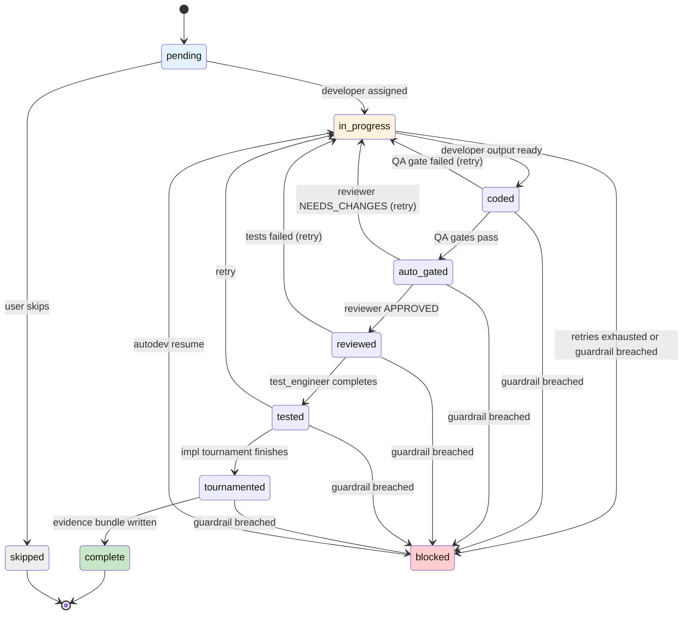
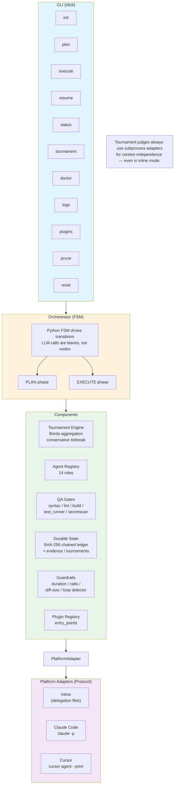
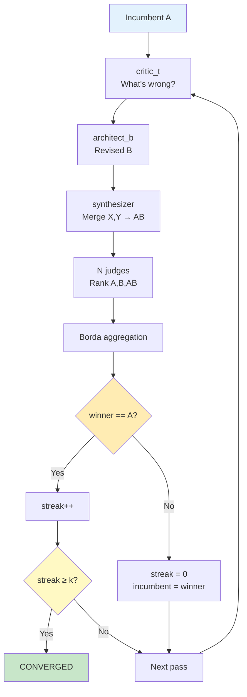

# AutoDev

<div align="center">

**A deterministic, resumable, tournament-based orchestrator for LLM-driven software development.**

[](https://www.python.org/downloads/)
[](LICENSE)
[](#development-setup)
[](#)
[](https://docs.pydantic.dev/latest/)

[Why AutoDev](#why-autodev) · [Design Principles](#design-principles) · [Architecture](docs/architecture.md) · [Tournaments](docs/design_documentation/tournaments.md) · [Quick Start](#quick-start)

</div>

---

## What it is

AutoDev is a **typed, crash-safe, auditable orchestration engine** that turns your existing Claude Code or Cursor subscription into a disciplined multi-agent development pipeline. It decomposes every feature request into a bounded finite state machine — *explore → plan → critique → code → review → test → merge* — and wraps the two highest-leverage decisions (the plan, and every individual diff) in a tournament-based self-refinement loop: a fresh critic identifies faults, a fresh author proposes a revision, a synthesizer merges the two, and N independent judges rank the variants via Borda count with a conservative tiebreak to the incumbent. Each role runs as a specialized agent with its own system prompt, model tier, and allow-listed tools — so **no model ever evaluates its own output**. The entire trajectory (delegations, tool calls, diffs, critiques, judge rankings, test results) is appended to a content-addressed JSONL ledger under `.autodev/`, making every run replayable, diffable, and auditable. If the process dies mid-task, `autodev resume` reconstructs state via ledger replay and continues at the exact FSM edge it left.

```bash
pip install autodev    # or: npm install -g autodev
```

---

## Why experienced developers should use this

If you have shipped production code with a single-agent AI tool, you have hit all of these failure modes. AutoDev is designed around the assumption that each is a structural property of the single-agent model, not a prompt-engineering problem.

- **Self-grading is a known failure mode.** A single model evaluating its own output inherits the same blind spots that produced the output. AutoDev routes evaluation through independent judges with fresh context — a structured-refinement algorithm designed to close the generation-evaluation gap between what a model can produce and what it can reliably evaluate. Separation of concerns at the *agent* level, not just the prompt level.

- **Non-determinism in the model, determinism in the pipeline.** The orchestrator is a pure Python FSM. Every state transition is a ledger append with a SHA-256 content hash chained to the previous entry. Same inputs + same recorded adapter outputs → byte-identical final state. This is what makes replay-based debugging and tournament regression testing tractable.

- **Crash-safety is a contract, not a hope.** The plan ledger uses `filelock` (with `thread_local=False` so asyncio tasks serialize correctly), atomic `tmp → rename` writes, and CAS hash chaining. Corrupted or partial writes are detected on replay; `autodev doctor` will refuse to proceed against a torn ledger.

- **Typed contracts at every boundary.** Every data structure crossing a process or async boundary — delegations, agent responses, evidence bundles, plan snapshots, tournament pass results — is validated by **pydantic v2 with `extra="forbid"`**. No silent coercion. No "it worked on my laptop" schema drift between runs.

- **No API keys, no vendor lock-in.** Every LLM call is a subprocess invocation of `claude -p` or `cursor agent --print` against your existing subscription. The `PlatformAdapter` is a protocol with four methods; a third adapter is ~150 LOC. Swap in any CLI-accessible model without touching the orchestrator or tournament engine.

- **Cost is bounded and inspectable, not emergent.** Per-task guardrails (`max_tool_calls`, `max_duration_s`, `max_diff_bytes`), tournament hard caps (`max_rounds`, `num_judges`, `convergence_k`), a loop detector that fingerprints repeated invocations, and a `cost_budget_usd_per_plan` circuit breaker. Every run emits a cost projection *before* execution begins.

- **Extensibility via `entry_points`, not forks.** Custom QA gates, judge providers, and agent extensions load via `importlib.metadata.entry_points(group="autodev.plugins")`. Ship a separate wheel, get picked up at next `autodev doctor`. No patched core, no monkey-patching.

- **Research-grounded, not vibes-based.** The tournament algorithm, convergence criteria, and Borda aggregation are faithful implementations of a published self-refinement approach — not invented here. We document the deviations (no per-call temperature control in subscription CLIs; we rely on fresh-context stochasticity) so you can reason about when the technique applies.

---

## Design principles

| Principle | Mechanism |
|---|---|
| **Separation of concerns at the agent level** | 14 role-specialized agents (architect, explorer, domain_expert, developer, reviewer, test_engineer, critic_sounding_board, critic_drift_verifier, docs, designer, critic_t, architect_b, synthesizer, judge) — each with its own prompt, model tier, and tool allow-list |
| **Typed contracts, validated at every boundary** | pydantic v2 strict models for all cross-process data; ledger entries are signed with SHA-256 chain hashes |
| **Deterministic orchestration over stochastic agents** | Pure Python FSM drives transitions; LLM calls are leaves in the graph, never nodes |
| **Append-only persistence, derived projections** | `plan-ledger.jsonl` is the source of truth; `plan.json` is a derived snapshot. Never mutate. |
| **Crash-safe by construction** | filelock + atomic rename + replay-based reconstruction. `autodev resume` is idempotent. |
| **Parallelism only where safe** | Tournaments run judges concurrently via `asyncio.gather` capped by `max_parallel_subprocesses`; all other work is serial |
| **Fresh context per tournament role** | Every critic, author, synthesizer, and judge invocation is a fresh subprocess with no prior session state |
| **Everything is a file** | All state under `.autodev/`. No daemons, no sockets, no shared memory. Diffable in git. |

---

## How it runs

You describe the feature. AutoDev coordinates the rest.

```text
Build a REST API with user registration, login, and JWT auth.
```

```
1. explorer     → scans the repo, reports structure, conventions, dependencies
2. domain_expert → domain guidance (auth patterns, secret management, JWT gotchas)
3. architect    → drafts a phased plan
4. Plan         ┌─ critic_t   → "here is everything wrong with this plan"
   Tournament  →│  architect_b → revised plan B
   (up to 15)   │  synthesizer → plan AB = merge(A, B) with randomized labels
                 └─ N judges   → rank [A, B, AB] via Borda; conservative tiebreak to A
5. critic_t     → plan-gate: APPROVED / NEEDS_REVISION / REJECTED
6. For each task, serially:
     developer   → produces diff_A
     QA gates    → syntax → lint → build → tests → secretscan
                   (fail → retry developer with structured feedback, up to qa_retry_limit)
     reviewer    → correctness + architecture check
     test_eng    → writes tests, runs them
     Impl        ┌─ git worktree /a ← diff_A
     Tournament →│  git worktree /b ← developer redo guided by critic
     (always-on) │  git worktree /ab ← developer synthesis of A and B
                 └─ judge ranks; winner merged to main; losers pruned
7. docs + knowledge updated
8. If retries exhausted → escalate to critic_sounding_board (pre-abort sanity check)
```

At every step, state is persisted to `.autodev/`. If you kill the process, `autodev resume` continues from the last ledger checkpoint.



---

## Observability & auditability

Everything is on disk, in a format you can grep, diff, and replay.

```text
.autodev/
├── config.json                      # Versioned pydantic schema
├── spec.md                          # Your feature intent (human-editable)
├── plan.json                        # Derived snapshot — DO NOT EDIT
├── plan-ledger.jsonl                # ★ Source of truth: append-only, CAS-chained
├── knowledge.jsonl                  # Per-project lessons (ranked, deduped)
├── rejected_lessons.jsonl           # Block list — prevents re-learning loops
├── evidence/
│   ├── {task_id}-developer.json     # Prompt, response, diff, tool calls
│   ├── {task_id}-review.json        # Reviewer findings
│   ├── {task_id}-test.json          # Test command, stdout/stderr, pass/fail
│   ├── {task_id}-tournament.json    # Full round-by-round tournament trace
│   └── {task_id}.patch              # Applied unified diff
├── tournaments/
│   ├── plan-{plan_id}/
│   │   ├── initial_a.md             # The drafted plan before the tournament
│   │   ├── final_output.md          # What the tournament converged on
│   │   ├── history.json             # Per-pass winners, judge rankings, streak
│   │   └── pass_NN/
│   │       ├── version_a.md         # Incumbent
│   │       ├── critic.md            # Critique text
│   │       ├── version_b.md         # Author B's revision
│   │       ├── version_ab.md        # Synthesizer's merge
│   │       └── result.json          # Judge rankings + Borda scores
│   └── impl-{task_id}/
│       ├── a/ b/ ab/                # Git worktrees (pruned after merge)
│       └── ...
└── sessions/{session_id}/
    ├── events.jsonl                 # structlog audit trail
    └── snapshot.json
```

Every decision is reconstructable from disk — why a judge ranked B above A, which critic feedback drove a retry, what the developer's first attempt looked like. This is what separates AutoDev from "prompt chains with extra steps."

---

## Quick start

### Inline mode (recommended — runs inside your existing agent session)

```bash
cd /your/project
autodev init --inline       # detects .claude/ or .cursor/, writes auto-resume config
```

Then, in your agent (Claude Code or Cursor), describe what you want built:

```text
Build a REST API with user registration, login, and JWT auth.
```

Your agent reads delegation files from `.autodev/delegations/`, executes tasks with its own tools, writes responses to `.autodev/responses/`, and runs `autodev resume` to continue the pipeline. **You never manually switch agents.**

### Standalone mode (CI, automation, unattended runs)

```bash
autodev init --platform claude_code   # or cursor
autodev plan "Add subtract(a, b) with a pytest test"
autodev execute
```

Every role spawns a fresh `claude -p` / `cursor agent --print` subprocess. Tournament judges always use subprocesses even in inline mode — fresh context per judge is load-bearing.

### Monitor

```bash
autodev status                         # phase, task FSM state, evidence counts
autodev logs [--session SID]           # tail events.jsonl
autodev doctor                         # health check (CLIs, config, plugins, guardrails)
autodev tournament --phase=plan \      # ad-hoc tournament runner (debugging)
                   --input spec.md \
                   --dry-run
```

### Recover

```bash
autodev resume                         # Replays ledger, continues at last FSM edge
autodev prune --older-than 30d         # GC stale tournament artifacts
autodev reset --hard                   # Destructive — clears plan state
```

---

## Architecture



**Serial by default.** One specialist at a time. **Parallelism only inside the tournament** — N judges via `asyncio.gather`, capped by `max_parallel_subprocesses`. No shared mutable state across agents.

---

## The agents

You do not manually switch between these. The orchestrator invokes them.

| Agent | Role | Invoked |
|---|---|---|
| `architect` | Plan drafting, delegation decisions | PLAN phase |
| `explorer` | Codebase reconnaissance | Before planning |
| `domain_expert` | Domain research | During planning |
| `developer` | Implements one task | EXECUTE phase |
| `reviewer` | Correctness + architecture review | After each task |
| `test_engineer` | Writes & runs tests | After each task |
| `critic_sounding_board` | Pre-escalation sanity check | On retry exhaustion |
| `critic_drift_verifier` | Post-phase plan-vs-reality drift check | Before `phase_complete` |
| `docs` | Post-phase documentation | End of each phase |
| `designer` | UI scaffolds (opt-in) | UI work |
| `critic_t` | Plan-gate + Tournament critic (finds problems, no fixes) | PLAN + Tournaments |
| `architect_b` | Tournament revision agent | Tournaments |
| `synthesizer` | Merges A + B with randomized labels | Tournaments |
| `judge` | Ranks A/B/AB via Borda count | Tournaments |

Agent prompts live in `src/autodev/agents/prompts/<name>.md`, each with YAML frontmatter declaring role, model tier, and tool allow-list. Python drives delegation — prompts contain no inline `@agent` handoffs, so agents stay focused on their assigned task. Tournament role prompts (`critic_t`, `architect_b`, `synthesizer`, `judge`) live in `src/autodev/tournament/prompts.py`. Tool allow-lists are enforced via `--allowed-tools` (Claude Code) or prompt-level constraints (Cursor).

---

## The tournament (the load-bearing piece)

After the architect drafts a plan, and after every developer task passes QA gates, AutoDev runs a self-refinement tournament:



### Plan tournament

`num_judges=3, convergence_k=2, max_rounds=15` by default. Converges when the incumbent wins two passes in a row.

### Implementation tournament (always-on)

`num_judges=1, convergence_k=1, max_rounds=3` by default. Variants are materialized in `git worktree`s:
- `/a` ← developer's initial diff
- `/b` ← developer re-run guided by critic_t feedback
- `/ab` ← developer synthesis of A and B
- Judge picks the winner; winner's diff merged to main worktree; `/a /b /ab` pruned.

The always-on default is tuned for cost: 4 subprocess calls per round × max 3 rounds = hard ceiling of 12 extra LLM calls per task. Disable per-run with `autodev execute --no-impl-tournament` or per-project in `config.json`.

### Why this works

- **Fresh context per role** — no in-context contamination. The critic cannot see the author's rationale; the judge cannot see the critic's critique; labels are randomized before judges see variants.
- **Borda aggregation with conservative tiebreak** — ties default to the incumbent. Prevents thrash on marginal improvements.
- **Convergence criterion** — the incumbent must win `k` consecutive rounds. Prevents infinite refinement loops.

See [`docs/design_documentation/tournaments.md`](docs/design_documentation/tournaments.md) for the full algorithm and proof sketches.

---

## How it compares

|  | AutoDev | Single-agent AI coding | Prompt chains |
|---|:-:|:-:|:-:|
| Multiple specialized agents | ✅ 14 roles | ❌ | Partial |
| Plan tournament before coding | ✅ Borda-ranked, converges in `k` passes | ❌ | ❌ |
| Implementation tournament per task | ✅ A/B/AB judged with git worktree isolation | ❌ | ❌ |
| Reviewer ≠ author | ✅ enforced at agent level | ❌ | ❌ |
| QA gates (lint, build, test, secrets) | ✅ with bounded retry + escalation | ❌ | Ad-hoc |
| Append-only CAS ledger | ✅ SHA-256 chained, replay-safe | ❌ | ❌ |
| Crash-safe resume | ✅ `autodev resume` | ❌ | ❌ |
| Works inside your existing agent | ✅ inline mode | N/A | ❌ |
| Plugin ecosystem (`entry_points`) | ✅ | ❌ | ❌ |
| No API keys | ✅ subscription-based | — | — |
| Cost guardrails (duration / calls / budget) | ✅ per-task + per-plan | ❌ | ❌ |
| Typed contracts (pydantic v2 strict) | ✅ everywhere | ❌ | ❌ |

---

## Installation

### As a global agent plugin (recommended)

```bash
# Install once, globally
pip install autodev
# or
npm install -g autodev

# Opt in per project
cd /your/project
autodev init --inline
```

The `--inline` flag writes a managed section to `.claude/CLAUDE.md` or `.cursor/rules/autodev.mdc` instructing your agent to:

1. Watch `.autodev/delegations/` for work.
2. Execute tasks using its own tools.
3. Write a JSON response to the specified `response_path` (validated against the `AgentResult` pydantic schema).
4. Run `autodev resume` to continue.

The managed section is idempotent — running `init --inline` again updates without clobbering your own content.

### From source (contributors)

```bash
git clone https://github.com/mohamedameen/autodev
cd autodev
uv sync
uv run pytest -v        # 733 tests, 94% coverage
```

---

## Configuration

`.autodev/config.json` is a versioned, strict pydantic schema. Model defaults are platform-aware — Claude Code uses model aliases (`opus`/`sonnet`/`haiku`) that resolve to the latest version, while Cursor uses explicit models with `auto` for intelligent selection and automatic fallback on rate limits. Each agent also has a configurable `max_turns` — the number of turns the agent gets per invocation (tool-heavy roles like `developer` get more turns; text-only tournament roles get 1).

```jsonc
{
  "schema_version": "1.0.0",
  "platform": "auto",                               // "claude_code" | "cursor" | "inline" | "auto"
  "agents": {
    // Claude Code defaults (aliases resolve to latest):
    "architect":         { "model": "opus",   "max_turns": 5  },
    "explorer":          { "model": "haiku",  "max_turns": 3  },
    "domain_expert":     { "model": "sonnet", "max_turns": 3  },
    "developer":         { "model": "sonnet", "max_turns": 10 },
    "reviewer":          { "model": "sonnet", "max_turns": 3  },
    "test_engineer":     { "model": "sonnet", "max_turns": 5  },
    "critic_t":          { "model": "sonnet", "max_turns": 1  },
    "architect_b":       { "model": "sonnet", "max_turns": 5  },
    "synthesizer":       { "model": "sonnet", "max_turns": 1  },
    "judge":             { "model": "sonnet", "max_turns": 1  },
    "critic_sounding_board": { "model": "sonnet", "max_turns": 3 },
    "critic_drift_verifier": { "model": "sonnet", "max_turns": 3 },
    "docs":              { "model": "sonnet", "max_turns": 3  },
    "designer":          { "model": "sonnet", "max_turns": 3  }
    // Cursor defaults (with rate limit fallback):
    // "architect":         { "model": "opus"   },   // → auto on 429
    // "explorer":          { "model": "auto"  },   // auto-selects best model
    // "developer":        { "model": "auto"  },   // auto-selects best model
    // etc.
  },
  "tournaments": {
    "plan": { "enabled": true, "num_judges": 3, "convergence_k": 2, "max_rounds": 15 },
    "impl": { "enabled": true, "num_judges": 1, "convergence_k": 1, "max_rounds": 3  },
    "max_parallel_subprocesses": 3,
    "auto_disable_for_models": ["opus"]             // gains plateau at high-tier models that can reliably self-evaluate
  },
  "qa_gates": {
    "syntax_check": true, "lint": true, "build_check": true,
    "test_runner":  true, "secretscan": true,
    "sast_scan":    false, "mutation_test": false
  },
  "qa_retry_limit": 3,
  "guardrails": {
    "max_tool_calls_per_task": 60,
    "max_duration_s_per_task": 900,
    "max_diff_bytes":          5242880,
    "cost_budget_usd_per_plan": null
  },
  "hive": { "enabled": true, "path": "~/.local/share/autodev/shared-learnings.jsonl" }
}
```

> **Note**: On Cursor, `architect` and `architect_b` default to `opus` with automatic fallback to `auto` when rate limited. Roles like `explorer`, `developer`, `test_engineer` default to `auto` for intelligent model selection.

---

## CLI reference

| Command | Purpose |
|---|---|
| `autodev init [--inline] [--platform …] [--force]` | Scaffold `.autodev/`, render agent files, write auto-resume config |
| `autodev plan "<intent>"` | PLAN phase: explore → domain_expert → architect-draft → plan tournament → critic_t-gate → persist |
| `autodev execute [--task ID] [--dry-run] [--no-impl-tournament]` | EXECUTE phase: developer → QA gates → review → tests → impl tournament → advance |
| `autodev resume` | Replay ledger, continue at last FSM edge |
| `autodev status` | Current phase, task FSM states, evidence counts, knowledge summary |
| `autodev tournament --phase=plan\|impl --input FILE [--dry-run]` | Ad-hoc tournament runner (debugging, experimentation) |
| `autodev doctor` | CLI detection, config validation, plugin discovery, guardrail configuration |
| `autodev logs [--session SID]` | Tail the structlog event stream |
| `autodev plugins` | List discovered plugins (QA gates, judge providers, agent extensions) |
| `autodev prune [--older-than 30d]` | GC stale tournament artifacts |
| `autodev reset [--hard]` | Destructive: clear `.autodev/plan*` (prompts for confirmation) |

---

## Cost model

AutoDev consumes your existing **subscription quota** — no API keys, no per-token billing, no surprise invoices. Every call is a subprocess invocation against your logged-in Claude Code or Cursor session.

**Rough upper bound per plan** (approximate, varies by task complexity):

- Plan phase: 5 – 8 calls (explorer + domain_expert + architect + plan-tournament × up to 15 rounds × ~4 calls + critic_t)
- Per task: 4 – 7 calls (developer + retries + reviewer + test_engineer + impl-tournament × up to 3 rounds × ~4 calls)

**Cost reduction levers**:

```bash
autodev execute --no-impl-tournament          # skip impl tournaments entirely
```
```jsonc
// or in config.json
"tournaments": {
  "plan": { "num_judges": 1, "max_rounds": 5 },
  "impl": { "enabled": false },
  "auto_disable_for_models": ["opus", "sonnet"]
}
```

Before `autodev execute`, the orchestrator prints a projected call count. You can abort before anything runs.

See [`docs/design_documentation/cost.md`](docs/design_documentation/cost.md) for the full breakdown and tuning guide.

---

## Extensibility

### Plugins via `entry_points`

```python
# setup.cfg / pyproject.toml of your plugin package
[project.entry-points."autodev.plugins"]
my_gate  = "my_package.gates:MyCustomGate"       # QAGatePlugin
my_judge = "my_package.judges:MyJudge"           # JudgeProviderPlugin
my_agent = "my_package.agents:MyAgentSpec"       # AgentExtensionPlugin
```

Install the wheel, run `autodev doctor` — your plugin is live. The registry validates against the `QAGatePlugin`, `JudgeProviderPlugin`, and `AgentExtensionPlugin` protocols; invalid plugins are skipped with a warning (no hard fail).

### New platforms

Add a new platform adapter by implementing the `PlatformAdapter` protocol (four methods: `init_workspace`, `execute`, `parallel`, `healthcheck`). See `src/autodev/adapters/claude_code.py` (~250 LOC) as a reference.

---

## Platform support

| Platform | Mode | Mechanism |
|---|---|---|
| **Claude Code** | Inline | `.claude/CLAUDE.md` managed section, delegation files |
| **Claude Code** | Standalone | `claude -p "<prompt>" --output-format json` subprocess per role |
| **Cursor** | Inline | `.cursor/rules/autodev.mdc` with `alwaysApply: true` |
| **Cursor** | Standalone | `cursor agent "<prompt>" --print --output-format json` |

Platform selection precedence:
1. `--inline` or `--platform` CLI flag
2. `AUTODEV_PLATFORM` environment variable
3. `config.json.platform` (when not `"auto"`)
4. Auto-detect: `claude --version` succeeds → `claude_code`; else `cursor --version` → `cursor`; else `autodev doctor` surfaces a diagnostic

---

## Non-goals

AutoDev is opinionated. Things it intentionally does **not** do:

- **No in-context delegation.** Agents do not `@mention` each other mid-conversation. The Python FSM delegates; the LLM stays focused.
- **No background agents.** Everything is serial except tournament judges. No race conditions by construction.
- **No per-call temperature control.** `claude -p` and `cursor agent --print` don't expose it; the tournament relies on fresh-context stochasticity instead. Documented deviation from the reference algorithm.
- **No implicit auto-merge to `main`.** AutoDev commits to worktrees and updates the main worktree; pushing is your call.
- **No telemetry.** Nothing phones home. Events stay in `.autodev/sessions/`.
- **No monkey-patching the platform CLI.** We invoke the public CLI surface (`claude -p`, `cursor agent --print`) and parse documented JSON output. If the CLI drifts, the adapter breaks loudly, not silently.

---

## Development setup

```bash
git clone https://github.com/mohamedameen/autodev
cd autodev
uv sync

# Full test suite
uv run pytest -v                                     # 733 passing, 94% coverage

# Property-based tests (Borda math)
uv run pytest --hypothesis-show-statistics tests/test_tournament_borda_aggregation.py

# Targeted
uv run pytest tests/test_state_ledger.py -v

# Integration tests (mocked adapters)
uv run pytest tests/integration/ -v

# Live smoke tests (requires claude CLI logged in)
AUTODEV_LIVE=1 uv run pytest tests/ -k live -v

# Lint / typecheck
uv run ruff check src/
uv run mypy src/
```

The test suite includes (94% coverage, all source files ≥80%):
- **Unit**: ledger atomicity, Borda aggregation, parse_ranking, plan manager under contention, knowledge ranking, adapter type round-trips, CLI commands, QA gates, config defaults, autologging
- **Integration**: tiny-repo E2E with stubbed adapters for determinism, impl tournament full-flow with git worktrees
- **Property**: Borda invariants via Hypothesis
- **Replay**: tournament determinism against recorded reference fixtures
- **Live**: opt-in smoke tests against real Claude Code / Cursor CLIs (`AUTODEV_LIVE=1`)

---

## Documentation

- [`docs/architecture.md`](docs/architecture.md) — subsystems, FSM states, data flow
- [`docs/design_documentation/tournaments.md`](docs/design_documentation/tournaments.md) — algorithm, convergence, configuration
- [`docs/design_documentation/adapters.md`](docs/design_documentation/adapters.md) — platform adapter contract, inline mode, writing a new adapter
- [`docs/design_documentation/agents.md`](docs/design_documentation/agents.md) — all 15 agent roles, prompts, tool maps
- [`docs/design_documentation/cost.md`](docs/design_documentation/cost.md) — subscription cost model, tuning guide

## Examples

- [`examples/subtract/`](examples/subtract/) — smoke test: add a `subtract(a, b)` function to a tiny repo
- [`examples/jwt_auth/`](examples/jwt_auth/) — realistic spec: build JWT authentication end-to-end

---

## Prior art

AutoDev combines two threads of research:

- **Self-refinement with independent evaluators.** Iterative LLM improvement closes the generation-evaluation gap when a fresh critic identifies faults, a fresh author proposes a revision, a synthesizer merges the two, and N fresh judges rank the variants via Borda count with a conservative tiebreak — making "do nothing" a first-class winning outcome. AutoDev implements this algorithm as its plan and implementation tournaments.
- **Coordinator-led multi-agent orchestration.** Serial delegation from a planning coordinator to specialized workers (developer, reviewer, test engineer, critic) — with gates between phases, evidence persisted per task, and bounded retry before escalation — produces more reliable output than monolithic single-agent systems. AutoDev adopts this pattern for its EXECUTE phase.

## License

GPL-3.0 — see [LICENSE](LICENSE).
