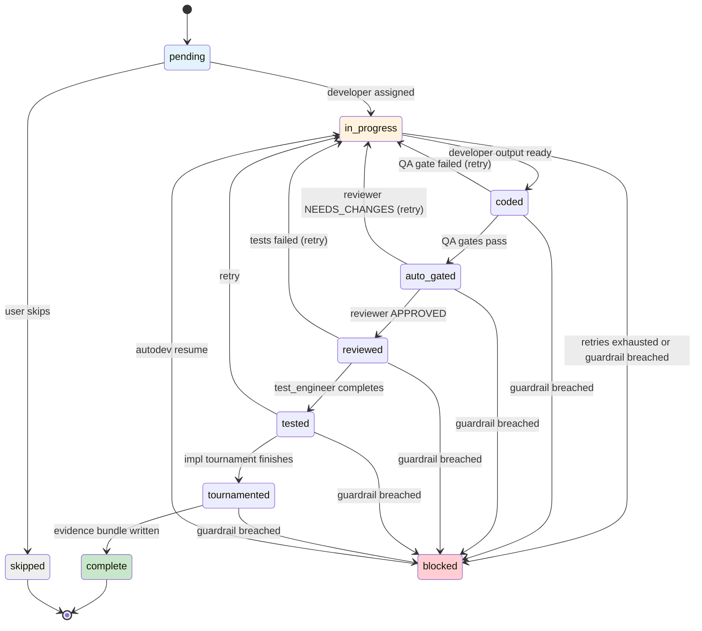
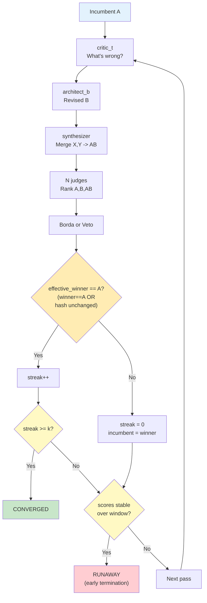

# AutoDev

<div align="center">

**A discipline layer that wraps any AI coding agent, raising its output to enterprise-grade quality.**

[](https://www.python.org/downloads/)
[](LICENSE)
[](#development-setup)
[](https://docs.pydantic.dev/latest/)
[](CHANGELOG.md)

[Lede](#what-autodev-is) · [Quick Start](#quick-start) · [Four Mechanisms](#the-four-discipline-mechanisms) · [Architecture](#architecture) · [Tournaments](#tournaments--multi-branch) · [Documentation](#documentation-index)

</div>

---

## What AutoDev is

AutoDev is a discipline layer that wraps any AI coding agent — and raises its output from prototype-quality to enterprise-quality: code that's actually worth a senior engineer's time to review and merge.

It does this with four mechanisms: tournament-based self-refinement (no model ever judges its own output), agent role specialization, mandatory QA gates (lint, build, tests, security, optionally mutation), and a content-addressed audit trail of every decision.

AutoDev does not replace human review. It produces output good enough to make the review productive instead of a rewrite session.

---

## Quick start

Install once, opt in per project, then describe what you want built.

```bash
pip install ai-autodev
```

```bash
cd /your/project
autodev init --inline
```

In your AI coding agent:

```text
Build a REST API with user registration, login, and JWT auth.
```

Uses your existing AI coding agent's session — no API keys to wire up. Currently supports Claude Code and Cursor.

---

## The four discipline mechanisms

### 1. Tournament-based self-refinement

A fresh critic identifies faults in the incumbent. A fresh author writes a revision. A synthesizer merges the two with randomized labels. N independent judges (5 by default for plans, 3 for phase reviews, 1 for impl) Borda-vote, and ties go to the incumbent. **No model ever evaluates its own output** — every role is a separate subprocess with no prior session state.

> Saves the reviewer the work of catching the obvious-in-retrospect mistakes the original model couldn't see.

### 2. Agent role specialization

14 specialized roles, each with its own system prompt, model tier, and tool allow-list. The architect drafts, the developer implements, the reviewer audits, the test engineer writes tests, the critics find faults — and they never share context. The role list is canonical (`REQUIRED_AGENT_ROLES` in `src/config/schema.py`).

> Reviewer never sees a diff that wasn't already independently checked by another agent.

### 3. Mandatory QA gates

Every diff runs through syntax check, lint, build, test runner, and secret scan before it can leave the FSM as `tested`. A failure feeds structured feedback back to the developer with bounded retry. Mutation testing (opt-in, `mutation_test_enabled`) and per-repo secret-scan baselines (`secretscan_baseline_enabled`) are also available.

> Reviewer never wastes time on a diff that doesn't compile or fails its own tests.

### 4. Auditable trail

Every decision — why this variant won, what the critic said, which judge ranked what, why the developer was sent back — is appended to a SHA-256-chained JSONL ledger under `.autodev/`. Tournaments persist their full per-pass history (`history.json`) and per-role checkpoints. Crashes replay deterministically via `autodev resume`.

> Reviewer gets a starting point with reasoning attached, not a black box to reverse-engineer.

---

## How it runs

You describe the feature. AutoDev coordinates the rest.

```text
Build a REST API with user registration, login, and JWT auth.
```

```
1. explorer     -> scans the repo, reports structure, conventions, dependencies
2. domain_expert -> domain guidance (auth patterns, secret management, JWT gotchas)
3. architect    -> drafts a phased plan
4. Plan         |- critic_t   -> "here is everything wrong with this plan"
   Tournament  ->| architect_b -> revised plan B
   (up to 15)   |  synthesizer -> plan AB = merge(A, B) with randomized labels
                |- N judges   -> rank [A, B, AB] via Borda; conservative tiebreak to A
5. critic_t     -> plan-gate: APPROVED / NEEDS_REVISION / REJECTED
6. For each task:
     developer   -> produces diff_A
     QA gates    -> syntax -> lint -> build -> tests -> secretscan
                    (fail -> retry developer with structured feedback, up to qa_retry_limit)
     reviewer    -> correctness + architecture check
     test_eng    -> writes tests, runs them
     Impl        |- git worktree /a  <- diff_A
     Tournament ->| git worktree /b  <- developer redo guided by critic
     (always-on) |  git worktree /ab <- developer synthesis of A and B
                 |- judge ranks; winner merged to main; losers pruned
7. phase_review tournament (3 judges) checks the phase before it closes
8. docs + knowledge updated
9. If retries exhausted -> escalate to critic_sounding_board (pre-abort sanity check)
```

**Cross-phase parallelism (opt-in, `cross_phase_parallelism_enabled`)** dispatches independent tasks concurrently across phase boundaries instead of waiting for the whole phase to drain.

At every step, state is persisted to `.autodev/`. If you kill the process, `autodev resume` continues from the last ledger checkpoint.


```mermaid
stateDiagram-v2
    [*] --> pending
    pending --> in_progress: developer assigned
    pending --> skipped: user skips

    in_progress --> coded: developer output ready
    coded --> auto_gated: QA gates pass
    auto_gated --> reviewed: reviewer APPROVED
    reviewed --> tested: test_engineer completes
    tested --> tournamented: impl tournament finishes
    tournamented --> complete: evidence bundle written

    coded --> in_progress: QA gate failed (retry)
    auto_gated --> in_progress: reviewer NEEDS_CHANGES (retry)
    reviewed --> in_progress: tests failed (retry)
    tested --> in_progress: retry

    in_progress --> blocked: retries exhausted or guardrail breached
    coded --> blocked: guardrail breached
    auto_gated --> blocked: guardrail breached
    reviewed --> blocked: guardrail breached
    tested --> blocked: guardrail breached
    tournamented --> blocked: guardrail breached

    blocked --> in_progress: autodev resume

    complete --> [*]
    skipped --> [*]

    style pending fill:#e3f2fd
    style in_progress fill:#fff3e0
    style complete fill:#c8e6c9
    style blocked fill:#ffcdd2
    style skipped fill:#eeeeee
```

---

## Architecture


```mermaid
flowchart TB
    subgraph CLI["CLI (click)"]
        direction LR
        init["init"]
        plan["plan"]
        execute["execute"]
        resume["resume"]
        status["status"]
        tournament_cmd["tournament"]
        doctor["doctor"]
        logs["logs"]
        plugins_cmd["plugins"]
        prune["prune"]
        reset["reset"]
        secretscan_cmd["secretscan"]
    end

    subgraph Orchestrator["Orchestrator (FSM)"]
        direction TB
        fsm["Python FSM drives transitions<br/>LLM calls are leaves, not nodes"]
        plan_phase["PLAN phase"]
        execute_phase["EXECUTE phase"]
        fsm --> plan_phase
        fsm --> execute_phase
    end

    CLI --> Orchestrator

    subgraph Components
        direction LR
        tournament["Tournament Engine<br/>Borda / Veto<br/>multi-branch fan-out"]
        registry["Agent Registry<br/>14 roles"]
        qa["QA Gates<br/>syntax / lint / build /<br/>test_runner / secretscan /<br/>mutation (opt-in)"]
        state["Durable State<br/>SHA-256 chained ledger<br/>+ evidence / tournaments"]
        guardrails["Guardrails<br/>duration / calls /<br/>diff-size / loop detector"]
        plugins_sub["Plugin Registry<br/>entry_points"]
    end

    Orchestrator --> Components
    Components --> PlatformAdapter

    subgraph Adapters["Platform Adapters (Protocol)"]
        direction LR
        inline["Inline<br/>(delegation files)"]
        claude["Claude Code<br/>claude -p"]
        cursor["Cursor<br/>cursor agent --print"]
        web["Web Search<br/>(escalation rung)"]
    end

    PlatformAdapter --> Adapters

    CLI:::cli
    Orchestrator:::orch
    Components:::comp
    Adapters:::adap

    classDef cli fill:#e1f5fe
    classDef orch fill:#fff3e0
    classDef comp fill:#e8f5e9
    classDef adap fill:#f3e5f5
```

**Serial by default.** One specialist at a time. Parallelism inside the tournament — N judges via `asyncio.gather`, capped by `max_parallel_subprocesses`. No shared mutable state across agents.

**Opt-in v0.21 components.** A `WorktreePool` warm-starts parallel worktrees at executor init. A speculative-execution dispatcher starts one child task per phase before its parent completes (rolling back on parent failure). The cross-phase dispatcher overlaps work across phase boundaries via stable `Phase.end_checkpoint_commit` handoff points.

---

## The agents

You do not manually switch between these. The orchestrator invokes them.

| Agent | Role | Invoked |
|---|---|---|
| `architect` | Plan drafting, delegation decisions | PLAN phase |
| `explorer` | Codebase reconnaissance | Before planning |
| `domain_expert` | Domain research | During planning |
| `developer` | Implements one task | EXECUTE phase |
| `reviewer` | Correctness + architecture review | After each task |
| `test_engineer` | Writes & runs tests | After each task |
| `critic_sounding_board` | Pre-escalation sanity check | On retry exhaustion |
| `critic_drift_verifier` | Post-phase plan-vs-reality drift check | Before `phase_complete` |
| `docs` | Post-phase documentation | End of each phase |
| `designer` | UI scaffolds (opt-in) | UI work |
| `critic_t` | Plan-gate + tournament critic (finds problems, no fixes) | PLAN + tournaments |
| `architect_b` | Tournament revision agent | Tournaments |
| `synthesizer` | Merges A + B with randomized labels | Tournaments |
| `judge` | Ranks A/B/AB via Borda or Veto | Tournaments |

Agent prompts live in `src/agents/prompts/<name>.md`, each with YAML frontmatter declaring role, model tier, and tool allow-list. Python drives delegation — prompts contain no inline `@agent` handoffs, so agents stay focused on their assigned task. Tournament role prompts (`critic_t`, `architect_b`, `synthesizer`, `judge`) live in `src/tournament/prompts.py`. Tool allow-lists are enforced via `--allowed-tools` (Claude Code) or prompt-level constraints (Cursor).

**Specialist judge roles.** `judge_roles` and `judge_role_weights` on `TournamentPhaseConfig` allow weighted votes by domain expertise — a security-focused judge can outvote two stylistic judges on a security-tagged task. Recusal is wired into impl tournaments.

---

## Tournaments + multi-branch

After the architect drafts a plan, and after every developer task passes QA gates, AutoDev runs a self-refinement tournament:


```mermaid
flowchart TD
    A["Incumbent A"] --> B["critic_t<br/>What's wrong?"]
    B --> C["architect_b<br/>Revised B"]
    C --> D["synthesizer<br/>Merge X,Y -> AB"]
    D --> E["N judges<br/>Rank A,B,AB"]
    E --> F["Borda or Veto"]
    F --> G{"effective_winner == A?<br/>(winner==A OR<br/>hash unchanged)"}
    G -->|Yes| H["streak++"]
    G -->|No| I["streak = 0<br/>incumbent = winner"]
    H --> J{streak >= k?}
    J -->|Yes| K["CONVERGED"]
    J -->|No| M{scores stable<br/>over window?}
    I --> M
    M -->|Yes| N["RUNAWAY<br/>(early termination)"]
    M -->|No| L["Next pass"]
    L --> B

    style A fill:#e3f2fd
    style K fill:#c8e6c9
    style N fill:#ffcdd2
    style J fill:#fff9c4
    style G fill:#ffecb3
    style M fill:#fff9c4
```

### Plan tournament

Default-on. `num_judges=5, convergence_k=2, max_rounds=15, num_branches=3`. Converges when the incumbent wins two passes in a row — counting either an explicit `A` win *or* a hash-equal "no change" pass where the synthesizer produced byte-identical output. Score-stability and winner-stability detectors prevent runaway.

### Implementation tournament

Default-on. `num_judges=1, convergence_k=1, max_rounds=3, num_branches=1` (single-branch by default). Variants are materialized in `git worktree`s:

- `/a` <- developer's initial diff
- `/b` <- developer re-run guided by critic_t feedback
- `/ab` <- developer synthesis of A and B
- Judge picks the winner; winner's diff merged to main worktree; `/a /b /ab` pruned.

The default is tuned for cost: 4 subprocess calls per round × max 3 rounds = hard ceiling of 12 extra LLM calls per task. Disable per-run with `autodev execute --no-impl-tournament`.

### Phase-review tournament

Default-on. A third tournament type runs between phases (`num_judges=3, convergence_k=1, max_rounds=2`). It applies the same critic/revision/synthesis/judge loop to a phase's checkpoint, catching regressions before they cascade into the next phase.

### Multi-branch tournaments (opt-in for impl, default-on for plan)

Single-branch tournaments converge to a local optimum. Multi-branch fans out N independent tournament trajectories (each with its own RNG seed and optionally its own per-role models), then meta-merges the survivors into a single output.

`BranchConfig` (v0.14.0) lets each branch declare:
- `model_overrides`: per-role model map for heterogeneous fan-out (e.g., `opus` on the architect lane, `sonnet` on the explorer lane)
- `lane`: tag for lane-aware knowledge injection
- `risk`: tag for risk-tier routing
- `family`: tag for cross-family plateau detection

Plan-side meta-merge is synthesizer-only pairwise reduction over the survivors. Impl-side meta-merge (v0.21.0) is synthesizer-LLM-on-diffs followed by re-materialization in a fresh worktree. A survivor floor (`max(2, ceil(N/2))`) prevents a single branch failure from sinking the run.

### Voting strategies

- **Borda (default):** rank-aggregation across all judges; conservative tiebreak to incumbent.
- **Veto (`voting_strategy="veto"`):** any judge can veto a variant; useful for security/compliance lanes where one objection should block promotion.

### Convergence detectors

- **Score-stability:** terminates when per-pass Borda scores stop moving by more than a threshold.
- **Winner-stability:** catches `[AB, AB, AB]` runaway where labels stay identical but content drifts.
- **Plateau detection (opt-in):** rule-based by default (`plateau_detector.strategy="rules"`); opt-in regression-based mode (`strategy="regression"`) uses pure-Python OLS over a configurable window. Cross-family plateau detection consults the lessons knowledge layer pre-fan-out and can mutate lanes when a family stalls.

See [`docs/design_documentation/multi_branch_tournament.md`](docs/design_documentation/multi_branch_tournament.md), [`docs/design_documentation/tournament_engine_design.md`](docs/design_documentation/tournament_engine_design.md), and [`docs/design_documentation/plateau_detection_design.md`](docs/design_documentation/plateau_detection_design.md).

---

## QA gates + guardrails

Five standard gates run on every developer diff, in order. All are default-on:

| Gate | What it does |
|---|---|
| `syntax_check` | Per-language parse check before anything else runs |
| `lint` | Project linter (ruff / eslint / etc., autodetected) |
| `build_check` | Type-check + build (`mypy`, `tsc`, etc.) |
| `test_runner` | Project test suite scoped to changed files where possible |
| `secretscan` | High-entropy strings + regex secret detection |

Failures feed structured feedback back to the developer; `qa_retry_limit` (default 3) bounds the retry loop. After exhaustion, escalation goes to `critic_sounding_board` for a pre-abort sanity check.

**Opt-in extras:**
- **Mutation testing** (`mutation_test_enabled`, `mutation_test_threshold=0.7`): runs `mutmut` on developer diffs as a promotion gate. The Stage-1/2 pipeline (v0.19.0) filters equivalent mutants statically and via LLM judge, surfacing real survivors as a `kill_rate` signal that feeds promotion grading.
- **Per-repo secretscan baseline** (`secretscan_baseline_enabled`): pre-existing-secret allowlist with per-extension entropy thresholds. Refresh with `autodev secretscan baseline`.
- **Hallucination guard** (default-on, `hallucination_guard=true`): AST-based check for invented identifiers in Python, TypeScript, JavaScript, and C++.
- **Drift verifier** (default-on, `drift_verifier_enabled=true`): plan-vs-reality cross-check before `phase_complete`.
- **Extended-scope editor expansion** (`Task.extended_scope`): a task may widen its allowed edit set when justified; the architect marks `Extended-Scope: { ... }` blocks. Sync validation runs by default; the critic-review path (`extended_scope_critic.py`) is opt-in.

**Guardrails** (per-task hard caps, all default-on):
- `max_invocations_per_task: 60`
- `max_tool_calls_per_task: 60`
- `max_duration_s_per_task: 900`
- `max_diff_bytes: 5_242_880`
- `cost_budget_usd_per_plan: null` (set to enforce a per-plan circuit breaker)

See [`docs/design_documentation/qa_gates_design.md`](docs/design_documentation/qa_gates_design.md), [`docs/design_documentation/guardrails_design.md`](docs/design_documentation/guardrails_design.md), and [`docs/design_documentation/extended_scope.md`](docs/design_documentation/extended_scope.md).

---

## Speculative execution + crash safety

### Speculative execution (opt-in, `speculative_execution_enabled`)

A child task may begin before its parent completes when both share an idle worktree slot. On parent success, the child's work is valid with no extra step. On parent failure, the rollback handler resets the worktree to baseline, re-queues the child as `pending`, and emits a `speculative_rolled_back` ledger op. **One speculative task per phase** (cap enforced in the cross-phase dispatcher).

The win is amortizing per-task setup (worktree claim, sparse-checkout, env preparation, agent cold-start) across the parent's tail.

### WorktreePool warm-start (opt-in, `worktree_pool_enabled`)

Pre-provisioned worktrees in `.autodev/execute_worktrees_pool/` shorten per-task setup latency at executor init. Warm pool capacity is sized to anticipated parallelism.

### Crash safety (always on)

The plan ledger uses `filelock` (with `thread_local=False` so asyncio tasks serialize correctly), atomic `tmp -> rename` writes, and CAS hash chaining. Corrupted or partial writes are detected on replay; `autodev doctor` will refuse to proceed against a torn ledger.

**Tournaments are also crash-safe mid-pass.** Each of `critic_t`, `architect_b`, `synthesizer`, and the N judges checkpoints its output before the next role's subprocess is spawned, so `autodev resume` re-runs only the unfinished roles within the in-flight pass.

See [`docs/design_documentation/speculative_execution.md`](docs/design_documentation/speculative_execution.md) and [`docs/design_documentation/orchestrator_design.md`](docs/design_documentation/orchestrator_design.md).

---

## v0.21.x highlights

The current line is **v0.21.1**. Highlights from recent releases:

- **v0.21.0**: speculative execution with rollback handler; cross-phase parallelism dispatcher (`Phase.end_checkpoint_commit` for stable handoff); WorktreePool warm-start; multi-branch impl tournament with diff-based meta-merge synthesis (`render_for_diff_synthesis`).
- **v0.20.0**: LLM PRM (`cfg.prm.strategy="rules+ml"`); regression-based plateau detector (`cfg.plateau_detector.strategy="regression"`); mutation-test promotion gate; extended-scope editor expansion; dynamic sparse-checkout expansion; per-event-type knowledge decay curves.
- **v0.19.0**: mutation-test pipeline Stages 1-2 (static + LLM equivalence filter -> `kill_rate` signal); holdout-set evaluation pre-promotion; hallucination guard extended to TypeScript / JavaScript / C++; per-repo secretscan baseline with allowlist.
- **v0.18.0**: specialist judge roles (`judge_roles` + `judge_role_weights`); veto voting strategy; cross-family plateau detection; architect council with `CriterionVote`; lane-aware tournament events; web-search escalation rung wired into recovery ladder.
- **v0.17.0**: WEB_SEARCH escalation rung between PIVOT and SOFT_BLOCKER; per-task sparse checkout (cone mode); repeat-hypothesis bigram-Jaccard tagging; `drift_verifier_enabled` default flipped to `True`.

See [`CHANGELOG.md`](CHANGELOG.md) for full release history.

---

## Why experienced developers should use this

If you have shipped production code with a single-agent AI tool, you have hit all of these failure modes. AutoDev treats each as a structural property of the single-agent model, not a prompt-engineering problem. Each mechanism below is framed as **discipline -> reviewer-time saving**.

- **No model judges its own output.** Self-grading is a known failure mode: a model evaluating its own work inherits the same blind spots that produced the work. AutoDev routes evaluation through independent agents — fresh critic, fresh author, fresh synthesizer, N fresh judges with randomized labels. *Reviewer-time saving:* the obvious-in-retrospect mistakes are already caught.

- **Determinism in the pipeline, even with non-deterministic agents.** The orchestrator is a pure Python FSM. Every state transition is a ledger append with a SHA-256 content hash chained to the previous entry. Same inputs + same recorded adapter outputs -> byte-identical final state. *Reviewer-time saving:* "what did the agent see?" is a `git diff`, not a debugging session.

- **Crash safety is a contract, not a hope.** filelock + atomic rename + CAS chaining + per-role tournament checkpointing. `autodev resume` is idempotent and re-runs only the unfinished roles within an in-flight pass. *Reviewer-time saving:* killed runs don't lose work; flaky CI doesn't multiply cost.

- **Typed contracts at every boundary.** Every data structure crossing a process or async boundary — delegations, agent responses, evidence bundles, plan snapshots, tournament pass results — is validated by **pydantic v2 with `extra="forbid"`**. *Reviewer-time saving:* schema drift between runs is caught at the boundary, not in production.

- **No API keys, no vendor lock-in.** Every LLM call is a subprocess invocation against your existing AI coding agent's subscription. The `PlatformAdapter` is a protocol with four methods; a third adapter is roughly 150 LOC. *Reviewer-time saving:* the discipline layer survives a model swap; you don't re-engineer your pipeline when you change vendors.

- **Cost is bounded and inspectable, not emergent.** Per-task guardrails, tournament hard caps, a loop detector that fingerprints repeated invocations, and a `cost_budget_usd_per_plan` circuit breaker. Every run emits a cost projection *before* execution begins. *Reviewer-time saving:* no surprise multi-hundred-dollar runs to explain after the fact.

- **Extensibility via `entry_points`, not forks.** Custom QA gates, judge providers, and agent extensions load via `importlib.metadata.entry_points(group="autodev.plugins")`. *Reviewer-time saving:* org-specific gates ship as a separate wheel; the core never gets monkey-patched.

---

## Observability & auditability

Everything is on disk, in a format you can grep, diff, and replay.

```text
.autodev/
|-- config.json                      # Versioned pydantic schema
|-- spec.md                          # Your feature intent (human-editable)
|-- plan.json                        # Derived snapshot - DO NOT EDIT
|-- plan-ledger.jsonl                # *Source of truth: append-only, CAS-chained
|-- knowledge.jsonl                  # Per-project lessons (ranked, deduped)
|-- rejected_lessons.jsonl           # Block list - prevents re-learning loops
|-- evidence/
|   |-- {task_id}-developer.json     # Prompt, response, diff, tool calls
|   |-- {task_id}-review.json        # Reviewer findings
|   |-- {task_id}-test.json          # Test command, stdout/stderr, pass/fail
|   |-- {task_id}-tournament.json    # Full round-by-round tournament trace
|   `-- {task_id}.patch              # Applied unified diff
|-- tournaments/
|   |-- plan-{plan_id}/
|   |   |-- initial_a.md             # The drafted plan before the tournament
|   |   |-- final_output.md          # What the tournament converged on
|   |   |-- history.json             # Per-pass winners, judge rankings, streak
|   |   |-- branches/family-X/       # Per-branch artifacts (multi-branch)
|   |   `-- pass_NN/
|   |       |-- version_a.md         # Incumbent
|   |       |-- critic.md            # Critique text
|   |       |-- version_b.md         # Author B's revision
|   |       |-- version_ab.md        # Synthesizer's merge
|   |       `-- result.json          # Judge rankings + Borda scores
|   `-- impl-{task_id}/
|       |-- a/ b/ ab/                # Git worktrees (pruned after merge)
|       `-- ...
|-- execute_worktrees_pool/          # WorktreePool warm-start (opt-in)
|-- speculative/                     # speculative_rolled_back artifacts (opt-in)
`-- sessions/{session_id}/
    |-- events.jsonl                 # structlog audit trail
    `-- snapshot.json
```

Every decision is reconstructable from disk — why a judge ranked B above A, which critic feedback drove a retry, what the developer's first attempt looked like, why a speculative child was rolled back. This is what separates AutoDev from "prompt chains with extra steps."

---

## How it compares

|  | AutoDev | Single-agent AI coding | Prompt chains |
|---|:-:|:-:|:-:|
| Multiple specialized agents | Yes — 14 roles | No | Partial |
| Plan tournament before coding | Yes — Borda-ranked, converges in `k` passes | No | No |
| Implementation tournament per task | Yes — A/B/AB judged with git worktree isolation | No | No |
| Phase-review tournament between phases | Yes — 3 judges | No | No |
| Multi-branch heterogeneous-model fan-out | Yes — `BranchConfig` per-role overrides | No | No |
| Reviewer != author | Yes — enforced at the agent level | No | No |
| QA gates (lint, build, test, secrets, mutation) | Yes — bounded retry + escalation | No | Ad-hoc |
| Append-only CAS ledger | Yes — SHA-256 chained, replay-safe | No | No |
| Crash-safe resume | Yes — `autodev resume` | No | No |
| Speculative execution + crash-safe rollback | Yes — opt-in, per-phase cap | No | No |
| Works inside your existing AI coding agent | Yes — inline mode | N/A | No |
| Plugin ecosystem (`entry_points`) | Yes | No | No |
| Subscription-based, zero per-token cost | Yes | — | — |
| Cost guardrails (duration / calls / budget) | Yes — per-task + per-plan | No | No |
| Typed contracts (pydantic v2 strict) | Yes — everywhere | No | No |

---

## Configuration

`.autodev/config.json` is a versioned, strict pydantic schema (`AutodevConfig`). Model defaults are platform-aware — Claude Code uses model aliases (`opus`/`sonnet`/`haiku`) that resolve to the latest version, while Cursor uses explicit models with `auto` for intelligent selection and automatic fallback on rate limits. Each agent has a configurable `max_turns` — the number of turns the agent gets per invocation (tool-heavy roles like `developer` get more turns; text-only tournament roles get 1).

Regenerate the defaults with:

```bash
uv run python -c "from config.defaults import default_config; print(default_config('claude_code').model_dump_json(indent=2))"
```

<details>
<summary>Full default configuration (Claude Code platform)</summary>

```json
{
  "schema_version": "1.0.0",
  "platform": "auto",
  "agents": {
    "architect": {
      "model": "opus",
      "disabled": false,
      "max_turns": 5,
      "effort": null
    },
    "explorer": {
      "model": "haiku",
      "disabled": false,
      "max_turns": 3,
      "effort": null
    },
    "domain_expert": {
      "model": "sonnet",
      "disabled": false,
      "max_turns": 3,
      "effort": null
    },
    "developer": {
      "model": "sonnet",
      "disabled": false,
      "max_turns": 10,
      "effort": null
    },
    "reviewer": {
      "model": "sonnet",
      "disabled": false,
      "max_turns": 3,
      "effort": null
    },
    "test_engineer": {
      "model": "sonnet",
      "disabled": false,
      "max_turns": 5,
      "effort": null
    },
    "critic_sounding_board": {
      "model": "sonnet",
      "disabled": false,
      "max_turns": 3,
      "effort": null
    },
    "critic_drift_verifier": {
      "model": "sonnet",
      "disabled": false,
      "max_turns": 3,
      "effort": null
    },
    "docs": {
      "model": "sonnet",
      "disabled": false,
      "max_turns": 3,
      "effort": null
    },
    "designer": {
      "model": "sonnet",
      "disabled": false,
      "max_turns": 3,
      "effort": null
    },
    "critic_t": {
      "model": "sonnet",
      "disabled": false,
      "max_turns": 1,
      "effort": null
    },
    "architect_b": {
      "model": "sonnet",
      "disabled": false,
      "max_turns": 5,
      "effort": null
    },
    "synthesizer": {
      "model": "sonnet",
      "disabled": false,
      "max_turns": 1,
      "effort": null
    },
    "judge": {
      "model": "sonnet",
      "disabled": false,
      "max_turns": 1,
      "effort": null
    }
  },
  "tournaments": {
    "plan": {
      "enabled": true,
      "num_judges": 5,
      "convergence_k": 2,
      "max_rounds": 15,
      "score_stability_window": 4,
      "score_stability_max_delta": 2,
      "winner_stability_window": 3,
      "max_plan_lines_growth_ratio": 1.5,
      "complex_plan_num_judges_override": 7,
      "num_branches": 3,
      "branches": null,
      "promotion_grade_enabled": false,
      "holdout_evaluation_enabled": false,
      "drift_verifier_enabled": true,
      "explorer_enabled": false,
      "voting_strategy": "borda",
      "judge_roles": null,
      "judge_role_weights": null,
      "plateau_detection_enabled": false,
      "plateau_window": 4,
      "cross_family_plateau_enabled": false,
      "cross_family_plateau_window": 10
    },
    "impl": {
      "enabled": true,
      "num_judges": 1,
      "convergence_k": 1,
      "max_rounds": 3,
      "score_stability_window": 2,
      "score_stability_max_delta": 1,
      "winner_stability_window": 2,
      "max_plan_lines_growth_ratio": null,
      "complex_plan_num_judges_override": null,
      "num_branches": 1,
      "branches": null,
      "promotion_grade_enabled": false,
      "holdout_evaluation_enabled": false,
      "drift_verifier_enabled": true,
      "explorer_enabled": false,
      "voting_strategy": "borda",
      "judge_roles": null,
      "judge_role_weights": null,
      "plateau_detection_enabled": false,
      "plateau_window": 4,
      "cross_family_plateau_enabled": false,
      "cross_family_plateau_window": 10
    },
    "phase_review": {
      "enabled": true,
      "num_judges": 3,
      "convergence_k": 1,
      "max_rounds": 2,
      "score_stability_window": null,
      "score_stability_max_delta": null,
      "winner_stability_window": null,
      "max_plan_lines_growth_ratio": null,
      "complex_plan_num_judges_override": null,
      "num_branches": 1,
      "branches": null,
      "promotion_grade_enabled": false,
      "holdout_evaluation_enabled": false,
      "drift_verifier_enabled": true,
      "explorer_enabled": false,
      "voting_strategy": "borda",
      "judge_roles": null,
      "judge_role_weights": null,
      "plateau_detection_enabled": false,
      "plateau_window": 4,
      "cross_family_plateau_enabled": false,
      "cross_family_plateau_window": 10
    },
    "max_parallel_subprocesses": null,
    "execute_max_parallel_tasks": null,
    "auto_disable_for_models": [
      "opus"
    ]
  },
  "qa_gates": {
    "syntax_check": true,
    "lint": true,
    "build_check": true,
    "test_runner": true,
    "secretscan": true,
    "secretscan_baseline_enabled": false,
    "secretscan_per_extension_thresholds": null,
    "sast_scan": false,
    "mutation_test": false,
    "mutation_test_enabled": false,
    "mutation_test_threshold": 0.7
  },
  "qa_retry_limit": 3,
  "user_complexity": "medium",
  "guardrails": {
    "max_invocations_per_task": 60,
    "max_tool_calls_per_task": 60,
    "max_duration_s_per_task": 900,
    "max_diff_bytes": 5242880,
    "cost_budget_usd_per_plan": null
  },
  "task_overrides": {
    "huge_repo_multipliers": null
  },
  "prm": {
    "strategy": "rules",
    "ml_threshold": 0.7,
    "ml_min_events": 3
  },
  "plateau_detector": {
    "strategy": "rules",
    "regression_window": 10,
    "plateau_slope_threshold": 0.1
  },
  "hive": {
    "enabled": true,
    "path": "~/.local/share/autodev/shared-learnings.jsonl"
  },
  "knowledge": {
    "enabled": true,
    "swarm_max_entries": 100,
    "hive_max_entries": 200,
    "dedup_threshold": 0.6,
    "max_inject_count": 5,
    "hive_enabled": true,
    "promotion_min_confirmations": 3,
    "promotion_min_confidence": 0.7,
    "denylist_roles": [
      "explorer",
      "judge",
      "critic_t",
      "architect_b",
      "synthesizer"
    ],
    "lane_aware_injection_enabled": true,
    "decay_curves": null
  },
  "hallucination_guard": true,
  "repeated_hypothesis_threshold": 0.6,
  "web_search_enabled": false,
  "worktree_sparse_checkout_enabled": false,
  "worktree_pool_enabled": false,
  "cross_phase_parallelism_enabled": false,
  "speculative_execution_enabled": false
}
```

</details>

> **Note**: On Cursor, `architect` and `architect_b` default to `opus` with automatic fallback to `auto` when rate limited. Roles like `explorer`, `developer`, `test_engineer` default to `auto` for intelligent model selection.

---

## CLI reference

| Command | Purpose |
|---|---|
| `autodev init [--inline] [--platform …] [--force]` | Scaffold `.autodev/`, render agent files, write auto-resume config |
| `autodev plan "<intent>"` | PLAN phase: explore -> domain_expert -> architect-draft -> plan tournament -> critic_t-gate -> persist |
| `autodev execute [--task ID] [--dry-run] [--no-impl-tournament]` | EXECUTE phase: developer -> QA gates -> review -> tests -> impl tournament -> advance |
| `autodev resume` | Replay ledger, continue at last FSM edge |
| `autodev status` | Current phase, task FSM states, evidence counts, knowledge summary |
| `autodev tournament --phase=plan\|impl --input FILE [--dry-run]` | Ad-hoc tournament runner (debugging, experimentation) |
| `autodev doctor` | CLI detection, config validation, plugin discovery, guardrail configuration |
| `autodev logs [--session SID]` | Tail the structlog event stream |
| `autodev plugins` | List discovered plugins (QA gates, judge providers, agent extensions) |
| `autodev prune [--older-than 30d]` | GC stale tournament artifacts |
| `autodev reset [--hard]` | Destructive: clear `.autodev/plan*` (prompts for confirmation) |
| `autodev secretscan baseline` | Refresh the per-repo secretscan baseline |

---

## Cost model

AutoDev consumes your existing **subscription quota** — no API keys, no per-token billing, no surprise invoices. Every call is a subprocess invocation against your logged-in AI coding agent session.

**Rough upper bound per plan** (approximate, varies by task complexity):

- Plan phase: 5 – 8 calls (explorer + domain_expert + architect + plan-tournament × up to 15 rounds × ~5 calls + critic_t)
- Per task: 4 – 7 calls (developer + retries + reviewer + test_engineer + impl-tournament × up to 3 rounds × ~4 calls)
- Multi-branch fan-out multiplies tournament cost roughly linearly: N branches × per-branch tournament cost (with a survivor-floor safety net)

**Cost reduction levers**:

```bash
autodev execute --no-impl-tournament          # skip impl tournaments entirely
```
```jsonc
// or in config.json
"tournaments": {
  "plan": { "num_judges": 1, "max_rounds": 5, "num_branches": 1 },
  "impl": { "enabled": false },
  "auto_disable_for_models": ["opus", "sonnet"]
}
```

Before `autodev execute`, the orchestrator prints a projected call count. You can abort before anything runs.

See [`docs/design_documentation/cost.md`](docs/design_documentation/cost.md) for the full breakdown and tuning guide.

---

## Extensibility

### Plugins via `entry_points`

```python
# pyproject.toml of your plugin package
[project.entry-points."autodev.plugins"]
my_gate  = "my_package.gates:MyCustomGate"       # QAGatePlugin
my_judge = "my_package.judges:MyJudge"           # JudgeProviderPlugin
my_agent = "my_package.agents:MyAgentSpec"       # AgentExtensionPlugin
```

Install the wheel, run `autodev doctor` — your plugin is live. The registry validates against the `QAGatePlugin`, `JudgeProviderPlugin`, and `AgentExtensionPlugin` protocols; invalid plugins are skipped with a warning (no hard fail).

### New platforms

Add a new platform adapter by implementing the `PlatformAdapter` protocol (four methods: `init_workspace`, `execute`, `parallel`, `healthcheck`). See `src/adapters/claude_code.py` as a reference (~250 LOC).

See [`docs/design_documentation/plugin_system_design.md`](docs/design_documentation/plugin_system_design.md) and [`docs/design_documentation/adapters_design.md`](docs/design_documentation/adapters_design.md).

---

## Platform support

| Platform | Mode | Mechanism |
|---|---|---|
| **Claude Code** | Inline | `.claude/CLAUDE.md` managed section, delegation files |
| **Claude Code** | Standalone | `claude -p "<prompt>" --output-format json` subprocess per role |
| **Cursor** | Inline | `.cursor/rules/autodev.mdc` with `alwaysApply: true` |
| **Cursor** | Standalone | `cursor agent "<prompt>" --print --output-format json` |

Four shipped adapters: `claude_code.py`, `cursor.py`, `inline.py`, `web_search.py` (the last powers the WEB_SEARCH escalation rung).

Platform selection precedence:
1. `--inline` or `--platform` CLI flag
2. `AUTODEV_PLATFORM` environment variable
3. `config.json.platform` (when not `"auto"`)
4. Auto-detect: `claude --version` succeeds -> `claude_code`; else `cursor --version` -> `cursor`; else `autodev doctor` surfaces a diagnostic

---

## Non-goals

AutoDev is opinionated. Things it intentionally does **not** do:

- **No replacement for human review.** AutoDev raises the floor of AI output. The final merge decision is yours.
- **No in-context delegation.** Agents do not `@mention` each other mid-conversation. The Python FSM delegates; the LLM stays focused.
- **No background agents.** Everything is serial except tournament judges and (opt-in) cross-phase parallelism. No race conditions by construction.
- **No per-call temperature control.** Subscription CLIs don't expose it; the tournament relies on fresh-context stochasticity instead. Documented deviation from the reference algorithm.
- **No implicit auto-merge to `main`.** AutoDev commits to worktrees and updates the main worktree; pushing is your call.
- **No telemetry.** Nothing phones home. Events stay in `.autodev/sessions/`.
- **No monkey-patching the platform CLI.** We invoke the public CLI surface (`claude -p`, `cursor agent --print`) and parse documented JSON output. If the CLI drifts, the adapter breaks loudly, not silently.

---

## Development setup

```bash
git clone https://github.com/mohamedameen/autodev
cd autodev
uv sync

# Full test suite (2,037 tests collected)
uv run pytest -v

# Property-based tests (Borda math)
uv run pytest --hypothesis-show-statistics tests/test_tournament_borda_aggregation.py

# Targeted
uv run pytest tests/test_state_ledger.py -v

# Integration tests (mocked adapters)
uv run pytest tests/integration/ -v

# Live smoke tests (requires claude CLI logged in)
AUTODEV_LIVE=1 uv run pytest tests/ -k live -v

# Lint / typecheck
uv run ruff check src/
uv run mypy src/
```

The test suite includes:
- **Unit**: ledger atomicity, Borda aggregation, parse_ranking, plan manager under contention, knowledge ranking, adapter type round-trips, CLI commands, QA gates, config defaults, autologging
- **Integration**: tiny-repo E2E with stubbed adapters for determinism, impl tournament full-flow with git worktrees, multi-branch tournament with diff-based meta-merge
- **Property**: Borda invariants via Hypothesis
- **Replay**: tournament determinism against recorded reference fixtures
- **Live**: opt-in smoke tests against real Claude Code / Cursor CLIs (`AUTODEV_LIVE=1`)

Coverage is checked in CI.

---

## Documentation index

### Architecture overview
- [`docs/architecture.md`](docs/architecture.md) — subsystems, FSM states, data flow

### Subsystems
- [`docs/design_documentation/orchestrator_design.md`](docs/design_documentation/orchestrator_design.md) — FSM, dispatchers, phase lifecycle
- [`docs/design_documentation/tournament_engine_design.md`](docs/design_documentation/tournament_engine_design.md) — full tournament algorithm + proof sketches
- [`docs/design_documentation/config_system_design.md`](docs/design_documentation/config_system_design.md) — `AutodevConfig` schema, platform-aware defaults
- [`docs/design_documentation/qa_gates_design.md`](docs/design_documentation/qa_gates_design.md) — gate sequencing, retry, escalation
- [`docs/design_documentation/adapters_design.md`](docs/design_documentation/adapters_design.md) — `PlatformAdapter` protocol, writing a new adapter
- [`docs/design_documentation/agents_design.md`](docs/design_documentation/agents_design.md) — agent registry, prompts, tool maps
- [`docs/design_documentation/plugin_system_design.md`](docs/design_documentation/plugin_system_design.md) — `entry_points`, plugin protocols
- [`docs/design_documentation/guardrails_design.md`](docs/design_documentation/guardrails_design.md) — duration/calls/diff caps, loop detector, cost circuit breaker
- [`docs/design_documentation/knowledge_system_design.md`](docs/design_documentation/knowledge_system_design.md) — swarm/hive lessons, dedup, lane-aware injection
- [`docs/design_documentation/state_management_design.md`](docs/design_documentation/state_management_design.md) — ledger, evidence bundles, replay
- [`docs/design_documentation/cli_design.md`](docs/design_documentation/cli_design.md) — command surface, subcommand layout

### v0.20–v0.21 subsystems
- [`docs/design_documentation/speculative_execution.md`](docs/design_documentation/speculative_execution.md) — opt-in speculation, rollback handler, ledger ops
- [`docs/design_documentation/multi_branch_tournament.md`](docs/design_documentation/multi_branch_tournament.md) — `BranchConfig`, meta-merge, survivor floor
- [`docs/design_documentation/prm.md`](docs/design_documentation/prm.md) — Process Reward Model: rules + LLM trajectory classifier
- [`docs/design_documentation/plateau_detection_design.md`](docs/design_documentation/plateau_detection_design.md) — rules vs regression OLS, cross-family detection
- [`docs/design_documentation/extended_scope.md`](docs/design_documentation/extended_scope.md) — task-driven edit-set widening with critic review

### Templates
- [`docs/design_documentation/adr_template.md`](docs/design_documentation/adr_template.md) — Architecture Decision Record template
- [`docs/design_documentation/design_document_template.md`](docs/design_documentation/design_document_template.md) — design doc template

### Compact summaries (user-facing companions to the design docs)
- [`docs/design_documentation/tournaments.md`](docs/design_documentation/tournaments.md) — tournaments at a glance
- [`docs/design_documentation/adapters.md`](docs/design_documentation/adapters.md) — adapters at a glance
- [`docs/design_documentation/agents.md`](docs/design_documentation/agents.md) — agents at a glance
- [`docs/design_documentation/cost.md`](docs/design_documentation/cost.md) — subscription cost model

### Other
- [`docs/design_documentation/semver.md`](docs/design_documentation/semver.md) — versioning policy
- [`CHANGELOG.md`](CHANGELOG.md) — release history

---

## Examples

- [`examples/subtract/`](examples/subtract/) — smoke test: add a `subtract(a, b)` function to a tiny repo
- [`examples/jwt_auth/`](examples/jwt_auth/) — realistic spec: build JWT authentication end-to-end

---

## Prior art

AutoDev combines two threads of research:

- **Self-refinement with independent evaluators.** Iterative LLM improvement closes the generation-evaluation gap when a fresh critic identifies faults, a fresh author proposes a revision, a synthesizer merges the two, and N fresh judges rank the variants via Borda count with a conservative tiebreak — making "do nothing" a first-class winning outcome. AutoDev implements this algorithm as its plan, impl, and phase-review tournaments.
- **Coordinator-led multi-agent orchestration.** Serial delegation from a planning coordinator to specialized workers (developer, reviewer, test engineer, critic) — with gates between phases, evidence persisted per task, and bounded retry before escalation — produces more reliable output than monolithic single-agent systems. AutoDev adopts this pattern for its EXECUTE phase.

## License

GPL-3.0 — see [LICENSE](LICENSE).
</content>
</invoke>