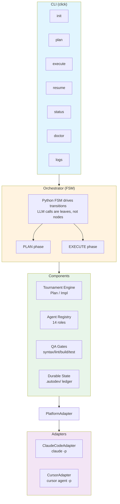
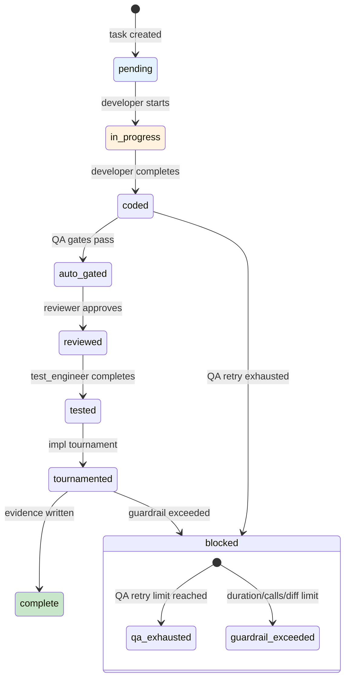

# Architecture

AutoDev is a Python CLI that orchestrates multi-agent coding workflows. This document describes the system architecture, subsystems, data flow, and state machine.

---

## System Architecture Diagram



**Serial by default**: one specialist at a time. **Parallelism only inside the tournament** (N judges via `asyncio.gather`, capped by `max_parallel_subprocesses`).

---

## Subsystem Breakdown

### A. Platform Adapters (`autodev/adapters/`)

Uniform contract over `claude -p` and `cursor agent --print`. Every subprocess call is **stateless** (fresh session) — continuity lives in `.autodev/` state, not in the LLM session.

| File | Purpose |
|---|---|
| `base.py` | `PlatformAdapter` protocol definition |
| `types.py` | `AgentSpec`, `AgentInvocation`, `AgentResult`, `ToolCall` pydantic models |
| `claude_code.py` | Subprocess wrapper around `claude -p` |
| `cursor.py` | Subprocess wrapper around `cursor agent --print` |
| `detect.py` | Auto-detect which binary is installed and logged in |

Key types:
```python
class AgentInvocation(BaseModel):
    role: str           # "developer", "critic_t", "judge", etc.
    prompt: str         # fully rendered prompt
    cwd: Path
    model: str | None   # "sonnet" | "opus" | "haiku" | None
    timeout_s: int = 600
    allowed_tools: list[str] | None = None
    max_turns: int = 1  # developer can be multi-turn

class AgentResult(BaseModel):
    success: bool
    text: str           # final message text
    tool_calls: list[ToolCall]
    files_changed: list[Path]
    diff: str | None
    duration_s: float
    error: str | None
    raw_stdout: str     # for debugging
```

### B. Agent Registry (`autodev/agents/`)

Single source of truth for all 14 agents. Renders to platform-native files at `autodev init`.

| File | Purpose |
|---|---|
| `__init__.py` | `build_registry(config) -> dict[str, AgentSpec]` |
| `tool_map.py` | Python dict mapping agent roles to allowed Claude Code tools |
| `render_claude.py` | Writes `.claude/agents/<name>.md` with YAML frontmatter |
| `render_cursor.py` | Writes `.cursor/rules/<name>.mdc` |
| `prompts/<name>.md` | 10 swarm agent prompts, vendored from opencode-swarm (tournament roles use `tournament/prompts.py`) |

### C. Orchestrator (`autodev/orchestrator/`)

The architect role is split: (i) Python FSM code deterministically drives the plan/execute flow and (ii) the LLM `architect` agent is called only for reasoning-heavy decisions.

| File | Purpose |
|---|---|
| `__init__.py` | `Orchestrator` class — top-level entry point |
| `plan_phase.py` | explorer → domain_expert → architect(draft) → PlanTournament → critic_t-gate → loop |
| `plan_parser.py` | `parse_plan_markdown` — parses architect output into `PlanSchema` |
| `execute_phase.py` | Per task: developer → auto-gates → reviewer → test_engineer → ImplTournament → evidence → advance |
| `task_state.py` | FSM transitions for task states |
| `delegation_envelope.py` | `DelegationEnvelope` — taskId, targetAgent, action, files, constraints, acceptance |
| `worktree.py` | `WorktreeManager` — `git worktree add/remove` for impl-tournament A/B/AB variants |
| `plan_tournament_runner.py` | Wires `PlanTournament` into the plan phase |

### D. Tournament Engine (`autodev/tournament/`)

Port of the autoreason self-refinement algorithm, parameterized over a `ContentHandler[T]`.

| File | Purpose |
|---|---|
| `core.py` | `Tournament[T]` generic, `run_pass`, `aggregate_rankings` (Borda), `parse_ranking` |
| `prompts.py` | CRITIC_SYSTEM, ARCHITECT_B_SYSTEM, SYNTHESIZER_SYSTEM, JUDGE_SYSTEM templates |
| `plan_tournament.py` | `ContentHandler[str]` for plan markdown |
| `impl_tournament.py` | `ContentHandler[ImplBundle]` for `{task, diff, test_results, files_changed}` |
| `llm.py` | `AdapterLLMClient` — adapter-backed LLM call with tenacity retry/backoff |
| `state.py` | Per-round artifact persistence under `.autodev/tournaments/{id}/pass_{n:02d}/` |

### E. Durable State (`autodev/state/`)

All state lives in `.autodev/` as append-only JSONL or pydantic-validated JSON. The ledger is the source of truth; `plan.json` is derived by replaying it.

| File | Purpose |
|---|---|
| `paths.py` | Centralized `.autodev/` layout constants |
| `ledger.py` | Append-only JSONL + CAS hash guard; crash-safe via `filelock` + atomic rename |
| `plan_manager.py` | Load/save via ledger replay |
| `evidence.py` | Pydantic-validated evidence bundle write/read |
| `knowledge.py` | Per-project + hive JSONL stores with Jaccard bigram dedup and ranking |
| `lockfile.py` | Thin `filelock` wrapper (`thread_local=False` required for asyncio) |
| `schemas.py` | Pydantic ports of `PlanSchema`, `TaskSchema`, `PhaseSchema`, `EvidenceSchema` |

### F. Configuration (`autodev/config/`)

| File | Purpose |
|---|---|
| `schema.py` | `AutodevConfig` pydantic v2 model |
| `loader.py` | `load_config(path)` / `save_config(cfg, path)` |
| `defaults.py` | `default_config()` — sensible defaults for new projects |

### G. CLI (`autodev/cli/`)

Framework: `click`. Entry point `autodev` registered via `[project.scripts]` in `pyproject.toml`.

### H. Plugins (`autodev/plugins/`)

Extension points via Python `entry_points(group="autodev.plugins")`.

| File | Purpose |
|---|---|
| `__init__.py` | Plugin protocol definitions |
| `registry.py` | `discover_plugins()` — entry_points-based discovery |

### I. Guardrails (`autodev/guardrails/`)

| File | Purpose |
|---|---|
| `enforcer.py` | `GuardrailEnforcer` — duration/tool-call/diff-size/invocation caps |
| `loop_detector.py` | `LoopDetector` — detects repeated identical outputs (hash-based) |

### J. QA Gates (`autodev/qa/`)

| File | Purpose |
|---|---|
| `detect.py` | Language detection from project files |
| `syntax_check.py` | Tree-sitter syntax validation |
| `lint.py` | Detected linter (ruff, eslint, etc.) |
| `build_check.py` | Build system check |
| `test_runner.py` | Test suite runner |
| `secretscan.py` | Secret/credential detection |

---

## Data Flow: Plan Phase

```
 autodev plan "<intent>"
        │
        ▼
 Orchestrator.plan(intent)
        │
        ├─ adapter.execute(explorer prompt + spec) → explore-plan.json evidence
        │
        ├─ adapter.execute(domain_expert prompt + explorer findings) → domain_expert-plan.json evidence
        │
        ├─ adapter.execute(architect draft prompt + spec + evidence) → plan markdown v0
        │
        ├─ ledger.append(plan_draft_created, v0)
        │
        ├─ PlanTournament.run(spec, v0)
        │     ├─ pass 1..15: critic_t → architect_b → synthesizer → N judges → Borda winner
        │     └─ converge at k=2 consecutive incumbent wins
        │
        ├─ adapter.execute(critic_t plan-gate prompt + refined plan) → APPROVED | NEEDS_REVISION | REJECTED
        │
        ├─ on NEEDS_REVISION: architect revises (bounded retries) → re-gate
        │
        └─ ledger.append(plan_approved) → plan.json persisted
```

## Data Flow: Execute Phase

```
 autodev execute
        │
        ▼
 Orchestrator.execute()
        │
        for each pending task:
        │
        ├─ ledger.append(task_started)
        │
        ├─ adapter.execute(developer prompt + DelegationEnvelope) → diff + files_changed
        │
        ├─ QA gates (Python, local):
        │     syntax_check → lint → build_check → test_runner → secretscan
        │     FAIL → retry developer with feedback (up to qa_retry_limit=3)
        │     exhausted → escalate to critic_sounding_board
        │
        ├─ adapter.execute(reviewer prompt + diff) → review evidence
        │
        ├─ adapter.execute(test_engineer prompt + diff) → test evidence
        │
        ├─ ImplTournament.run(task_desc, ImplBundle(diff_A, tests_A))
        │     ├─ git worktree add .autodev/tournaments/impl-{task_id}/{a,b,ab}
        │     ├─ critic_t reads diff_A → critique
        │     ├─ architect_b proposes direction → developer re-runs in /b → diff_B
        │     ├─ synthesizer proposes picks → developer applies in /ab → diff_AB
        │     ├─ judge ranks (A, B, AB) → winner merged to main worktree
        │     └─ worktrees pruned; tournament.json evidence written
        │
        ├─ ledger.append(task_complete)
        │
        └─ knowledge promotion check (swarm → hive if criteria met)
```

---

## FSM State Diagram

Task states and transitions:



---

## File Layout

```
autodev/                          # project root
├── pyproject.toml                # uv/pip metadata, entry points
├── README.md
├── uv.lock
├── autodev/                      # Python package
│   ├── __init__.py
│   ├── __main__.py               # python -m AutoDev entry
│   ├── errors.py                 # AutodevError hierarchy
│   ├── logging.py                # structlog setup
│   ├── adapters/                 # Platform adapter layer
│   ├── agents/                   # Agent registry + prompts
│   │   └── prompts/              # 14 .md files (10 swarm + 4 tournament)
│   ├── cli/                      # click commands
│   │   └── commands/             # init, plan, execute, resume, status, ...
│   ├── config/                   # schema, loader, defaults
│   ├── guardrails/               # enforcer, loop_detector
│   ├── orchestrator/             # plan_phase, execute_phase, worktree, ...
│   ├── plugins/                  # entry_points discovery
│   ├── qa/                       # syntax_check, lint, build_check, ...
│   ├── state/                    # ledger, plan_manager, evidence, knowledge, ...
│   └── tournament/               # core, plan_tournament, impl_tournament, ...
└── tests/
    ├── conftest.py
    ├── stub_adapter.py           # StubAdapter for unit tests
    ├── fixtures/
    │   ├── autoreason/           # reference fixtures from autoreason paper
    │   └── golden/               # snapshot golden files
    └── test_*.py                 # ~43 test files, ~356 tests

.autodev/                         # per-project state (created by autodev init)
├── config.json
├── spec.md
├── plan.json                     # derived from ledger replay
├── plan-ledger.jsonl             # append-only mutations
├── knowledge.jsonl               # per-project lessons
├── rejected_lessons.jsonl
├── evidence/
│   ├── {task_id}-developer.json
│   ├── {task_id}-review.json
│   ├── {task_id}-test.json
│   ├── {task_id}-tournament.json
│   └── {task_id}.patch
├── tournaments/
│   ├── plan-{plan_id}/
│   │   ├── initial_a.md
│   │   ├── final_output.md
│   │   ├── history.json
│   │   └── pass_{n:02d}/
│   └── impl-{task_id}/
│       ├── history.json
│       ├── {a,b,ab}/             # git worktrees (pruned after merge)
│       └── pass_{n:02d}/
└── sessions/
    └── {session_id}/
        ├── events.jsonl          # full audit trail
        └── snapshot.json

~/.local/share/autodev/
└── shared-learnings.jsonl        # hive tier (cross-project knowledge)
```

---

## Documentation Index

### Design Documents (`docs/design_documentation/`)

| Document | Component |
|----------|-----------|
| [adapters_design.md](design_documentation/adapters_design.md) | Platform Adapter Layer (ClaudeCode, Cursor, Inline) |
| [agents_design.md](design_documentation/agents_design.md) | Agent Registry & 14-Role Prompt System |
| [orchestrator_design.md](design_documentation/orchestrator_design.md) | FSM Orchestrator (Plan & Execute Phases) |
| [tournament_engine_design.md](design_documentation/tournament_engine_design.md) | Tournament Engine (Borda Count Self-Refinement) |
| [state_management_design.md](design_documentation/state_management_design.md) | Durable State Layer (Ledger, Evidence, Schemas) |
| [knowledge_system_design.md](design_documentation/knowledge_system_design.md) | Two-Tier Knowledge Store (Swarm + Hive) |
| [qa_gates_design.md](design_documentation/qa_gates_design.md) | QA Gates Pipeline (Syntax, Lint, Build, Test, Secrets) |
| [guardrails_design.md](design_documentation/guardrails_design.md) | Per-Task Guardrails & Loop Detection |
| [plugin_system_design.md](design_documentation/plugin_system_design.md) | Plugin Discovery & Protocol System |
| [config_system_design.md](design_documentation/config_system_design.md) | Configuration Schema & Loading |
| [cli_design.md](design_documentation/cli_design.md) | CLI Layer (Click Commands) |

### Architecture Decision Records (`src/design_decision/`)

| ADR | Decision |
|-----|----------|
| [ADR-001](../src/design_decision/adr-001-stateless-subprocess-invocations.md) | Stateless Subprocess Invocations |
| [ADR-002](../src/design_decision/adr-002-append-only-jsonl-ledger-with-cas.md) | Append-Only JSONL Ledger with CAS Hash Chaining |
| [ADR-003](../src/design_decision/adr-003-borda-count-tournament-algorithm.md) | Borda Count Tournament Algorithm |
| [ADR-004](../src/design_decision/adr-004-two-tier-knowledge-with-jaccard-dedup.md) | Two-Tier Knowledge with Jaccard Dedup |
| [ADR-005](../src/design_decision/adr-005-protocol-based-plugin-system.md) | Protocol-Based Plugin System |
| [ADR-006](../src/design_decision/adr-006-platform-adapter-abstraction.md) | Platform Adapter Abstraction |
| [ADR-007](../src/design_decision/adr-007-git-worktree-isolation-for-tournaments.md) | Git Worktree Isolation for Tournaments |
| [ADR-008](../src/design_decision/adr-008-deterministic-fsm-orchestration.md) | Deterministic FSM Orchestration |
| [ADR-009](../src/design_decision/adr-009-pydantic-v2-strict-validation.md) | Pydantic v2 Strict Validation |
| [ADR-010](../src/design_decision/adr-010-conservative-tiebreak-in-tournaments.md) | Conservative Tiebreak in Tournaments |

### Reference Documents (`docs/design_documentation/`)

| Document | Purpose |
|----------|---------|
| [tournaments.md](design_documentation/tournaments.md) | Tournament algorithm detail & configuration |
| [adapters.md](design_documentation/adapters.md) | Adapter layer reference |
| [agents.md](design_documentation/agents.md) | Agent roles reference |
| [cost.md](design_documentation/cost.md) | Cost model & estimation |
| [semver.md](design_documentation/semver.md) | Versioning policy |

### Templates

| Template | Purpose |
|----------|---------|
| [design_document_template.md](design_documentation/design_document_template.md) | Template for new component design docs |
| [adr_template.md](design_documentation/adr_template.md) | Template for new Architecture Decision Records |
