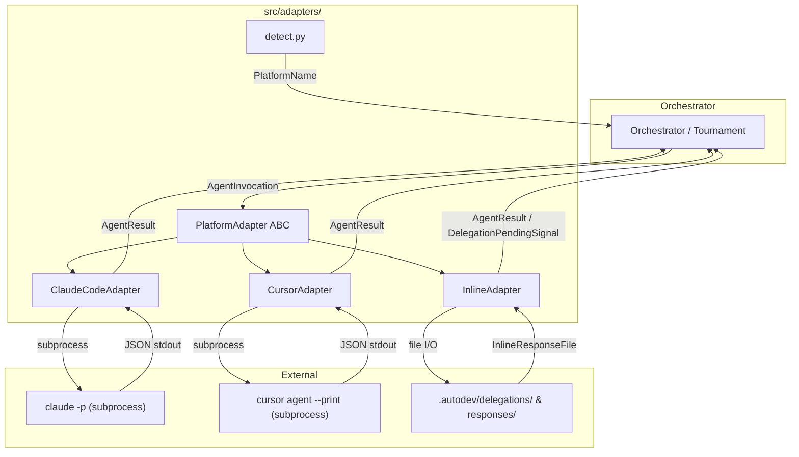
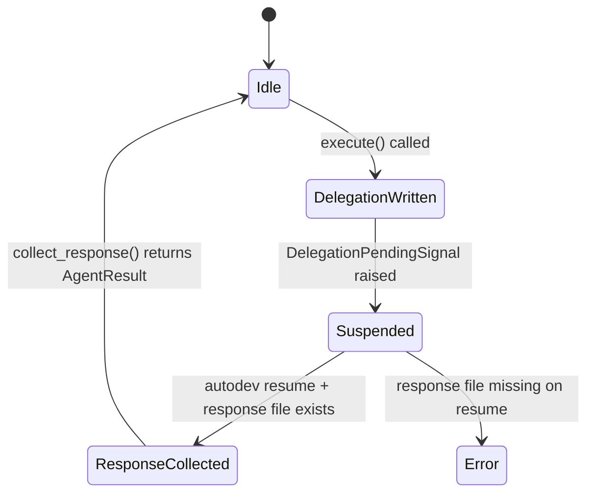
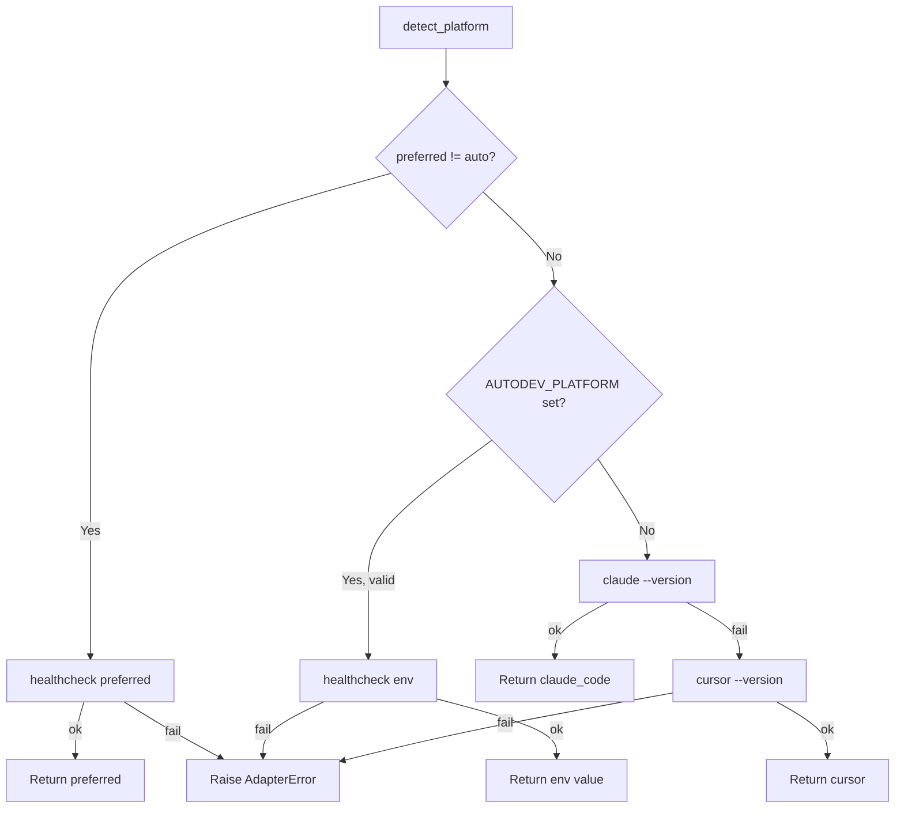

# Platform Adapter Layer Design

**Status:** Implemented
**Author:** Mohamed Ameen
**Date:** 2026-04-17
**Last Updated:** 2026-04-17
**Reviewers:** --
**Package:** `src/adapters/`
**Entry Point:** N/A (library-only, consumed by `src/orchestrator/`)

## 1. Overview

### 1.1 Purpose

The Platform Adapter Layer provides a uniform asynchronous interface for invoking LLM-backed coding agents across heterogeneous platforms. Every adapter speaks the same `PlatformAdapter` ABC regardless of whether the underlying transport is a Claude Code subprocess, a Cursor CLI subprocess, or an in-process file-based delegation. This decoupling lets the orchestrator, tournament engine, and QA gates treat agent invocation as a single operation without awareness of platform-specific concerns.

### 1.2 Scope

**In scope:**
- `PlatformAdapter` abstract base class and its four abstract methods
- Three concrete adapters: `ClaudeCodeAdapter`, `CursorAdapter`, `InlineAdapter`
- Platform auto-detection cascade (`detect_platform`, `get_adapter`)
- Shared Pydantic v2 data models: `AgentInvocation`, `AgentResult`, `AgentSpec`, `ToolCall`, `StreamEvent`
- Inline-mode types: `DelegationPendingSignal`, `InlineSuspendState`, `InlineResponseFile`
- Git-based file-change detection utilities
- Bounded parallel execution via `asyncio.Semaphore`

**Out of scope:**
- Tournament engine internals (covered in `tournaments_design.md`)
- Orchestrator FSM logic (covered in `orchestrator_design.md`)
- Agent prompt content and registry (covered in `agents_design.md`)
- QA gate implementations (`src/qa/`)

### 1.3 Context

The adapter layer sits at the bottom of the AutoDev pipeline:

```
CLI (Click) -> Orchestrator -> Adapter Layer -> External Platform (claude / cursor / filesystem)
                                    ^
                                    |
                             Tournament Engine
```

The orchestrator constructs an `AgentInvocation` and calls `adapter.execute()`. The adapter translates this into platform-specific subprocess invocations (or file writes, for inline mode), captures the result, and returns a normalized `AgentResult`. The orchestrator never needs to know which platform is running underneath.

## 2. Requirements

### 2.1 Functional Requirements

- FR-1: Provide a single abstract interface (`PlatformAdapter`) with `execute()`, `parallel()`, `init_workspace()`, and `healthcheck()` methods.
- FR-2: `ClaudeCodeAdapter` must invoke `claude -p` with JSON output parsing, model/tool/max-turns flags, and file-change detection via `git status --porcelain` before/after.
- FR-3: `CursorAdapter` must invoke `cursor agent --print` with model fallback logic (primary model -> "auto" on rate-limit).
- FR-4: `InlineAdapter` must write delegation files to `.autodev/delegations/`, raise `DelegationPendingSignal` to suspend the orchestrator, and collect response files from `.autodev/responses/` on resume.
- FR-5: `detect_platform()` must implement a four-tier cascade: CLI flag > `AUTODEV_PLATFORM` env var > `claude --version` probe > `cursor --version` probe.
- FR-6: `parallel()` must run invocations concurrently, capped by `asyncio.Semaphore(max_concurrent)`, preserving input order.
- FR-7: Every adapter must handle subprocess timeouts gracefully, returning a structured `AgentResult` with `success=False` rather than crashing.

### 2.2 Non-Functional Requirements

- **Subprocess isolation:** Every `execute()` call spawns a fresh subprocess. No shared mutable state between invocations. No `--continue` flag is passed to Claude; every call is stateless.
- **Asyncio concurrency:** All subprocess I/O uses `asyncio.create_subprocess_exec` with `asyncio.wait_for` for timeout enforcement. The event loop is never blocked.
- **Pydantic v2 strict validation:** All boundary models use `ConfigDict(extra="forbid")`. Unknown fields are rejected at parse time.
- **Crash safety:** Timeout paths kill the subprocess, wait up to 5 seconds for cleanup, and return a structured error result. `FileNotFoundError` for missing binaries is caught and reported.
- **Deterministic reproducibility:** Given the same `AgentInvocation`, the adapter constructs the same CLI command. Platform detection is deterministic given the same environment.

### 2.3 Constraints

- Must run on Python 3.11+ with no compiled extensions.
- Must work within a single-machine, single-user context.
- Must not introduce dependencies beyond `pyproject.toml` (relies on `pydantic`, `structlog`, standard library `asyncio`/`subprocess`/`json`).
- The `claude` and `cursor` CLIs are external binaries installed independently; AutoDev cannot control their versions.

## 3. Architecture

### 3.1 High-Level Design



### 3.2 Component Structure

| File | Responsibility |
|------|---------------|
| `base.py` | `PlatformAdapter` ABC with `execute()`, `parallel()`, `init_workspace()`, `healthcheck()` |
| `types.py` | Pydantic v2 models: `AgentInvocation`, `AgentResult`, `AgentSpec`, `ToolCall`, `StreamEvent` |
| `claude_code.py` | `ClaudeCodeAdapter`: `claude -p` subprocess invocation, JSON parsing, git diff detection |
| `cursor.py` | `CursorAdapter`: `cursor agent --print` subprocess invocation, model fallback, multi-binary probe |
| `inline.py` | `InlineAdapter`: file-based delegation/response, `DelegationPendingSignal` for suspend/resume |
| `inline_types.py` | `DelegationPendingSignal`, `InlineSuspendState`, `InlineResponseFile`, `InlineResponseError` |
| `inline_config.py` | Renders auto-resume config into `.claude/CLAUDE.md` and `.cursor/rules/src.mdc` |
| `detect.py` | `detect_platform()`, `get_adapter()`: four-tier platform detection cascade |
| `git_utils.py` | `_git_porcelain_set()`, `_diff_files()`, `_git_diff()`: shared file-change detection |
| `__init__.py` | Re-exports all public symbols |

### 3.3 Data Models

```python
class ToolCall(BaseModel):
    """A single tool invocation reported by an adapter."""
    model_config = ConfigDict(extra="forbid")

    tool: str
    args: dict[str, Any] = Field(default_factory=dict)
    result_summary: str | None = None
    error: str | None = None


class AgentInvocation(BaseModel):
    """Input to PlatformAdapter.execute()."""
    model_config = ConfigDict(extra="forbid", arbitrary_types_allowed=True)

    role: str
    prompt: str
    cwd: Path
    model: str | None = None
    timeout_s: int = 600
    allowed_tools: list[str] | None = None
    max_turns: int = 1
    metadata: dict[str, Any] = Field(default_factory=dict)


class AgentResult(BaseModel):
    """Output of PlatformAdapter.execute()."""
    model_config = ConfigDict(extra="forbid", arbitrary_types_allowed=True)

    success: bool
    text: str
    tool_calls: list[ToolCall] = Field(default_factory=list)
    files_changed: list[Path] = Field(default_factory=list)
    diff: str | None = None
    duration_s: float
    error: str | None = None
    raw_stdout: str = ""
    raw_stderr: str = ""


class AgentSpec(BaseModel):
    """Definition of an agent (used by init_workspace in Phase 3)."""
    model_config = ConfigDict(extra="forbid")

    name: str
    description: str
    prompt: str
    tools: list[str] = Field(default_factory=list)
    model: str | None = None


class StreamEvent(BaseModel):
    """Reserved for future stream-json parsing; unused in Phase 2."""
    model_config = ConfigDict(extra="forbid")

    type: Literal["tool_start", "tool_end", "text", "error"]
    data: dict[str, Any] = Field(default_factory=dict)
```

**Inline-mode models:**

```python
class DelegationPendingSignal(Exception):
    """Raised by InlineAdapter.execute() to suspend the orchestrator.
    NOT an error -- the orchestrator catches this and serializes state."""
    task_id: str
    role: str
    delegation_path: Path


class InlineSuspendState(BaseModel):
    """Persisted to .autodev/inline-state.json when the process suspends."""
    model_config = ConfigDict(extra="forbid")

    schema_version: Literal["1.0"] = "1.0"
    session_id: str
    suspended_at: str
    pending_task_id: str
    pending_role: str
    delegation_path: str
    response_path: str
    orchestrator_step: Literal[
        "developer", "reviewer", "test_engineer",
        "critic_sounding_board", "plan_explorer",
        "plan_domain_expert", "plan_architect",
    ]
    retry_count: int = 0
    last_issues: list[str] = Field(default_factory=list)


class InlineResponseFile(BaseModel):
    """Schema for the JSON file the agent writes after completing a delegation."""
    model_config = ConfigDict(extra="forbid")

    schema_version: Literal["1.0"] = "1.0"
    task_id: str
    role: str
    success: bool
    text: str
    error: str | None = None
    duration_s: float = 0.0
    files_changed: list[str] = Field(default_factory=list)
    diff: str | None = None
```

### 3.4 State Machine

The `InlineAdapter` introduces a suspend/resume state machine at the adapter level:



The subprocess adapters (`ClaudeCodeAdapter`, `CursorAdapter`) have no state machine -- each `execute()` call is a synchronous request/response cycle.

### 3.5 Protocol / Interface Contracts

```python
class PlatformAdapter(ABC):
    """Uniform subprocess-based contract for every LLM platform."""

    name: str = "abstract"

    @abstractmethod
    async def init_workspace(self, cwd: Path, agents: list[AgentSpec]) -> None:
        """Render platform-native agent files into cwd."""

    @abstractmethod
    async def execute(self, inv: AgentInvocation) -> AgentResult:
        """Run a single agent invocation to completion."""

    async def parallel(
        self,
        invs: list[AgentInvocation],
        max_concurrent: int = 3,
    ) -> list[AgentResult]:
        """Run invs concurrently, capped at max_concurrent."""

    @abstractmethod
    async def healthcheck(self) -> tuple[bool, str]:
        """Return (ok, details) describing CLI presence / login status."""
```

The `parallel()` method has a default implementation on the ABC that wraps `execute()` calls with `asyncio.Semaphore` and `asyncio.gather`. The `InlineAdapter` overrides it to raise `NotImplementedError` because inline mode is inherently sequential (one delegation at a time).

### 3.6 Interfaces

**Public API:**

| Function/Method | Description |
|----------------|-------------|
| `detect_platform(preferred)` | Returns `PlatformName` via the four-tier cascade |
| `get_adapter(platform, cwd, platform_hint)` | Resolves and returns a `PlatformAdapter` instance |
| `PlatformAdapter.execute(inv)` | Runs one agent invocation |
| `PlatformAdapter.parallel(invs, max_concurrent)` | Runs multiple invocations concurrently |
| `PlatformAdapter.init_workspace(cwd, agents)` | Renders platform-native agent config files |
| `PlatformAdapter.healthcheck()` | Probes CLI availability and returns `(ok, details)` |
| `InlineAdapter.collect_response(task_id, role)` | Reads and validates a response file (resume path) |
| `InlineAdapter.has_pending_response(task_id, role)` | Checks if a response file exists |

## 4. Design Decisions

### 4.1 Key Decisions

| Decision | Rationale | Alternatives Considered |
|----------|-----------|------------------------|
| Stateless subprocesses (no `--continue`) | Continuity lives in autodev's own state files, not in the LLM session. Each invocation is isolated and reproducible. (ADR-001) | Persistent LLM sessions with `--continue` -- rejected because it creates hidden coupling between orchestrator state and LLM session state. |
| ABC instead of Protocol | Concrete `parallel()` implementation on the base class provides shared behavior. An ABC with abstract + concrete methods is more natural than a Protocol for this pattern. | `typing.Protocol` -- would require duplicating `parallel()` in each adapter or using a mixin. |
| File-based inline delegation | When running inside an agent session, subprocess spawning would create a second agent session. File-based delegation lets the host agent read the task and respond. (ADR-006) | Direct function calls -- rejected because the host agent needs to use its own tools and context, which requires returning control to it. |
| `DelegationPendingSignal` as exception | The signal must unwind the call stack to the orchestrator so it can serialize state and exit. A return value would require every intermediate caller to check and forward it. | Sentinel return value, callback pattern -- both add complexity to every caller in the chain. |
| Git-based file-change detection | Before/after `git status --porcelain` snapshots detect new files. `git diff HEAD` provides the unified diff. Works with any agent that modifies files. | Filesystem watchers (`watchdog`) -- rejected because they add a dependency and require event loop integration. Inotify is Linux-only. |
| Model fallback in CursorAdapter | Rate-limit errors on `opus`/`sonnet` fall back to `auto`. This handles Cursor's subscription-based rate limits gracefully. | Fail immediately on rate limit -- rejected because it wastes the entire task's progress. |

### 4.2 Trade-offs

- **File-change detection via `git status` snapshots misses modifications to already-dirty files.** A file that was modified before the invocation and is modified again during it will show up in both the before and after snapshots, so the delta is empty. This is acceptable for Phase 2 -- the orchestrator cares about new work the agent just did, not pre-existing modifications. Phase 3+ may switch to diff-based tracking.
- **InlineAdapter does not support `parallel()`.** Inline mode suspends the process after each delegation, so parallelism is fundamentally impossible. The orchestrator must handle inline tasks sequentially.
- **`ToolCall` list is always empty in Phase 2.** The `claude -p --output-format json` response only includes the final aggregated result, not individual tool calls. Populating this requires stream-json parsing (future enhancement).

## 5. Implementation Details

### 5.1 Core Algorithms/Logic

**ClaudeCodeAdapter.execute() flow:**

1. Snapshot `git status --porcelain` (before).
2. Build CLI command: `claude -p <prompt> --output-format json --permission-mode acceptEdits [--model M] [--max-turns N] [--allowed-tools T]`.
3. Spawn subprocess via `asyncio.create_subprocess_exec` with `cwd=inv.cwd`.
4. Wait with `asyncio.wait_for(proc.communicate(), timeout=inv.timeout_s)`.
5. On timeout: kill process, wait up to 5s, return `AgentResult(success=False, error="timeout")`.
6. On `FileNotFoundError`: return `AgentResult(success=False, error="binary not found")`.
7. Parse JSON stdout. Extract `result` field as text, `is_error` flag.
8. Snapshot `git status --porcelain` (after). Compute `files_changed = after - before`.
9. If files changed, compute `git diff HEAD` for the unified diff.
10. Return `AgentResult`.

**CursorAdapter model fallback flow:**

1. Build `models_to_try` list: `[inv.model]` plus fallback if `inv.model` is `"opus"` or `"sonnet"`.
2. For each model, for each binary (`"cursor"`, `"cursor-agent"`):
   a. Build and spawn command.
   b. On `FileNotFoundError`: try next binary.
   c. On rate-limit (exit code 429 or stderr match): append fallback model and break to next model.
   d. On success: parse JSON, detect file changes, return result.
3. If all models/binaries exhausted: return `AgentResult(success=False, error=last_err)`.

**CursorAdapter JSON text extraction** uses a defensive multi-key probe:

```python
for key in ("result", "response", "text", "content", "message"):
    value = parsed.get(key)
    if isinstance(value, str) and value:
        return value
return ""
```

**Platform detection cascade:**



### 5.2 Concurrency Model

**Bounded parallel execution** is implemented in the ABC:

```python
async def parallel(
    self,
    invs: list[AgentInvocation],
    max_concurrent: int = 3,
) -> list[AgentResult]:
    if max_concurrent < 1:
        raise ValueError("max_concurrent must be >= 1")
    sem = asyncio.Semaphore(max_concurrent)

    async def _one(inv: AgentInvocation) -> AgentResult:
        async with sem:
            return await self.execute(inv)

    return await asyncio.gather(
        *(_one(i) for i in invs),
        return_exceptions=False,
    )
```

- The semaphore defaults to 3 (configurable via `TournamentsConfig.max_parallel_subprocesses`).
- `return_exceptions=False` means any adapter failure propagates immediately.
- Result order matches input order (guaranteed by `asyncio.gather`).

### 5.3 Subprocess Invocation Pattern

All subprocess adapters follow the same pattern:

```python
proc = await asyncio.create_subprocess_exec(
    *cmd,
    cwd=str(inv.cwd),
    stdout=asyncio.subprocess.PIPE,
    stderr=asyncio.subprocess.PIPE,
)
try:
    stdout_b, stderr_b = await asyncio.wait_for(
        proc.communicate(),
        timeout=inv.timeout_s,
    )
except asyncio.TimeoutError:
    with suppress(ProcessLookupError):
        proc.kill()
    with suppress(asyncio.TimeoutError):
        await asyncio.wait_for(proc.wait(), timeout=5)
    # Return structured error result
```

Key properties:
- `cwd` is set to `inv.cwd` -- the `claude` CLI does not accept `--cwd`.
- Both stdout and stderr are captured as pipes.
- Timeout kills the process and waits up to 5 additional seconds for cleanup.
- `ProcessLookupError` is suppressed in case the process already exited.

### 5.4 Atomic I/O Pattern

The `InlineAdapter` writes delegation files atomically by using `Path.write_text()` (which on POSIX is effectively atomic for small files). The `InlineSuspendState` is written to `.autodev/inline-state.json` via Pydantic's `model_dump_json` + `Path.write_text`.

The inline config module (`inline_config.py`) performs idempotent updates to `.claude/CLAUDE.md` by using HTML comment delimiters (`<!-- autodev-managed -->`) to mark the managed section. The `update_claude_md()` function replaces the section in-place if delimiters exist, or appends if they don't.

### 5.5 Error Handling

| Error Condition | Handling |
|----------------|----------|
| Binary not found (`FileNotFoundError`) | Return `AgentResult(success=False, error="binary not found: ...")` |
| Subprocess timeout | Kill process, return `AgentResult(success=False, error="timeout after Ns")` |
| Non-zero exit code | Return `AgentResult(success=False, error="exited N: stderr")` |
| JSON parse failure | Log warning, return `AgentResult(success=False, error="parse failed: ...")` |
| Rate limit (Cursor) | Append fallback model to retry list; if exhausted, return error |
| Response file missing (Inline) | Raise `InlineResponseError` |
| Response file mismatch (Inline) | Raise `InlineResponseError` with task_id/role details |
| Invalid preferred platform | Raise `AdapterError` |
| No platform CLI found | Raise `AdapterError("No platform CLI found; install claude or cursor")` |

All error results preserve `raw_stdout` and `raw_stderr` for debugging.

### 5.6 Dependencies

- **pydantic:** Model validation at all boundaries (`AgentInvocation`, `AgentResult`, `AgentSpec`, inline types)
- **structlog:** Structured logging via `autologging.get_logger`
- **yaml:** Used by `render_claude.py` and `render_cursor.py` for frontmatter generation (standard `PyYAML`)
- **Internal:** `src/errors` for `AdapterError`, `src/state/paths` for delegation/response path resolution, `src/autologging` for logger factory

### 5.7 Configuration

| Config Path | Description | Default |
|-------------|-------------|---------|
| `AutodevConfig.platform` | Preferred platform: `"claude_code"`, `"cursor"`, `"inline"`, `"auto"` | `"auto"` |
| `AUTODEV_PLATFORM` env var | Override platform selection | Not set |
| `TournamentsConfig.max_parallel_subprocesses` | Semaphore bound for `parallel()` | `3` |
| `AgentInvocation.timeout_s` | Per-invocation subprocess timeout | `600` (10 minutes) |
| `AgentInvocation.max_turns` | Max turns for the Claude CLI | `1` |

## 6. Integration Points

### 6.1 Dependencies on Other Components

| Component | Dependency |
|-----------|-----------|
| `src/config/schema.py` | `AutodevConfig.platform` drives adapter selection |
| `src/state/paths.py` | `delegation_path()`, `response_path()`, `inline_state_path()` |
| `src/errors.py` | `AdapterError` base exception class |
| `src/autologging.py` | `get_logger()` for structured logging |

### 6.2 Adapter Contract Dependency

This component **defines** the adapter protocol (`PlatformAdapter`). All other components depend on it.

### 6.3 Ledger Event Emissions

The adapter layer does not write ledger events directly. Evidence and ledger writes are the orchestrator's responsibility.

### 6.4 Components That Depend on This

| Consumer | Usage |
|----------|-------|
| `src/orchestrator/` | All `execute()` and `parallel()` calls flow through the adapter |
| `src/orchestrator/plan_phase.py` | `_delegate()` calls `adapter.execute()` |
| `src/orchestrator/execute_phase.py` | `delegate()` calls `adapter.execute()` |
| `src/orchestrator/plan_tournament_runner.py` | Wraps adapter in `AdapterLLMClient` for tournament |
| `src/orchestrator/impl_tournament_runner.py` | `_CoderRunner` calls `adapter.execute()` in worktrees |
| `src/tournament/` | `AdapterLLMClient` wraps `PlatformAdapter` for tournament scoring |

### 6.5 External Systems

| System | Interaction |
|--------|------------|
| Claude Code CLI (`claude`) | Subprocess invocation via `claude -p --output-format json` |
| Cursor CLI (`cursor`, `cursor-agent`) | Subprocess invocation via `cursor agent --print --output-format json` |
| Git | `git status --porcelain`, `git diff HEAD` for file-change detection; `git --version` indirectly via healthcheck |
| Filesystem | `.autodev/delegations/` and `.autodev/responses/` for inline mode |

## 7. Testing Strategy

### 7.1 Unit Tests

- Round-trip serialization for all Pydantic models (`AgentInvocation`, `AgentResult`, `AgentSpec`, `ToolCall`, `StreamEvent`, `InlineSuspendState`, `InlineResponseFile`).
- `extra="forbid"` rejection tests: verify that unknown fields raise `ValidationError`.
- `_build_command()` tests for both `ClaudeCodeAdapter` and `CursorAdapter` with various flag combinations.
- `_extract_text()` tests for Cursor's defensive multi-key JSON parsing.
- `_diff_files()` and `_git_porcelain_set()` tests with mock subprocess output.
- `detect_platform()` with mocked healthchecks and environment variables.
- `can_transition()` for inline state transitions.
- `update_claude_md()` idempotent section replacement tests.

### 7.2 Integration Tests

- End-to-end `execute()` tests with mocked subprocess (monkeypatched `asyncio.create_subprocess_exec`).
- Timeout behavior: verify that the adapter kills the subprocess and returns a structured error.
- `parallel()` with semaphore: verify concurrent execution count does not exceed `max_concurrent`.
- Inline adapter delegation round-trip: write delegation, create response file, call `collect_response()`.
- Platform detection with real binary probes (CI-only, skipped when binaries are absent).

### 7.3 Property-Based Tests

- Hypothesis strategies for `AgentInvocation` fields to fuzz model validation.
- Random `git status --porcelain` output to test `_git_porcelain_set()` parsing.

### 7.4 Test Data Requirements

- Sample `claude -p --output-format json` stdout payloads (success, error, malformed).
- Sample `cursor agent --print --output-format json` stdout payloads with various key structures.
- Sample `git status --porcelain` output (clean, modified, renamed, untracked).

## 8. Security Considerations

- **Prompt injection via subprocess args:** The prompt is passed as a positional argument to `claude -p`, not via shell interpolation. `asyncio.create_subprocess_exec` avoids shell expansion.
- **File permission for inline mode:** Delegation and response files are written with default umask. No secrets are stored in these files -- they contain prompts and agent text output.
- **Raw stdout/stderr preservation:** `AgentResult.raw_stdout` and `raw_stderr` may contain sensitive content from the LLM. These fields should not be logged at INFO level or exposed to end users without truncation.
- **Binary path injection:** The `binary` parameter for `ClaudeCodeAdapter` defaults to `"claude"` and is resolved via PATH. If an attacker controls PATH, they could substitute a malicious binary. This is standard subprocess risk.

## 9. Performance Considerations

- **Subprocess overhead:** Each `execute()` call spawns a new OS process. The `claude` CLI has a cold-start time of approximately 1-3 seconds. For bulk operations, `parallel()` amortizes this.
- **Semaphore bound:** The default `max_concurrent=3` limits resource consumption. This is configurable via `TournamentsConfig.max_parallel_subprocesses`.
- **Git operations:** `_git_porcelain_set()` runs synchronously via `subprocess.run` (not async) with a 5-second timeout. This is acceptable because the operation is fast for typical repo sizes, but could become a bottleneck for very large monorepos. Phase 3+ may move to async subprocess.
- **Inline mode latency:** The suspend/resume cycle adds human-in-the-loop latency (the agent must read the delegation, execute, write the response, and run `autodev resume`). This is inherent to the inline architecture and is not a performance concern for the adapter itself.

## 10. Installation & CLI Entry

### 10.1 Package Registration

The adapter layer is a library package under `src/adapters/`. It is imported by `src/orchestrator/` and does not register CLI commands directly.

### 10.2 CLI Commands

No direct CLI commands. The adapter is selected via:
- `autodev run --platform <claude_code|cursor|inline|auto>`
- `AUTODEV_PLATFORM` environment variable
- Auto-detection (default)

### 10.3 Migration Strategy

N/A -- this is the initial implementation.

## 11. Observability

### 11.1 Structured Logging

| Event | Key Fields | Description |
|-------|-----------|-------------|
| `claude_code.execute` | `role`, `model`, `max_turns`, `allowed_tools`, `cwd` | Before subprocess spawn |
| `claude_code.parse_failed` | `err`, `raw_stdout` (truncated) | JSON parse failure |
| `cursor.execute` | `role`, `model`, `binary`, `cwd` | Before subprocess spawn |
| `cursor.rate_limit_fallback` | `role`, `from_model`, `to_model` | Model fallback on rate limit |
| `cursor.allowed_tools_ignored` | `role`, `allowed_tools` | Cursor does not support `--allowed-tools` |
| `inline.execute` | `role`, `task_id`, `delegation_path` | Delegation file written |
| `inline.init_workspace` | `cwd`, `platform`, `agent_count` | Config files rendered |
| `detect_platform.selected` | `platform`, `details` | Auto-detection result |

### 11.2 Audit Artifacts

- `.autodev/delegations/<task_id>-<role>.md` -- delegation files (inline mode)
- `.autodev/responses/<task_id>-<role>.json` -- response files (inline mode)
- `.autodev/inline-state.json` -- suspend state (inline mode, cleared on resume)

### 11.3 Status Command

`autodev status` reports the active platform name and adapter health. The orchestrator's `status()` method does not expose adapter internals directly, but the platform name is implicit in the session configuration.

## 12. Cost Implications

| Operation | LLM Calls | Notes |
|-----------|-----------|-------|
| Single agent invocation | 1 | One subprocess = one API call to the platform |
| `parallel(invs, max_concurrent=3)` | `len(invs)` | Concurrent but each is one API call |
| Model fallback (Cursor) | Up to 2 | Primary model + fallback on rate limit |
| Healthcheck | 0 | `--version` flag, no LLM call |

The adapter layer itself adds no LLM calls beyond what the orchestrator requests. Cost is entirely driven by the number of `execute()` calls from the orchestrator and tournament engine.

## 13. Future Enhancements

- **Stream-JSON parsing:** Parse `claude -p` stream output to populate `ToolCall` list in real-time, enabling progress reporting and fine-grained tool-call tracking.
- **Phase 3 workspace rendering:** `init_workspace()` currently stubs as no-op for subprocess adapters. Phase 3 will render `.claude/agents/<name>.md` and `.cursor/rules/<name>.mdc` from `AgentSpec` via `render_claude.py` and `render_cursor.py`.
- **Async git operations:** Move `_git_porcelain_set()` and `_git_diff()` from synchronous `subprocess.run` to `asyncio.create_subprocess_exec`.
- **Diff-based file-change tracking:** Replace before/after `git status` snapshots with proper `git diff` to catch modifications to already-dirty files.
- **Cursor `--allowed-tools` support:** Currently logged as a warning and ignored. Future Cursor CLI versions may support tool restrictions.

## 14. Open Questions

- [ ] Should `StreamEvent` be removed or promoted to a first-class concept with stream-JSON parsing?
- [ ] Should `_git_porcelain_set()` be moved to async to avoid blocking the event loop for large repos?
- [ ] Should the InlineAdapter support a "batch delegation" mode where multiple delegation files are written before suspend?

## 15. Related ADRs

- ADR-001: Stateless subprocesses -- each agent invocation is a fresh subprocess with no shared mutable state.
- ADR-006: Platform adapter abstraction -- the `PlatformAdapter` ABC decouples the orchestrator from platform-specific CLI invocations.

## 16. References

- [Claude Code CLI documentation](https://docs.anthropic.com/en/docs/claude-code)
- [Cursor Agent CLI documentation](https://docs.cursor.sh/)
- [asyncio subprocess documentation](https://docs.python.org/3/library/asyncio-subprocess.html)

## 17. Revision History

| Date | Author | Changes |
|------|--------|---------|
| 2026-04-17 | Mohamed Ameen | Initial draft |
