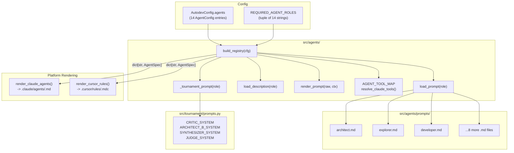

# Agent Registry & Prompts Design

**Status:** Implemented
**Author:** Mohamed Ameen
**Date:** 2026-04-17
**Last Updated:** 2026-04-17
**Reviewers:** --
**Package:** `src/agents/`
**Entry Point:** N/A (library-only, consumed by `src/orchestrator/` via `build_registry()`)

## 1. Overview

### 1.1 Purpose

The Agent Registry and Prompts subsystem defines the 14-role agent taxonomy that powers AutoDev's multi-agent coding workflow. It manages prompt templates, per-role tool allow-lists, model selection, and platform-specific rendering of agent definitions into `.claude/agents/<name>.md` and `.cursor/rules/<name>.mdc` files. The registry is the single source of truth for "what an agent is, what tools it can use, and what prompt it receives."

### 1.2 Scope

**In scope:**
- 14-role agent registry: 10 swarm roles + 4 tournament roles
- `build_registry(config)` -> `dict[str, AgentSpec]` construction
- `AGENT_TOOL_MAP`: per-role canonical tool allow-list with Claude Code translation
- Prompt template system: YAML frontmatter + markdown with `{{KEY}}` placeholder substitution
- Platform rendering: `render_claude_agents()` and `render_cursor_rules()`
- Per-role model configuration via `AutodevConfig.agents`
- Tournament role prompt loading from `tournament.prompts` module

**Out of scope:**
- Prompt content authoring guidelines (this document covers the system, not the content)
- Tournament engine mechanics (covered in `tournaments_design.md`)
- Orchestrator delegation logic (covered in `orchestrator_design.md`)
- Platform adapter execution (covered in `adapters_design.md`)

### 1.3 Context

The agent registry sits between configuration and execution in the AutoDev pipeline:

```
config.json -> build_registry() -> dict[str, AgentSpec] -> Orchestrator -> Adapter
                                          |
                                          v
                                  init_workspace() -> .claude/agents/ or .cursor/rules/
```

The orchestrator looks up an `AgentSpec` by role name, uses its prompt and tool list to build an `AgentInvocation`, and sends it to the platform adapter. The registry ensures that every role the orchestrator might reference is defined, validated, and has a consistent prompt + tool mapping.

## 2. Requirements

### 2.1 Functional Requirements

- FR-1: Define exactly 14 agent roles: 10 swarm roles (`architect`, `explorer`, `domain_expert`, `developer`, `reviewer`, `test_engineer`, `critic_sounding_board`, `critic_drift_verifier`, `docs`, `designer`) and 4 tournament roles (`critic_t`, `architect_b`, `synthesizer`, `judge`).
- FR-2: `build_registry(config)` must validate that all 14 roles are present in `config.agents` and raise `ValueError` if any are missing.
- FR-3: Each swarm role must have a markdown prompt file at `src/agents/prompts/<role>.md` with YAML frontmatter (`name`, `description`, `source` fields).
- FR-4: Tournament role prompts must be loaded from `tournament.prompts` module constants, with graceful fallback to empty string if the module is unavailable.
- FR-5: `AGENT_TOOL_MAP` must define canonical tool names per role, with `resolve_claude_tools()` translating to Claude Code tool names.
- FR-6: Tournament roles must have empty tool lists (text-only reasoning, no tool access).
- FR-7: `render_claude_agents()` must produce `.claude/agents/<name>.md` files with YAML frontmatter containing `name`, `description`, `tools`, and optional `model`.
- FR-8: `render_cursor_rules()` must produce `.cursor/rules/<name>.mdc` files with YAML frontmatter containing `description` and `alwaysApply: false`.
- FR-9: Prompt templates must support `{{KEY}}` placeholder substitution for `QA_RETRY_LIMIT` and `TOOLS`.

### 2.2 Non-Functional Requirements

- **Pydantic v2 strict validation:** The `AgentSpec` model uses `ConfigDict(extra="forbid")`. All agent specs are validated at registry construction time.
- **Deterministic reproducibility:** `build_registry()` produces the same output for the same config. `render_claude_agents()` and `render_cursor_rules()` write files in sorted order.
- **Maintainability:** Prompts are separate markdown files, not inline strings. YAML frontmatter provides machine-readable metadata. The tool map is a single declarative dictionary.
- **Graceful degradation:** If `tournament.prompts` is not available (module not yet merged), tournament roles get empty prompts with a warning. The registry still constructs successfully.

### 2.3 Constraints

- Must run on Python 3.11+ with no compiled extensions.
- Prompt files must be valid UTF-8 markdown.
- YAML frontmatter must be delimited by `---\n...\n---\n` markers.
- The `yaml` (PyYAML) library is used for frontmatter serialization during rendering.

## 3. Architecture

### 3.1 High-Level Design



### 3.2 Component Structure

| File | Responsibility |
|------|---------------|
| `__init__.py` | `build_registry()`, `load_prompt()`, `load_description()`, `render_prompt()`, `_tournament_prompt()` |
| `tool_map.py` | `AGENT_TOOL_MAP`, `CLAUDE_CODE_TOOLS`, `resolve_claude_tools()` |
| `render_claude.py` | `render_claude_agents()`: writes `.claude/agents/<name>.md` files |
| `render_cursor.py` | `render_cursor_rules()`: writes `.cursor/rules/<name>.mdc` files |
| `prompts/*.md` | 11 markdown prompt files for swarm roles (one per role, except tournament roles) |

### 3.3 Data Models

The agent registry reuses `AgentSpec` from `src/adapters/types.py`:

```python
class AgentSpec(BaseModel):
    """Definition of an agent."""
    model_config = ConfigDict(extra="forbid")

    name: str           # Role name: "developer", "architect", etc.
    description: str    # Human-readable description from frontmatter
    prompt: str         # Rendered prompt with placeholders substituted
    tools: list[str]    # Claude Code tool names: ["Read", "Edit", "Write", ...]
    model: str | None   # Per-role model override from config
```

Configuration model:

```python
class AgentConfig(BaseModel):
    """Per-role configuration from config.json."""
    model_config = ConfigDict(extra="forbid")

    model: str | None = None   # Model override (e.g., "claude-sonnet-4-20250514")
    disabled: bool = False     # Future: disable a role
```

### 3.4 State Machine

This component has no FSM aspects. It is a stateless builder: config in, registry out.

### 3.5 Protocol / Interface Contracts

No protocols defined. The registry produces `dict[str, AgentSpec]` which is consumed by the orchestrator and adapter `init_workspace()` methods.

### 3.6 Interfaces

| Function | Signature | Description |
|----------|-----------|-------------|
| `build_registry(cfg)` | `AutodevConfig -> dict[str, AgentSpec]` | Constructs the full 14-role registry |
| `load_prompt(role)` | `str -> str` | Reads and strips frontmatter from `prompts/<role>.md` |
| `load_description(role)` | `str -> str` | Extracts `description:` from frontmatter |
| `render_prompt(raw, ctx)` | `(str, dict[str, str]) -> str` | Substitutes `{{KEY}}` placeholders |
| `resolve_claude_tools(role)` | `str -> list[str]` | Translates canonical tool names to Claude Code names |
| `render_claude_agents(specs, target_dir)` | `(dict, Path) -> list[Path]` | Writes `.claude/agents/<name>.md` files |
| `render_cursor_rules(specs, target_dir)` | `(dict, Path) -> list[Path]` | Writes `.cursor/rules/<name>.mdc` files |

## 4. Design Decisions

### 4.1 Key Decisions

| Decision | Rationale | Alternatives Considered |
|----------|-----------|------------------------|
| 14 fixed roles enforced at startup | The orchestrator and tournament engine depend on specific roles existing. Validating at registry construction prevents runtime `KeyError` during plan/execute phases. | Lazy role resolution -- rejected because a missing role during execution would be harder to diagnose. |
| Markdown prompt files with YAML frontmatter | Separates prompt content from code. Frontmatter provides structured metadata without a database. Markdown is readable, editable, and diff-friendly. | Inline Python strings -- rejected for maintainability. YAML files -- rejected because the prompt body is better expressed as markdown. |
| `{{KEY}}` placeholder substitution (not Jinja2) | Simple `str.replace` loop with zero dependencies. The only placeholders used are `QA_RETRY_LIMIT` and `TOOLS`. | Jinja2 -- rejected because the complexity of a full template engine is not justified by two placeholders. |
| Tournament roles have empty tool lists | Tournament agents (critic_t, architect_b, synthesizer, judge) perform pure text-in/text-out reasoning. Giving them tools would allow them to modify the codebase, violating the tournament's isolation contract. | Read-only tools for tournament judges -- rejected because even read access creates an ordering dependency (the codebase state might change between judge invocations). |
| Prompts adapted from opencode-swarm | The architect, developer, explorer, and other role prompts are adapted from the opencode-swarm TypeScript project (credited in YAML `source:` field). This provides battle-tested prompt engineering. | Writing all prompts from scratch -- rejected because the swarm prompts encode substantial trial-and-error knowledge about anti-batching, delegation discipline, and QA gating. |
| `alwaysApply: false` for Cursor rules | AutoDev invokes Cursor agents via explicit prompts, not contextually. Setting `alwaysApply: true` would inject role prompts into every Cursor interaction, which is undesirable. | `alwaysApply: true` -- rejected because it would pollute non-autodev Cursor interactions. |

### 4.2 Trade-offs

- **Prompt size vs. agent capability:** The architect prompt is extremely large (1000+ lines) because it encodes the full QA gate protocol, anti-batching rules, escalation discipline, and delegation format. This consumes tokens on every invocation but prevents the architect from skipping critical steps.
- **Fixed role taxonomy vs. extensibility:** The 14-role set is hardcoded in `REQUIRED_AGENT_ROLES`. Adding a new role requires updating the tuple, adding a prompt file, and updating the tool map. This rigidity ensures consistency at the cost of flexibility.
- **Tournament prompt coupling:** Tournament role prompts live in `src/tournament/prompts.py`, not in `src/agents/prompts/`. This creates a cross-package import but keeps tournament-specific content co-located with the tournament engine.

## 5. Implementation Details

### 5.1 Core Algorithms/Logic

**`build_registry(cfg)` flow:**

1. Call `cfg.require_all_roles()` to validate all 14 roles are present.
2. Compute `qa_retry_limit` string from `cfg.qa_retry_limit`.
3. For each role in `REQUIRED_AGENT_ROLES`:
   a. Look up `AgentConfig` from `cfg.agents[role]`.
   b. Resolve Claude Code tools via `resolve_claude_tools(role)`.
   c. If tournament role: load prompt from `_tournament_prompt()`, description from `_TOURNAMENT_DESCRIPTIONS`.
   d. If swarm role: load prompt from `load_prompt()`, description from `load_description()`.
   e. Render prompt with `render_prompt(raw, {"QA_RETRY_LIMIT": ..., "TOOLS": ...})`.
   f. Construct `AgentSpec(name, description, prompt, tools, model)`.
4. Return `dict[str, AgentSpec]`.

**Frontmatter stripping (`_strip_frontmatter`):**

```python
def _strip_frontmatter(text: str) -> str:
    if not text.startswith("---\n"):
        return text
    end = text.find("\n---\n", 4)
    if end == -1:
        return text
    return text[end + len("\n---\n"):].lstrip("\n")
```

This removes the leading `---\n...\n---\n` block and strips any immediately following blank lines.

**Tool resolution (`resolve_claude_tools`):**

```python
CLAUDE_CODE_TOOLS = {
    "read": "Read", "edit": "Edit", "write": "Write",
    "bash": "Bash", "glob": "Glob", "grep": "Grep",
    "web_search": "WebSearch", "web_fetch": "WebFetch",
    "task": "Task", "notebook_edit": "NotebookEdit",
}

def resolve_claude_tools(role: str) -> list[str]:
    canonical = AGENT_TOOL_MAP.get(role, [])
    return [CLAUDE_CODE_TOOLS[c] for c in canonical if c in CLAUDE_CODE_TOOLS]
```

### 5.2 The 14-Role Taxonomy

#### Swarm Roles (10 roles, have tool access)

| Role | Tools (Canonical) | Claude Code Tools | Purpose |
|------|-------------------|-------------------|---------|
| `architect` | read, glob, grep, web_search, web_fetch, task | Read, Glob, Grep, WebSearch, WebFetch, Task | Plan drafting, delegation decisions, orchestration |
| `explorer` | read, glob, grep | Read, Glob, Grep | Read-only codebase reconnaissance |
| `domain_expert` | read, glob, grep, web_search, web_fetch | Read, Glob, Grep, WebSearch, WebFetch | Domain research with documentation lookup |
| `developer` | read, edit, write, bash, glob, grep | Read, Edit, Write, Bash, Glob, Grep | Code implementation (one task at a time) |
| `reviewer` | read, glob, grep | Read, Glob, Grep | Read-only code review and verification |
| `test_engineer` | read, edit, write, bash, glob, grep | Read, Edit, Write, Bash, Glob, Grep | Test writing and execution |
| `critic_sounding_board` | read, glob, grep | Read, Glob, Grep | Pre-escalation pushback and honest assessment |
| `critic_drift_verifier` | read, glob, grep | Read, Glob, Grep | Phase-level drift verification against spec |
| `docs` | read, edit, write, glob, grep | Read, Edit, Write, Glob, Grep | Documentation file updates |
| `designer` | read, glob, grep, web_fetch | Read, Glob, Grep, WebFetch | UI/UX design spec and scaffold generation |

#### Tournament Roles (4 roles, no tool access)

| Role | Tools | Purpose |
|------|-------|---------|
| `critic_t` | (none) | Tournament critic: finds problems without proposing fixes |
| `architect_b` | (none) | Tournament revision author: addresses criticisms in a new draft |
| `synthesizer` | (none) | Tournament synthesizer: merges strongest elements of two versions |
| `judge` | (none) | Tournament judge: ranks proposals via Borda count |

### 5.3 Prompt Template Pattern

Each swarm role prompt follows this structure:

```markdown
---
name: <role_name>
description: <one-line description>
source: opencode-swarm/src/agents/<original>.ts
---

## IDENTITY
You are <Role>. You <primary action> directly -- you do NOT delegate.

## RULES
<role-specific behavioral rules>

Available Tools: {{TOOLS}}

## DELEGATION FORMAT / OUTPUT FORMAT
<structured I/O specification>
```

Key conventions observed in the prompt files:

- **Anti-delegation preamble:** Developer, explorer, and other "leaf" roles explicitly state "DO NOT use the Task tool to delegate to other agents."
- **Anti-batching rules (architect):** Extensive `BEHAVIORAL_GUIDANCE` blocks detect batching patterns ("and" connecting two actions, multiple FILE paths) and enforce the split rule.
- **Output format enforcement:** Each role specifies a mandatory output format with "deviations will be rejected" warnings.
- **Placeholder injection:** `{{TOOLS}}` is replaced with the comma-separated Claude Code tool names. `{{QA_RETRY_LIMIT}}` is replaced with the configured retry limit (default 3).
- **Self-audit checklists:** The developer role includes a mandatory pre-submit self-audit checklist.

### 5.4 Platform Rendering

**Claude Code rendering** (`render_claude.py`):

```yaml
---
name: developer
description: Production-quality code implementation with anti-hallucination protocol.
tools:
- Read
- Edit
- Write
- Bash
- Glob
- Grep
model: claude-sonnet-4-20250514
---

<prompt body>
```

Written to `.claude/agents/developer.md`. Files are written in sorted order by role name.

**Cursor rendering** (`render_cursor.py`):

```yaml
---
description: Production-quality code implementation with anti-hallucination protocol.
alwaysApply: false
---

# developer role

<prompt body>
```

Written to `.cursor/rules/developer.mdc`. The `alwaysApply: false` ensures the rule is opt-in. A `# <name> role` heading is prepended to the body for readability.

### 5.5 Error Handling

| Error Condition | Handling |
|----------------|----------|
| Missing role in `config.agents` | `build_registry()` -> `cfg.require_all_roles()` raises `ValueError` with list of missing roles |
| Missing prompt file | `load_prompt()` raises `FileNotFoundError` |
| Missing frontmatter | `_strip_frontmatter()` returns the full text unchanged (graceful) |
| Missing `description:` in frontmatter | `load_description()` returns empty string (graceful) |
| `tournament.prompts` module unavailable | `_tournament_prompt()` returns empty string with warning log (graceful degradation) |
| Unknown role in `AGENT_TOOL_MAP` | `resolve_claude_tools()` returns empty list (graceful) |

### 5.6 Dependencies

- **pydantic:** `AgentSpec`, `AgentConfig` model validation
- **yaml (PyYAML):** Frontmatter serialization in `render_claude.py` and `render_cursor.py`
- **structlog:** Logging via standard library `logging` module (this package uses `logging.getLogger` directly)
- **Internal:** `src/adapters/types.py` for `AgentSpec`, `src/config/schema.py` for `REQUIRED_AGENT_ROLES` and `AutodevConfig`

### 5.7 Configuration

| Config Path | Description | Default |
|-------------|-------------|---------|
| `AutodevConfig.agents` | `dict[str, AgentConfig]` -- per-role model and disabled flag | All 14 roles required |
| `AgentConfig.model` | Per-role model override | `None` (platform default) |
| `AgentConfig.disabled` | Future: disable a role | `False` |
| `AutodevConfig.qa_retry_limit` | Injected as `{{QA_RETRY_LIMIT}}` in prompts | `3` |

## 6. Integration Points

### 6.1 Dependencies on Other Components

| Component | Dependency |
|-----------|-----------|
| `src/config/schema.py` | `REQUIRED_AGENT_ROLES`, `AutodevConfig`, `AgentConfig` |
| `src/adapters/types.py` | `AgentSpec` model |
| `src/tournament/prompts.py` | Tournament role prompt constants (optional, graceful fallback) |

### 6.2 Adapter Contract Dependency

This component does not consume adapter protocols. It produces `AgentSpec` objects that adapters consume via `init_workspace()`.

### 6.3 Ledger Event Emissions

This component does not write ledger events. It is a stateless builder.

### 6.4 Components That Depend on This

| Consumer | Usage |
|----------|-------|
| `src/orchestrator/__init__.py` | Stores `registry: dict[str, AgentSpec]` as instance state |
| `src/orchestrator/plan_phase.py` | Looks up `orch.registry[role]` for prompt + tools |
| `src/orchestrator/execute_phase.py` | Looks up `orch.registry[role]` for prompt + tools |
| `src/orchestrator/impl_tournament_runner.py` | `_CoderRunner` looks up developer and test_engineer specs |
| `src/adapters/claude_code.py` | `init_workspace()` will consume `AgentSpec` list in Phase 3 |
| `src/adapters/cursor.py` | `init_workspace()` will consume `AgentSpec` list in Phase 3 |
| `src/adapters/inline.py` | `init_workspace()` creates delegation/response directories |

### 6.5 External Systems

| System | Interaction |
|--------|------------|
| Filesystem | Reads `src/agents/prompts/*.md` at build time; writes `.claude/agents/` and `.cursor/rules/` at workspace init time |

## 7. Testing Strategy

### 7.1 Unit Tests

- `build_registry()` with a valid config produces exactly 14 entries.
- `build_registry()` with a missing role raises `ValueError`.
- `load_prompt()` strips YAML frontmatter correctly.
- `load_prompt()` for nonexistent role raises `FileNotFoundError`.
- `load_description()` extracts the `description:` field from frontmatter.
- `render_prompt()` substitutes all `{{KEY}}` placeholders.
- `render_prompt()` leaves unknown `{{UNKNOWN}}` placeholders unchanged.
- `resolve_claude_tools("developer")` returns `["Read", "Edit", "Write", "Bash", "Glob", "Grep"]`.
- `resolve_claude_tools("critic_t")` returns `[]`.
- `resolve_claude_tools("unknown_role")` returns `[]`.
- Round-trip serialization for `AgentSpec` with `extra="forbid"`.

### 7.2 Integration Tests

- `render_claude_agents()` writes correct files to a temp directory with expected frontmatter.
- `render_cursor_rules()` writes correct `.mdc` files with `alwaysApply: false`.
- Full pipeline: `build_registry(cfg)` -> `render_claude_agents(specs, tmpdir)` -> read files back and verify structure.

### 7.3 Property-Based Tests

- Hypothesis: random role names from `REQUIRED_AGENT_ROLES` always resolve to a valid `AgentSpec`.
- Hypothesis: random prompt text with `{{KEY}}` patterns renders correctly with matching context keys.

### 7.4 Test Data Requirements

- Minimal `AutodevConfig` fixture with all 14 roles defined.
- Sample prompt markdown files with and without frontmatter.
- Expected Claude Code and Cursor output files for snapshot comparison.

## 8. Security Considerations

- **Prompt injection:** The prompt files are authored by the project maintainers, not by user input. However, `render_prompt()` substitutes user-configurable values (e.g., `QA_RETRY_LIMIT` from config). These values are integers, not arbitrary strings, so injection risk is minimal.
- **Tool allow-lists:** The tool map restricts which tools each role can use. This is a defense-in-depth measure -- even if a prompt instructs the agent to use a tool not in its allow-list, the platform adapter enforces the restriction via `--allowed-tools`.
- **Tournament role isolation:** Tournament roles have no tools, ensuring they cannot modify the codebase during judgment. This prevents a judge from "fixing" code to match its preference.

## 9. Performance Considerations

- **Registry construction:** `build_registry()` reads 11 markdown files from disk (one per swarm role). This is a one-time cost at startup (microseconds for file I/O, no LLM calls).
- **Prompt rendering:** `render_prompt()` performs simple string replacement. No regex or template engine overhead.
- **Workspace rendering:** Writing 14 agent files to disk is fast and happens once per `init_workspace()` call.

## 10. Installation & CLI Entry

### 10.1 Package Registration

The agent registry is a library package under `src/agents/`. It does not register CLI commands. It is imported by the orchestrator at startup.

### 10.2 CLI Commands

No direct CLI commands. The registry is constructed internally by `autodev run` and `autodev plan`.

### 10.3 Migration Strategy

N/A -- this is the initial implementation.

## 11. Observability

### 11.1 Structured Logging

| Event | Key Fields | Description |
|-------|-----------|-------------|
| Warning: `tournament.prompts not available` | `role` | Tournament prompt module not importable |
| `claude_code.init_workspace_stub` | `cwd`, `agent_count` | Phase 2 no-op for workspace init |
| `cursor.init_workspace_stub` | `cwd`, `agent_count` | Phase 2 no-op for workspace init |
| `inline.init_workspace` | `cwd`, `platform`, `agent_count` | Config files rendered |

### 11.2 Audit Artifacts

- `.claude/agents/<name>.md` -- rendered agent definitions (Claude Code platform)
- `.cursor/rules/<name>.mdc` -- rendered agent rules (Cursor platform)
- `.claude/CLAUDE.md` -- auto-resume section (inline mode)

### 11.3 Status Command

N/A -- the registry is a build-time artifact and has no runtime state to report.

## 12. Cost Implications

| Operation | LLM Calls | Notes |
|-----------|-----------|-------|
| `build_registry()` | 0 | Pure file I/O, no LLM calls |
| `render_claude_agents()` | 0 | File writes only |
| `render_cursor_rules()` | 0 | File writes only |

The agent registry itself has zero LLM cost. Costs are incurred when the orchestrator invokes agents via the adapter layer.

## 13. Future Enhancements

- **Phase 3 workspace rendering:** `init_workspace()` on `ClaudeCodeAdapter` and `CursorAdapter` will call `render_claude_agents()` and `render_cursor_rules()` respectively, instead of stubbing as no-ops.
- **Dynamic role registration:** Allow plugins or config to define additional roles beyond the fixed 14, with custom prompts and tool maps.
- **Prompt versioning:** Track prompt file hashes in the plan metadata so that a plan can be re-executed with the same prompts even if they've been updated.
- **Tool map validation:** Verify at registry construction time that every tool in `AGENT_TOOL_MAP` exists in `CLAUDE_CODE_TOOLS`, catching typos early.
- **Cursor `--allowed-tools`:** When Cursor supports tool restrictions, `render_cursor_rules()` should include tool lists in the MDC frontmatter.

## 14. Open Questions

- [ ] Should the `disabled` flag on `AgentConfig` be enforced in `build_registry()` (skip disabled roles) or in the orchestrator (skip invocations)?
- [ ] Should prompt files be versioned separately from the codebase to allow prompt-only updates without code changes?
- [ ] Should the architect prompt be split into smaller composable sections to reduce token consumption for simpler tasks?

## 15. Related ADRs

- ADR-001: Stateless subprocesses -- the prompt is fully self-contained per invocation; no session state carries between calls.
- ADR-006: Platform adapter abstraction -- `AgentSpec` is the bridge between the registry and platform-specific rendering.

## 16. References

- [opencode-swarm](https://github.com/opencode-swarm) -- original TypeScript agent implementations
- [Claude Code agent files](https://docs.anthropic.com/en/docs/claude-code/agents) -- `.claude/agents/<name>.md` format
- [Cursor rules](https://docs.cursor.sh/context/rules) -- `.cursor/rules/<name>.mdc` format

## 17. Revision History

| Date | Author | Changes |
|------|--------|---------|
| 2026-04-17 | Mohamed Ameen | Initial draft |
