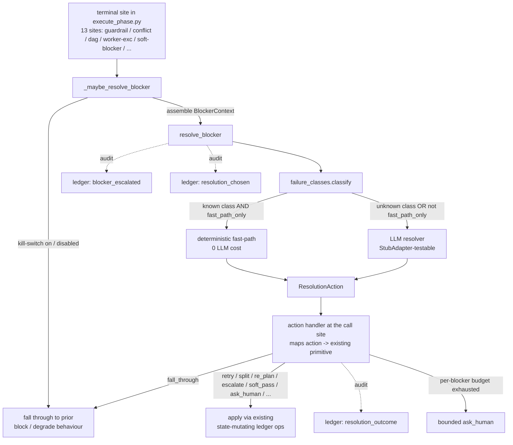

# Universal Blocker Resolver Design

> Companion deep spec for [ADR-0047](../decisions/0047-universal-blocker-resolver.md). Where the ADR
> argues *why*, this document specifies *how*: the terminal-site → resolver flow, the failure-class
> taxonomy, the schemas, the action vocabulary ↔ existing-primitive mapping, the config, the three audit
> ledger ops, and the three-layer loop-safety. Models its structure on
> [`intake_clarification_phase_design.md`](intake_clarification_phase_design.md) (ADR-0045).

* **Status:** Accepted
* **Author:** Mohamed Ameen
* **Date:** 2026-06-15
* **Package:** `src/orchestrator` (resolver + taxonomy + call-site wiring), `src/state` (schemas + ledger), `src/config` (config)
* **Entry Point:** `orchestrator.blocker_resolver.resolve_blocker(ctx: BlockerContext, orch) -> ResolutionAction`, fired through the `_maybe_resolve_blocker` shim at each terminal site in `execute_phase.py`
* **Companion to:** [ADR-0047 — Universal Blocker Resolver](../decisions/0047-universal-blocker-resolver.md)

## 1. Overview

### 1.1 Purpose

Give AutoDev's execute phase the recovery instinct of a senior engineer who hits a wall: **don't dead-end —
look at the whole blocker, pick the one bounded move that re-enables the work, and only ask a human as a
last resort.** Today the 13 terminal sites in `execute_phase.py` each emit a bespoke `blocked_reason`, raise
to the CLI, or silently degrade — there is no orchestrator-level actor that *reasons* about a terminal
blocker. The resolver adds: **assemble blocker context → classify → choose a bounded action (deterministic
fast-path OR LLM resolver) → map to an existing primitive → record the decision.**

### 1.2 Scope

**In scope:** a new `resolve_blocker` router + a `_maybe_resolve_blocker` shim wired into the 13 terminal
sites; a canonical `failure_classes.py` taxonomy; a fixed action vocabulary that maps **only** onto existing
recovery primitives; `BlockerContext` / `ResolutionAction` schemas; `ResolverConfig`; three **audit-only**
ledger ops; three-layer loop-safety (per-blocker budget, circuit-breaker, resolver-self-failure →
`ask_human`); the `AUTODEV_RESOLVER_DISABLED` kill-switch.

**Out of scope:** new recovery *engines* — every action invokes machinery that already exists
(`repetition_recovery`, budget/model escalation, the A1 reviewer soft-pass, intake clarify, corrective-task
split). The structural plan errors (`STRUCTURAL_FAILURE_CLASSES`) keep their re-plan / legacy-block policy;
the resolver routes them for observability but does **not** attempt task-local recovery on them. Mutating
plan state is **not** the resolver's job — its chosen action applies through the existing state-mutating
ledger ops.

### 1.3 Context

The execute phase runs a per-task FSM with a deterministic recovery ladder (retry → pivot → discard →
soft-blocker). The ladder handles the common case but its **terminal rungs** dead-end. Across Runs 1–4 the
dominant blockers were *recoverable* delivery-layer dead-ends — a triple `LLMRateLimitError` that opened the
infra circuit, a reviewer-MALFORMED loop, a `depends_on=[]` parallel-worktree incoherence, a failed
cross-phase dependency — yet each surfaced `user_decision_required` and halted the run. The recovery
*primitives* already exist; what was missing is the **router** that owns the recovery decision at a terminal
site and a path that *reasons* about a **novel** (`unknown`) failure instead of dead-ending on it.

## 2. Requirements

### 2.1 Functional Requirements

- **FR1 — Terminal-site routing.** Each of the 13 terminal sites in `execute_phase.py` assembles a
  `BlockerContext` and calls `_maybe_resolve_blocker`; the resolver returns a `ResolutionAction` from the
  fixed vocabulary, which the site applies.
- **FR2 — Two-tier resolution.** A **deterministic fast-path** maps a *known* `failure_class` to a bounded
  action with **zero LLM cost**; the **LLM resolver** handles the catch-all `unknown` class (and, when
  `fast_path_only_on_known=False`, any routed blocker).
- **FR3 — Bounded action vocabulary.** The chosen action is one of 15 fixed `ResolutionActionType` values,
  each mapping onto an **existing** recovery primitive (§4); the vocabulary never invents a new code path.
- **FR4 — Apply via existing ops.** The site maps `action` onto the existing recovery primitive and effects
  plan-state change through the regular state-mutating ledger ops — the resolver itself never mutates plan
  state.
- **FR5 — Audit trail.** Emit `blocker_escalated` (on routing), `resolution_chosen` (on pick), and
  `resolution_outcome` (on apply / decline) for every routed blocker.
- **FR6 — Loop-safety.** Enforce a per-blocker cycle budget (`max_cycles_per_blocker`); on exhaustion, fall
  through to a bounded `ask_human` (§7).
- **FR7 — Fail-safe fall-through.** `fall_through` returns the site to its **exact** prior block/degrade
  behaviour; `AUTODEV_RESOLVER_DISABLED=1` forces every site to legacy behaviour.
- **FR8 — Deterministic resume.** On resume, re-read the three audit ops to reconstruct the per-blocker
  budget; never re-invoke the resolver for an already-resolved blocker.

### 2.2 Non-Functional Requirements

- **NFR1 — Common-case cost ≈ 0:** with `fast_path_only_on_known=True` the resolver only engages at terminal
  rungs / on `unknown`; known recoverable cases stay on the cheap deterministic ladder.
- **NFR2 — Additivity:** with the kill-switch on (or every action `fall_through`), behaviour is byte-for-byte
  the prior per-site behaviour — the determinism baseline is unchanged until the resolver chooses to act.
- **NFR3 — Determinism/resume** (NFR mirror of FR8): the same `BlockerContext` + the same recorded budget →
  the same action, and never more than `max_cycles_per_blocker` recovery cycles.
- **NFR4 — Pydantic strictness:** `BlockerContext` and `ResolutionAction` are `ConfigDict(extra='forbid')`;
  a malformed resolver output fails safe to `fall_through`/`ask_human`, never to silent mis-routing.
- **NFR5 — Loop-impossibility:** the per-blocker budget + circuit-breaker + resolver-self-failure rule make
  unbounded recovery recursion impossible (§7).
- **NFR6 — Testability:** the fast-path is pure (no LLM/I/O), unit-testable per class; the LLM path is
  `StubAdapter`-driven.

### 2.3 Constraints

- Must run **at the terminal site**, mid-execution, with the live task/phase/worktree state — not in a
  downstream phase after the plan is frozen.
- Must **reuse** existing recovery primitives only; no new recovery engine.
- The audit ops must be **audit-only** (never mutate plan state); resume reconstructs the budget from them.
- Structural plan errors (`STRUCTURAL_FAILURE_CLASSES`) must keep their re-plan / legacy-block policy.

## 3. Architecture

### 3.1 High-Level Design



The resolver is **flag-guarded and fail-safe**: `AUTODEV_RESOLVER_DISABLED=1` (or any uncaught resolver
error) degrades to "fall through to the call site's prior behaviour" (logged) — the resolver must never make
a terminal site *worse* than it was before.

### 3.2 Component Structure

| Component | Location | Responsibility |
|---|---|---|
| `resolve_blocker` | `src/orchestrator/blocker_resolver.py` *(new)* | Two-tier router: classify → fast-path or LLM resolver → return a `ResolutionAction`; emit the audit ops; enforce loop-safety; fall through on self-failure. |
| `_maybe_resolve_blocker` | `src/orchestrator/blocker_resolver.py` *(new)* | Thin shim each terminal site calls: build `BlockerContext`, honour the kill-switch / `enabled`, invoke `resolve_blocker`, hand the action back to the site's handler. |
| failure-class taxonomy | `src/orchestrator/failure_classes.py` | Canonical named classes (one per terminal site) + `unknown` catch-all; `classify` / `is_known`; `STRUCTURAL_FAILURE_CLASSES`. |
| `BlockerContext` / `ResolutionAction` | `src/state/schemas.py` | Resolver input / output (`extra='forbid'`). |
| audit ledger ops | `src/state/ledger.py` | `blocker_escalated`, `resolution_chosen`, `resolution_outcome` (audit-only). |
| `ResolverConfig` | `src/config/schema.py` / `defaults.py` | `enabled`, `max_cycles_per_blocker`, `fast_path_only_on_known`, `model`; default-on. |
| action handlers | `src/orchestrator/execute_phase.py` (the 13 sites) | Map the chosen `action` onto the existing recovery primitive; `fall_through` reproduces prior behaviour. |

### 3.3 Data Models

All `ConfigDict(extra='forbid')`, in `src/state/schemas.py` (mirroring `BlockerContext`/`ResolutionAction`
as implemented):

```python
ResolutionActionType = Literal[
    "retry_with_changes", "split_task", "narrow_scope", "re_architect", "re_plan",
    "reroute", "repair_environment", "relax_constraint", "escalate_budget", "escalate_model",
    "soft_pass_with_evidence", "consult_knowledge", "web_search", "ask_human", "fall_through",
]

class BlockerContext(BaseModel):           # resolver input
    model_config = ConfigDict(extra="forbid")
    failure_class: str                     # one of failure_classes.ALL_FAILURE_CLASSES, else "unknown"
    raw_error: str = ""
    failing_role: str | None = None
    task_id: str | None = None
    phase_id: str | None = None
    attempt_history: list[str] = Field(default_factory=list)        # ledger trajectory (most-recent-last)
    recovery_already_tried: list[str] = Field(default_factory=list) # B5 loop-safety: this blocker's tries
    evidence_refs: list[str] = Field(default_factory=list)          # paths / ledger seqs the resolver may cite
    available_actions: list[str] = Field(default_factory=list)      # the subset this call site can apply

class ResolutionAction(BaseModel):         # resolver output
    model_config = ConfigDict(extra="forbid")
    action: ResolutionActionType
    params: dict[str, Any] = Field(default_factory=dict)  # e.g. {"new_max_turns": 12}, {"question": "..."}
    rationale: str = ""
```

`params` is a free dict by design so the action vocabulary can grow (new param shapes) without a schema
migration. `available_actions` lets a call site advertise only the primitives it can actually apply, so the
resolver never picks an action the site cannot effect.

## 4. Action Vocabulary ↔ Reused Primitive

Every action maps onto an **existing** recovery primitive — the resolver is a router, never a new engine.

| Action | Reused primitive / mechanism |
|---|---|
| `retry_with_changes` | The existing per-task retry rung, re-armed with the resolver's `params` (changed prompt/inputs). |
| `split_task` | The corrective-task / task-split machinery (`append_corrective_tasks`). |
| `narrow_scope` | The scope-narrowing path used by the edit-scope / minimality handling. |
| `re_architect` | `repetition_recovery.py` `re_architect` (re-enter the architect / ADR-0044 altitude machinery). |
| `re_plan` | The architect re-plan path (regenerate the DAG; the `dag_invalid` structural recovery). |
| `reroute` | Adapter/model rerouting used by the infra circuit-breaker handling. |
| `repair_environment` | The environment-repair path (deps/worktree repair before retry). |
| `relax_constraint` | The constraint-relaxation lever (e.g. loosen a guardrail/budget cap within policy). |
| `escalate_budget` | `budget_escalation` (raise decision-cost / turn budget). |
| `escalate_model` | Model escalation sonnet → opus (recovery Tier-5). |
| `soft_pass_with_evidence` | The A1 reviewer **soft-pass-with-evidence** pattern (accept + record evidence). |
| `consult_knowledge` | The two-tier knowledge consult (past-failure memory). |
| `web_search` | The web-search tool path (external lookup for novel infra/errors). |
| `ask_human` | The ADR-0045 intake/clarify single-batched question channel (precise, last-resort). |
| `fall_through` | Decline: the call site's **legacy** block/degrade behaviour (additivity guarantee). |

## 5. Config Schema (`ResolverConfig`)

```python
class ResolverConfig(BaseModel):              # src/config/schema.py:523
    model_config = ConfigDict(extra="forbid")
    enabled: bool                             # default True via _default_resolver_cfg
    max_cycles_per_blocker: int = Field(default=3, ge=1, le=10)   # per-blocker budget (B5)
    fast_path_only_on_known: bool = True      # True: engage only at terminal rungs / on unknown (≈0 cost)
    model: str | None = None                  # resolver LLM (None -> default)
# AutodevConfig.resolver: ResolverConfig = Field(default_factory=_default_resolver_cfg)  # schema.py:1248
```

`_default_resolver_cfg()` returns the on-by-default config (`enabled=True`, `max_cycles_per_blocker=3`,
`fast_path_only_on_known=True`, `model=None`); `default_config()` wires it in (`defaults.py:313`). A legacy
`config.json` lacking the field still validates (the `default_factory`). Kill-switch:
`AUTODEV_RESOLVER_DISABLED=1` forces the resolver off regardless of `enabled` (every site falls through —
fail-safe), mirroring `AUTODEV_FRAMING_DISABLED` / `AUTODEV_INTAKE_DISABLED` / `AUTODEV_DIAGNOSIS_DISABLED`.

## 6. Ledger & State

Three **audit-only** ops (`src/state/ledger.py:613-615`) — they **never** mutate plan state; the resolver's
chosen action lands through the regular `update_task_status` / `append_corrective_tasks` /
`budget_escalation` ops emitted alongside:

- **`blocker_escalated`** — `{task_id, phase_id, failure_class, failing_role, raw_error_excerpt,
  recovery_already_tried: list[str]}`. Emitted when a terminal site routes a blocker to `resolve_blocker`.
- **`resolution_chosen`** — `{task_id, failure_class, action, rationale_excerpt, params}`. Emitted once the
  resolver picks an action.
- **`resolution_outcome`** — `{task_id, action, outcome: "applied" | "fell_through" | "ask_human", reason}`.
  Emitted after the site applies (or declines) the action.

**Resume-safety:** on resume, these three ops are re-read to reconstruct the **per-blocker resolution
budget** *without* re-invoking the resolver (loop-safety + determinism). The per-blocker key (task +
failure class) is stable across resume so the budget genuinely bounds the loop; a retry that hits the same
wall does **not** reset it.

**Per-blocker budget:** `max_cycles_per_blocker` (default 3) caps how many resolver cycles a single blocker
may consume before the resolver stops recursing and falls through to a bounded `ask_human`.

## 7. Loop-Safety (B5)

Three layers make unbounded recovery recursion impossible:

1. **Per-blocker budget.** Each blocker (keyed by task + failure class) has a `max_cycles_per_blocker`
   ledger-tracked budget. Once consumed without recovery, the resolver stops recursing and emits a bounded
   `ask_human` (a precise question via the ADR-0045 clarify channel) rather than resolving again.
2. **Circuit-breaker.** A global breaker bounds total resolver activity across tasks (the same instinct as
   the infra circuit-breaker for rate-limits): a storm of blockers trips the breaker and stops the resolver
   re-firing, surfacing a single structured halt instead of a recovery cascade.
3. **Resolver-self-failure → `ask_human`.** If the resolver itself raises (LLM error, malformed output that
   fails `extra='forbid'` validation, etc.), it does **not** propagate — it degrades to a bounded
   `ask_human` (or `fall_through` where no question is warranted), so a broken resolver can never make a
   terminal site worse than its prior behaviour.

`STRUCTURAL_FAILURE_CLASSES` (`dag_invalid`, `cross_phase_dag_invalid`, `edit_scope_violation`,
`infra_circuit_open`) are routed for observability but default to re-plan / legacy-block — **no** task-local
recovery, precisely because these are phase-wide and looping a task-local fix on them would be unsafe.

## 8. Testing Strategy

- **Fast-path per class (unit, pure).** For each known `failure_class`, assert the deterministic action
  mapping; assert `classify` normalises an arbitrary string to `unknown`.
- **LLM resolver on `unknown` (StubAdapter).** An unrecognised failure routes to the LLM resolver; the
  stub returns a `ResolutionAction`; assert it is one of `available_actions`.
- **Loop-safety.** Per-blocker budget exhaustion → `ask_human`; circuit-breaker trips on a blocker storm;
  resolver-self-failure (stub raises / returns malformed JSON) → bounded `ask_human`, never propagates.
- **Additivity / kill-switch.** With `AUTODEV_RESOLVER_DISABLED=1` (and with every action `fall_through`),
  each terminal site reproduces its exact prior block/degrade behaviour.
- **Resume.** The three audit ops reconstruct the per-blocker budget; the resolver is **not** re-invoked for
  an already-resolved blocker; the locked decision is replay-stable.
- **Field fixtures.** The Run-1–4 dead-ends (rate-limit storm → `infra_circuit_open`/`reroute`,
  reviewer-MALFORMED loop, `depends_on=[]` DAG incoherence → `re_plan`, conflict escalation) each yield a
  bounded recovery instead of `user_decision_required`.

## 9. Implementation Checklist

- [ ] `failure_classes.py` — canonical taxonomy (13 terminal classes + `phase_degraded` + `unknown`),
  `STRUCTURAL_FAILURE_CLASSES`, `classify`, `is_known`. *(done — Foundation)*
- [ ] `state/schemas.py` — `BlockerContext`, `ResolutionAction`, `ResolutionActionType`
  (`extra='forbid'`). *(done — Foundation)*
- [ ] `state/ledger.py` — `blocker_escalated`, `resolution_chosen`, `resolution_outcome` (audit-only) +
  resume reconstruction of the per-blocker budget. *(done — Foundation)*
- [ ] `config/schema.py` + `defaults.py` — `ResolverConfig`, `_default_resolver_cfg`,
  `AutodevConfig.resolver`, kill-switch. *(done — Foundation)*
- [ ] `orchestrator/blocker_resolver.py` *(new)* — `resolve_blocker` (two-tier) + `_maybe_resolve_blocker`
  shim; emit audit ops; enforce loop-safety; fall through on self-failure.
- [ ] `orchestrator/execute_phase.py` — wire `_maybe_resolve_blocker` into the 13 terminal sites; map each
  action onto its existing primitive; `fall_through` reproduces prior behaviour.
- [ ] `tests/orchestrator/test_blocker_resolver*.py` — fast-path, LLM path, loop-safety, additivity,
  resume, field fixtures.
