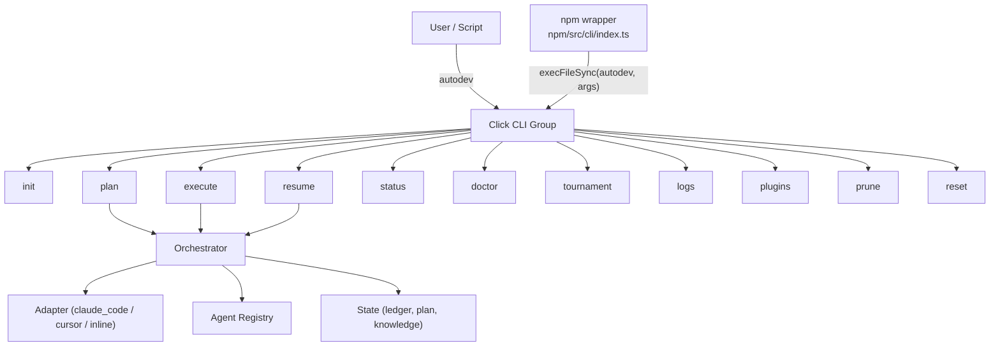
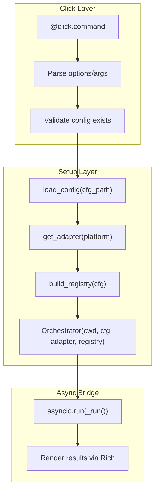
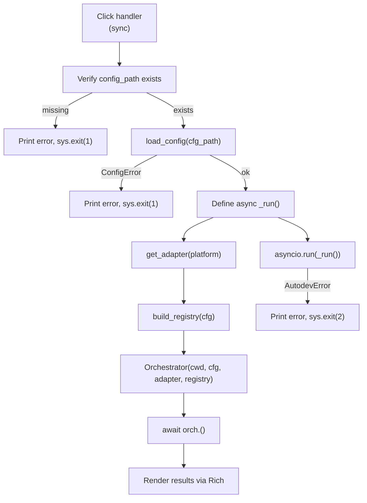
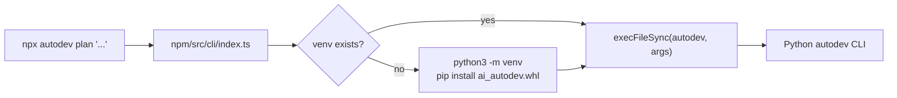

# CLI Layer Design

**Status:** Implemented
**Author:** Mohamed Ameen
**Date:** 2026-04-17
**Last Updated:** 2026-04-17
**Reviewers:** --
**Package:** `src/cli/`
**Entry Point:** `autodev` (registered via `[project.scripts]` in `pyproject.toml`)

## 1. Overview

### 1.1 Purpose

The CLI layer is the user-facing entry point for all AutoDev operations. It translates command-line invocations into orchestrator calls, bridging Click's synchronous execution model to the async orchestrator via `asyncio.run()`. Every workflow -- project scaffolding, plan creation, task execution, crash recovery, health checks, and tournament debugging -- is accessible through a single `autodev` command with subcommands.

### 1.2 Scope

**In scope:**

- Click command group with 11 subcommands: `init`, `plan`, `execute`, `resume`, `status`, `doctor`, `logs`, `tournament`, `plugins`, `prune`, `reset`
- Config loading and validation before each command
- Adapter detection and registry building
- Orchestrator instantiation and async bridging
- Rich console output (tables, colored status)
- npm wrapper that delegates to the Python CLI

**Out of scope:**

- Orchestrator internals (the CLI is a thin wire-up layer)
- Agent prompt construction
- Tournament algorithms
- State file formats (owned by `src/state/`)

### 1.3 Context

The CLI sits at the outermost boundary of the AutoDev pipeline. Every user interaction enters through the CLI, which performs validation and setup, then delegates to the core orchestrator. The CLI also serves as the integration point for the npm wrapper, which installs the Python wheel into a managed venv and forwards all commands to the `autodev` binary.



## 2. Requirements

### 2.1 Functional Requirements

- **FR-1:** Provide a single `autodev` entry point with subcommands for every lifecycle operation
- **FR-2:** Validate `.autodev/config.json` exists and is valid before commands that require state (plan, execute, resume, status)
- **FR-3:** Auto-detect the target platform (Claude Code / Cursor) or accept explicit `--platform` override
- **FR-4:** Bridge synchronous Click handlers to the async orchestrator via `asyncio.run()`
- **FR-5:** Render human-readable output via Rich tables with colored status indicators
- **FR-6:** Exit with appropriate codes: 0 (success), 1 (config/setup error), 2 (runtime error)
- **FR-7:** Support `--help` and `--version` at the top level and on every subcommand

### 2.2 Non-Functional Requirements

- **Startup latency:** Deferred imports for heavy modules (adapters, orchestrator) so `autodev --help` is fast
- **Crash-safety:** The CLI itself performs no state writes; all state mutation is delegated to the orchestrator and state modules
- **Pydantic v2 strict validation:** Config is validated through `AutodevConfig` with `extra="forbid"` on load; invalid config surfaces as a clear error message before any work begins
- **Maintainability:** Each subcommand lives in its own module under `src/cli/commands/`; registration is centralized in `__init__.py`

### 2.3 Constraints

- Must run on Python 3.11+ with no compiled extensions
- Click is the only CLI framework (no argparse, no typer)
- Rich is used for all terminal output (no raw `print()`)
- `asyncio.run()` is the only async entry point (no manual event loop management)

## 3. Architecture

### 3.1 High-Level Design

The CLI follows a two-layer architecture: a thin Click command layer that handles argument parsing and output rendering, and a setup layer that wires up config, adapter, registry, and orchestrator before delegating to the async core.



The pattern is consistent across `plan`, `execute`, and `resume`:

1. Parse CLI options
2. Verify `.autodev/config.json` exists
3. Load and validate config via Pydantic
4. Define an inner `async def _run()` that builds adapter, registry, and orchestrator
5. Call `asyncio.run(_run())`
6. Render results or handle errors

### 3.2 Component Structure

```
src/cli/
    __init__.py           # Click group definition, main() entry point
    commands/
        __init__.py       # register_commands() attaches all subcommands
        init.py           # autodev init
        plan.py           # autodev plan
        execute.py        # autodev execute
        resume.py         # autodev resume
        status.py         # autodev status
        doctor.py         # autodev doctor
        tournament.py     # autodev tournament
        logs.py           # autodev logs (stub)
        plugins.py        # autodev plugins
        prune.py          # autodev prune (stub)
        reset.py          # autodev reset (stub)
```

Registration is centralized in `commands/__init__.py`:

```python
def register_commands(group: click.Group) -> None:
    group.add_command(init.init)
    group.add_command(plan.plan)
    group.add_command(execute.execute)
    group.add_command(resume.resume)
    group.add_command(status.status)
    group.add_command(tournament.tournament)
    group.add_command(doctor.doctor)
    group.add_command(logs.logs)
    group.add_command(reset.reset)
    group.add_command(prune.prune)
    group.add_command(plugins.plugins)
```

### 3.3 Data Models

The CLI layer does not define its own Pydantic models. It consumes:

- `AutodevConfig` (from `config.schema`) -- loaded and validated on every command that requires state
- Plan/Task models (from `state/`) -- read by `status`, rendered as tables
- `KnowledgeStore` (from `state/knowledge`) -- read by `status` for entry counts
- `CheckResult` (dataclass in `doctor.py`) -- lightweight result type for health checks

```python
@dataclass
class CheckResult:
    name: str
    ok: bool
    detail: str
```

### 3.4 Command Reference

#### `autodev init`

Scaffolds `.autodev/` and renders platform-native agent files.

| Option | Type | Default | Description |
|--------|------|---------|-------------|
| `--platform` | `Choice[claude, cursor, auto]` | `auto` | Target platform for rendered agent files |
| `--force` | flag | `False` | Overwrite existing `.autodev/` state |
| `--inline` | flag | `False` | Configure for inline (agent-embedded) mode |

**Creates:**
- `.autodev/config.json` -- persisted `AutodevConfig`
- `.autodev/spec.md` -- placeholder intent file (editable template)
- `.claude/agents/<role>.md` -- Claude Code agent definitions (when platform is Claude)
- `.cursor/rules/<role>.mdc` -- Cursor rules (when platform is Cursor)

**Idempotency:** Exits non-zero if `.autodev/` exists unless `--force` is set. With `--force`, all generated files are overwritten.

**Exit codes:** 0 (success), 1 (already initialized without `--force`)

#### `autodev plan`

Runs the PLAN phase end-to-end: explore, research, draft, tournament, persist.

| Option | Type | Default | Description |
|--------|------|---------|-------------|
| `INTENT` | argument (required) | -- | Plain-English description of what to build |
| `--platform` | `Choice[claude_code, cursor, auto]` | config value | Override platform selection |

**Flow:**
1. Load config
2. Detect adapter
3. Build agent registry
4. Instantiate `Orchestrator`
5. Call `orch.plan(intent)` (async)
6. Render plan summary table (phases, tasks, files)

**Exit codes:** 0 (plan approved), 1 (config error), 2 (runtime error)

#### `autodev execute`

Executes pending tasks serially: developer -> review -> tests -> advance.

| Option | Type | Default | Description |
|--------|------|---------|-------------|
| `--task` | `str` | `None` | Target a specific task ID |
| `--dry-run` | flag | `False` | Plan work without mutating the repo |
| `--no-impl-tournament` | flag | `False` | Disable the implementation tournament |
| `--platform` | `Choice[claude_code, cursor, auto]` | config value | Override platform selection |

**Inline mode:** When the adapter returns a `DelegationPendingSignal`, the CLI prints the delegation path and exits 0 (not an error -- the user's IDE agent must respond before `autodev resume` can continue).

**Output table columns:** Task, Status (colored: green=complete, red=blocked, yellow=skipped), Retries, Escalated

**Exit codes:** 0 (success or delegation pending), 1 (config error), 2 (runtime error)

#### `autodev resume`

Continues execution from the last ledger checkpoint (crash recovery).

| Option | Type | Default | Description |
|--------|------|---------|-------------|
| `--platform` | `Choice[claude_code, cursor, auto]` | config value | Override platform selection |

**Inline resume:** Checks for a suspend state file first. If found, verifies that the pending agent response exists before resuming. If the response is not yet available, prints the expected file paths and exits 0 (waiting).

**Exit codes:** 0 (success or waiting for response), 1 (config error), 2 (runtime error)

#### `autodev status`

Prints plan/task status and knowledge entry counts.

**No options.** Read-only command.

**Output:**
- Plan title and ID
- Task table: Phase, Task, Status, Retries, Evidence count
- Summary line: `pending=N | in_progress=N | complete=N | blocked=N | skipped=N`
- Knowledge summary: `Knowledge: N lessons in swarm tier, M in hive tier`

**Exit codes:** 0 (success), 1 (config error), 2 (runtime error)

#### `autodev doctor`

Verifies CLI availability and config validity.

**No options.** Runs three checks:

1. `claude --version` -- probe Claude Code CLI
2. `cursor --version` -- probe Cursor CLI
3. `.autodev/config.json` -- validate config

Requires at least one of the two CLIs to pass. Also displays:

- **Plugins table:** QA Gates, Judge Providers, Agent Extensions counts
- **Guardrails table:** `max_tool_calls_per_task`, `max_duration_s_per_task`, `max_diff_bytes`, `cost_budget_usd_per_plan`

**Exit codes:** 0 (at least one CLI + valid config), 1 (no CLI or invalid config)

#### `autodev tournament`

Standalone tournament runner for plan and implementation refinement.

| Option | Type | Default | Description |
|--------|------|---------|-------------|
| `--phase` | `Choice[plan, impl]` (required) | -- | Which tournament variant to run |
| `--input` | `Path` | `None` | Input file (required for plan; optional diff for impl) |
| `--dry-run` | flag | `False` | Skip LLM calls; use canned responses |
| `--max-rounds` | `int` | config value | Override `tournaments.*.max_rounds` |
| `--input-diff` | `Path` | `None` | Unified diff file for `--phase=impl` |
| `--task-desc` | `str` | `None` | Task description for `--phase=impl` |
| `--task-id` | `str` | `cli-impl` | Task ID for `--phase=impl` |
| `--files` | `str` | `None` | Comma-separated list of changed files for `--phase=impl` |

**Plan tournament flow:**
1. Load config (or use defaults in `--dry-run` mode)
2. Read input file as initial plan markdown
3. Derive task prompt: `<input>.spec.md` sibling > first `#` heading > `"Refine this plan."`
4. Build `AdapterLLMClient` or `DryRunLLMClient`
5. Run `Tournament` with `PlanContentHandler`
6. Render per-pass table: Pass, Winner, Scores, Valid judges, Elapsed

**Impl tournament flow:**
1. Load config (or use defaults in `--dry-run` mode)
2. Read diff file
3. Build `ImplBundle` from inputs
4. Run `ImplTournament` with `ImplContentHandler`
5. In CLI standalone mode, uses no-op worktree manager and no-op coder runner

**Dry-run mode:** Accepts `--dry-run` even without `.autodev/config.json` (uses default config). `DryRunLLMClient` returns role-specific canned responses. The judge always returns `RANKING: 1, 2, 3` so Borda aggregation converges predictably.

**Artifacts:** Written to `.autodev/tournaments/<plan|impl>-<uuid>/`

**Exit codes:** 0 (success), 1 (config error), 2 (runtime error or missing input)

#### `autodev plugins`

Lists all discovered plugins via entry points.

**No options.**

Discovers plugins via `discover_plugins()` and displays them in a table with Name, Type (QA Gate / Judge Provider / Agent Extension), and Module. Shows total counts.

**Exit codes:** 0 (always)

#### `autodev logs` (stub)

Tails `events.jsonl` for a session.

| Option | Type | Default | Description |
|--------|------|---------|-------------|
| `--session` | `str` | `None` | Session ID to tail |

**Status:** Not yet implemented (Phase 4). Exits with code 1.

#### `autodev prune` (stub)

Garbage-collects stale tournament artifacts.

| Option | Type | Default | Description |
|--------|------|---------|-------------|
| `--older-than` | `str` | `30d` | Age threshold (e.g., `30d`, `7d`, `24h`) |

**Status:** Not yet implemented (Phase 10). Exits with code 1.

#### `autodev reset` (stub)

Clears `.autodev/plan*` state.

| Option | Type | Default | Description |
|--------|------|---------|-------------|
| `--hard` | flag | `False` | Also remove evidence and tournaments |

**Status:** Not yet implemented (Phase 4). Exits with code 1.

### 3.5 Command Wiring Pattern

All stateful commands (plan, execute, resume) follow an identical wiring pattern:



## 4. Design Decisions

### 4.1 Key Decisions

| Decision | Rationale | Alternatives Considered |
|----------|-----------|------------------------|
| Click over argparse/typer | Click provides declarative command groups, consistent `--help` generation, and composable decorators. Typer adds a Pydantic dependency for CLI typing that overlaps with our existing Pydantic usage. | argparse (verbose for subcommands), typer (extra dependency), fire (too implicit) |
| `asyncio.run()` bridge | Simple, explicit, one-shot. Each CLI invocation creates a fresh event loop. No persistent loop management needed. | uvloop (unnecessary complexity), manual loop (error-prone), click-async decorators (fragile) |
| Rich for output | Tables, colored status, and styled text with zero effort. Already a dependency. | Plain `print()` (no styling), `tabulate` (extra dependency), JSON output only (bad UX for humans) |
| One module per command | Clear ownership, easy to find code, minimal import scope per command. The `register_commands()` function in `__init__.py` is the single registration point. | Single large `cli.py` (doesn't scale), auto-discovery (too magical) |
| Config validation at CLI boundary | Fail early with a clear message before any async work begins. Prevents confusing errors deep in the orchestrator. | Lazy validation (confusing errors), schema-less config (no safety) |
| Deferred heavy imports | Modules like `adapters.detect`, `orchestrator`, and `tournament` are imported inside `_run()` or at function scope, not at module top. This keeps `autodev --help` fast. | Top-level imports (slow startup for help/version) |

### 4.2 Trade-offs

- **Sync Click + async orchestrator:** The `asyncio.run()` bridge means each command gets a fresh event loop. This is simple but prevents the CLI from being embedded in an existing async application. Acceptable because the CLI is always the outermost entry point.
- **Rich dependency for output:** Rich adds ~3 MB to the install. The visual quality of tables and colored output justifies this for a developer-facing tool.
- **Stub commands included:** `logs`, `prune`, and `reset` are registered but print "not yet implemented" and exit 1. This reserves the command names and provides discoverability via `--help`, at the cost of a slightly confusing user experience.

## 5. Implementation Details

### 5.1 Entry Point Registration

In `pyproject.toml`:

```toml
[project.scripts]
autodev = "cli:main"
```

The `cli` module's `main()` function calls `cli(standalone_mode=True)` on the Click group:

```python
@click.group(
    context_settings={"help_option_names": ["-h", "--help"]},
    invoke_without_command=False,
)
@click.version_option(version=__version__, prog_name="autodev")
def cli() -> None:
    """autodev: multi-agent orchestrator with tournament self-refinement."""

register_commands(cli)

def main() -> None:
    cli(standalone_mode=True)
```

### 5.2 npm Wrapper Integration

The npm package (`npm/`) provides a Node.js wrapper that:

1. Creates a managed Python venv at `~/.config/autodev/venv/`
2. Installs the `autodev` wheel from the bundled `wheel/` directory
3. Forwards all CLI arguments to the installed `autodev` binary via `execFileSync`



Special npm-level commands:
- `autodev install` -- force venv setup
- `autodev uninstall` -- remove venv and config dir
- `autodev version` / `--version` / `-v` -- print npm package version
- `autodev doctor` -- ensure venv, then delegate to Python `autodev doctor`
- All other commands -- ensure venv, then delegate verbatim

### 5.3 Error Handling

The CLI uses a consistent three-tier exit code strategy:

| Exit Code | Meaning | Example |
|-----------|---------|---------|
| 0 | Success (or delegation pending in inline mode) | Plan approved, tasks executed |
| 1 | Setup/config error | Missing `.autodev/config.json`, invalid config |
| 2 | Runtime error | `AutodevError` during orchestration |

Error handling pattern in every command:

```python
try:
    cfg = load_config(cfg_path)
except AutodevError as exc:
    console.print(f"[red]autodev <cmd>: config error[/red]: {exc}")
    sys.exit(1)

try:
    asyncio.run(_run())
except AutodevError as exc:
    console.print(f"[red]autodev <cmd> failed[/red]: {exc}")
    sys.exit(2)
```

### 5.4 Dependencies

- **click:** CLI group, commands, options, arguments, `Choice` types
- **rich:** `Console`, `Table` for all terminal output
- **pydantic:** Config validation via `AutodevConfig` (consumed, not defined by CLI)
- **structlog:** Not used directly by CLI; logging is handled by downstream modules
- **Internal:** `config.loader` (load/save), `config.defaults` (default config), `adapters.detect` (platform auto-detection), `agents` (registry building), `orchestrator` (plan/execute/resume), `state.paths` (config path), `state.knowledge` (status display), `state.evidence` (status display), `plugins.registry` (doctor/plugins display), `errors` (`AutodevError`, `ConfigError`)

### 5.5 Configuration

The CLI reads configuration from `.autodev/config.json` (validated through `AutodevConfig`). Key config fields consumed by CLI commands:

| Config Field | Used By | Purpose |
|-------------|---------|---------|
| `platform` | plan, execute, resume | Default platform when `--platform` not specified |
| `tournaments.plan.*` | tournament | Plan tournament parameters |
| `tournaments.impl.*` | tournament | Impl tournament parameters |
| `guardrails.*` | doctor | Display guardrail caps |
| `knowledge.*` | status | Knowledge store entry counts |

Environment variable: `AUTODEV_PLATFORM` can override platform detection (handled by `adapters.detect`).

## 6. Integration Points

### 6.1 Dependencies on Other Components

| Component | Usage |
|-----------|-------|
| `config.loader` | `load_config()`, `save_config()` |
| `config.defaults` | `default_config()` for init and dry-run tournament |
| `adapters.detect` | `get_adapter()` for platform auto-detection |
| `adapters.inline` | `InlineAdapter` for inline mode (resume, init) |
| `agents` | `build_registry()` to create the agent spec registry |
| `agents.render_claude` | `render_claude_agents()` for init |
| `agents.render_cursor` | `render_cursor_rules()` for init |
| `orchestrator` | `Orchestrator` for plan/execute/resume |
| `orchestrator.inline_state` | `load_suspend_state()` for resume |
| `state.paths` | `config_path()`, `autodev_root()` |
| `state.knowledge` | `KnowledgeStore` for status display |
| `state.evidence` | `list_evidence()` for status display |
| `state.plan_manager` | `PlanManager` for status display |
| `plugins.registry` | `discover_plugins()` for doctor/plugins |
| `tournament` | `Tournament`, `ImplTournament`, `AdapterLLMClient`, content handlers, config |
| `errors` | `AutodevError`, `ConfigError` for exception handling |

### 6.2 Components That Depend on This

| Component | Dependency |
|-----------|------------|
| npm wrapper (`npm/src/cli/index.ts`) | Delegates all commands to the Python `autodev` binary |
| Agent files (`.claude/agents/*.md`) | Generated by `autodev init` |
| Cursor rules (`.cursor/rules/*.mdc`) | Generated by `autodev init` |

### 6.3 External Systems

| System | Interaction |
|--------|-------------|
| Claude Code CLI (`claude`) | Probed by `doctor`; used by `ClaudeCodeAdapter` via `get_adapter()` |
| Cursor CLI (`cursor`) | Probed by `doctor`; used by `CursorAdapter` via `get_adapter()` |
| Filesystem | `.autodev/` directory tree, config files, agent files |
| npm/Node.js | Wrapper package delegates to Python CLI |

## 7. Testing Strategy

### 7.1 Unit Tests

- `register_commands()` attaches all 11 subcommands to a Click group
- Each command's Click decorators parse options correctly (use Click's `CliRunner`)
- `_derive_task_prompt()` precedence: spec file > heading > fallback
- `_render_plan_summary()`, `_render_execute_summary()`, `_render_resume_summary()` produce output without exceptions for valid inputs
- `CheckResult` dataclass instantiation
- `_probe_cli()` with mocked `subprocess.run` for pass/fail/timeout

### 7.2 Integration Tests

- `autodev init` creates `.autodev/config.json` and `spec.md` in a temp directory
- `autodev init --force` overwrites existing state
- `autodev init` without `--force` on existing `.autodev/` exits 1
- `autodev doctor` with mocked CLI probes
- `autodev tournament --phase=plan --dry-run --input <file>` runs to completion
- `autodev tournament --phase=impl --dry-run --input-diff <file>` runs to completion
- `autodev status` with no plan shows "No plan yet"
- `autodev plugins` with no plugins shows "No plugins discovered"
- Commands exit 1 when `.autodev/config.json` is missing
- Commands exit 1 when config is invalid (extra fields, missing required roles)

### 7.3 Test Data Requirements

- Temporary directories (pytest `tmp_path`) for `.autodev/` state
- Sample plan markdown files for tournament dry-run
- Sample diff files for impl tournament dry-run
- Mock adapters that return canned responses
- Fixtures for valid and invalid `config.json`

## 8. Security Considerations

- **No secrets in CLI output:** The CLI renders plan summaries, task status, and health check results. No API keys or credentials are displayed.
- **Config validation:** Pydantic `extra="forbid"` rejects unexpected fields in `config.json`, preventing injection of unexpected configuration.
- **Subprocess probing:** `doctor` runs `claude --version` and `cursor --version` with a 5-second timeout to prevent hanging on unresponsive binaries.
- **npm wrapper:** The npm wrapper executes `python3` and `pip install` during venv setup. Users should verify the wheel integrity before running `npm install`.

## 9. Performance Considerations

- **Startup time:** `autodev --help` and `autodev --version` are fast because heavy modules (adapters, orchestrator, tournament) are imported inside command handlers, not at module top level.
- **Config loading:** Single JSON parse + Pydantic validation per command invocation. Negligible overhead.
- **`asyncio.run()` overhead:** Creates a fresh event loop per invocation. This adds ~1ms overhead, which is irrelevant for a CLI tool.
- **Doctor probes:** Each CLI probe (`claude --version`, `cursor --version`) has a 5-second timeout. In the worst case (both CLIs unresponsive), doctor takes ~10 seconds.

## 10. Installation & CLI Entry

### 10.1 Package Registration

```toml
[project.scripts]
autodev = "cli:main"
```

After `pip install ai-autodev` (or `uv pip install -e .`), the `autodev` command is available on PATH.

### 10.2 npm Distribution

```json
{
  "bin": {
    "autodev": "./dist/cli/index.js"
  }
}
```

After `pip install ai-autodev`, the `autodev` command is available on PATH.

### 10.3 CLI Commands Summary

```bash
autodev --version                           # Print version
autodev --help                              # List all commands
autodev init [--platform claude|cursor|auto] [--force] [--inline]
autodev plan "<intent>" [--platform ...]
autodev execute [--task ID] [--dry-run] [--no-impl-tournament] [--platform ...]
autodev resume [--platform ...]
autodev status
autodev doctor
autodev tournament --phase=plan --input file.md [--dry-run] [--max-rounds N]
autodev tournament --phase=impl --input-diff diff.txt [--task-desc "..."] [--dry-run]
autodev plugins
autodev logs --session <id>                 # Not yet implemented
autodev prune [--older-than 30d]            # Not yet implemented
autodev reset [--hard]                      # Not yet implemented
```

## 11. Observability

### 11.1 Structured Logging

The CLI layer itself does not emit structlog events. All logging occurs in downstream modules (orchestrator, adapter, knowledge store). The CLI handles errors by catching `AutodevError` and printing user-friendly messages via Rich.

### 11.2 Audit Artifacts

| Artifact | Location | Produced By |
|----------|----------|-------------|
| `config.json` | `.autodev/config.json` | `autodev init` |
| `spec.md` | `.autodev/spec.md` | `autodev init` |
| Agent files | `.claude/agents/*.md` | `autodev init` |
| Cursor rules | `.cursor/rules/*.mdc` | `autodev init` |
| Tournament artifacts | `.autodev/tournaments/<id>/` | `autodev tournament` |

### 11.3 Status Command

`autodev status` provides a comprehensive snapshot:

```
Plan: Implement auth system (plan-abc123)
               Tasks
 Phase  Task     Status   Retries  Evidence
 P1     T1.1     complete       0         3
 P1     T1.2     complete       0         2
 P2     T2.1     in_progress    1         1
 P2     T2.2     pending        0         0
pending=1 | in_progress=1 | complete=2 | blocked=0 | skipped=0
Knowledge: 12 lessons in swarm tier, 5 in hive tier
```

## 12. Cost Implications

The CLI layer itself makes zero LLM calls. All LLM costs are incurred by the orchestrator and tournament modules invoked through the CLI.

| Command | LLM Calls | Notes |
|---------|-----------|-------|
| init | 0 | Pure file I/O |
| plan | Varies | Delegates to orchestrator (explorer + architect + tournament) |
| execute | Varies | Delegates to orchestrator (developer + review + tests) |
| resume | Varies | Continues from checkpoint |
| status | 0 | Read-only |
| doctor | 0 | CLI probes only |
| tournament (dry-run) | 0 | Canned responses |
| tournament (live) | N judges x M rounds | See tournaments design doc |
| plugins | 0 | Entry point discovery |
| logs/prune/reset | 0 | Not yet implemented |

## 13. Future Enhancements

- **`autodev logs`:** Implement session log tailing with real-time streaming
- **`autodev prune`:** Implement GC with configurable age thresholds for tournament artifacts
- **`autodev reset`:** Implement plan state clearing with `--hard` for full cleanup
- **`--json` output flag:** Machine-readable JSON output for all commands (for CI/CD integration)
- **`--verbose` flag:** Increase log verbosity for debugging
- **`autodev knowledge` subcommand group:** List, search, export, and prune knowledge entries directly
- **Shell completion:** Generate completions for bash/zsh/fish via Click's built-in support
- **Progress indicators:** Rich progress bars for long-running operations (plan, execute, tournament)

## 14. Open Questions

- [ ] Should `--json` output be a global option on the Click group or per-command?
- [ ] Should stub commands (`logs`, `prune`, `reset`) exit 0 with a warning or exit 1 as they do now?
- [ ] Should the npm wrapper support auto-updating the wheel when a new version is available?
- [ ] Should `autodev doctor` also probe Python version and dependency versions?

## 15. Related ADRs

- None currently. Consider creating ADR for CLI error code conventions and the sync-to-async bridging pattern.

## 16. References

- `src/cli/__init__.py` -- Click group and entry point
- `src/cli/commands/__init__.py` -- command registration
- `src/cli/commands/*.py` -- individual command implementations
- `npm/src/cli/index.ts` -- npm wrapper
- `npm/package.json` -- npm package configuration
- `pyproject.toml` -- `[project.scripts]` entry point registration

## 17. Revision History

| Date | Author | Changes |
|------|--------|---------|
| 2026-04-17 | Mohamed Ameen | Initial draft |
