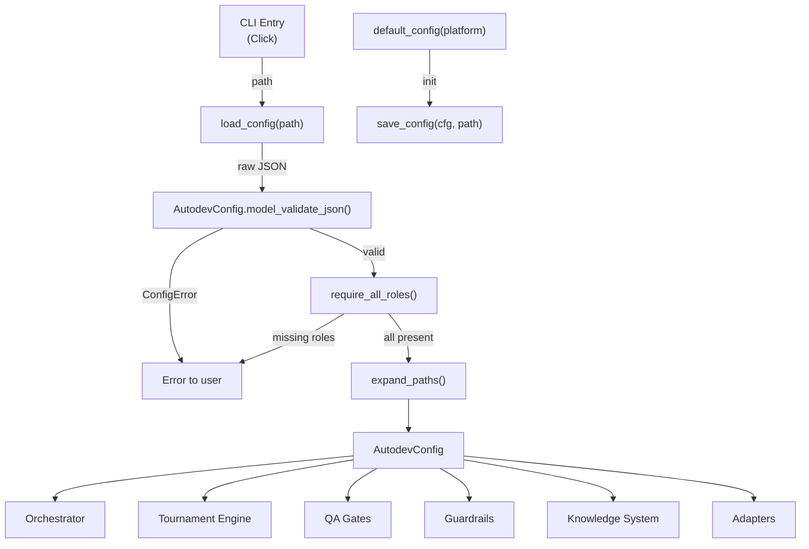
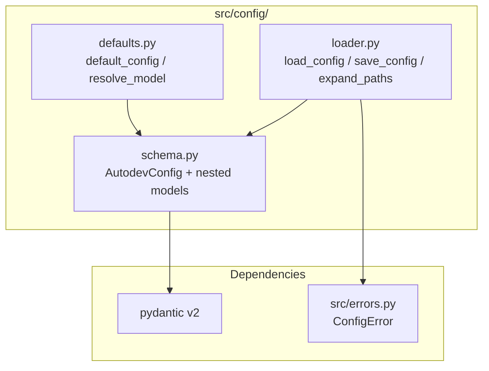
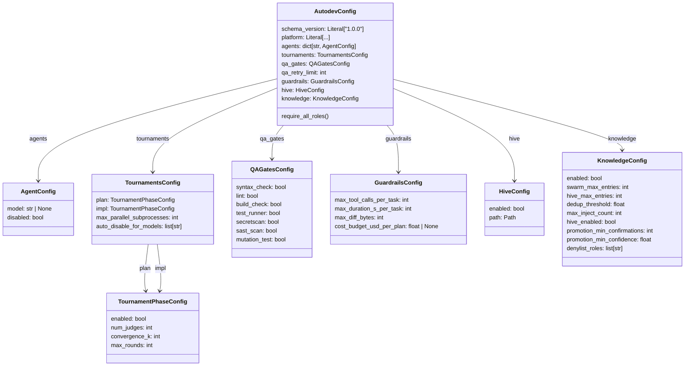
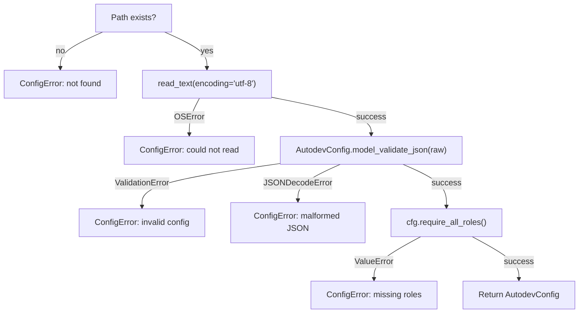
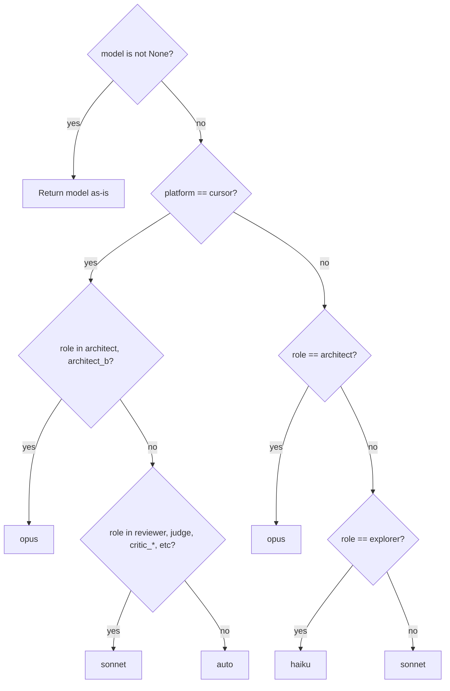

# Configuration Schema & Loading Design

**Status:** Implemented
**Author:** Mohamed Ameen
**Date:** 2026-04-17
**Last Updated:** 2026-04-17
**Reviewers:** --
**Package:** `src/config/`
**Entry Point:** N/A (library-only, consumed by CLI and orchestrator)

## 1. Overview

### 1.1 Purpose

The configuration system defines, validates, loads, and persists AutoDev's runtime configuration. It provides a Pydantic v2 schema (`AutodevConfig`) that enforces strict validation (`extra="forbid"`) on all nested models, a loader that converts `.autodev/config.json` into validated Python objects, and a factory that produces sensible defaults with platform-dependent model resolution. The schema serves as the single source of truth for all tunable parameters across the pipeline.

### 1.2 Scope

**In scope:**

- `AutodevConfig` root model and all nested sub-models.
- `load_config()` / `save_config()` for JSON file I/O.
- `default_config()` factory with platform-dependent model resolution.
- `expand_paths()` for user-home path resolution.
- `REQUIRED_AGENT_ROLES` tuple (all 14 roles).
- `require_all_roles()` validation.

**Out of scope:**

- Environment variable overrides (planned but not yet implemented).
- CLI flag-level overrides (handled by Click at the CLI layer).
- Config migration between schema versions.
- Runtime config mutation after load.

### 1.3 Context

The configuration system sits at the foundation of the AutoDev pipeline. Every subsystem -- adapters, orchestrator, tournament engine, QA gates, guardrails, and knowledge -- reads its operational parameters from `AutodevConfig`. The config file (`.autodev/config.json`) is loaded once at CLI entry, validated against the Pydantic schema, and threaded through the pipeline as an immutable object.



## 2. Requirements

### 2.1 Functional Requirements

- **FR-1:** Define a strict Pydantic v2 schema for `.autodev/config.json` that rejects unknown fields at every nesting level (`extra="forbid"`).
- **FR-2:** Validate that all 14 required agent roles are present in the `agents` dict at load time.
- **FR-3:** Load config from a JSON file, raising `ConfigError` on file-not-found, read errors, malformed JSON, or validation failures.
- **FR-4:** Save config as pretty-printed JSON with a trailing newline.
- **FR-5:** Provide a `default_config(platform)` factory that generates sensible defaults with platform-dependent model resolution (Claude Code vs Cursor).
- **FR-6:** Support a `schema_version` field (`Literal["1.0.0"]`) for forward-compatibility.
- **FR-7:** Expand user-home paths (e.g., `~/.local/share/...`) in `HiveConfig.path`.

### 2.2 Non-Functional Requirements

- **Crash-safety:** `save_config()` creates parent directories as needed. JSON writing is a single `write_text()` call (not atomic via tempfile -- acceptable for config files that are written infrequently and only by user action).
- **Pydantic v2 strict validation:** Every model in the schema uses `ConfigDict(extra="forbid")`. This catches typos in config keys and prevents silent misconfiguration.
- **Deterministic reproducibility:** Given the same config file content, `load_config()` always produces the same `AutodevConfig` object.
- **Maintainability:** Schema changes are versioned via `schema_version`. All models use clear field names with defaults documented.

### 2.3 Constraints

- Must run on Python 3.11+.
- Config format is JSON (not YAML, TOML, or INI). Chosen for ubiquity and Pydantic's built-in `model_validate_json()`.
- Must not introduce dependencies beyond `pydantic` and stdlib.
- `schema_version` is a `Literal["1.0.0"]` -- the schema must be updated (new literal variant) before any breaking changes.

## 3. Architecture

### 3.1 High-Level Design



### 3.2 Component Structure

| File | Element | Responsibility |
|------|---------|---------------|
| `src/config/schema.py` | `AutodevConfig` | Root Pydantic model for `.autodev/config.json` |
| `src/config/schema.py` | `AgentConfig` | Per-agent model/disabled configuration |
| `src/config/schema.py` | `TournamentsConfig` | Tournament parameters (plan + impl phases) |
| `src/config/schema.py` | `TournamentPhaseConfig` | Per-phase tournament tuning (judges, rounds, convergence) |
| `src/config/schema.py` | `QAGatesConfig` | Boolean toggles for each QA gate |
| `src/config/schema.py` | `GuardrailsConfig` | Per-task safety caps |
| `src/config/schema.py` | `HiveConfig` | File-level settings for cross-project knowledge |
| `src/config/schema.py` | `KnowledgeConfig` | Behavioral config for the two-tier knowledge system |
| `src/config/schema.py` | `REQUIRED_AGENT_ROLES` | Tuple of all 14 mandatory agent role names |
| `src/config/loader.py` | `load_config()` | Load and validate a config file |
| `src/config/loader.py` | `save_config()` | Write config as JSON |
| `src/config/loader.py` | `expand_paths()` | Resolve `~` in file paths |
| `src/config/defaults.py` | `default_config()` | Factory producing sensible defaults |
| `src/config/defaults.py` | `resolve_model()` | Platform-dependent LLM model selection per role |

### 3.3 Data Models

#### Root Model

```python
class AutodevConfig(BaseModel):
    model_config = ConfigDict(extra="forbid")

    schema_version: Literal["1.0.0"] = "1.0.0"
    platform: Literal["claude_code", "cursor", "inline", "auto"] = "auto"
    agents: dict[str, AgentConfig]
    tournaments: TournamentsConfig
    qa_gates: QAGatesConfig = Field(default_factory=QAGatesConfig)
    qa_retry_limit: int = 3
    guardrails: GuardrailsConfig = Field(default_factory=GuardrailsConfig)
    hive: HiveConfig
    knowledge: KnowledgeConfig = Field(default_factory=KnowledgeConfig)

    def require_all_roles(self) -> None:
        missing = [r for r in REQUIRED_AGENT_ROLES if r not in self.agents]
        if missing:
            raise ValueError(f"missing required agent roles: {missing}")
```

#### Agent Configuration

```python
class AgentConfig(BaseModel):
    model_config = ConfigDict(extra="forbid")

    model: str | None = None    # LLM model alias; None = use platform default
    disabled: bool = False       # Disable this agent role entirely
```

#### Tournament Configuration

```python
class TournamentPhaseConfig(BaseModel):
    model_config = ConfigDict(extra="forbid")

    enabled: bool               # Whether this tournament phase runs
    num_judges: int             # Number of judges per round
    convergence_k: int          # Consecutive stable-winner rounds to converge
    max_rounds: int             # Hard cap on tournament rounds

class TournamentsConfig(BaseModel):
    model_config = ConfigDict(extra="forbid")

    plan: TournamentPhaseConfig
    impl: TournamentPhaseConfig
    max_parallel_subprocesses: int = 3
    auto_disable_for_models: list[str] = Field(
        default_factory=lambda: ["opus"]
    )
```

#### QA Gates Configuration

```python
class QAGatesConfig(BaseModel):
    model_config = ConfigDict(extra="forbid")

    syntax_check: bool = True
    lint: bool = True
    build_check: bool = True
    test_runner: bool = True
    secretscan: bool = True
    sast_scan: bool = False       # Off by default (expensive)
    mutation_test: bool = False   # Off by default (expensive)
```

#### Guardrails Configuration

```python
class GuardrailsConfig(BaseModel):
    model_config = ConfigDict(extra="forbid")

    max_tool_calls_per_task: int = 60
    max_duration_s_per_task: int = 900       # 15 minutes
    max_diff_bytes: int = 5_242_880          # 5 MB
    cost_budget_usd_per_plan: float | None = None  # Reserved
```

#### Knowledge Configuration (Two-Tier)

```python
class HiveConfig(BaseModel):
    """File-level settings for cross-project knowledge."""
    model_config = ConfigDict(extra="forbid")

    enabled: bool = True
    path: Path                   # e.g. ~/.local/share/autodev/shared-learnings.jsonl

class KnowledgeConfig(BaseModel):
    """Behavioral config for the two-tier knowledge system."""
    model_config = ConfigDict(extra="forbid")

    enabled: bool = True
    swarm_max_entries: int = 100
    hive_max_entries: int = 200
    dedup_threshold: float = 0.6
    max_inject_count: int = 5
    hive_enabled: bool = True
    promotion_min_confirmations: int = 3
    promotion_min_confidence: float = 0.7
    denylist_roles: list[str] = Field(
        default_factory=lambda: [
            "explorer", "judge", "critic_t",
            "architect_b", "synthesizer",
        ]
    )
```

#### Required Agent Roles

```python
REQUIRED_AGENT_ROLES: tuple[str, ...] = (
    "architect", "explorer", "domain_expert", "developer",
    "reviewer", "test_engineer", "critic_sounding_board",
    "critic_drift_verifier", "docs", "designer",
    "critic_t", "architect_b", "synthesizer", "judge",
)
```

### 3.4 Model Hierarchy Diagram



### 3.5 Protocol / Interface Contracts

The config system does not define protocols. It provides data models consumed by all other subsystems.

### 3.6 Interfaces

**`load_config(path: Path) -> AutodevConfig`**

Load and validate a config file. Raises `ConfigError` on any failure (file not found, read error, malformed JSON, validation error, missing roles).

**`save_config(cfg: AutodevConfig, path: Path) -> None`**

Write config as pretty-printed JSON. Creates parent directories as needed.

**`expand_paths(cfg: AutodevConfig) -> AutodevConfig`**

Return a deep copy with user-home paths resolved (currently `hive.path`).

**`default_config(platform: str = "auto") -> AutodevConfig`**

Return the shipped default configuration with platform-dependent model resolution.

**`resolve_model(model: str | None, role: str, platform: str) -> str`**

Resolve an LLM model alias for a given role and platform. Returns the explicit model if set; otherwise applies platform-specific defaults.

## 4. Design Decisions

### 4.1 Key Decisions

| Decision | Rationale | Alternatives Considered |
|----------|-----------|------------------------|
| `extra="forbid"` on all models | Catches typos and prevents silent misconfiguration. A mistyped key like `max_too_calls` is rejected immediately rather than silently ignored. | `extra="ignore"` (lenient), `extra="allow"` (permissive) |
| JSON format (not YAML/TOML) | Pydantic v2 has native `model_validate_json()`. No additional parser dependency. JSON is universally understood. | YAML (more human-friendly but needs PyYAML), TOML (PEP 680 but less expressive for nested structures) |
| `schema_version` as `Literal["1.0.0"]` | Enables forward-compatibility checking. Adding `"2.0.0"` to the Literal union lets the loader detect and handle both versions. | Semver string with runtime parsing, integer version |
| `HiveConfig` vs `KnowledgeConfig` separation | `HiveConfig` governs the on-disk file (path + master switch). `KnowledgeConfig` governs behavioral tuning (ranking, dedup, caps). Operators can disable the hive file entirely without touching behavioral knobs, or vice versa. | Single `KnowledgeConfig` with all fields, nested `HiveConfig` inside `KnowledgeConfig` |
| Platform-dependent model resolution in `defaults.py` | Different platforms have different model availability and cost profiles. Cursor's `auto` model selector behaves differently from Claude Code's alias resolution. Centralizing this logic avoids scattered conditionals. | Per-platform config files, model aliases resolved at adapter layer |
| `require_all_roles()` as explicit validation | Ensures the config file has all 14 required agent roles. Failing fast at load time prevents cryptic errors deep in the pipeline when a role is referenced but missing. | Lazy validation on first access, optional roles with fallback |

### 4.2 Trade-offs

- **Strictness vs. extensibility:** `extra="forbid"` means users cannot add custom keys to the config. This is intentional -- unknown keys are almost always typos. Custom data should go in separate files.
- **Required roles enforcement:** All 14 roles must be present even if `disabled: true`. This ensures the config is always complete. The cost is verbosity for users who want a minimal config.
- **JSON vs. YAML:** JSON lacks comments and is less human-friendly for editing. Mitigated by `autodev init` generating the default config file.
- **No env var overrides (yet):** The three-layer precedence (env var -> config file -> code defaults) is planned but only the latter two are implemented. Users must edit the config file for all non-default values.

## 5. Implementation Details

### 5.1 Core Algorithms/Logic

**`load_config` pipeline:**



**`resolve_model` logic:**



**Platform model resolution defaults:**

| Role | Claude Code | Cursor |
|------|-------------|--------|
| architect | opus | opus |
| architect_b | sonnet | opus |
| explorer | haiku | auto |
| developer | sonnet | auto |
| test_engineer | sonnet | auto |
| reviewer | sonnet | sonnet |
| judge | sonnet | sonnet |
| critic_t | sonnet | sonnet |
| critic_sounding_board | sonnet | sonnet |
| critic_drift_verifier | sonnet | sonnet |
| synthesizer | sonnet | sonnet |
| docs | sonnet | sonnet |
| designer | sonnet | sonnet |
| domain_expert | sonnet | sonnet |

### 5.2 Concurrency Model

The config system is fully synchronous. Config is loaded once at startup and passed immutably through the pipeline. No concurrency concerns.

### 5.3 Subprocess Invocation Pattern

Not applicable. Config loading does not spawn subprocesses.

### 5.4 Atomic I/O Pattern

`save_config()` uses a single `path.write_text()` call. This is not strictly atomic (no tempfile + `os.replace()`) but is acceptable for config files that are:

1. Written only during `autodev init` or explicit user action.
2. Never written concurrently.
3. Small (< 10 KB).

### 5.5 Error Handling

All failures in `load_config()` are wrapped in `ConfigError` (subclass of `AutodevError`) with descriptive messages:

| Failure | Exception Chain | Message |
|---------|----------------|---------|
| File not found | `ConfigError` | `config file not found: {path}` |
| Read error | `ConfigError` from `OSError` | `could not read {path}: {exc}` |
| Validation error | `ConfigError` from `ValidationError` | `invalid config at {path}: {exc}` |
| Malformed JSON | `ConfigError` from `JSONDecodeError` | `malformed JSON at {path}: {exc}` |
| Missing roles | `ConfigError` from `ValueError` | `missing required agent roles: [...]` |

### 5.6 Dependencies

- **pydantic v2:** `BaseModel`, `ConfigDict`, `Field`, `ValidationError` -- the core of the schema system.
- **stdlib:** `json`, `pathlib.Path`, `typing.Literal`
- **Internal:** `errors.ConfigError`

### 5.7 Configuration

The config system is self-referential -- it *is* the configuration mechanism for AutoDev. The config file location defaults to `.autodev/config.json` relative to the project root and can be overridden via the `--config` CLI flag.

**Default config file structure:**

```json
{
  "schema_version": "1.0.0",
  "platform": "auto",
  "agents": {
    "architect": { "model": "opus", "disabled": false },
    "explorer": { "model": "haiku", "disabled": false },
    "domain_expert": { "model": "sonnet", "disabled": false },
    "developer": { "model": "sonnet", "disabled": false },
    "reviewer": { "model": "sonnet", "disabled": false },
    "test_engineer": { "model": "sonnet", "disabled": false },
    "critic_sounding_board": { "model": "sonnet", "disabled": false },
    "critic_drift_verifier": { "model": "sonnet", "disabled": false },
    "docs": { "model": "sonnet", "disabled": false },
    "designer": { "model": "sonnet", "disabled": false },
    "critic_t": { "model": "sonnet", "disabled": false },
    "architect_b": { "model": "sonnet", "disabled": false },
    "synthesizer": { "model": "sonnet", "disabled": false },
    "judge": { "model": "sonnet", "disabled": false }
  },
  "tournaments": {
    "plan": { "enabled": true, "num_judges": 3, "convergence_k": 2, "max_rounds": 15 },
    "impl": { "enabled": true, "num_judges": 1, "convergence_k": 1, "max_rounds": 3 },
    "max_parallel_subprocesses": 3,
    "auto_disable_for_models": ["opus"]
  },
  "qa_gates": {
    "syntax_check": true, "lint": true, "build_check": true,
    "test_runner": true, "secretscan": true,
    "sast_scan": false, "mutation_test": false
  },
  "qa_retry_limit": 3,
  "guardrails": {
    "max_tool_calls_per_task": 60,
    "max_duration_s_per_task": 900,
    "max_diff_bytes": 5242880,
    "cost_budget_usd_per_plan": null
  },
  "hive": {
    "enabled": true,
    "path": "~/.local/share/autodev/shared-learnings.jsonl"
  },
  "knowledge": {
    "enabled": true,
    "swarm_max_entries": 100,
    "hive_max_entries": 200,
    "dedup_threshold": 0.6,
    "max_inject_count": 5,
    "hive_enabled": true,
    "promotion_min_confirmations": 3,
    "promotion_min_confidence": 0.7,
    "denylist_roles": ["explorer", "judge", "critic_t", "architect_b", "synthesizer"]
  }
}
```

## 6. Integration Points

### 6.1 Dependencies on Other Components

- **`errors.ConfigError`**: The sole exception type raised by the loader.

### 6.2 Adapter Contract Dependency

Not applicable. The config system does not consume adapter protocols. It provides `AgentConfig.model` which adapters use to select the LLM model.

### 6.3 Ledger Event Emissions

The config system does not write ledger events.

### 6.4 Components That Depend on This

Every major AutoDev subsystem reads from `AutodevConfig`:

| Consumer | Config Section | Usage |
|----------|---------------|-------|
| Orchestrator | `platform`, `agents`, `qa_retry_limit` | Platform selection, agent roster, retry policy |
| Tournament engine | `tournaments` | Phase enable/disable, judge count, convergence, rounds |
| QA phase engine | `qa_gates` | Which gates to run |
| Guardrails enforcer | `guardrails` | Per-task safety caps |
| Knowledge system | `knowledge`, `hive` | Behavioral tuning and file-level settings |
| Adapter factory | `agents[role].model`, `platform` | Model selection per agent role |
| Workspace initializer | `agents` | Agent definitions and disabled roles |

### 6.5 External Systems

- **Filesystem:** `.autodev/config.json` for config persistence, `~/.local/share/autodev/` for hive path.

## 7. Testing Strategy

### 7.1 Unit Tests

- **Schema validation:** Round-trip `AutodevConfig` through `model_dump_json()` / `model_validate_json()`. Verify all fields survive.
- **extra="forbid":** Verify that unknown keys raise `ValidationError` at every nesting level.
- **REQUIRED_AGENT_ROLES:** Verify `require_all_roles()` raises `ValueError` for each missing role.
- **resolve_model:** Test all branches for both `cursor` and `claude_code` platforms, with and without explicit model overrides.
- **default_config:** Verify the factory produces a valid `AutodevConfig` that passes `require_all_roles()`.
- **load_config error paths:** File not found, read error (mocked), malformed JSON, schema violation, missing roles.
- **save_config:** Verify file is written, parent dirs created, JSON is valid and parseable.
- **expand_paths:** Verify `~` is expanded in `hive.path`.

### 7.2 Integration Tests

- **Full round-trip:** `default_config()` -> `save_config()` -> `load_config()` -> assert equality.
- **Config modification:** Load config, modify a field via `model_copy()`, save, reload, verify change persists.

### 7.3 Property-Based Tests

- **Hypothesis for AgentConfig:** Generate random model strings and disabled booleans. Verify round-trip serialization.
- **Hypothesis for GuardrailsConfig:** Generate random positive integer caps. Verify schema accepts them.
- **Hypothesis for KnowledgeConfig:** Generate random thresholds in [0, 1]. Verify schema accepts them.

### 7.4 Test Data Requirements

- Valid config JSON files with all 14 roles.
- Invalid config JSON files: missing roles, extra keys, wrong types, malformed JSON.
- Platform variants: `"cursor"`, `"claude_code"`, `"auto"`.

## 8. Security Considerations

- **Input validation:** `extra="forbid"` at every level rejects unexpected fields. Pydantic enforces types strictly.
- **Path traversal:** `hive.path` is user-supplied and expanded with `expanduser()`. The knowledge system should validate the resolved path is within expected directories.
- **No secrets in config:** API keys and credentials must not be stored in `.autodev/config.json`. They should use environment variables or platform-specific credential stores.

## 9. Performance Considerations

- **Load time:** Pydantic v2's `model_validate_json()` is implemented in Rust and parses a typical config file in < 1ms.
- **Memory:** The full `AutodevConfig` object is < 10 KB in memory.
- **No hot path:** Config is loaded once at startup. No performance-sensitive code paths.

## 10. Installation & CLI Entry

### 10.1 Package Registration

The config module is part of the core `autodev` wheel (`src/config/`). No separate entry point needed.

### 10.2 CLI Commands

```bash
# Initialize a project with default config
autodev init

# Run with explicit config path
autodev --config path/to/config.json run
```

The `autodev init` command calls `default_config()` -> `save_config()` to create `.autodev/config.json`.

## 11. Observability

### 11.1 Structured Logging

The config module does not emit structured log events. Errors are raised as `ConfigError` and logged by the CLI layer.

### 11.2 Audit Artifacts

The config file itself (`.autodev/config.json`) serves as the audit artifact. It is checked into version control along with the project.

### 11.3 Status Command

`autodev status` may display:

- Config file path and schema version.
- Current platform.
- Number of enabled/disabled agents.
- Tournament phase settings.
- Active QA gates.
- Guardrail caps.

## 12. Cost Implications

The config system makes zero LLM calls. However, the configuration it defines directly controls cost:

| Config Parameter | Cost Impact |
|-----------------|-------------|
| `agents[role].model` | Model pricing varies 10-50x between haiku/sonnet/opus |
| `tournaments.plan.max_rounds` (default: 15) | Each round = N judge calls |
| `tournaments.plan.num_judges` (default: 3) | Multiplied by rounds |
| `tournaments.impl.max_rounds` (default: 3) | Implementation refinement rounds |
| `tournaments.auto_disable_for_models: ["opus"]` | Auto-disables tournaments for expensive models |
| `guardrails.max_tool_calls_per_task` (default: 60) | Hard cap on tool calls per task |
| `guardrails.cost_budget_usd_per_plan` | Per-plan USD budget (reserved) |
| `qa_retry_limit` (default: 3) | QA failures trigger retries, each retry = more LLM calls |

## 13. Future Enhancements

- **Environment variable overrides:** Support `AUTODEV_GUARDRAILS__MAX_TOOL_CALLS=100` style overrides (three-layer precedence: env var -> config file -> code defaults).
- **Schema migration:** When `schema_version` advances to `"2.0.0"`, implement a migration function that upgrades `"1.0.0"` configs automatically.
- **Partial config:** Allow config files to specify only overrides, merging with `default_config()` for unspecified fields.
- **Config validation CLI command:** `autodev config validate` to check a config file without running the pipeline.
- **Per-task config overrides:** Allow individual tasks to override guardrails or model selection.
- **Dynamic model resolution:** Integrate with platform APIs to detect available models at runtime rather than relying on static defaults.

## 14. Open Questions

- [ ] Should environment variable overrides use nested double-underscore notation (`AUTODEV_GUARDRAILS__MAX_TOOL_CALLS`) or flat names?
- [ ] Should `schema_version` be enforced as a migration check or just a compatibility marker?
- [ ] Should `HiveConfig.path` support environment variable expansion (e.g., `$XDG_DATA_HOME`) in addition to `~`?
- [ ] Should config support YAML as an alternative format for human-friendliness?
- [ ] Should `REQUIRED_AGENT_ROLES` be derived dynamically from the agent spec registry rather than hardcoded?

## 15. Related ADRs

- ADR-009: Pydantic v2 strict validation (mandates `extra="forbid"` on all boundary models)

## 16. References

- `src/config/schema.py` -- AutodevConfig and all nested model definitions
- `src/config/loader.py` -- load_config, save_config, expand_paths
- `src/config/defaults.py` -- default_config, resolve_model
- `src/errors.py` -- ConfigError definition
- [Pydantic v2 documentation](https://docs.pydantic.dev/latest/)
- [Python typing.Literal](https://docs.python.org/3/library/typing.html#typing.Literal)

## 17. Revision History

| Date | Author | Changes |
|------|--------|---------|
| 2026-04-17 | Mohamed Ameen | Initial draft |
