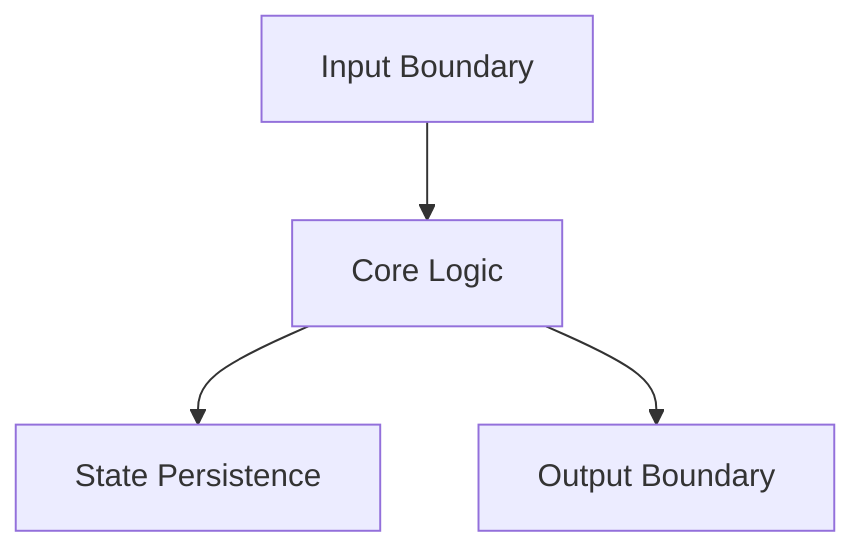
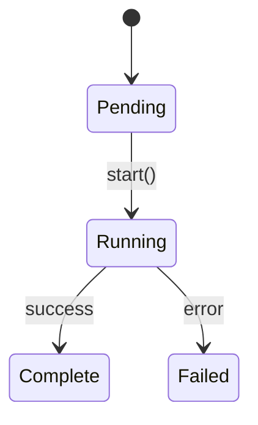

# Component Design Document Template

> **AutoDev Tech Stack:** Python 3.11+, Pydantic v2, asyncio, Click, structlog, filelock.
> All components operate within a CLI that orchestrates multi-agent coding workflows
> with tournament-based self-refinement. Keep designs consistent with this stack.

## File Naming Convention

All design documents must follow this naming convention:

```
<component_name>_design.md
```

**Rules:**
- Use lowercase letters
- Separate words with underscores (`_`)
- Use descriptive component/feature names
- Place all design documents in `docs/design_documentation/`

**Examples:**
- `adapters_design.md`
- `tournament_engine_design.md`
- `orchestrator_pipeline_design.md`
- `state_ledger_design.md`
- `guardrails_design.md`
- `qa_judge_design.md`

---

# [Component Name] Design

**Status:** [Draft | In Review | Approved | Implemented | Deprecated]
**Author:** [Your Name]
**Date:** [YYYY-MM-DD]
**Last Updated:** [YYYY-MM-DD]
**Reviewers:** [List of reviewers]
**Package:** [e.g., `src/tournament/`, `src/adapters/`]
**Entry Point:** [e.g., `autodev tournament run`, or N/A if library-only]

## 1. Overview

### 1.1 Purpose
[Provide a clear, concise statement of what this component is designed to accomplish and why it's needed within the AutoDev orchestration pipeline.]

### 1.2 Scope
[Define what is included in this design and what is explicitly out of scope.]

### 1.3 Context
[Describe where this component sits in the AutoDev pipeline (adapters -> orchestrator -> agents -> tournament -> QA). What problems it solves and how it relates to other AutoDev subsystems.]

## 2. Requirements

### 2.1 Functional Requirements
- [Requirement 1: Description]
- [Requirement 2: Description]
- [Requirement 3: Description]

### 2.2 Non-Functional Requirements
- **Crash-safety:** [e.g., All writes to `.autodev/` state must be atomic (tempfile + `os.replace`). Ledger entries use CAS hash chaining so partial writes are detectable.]
- **Subprocess isolation:** [e.g., Each agent invocation must be stateless -- fresh subprocess, no shared mutable globals, clean environment.]
- **Asyncio concurrency:** [e.g., Must not block the event loop. All I/O via `await`. Bounded concurrency with `asyncio.Semaphore(N)`.]
- **Pydantic v2 strict validation:** [e.g., All data crossing a boundary (CLI input, adapter output, ledger records) must be validated through a Pydantic `BaseModel` with `ConfigDict(extra="forbid")`.]
- **LLM cost efficiency:** [e.g., Minimize subscription calls per run. Cache intermediate results. Document expected invocation count.]
- **Deterministic reproducibility:** [e.g., Given the same inputs and seed, the component must produce identical outputs. No implicit ordering dependencies.]
- **Maintainability:** [e.g., Must follow project coding standards, structlog for all logging.]

### 2.3 Constraints
- [Technical constraint 1, e.g., Must run on Python 3.11+ with no compiled extensions]
- [Technical constraint 2, e.g., Must work within a single-machine, single-user context]
- [Dependency constraint, e.g., Must not introduce dependencies beyond pyproject.toml]

## 3. Architecture

### 3.1 High-Level Design
[Provide a high-level overview of the component architecture. Include Mermaid diagrams to illustrate structure, data flow, or state transitions. Prefer `flowchart TB` for pipelines or `stateDiagram-v2` for lifecycle-driven components.]



### 3.2 Component Structure
[Describe the internal structure: modules, classes, and how they map to files under `src/`.]

### 3.3 Data Models
[Define the Pydantic models used by this component. All models at boundaries must use `extra="forbid"` to reject unknown fields.]

```python
from pydantic import BaseModel, ConfigDict

class ExampleModel(BaseModel):
    """Brief description of the model."""
    model_config = ConfigDict(extra="forbid")

    field1: str
    field2: int
    field3: bool = False
```

### 3.4 State Machine
[If this component has lifecycle states (e.g., Pending -> Running -> Judging -> Complete), document the state machine here. Use a `stateDiagram-v2` Mermaid diagram.]



[If this component has no FSM aspects, remove this subsection.]

### 3.5 Protocol / Interface Contracts
[Document any `typing.Protocol` classes this component defines or implements. AutoDev uses `@runtime_checkable` protocols for adapter and plugin contracts.]

```python
from typing import Protocol, runtime_checkable

@runtime_checkable
class ExampleProtocol(Protocol):
    async def execute(self, task: Task) -> Result: ...
```

### 3.6 Interfaces
[Describe the public interfaces (functions, methods, CLI commands) that this component exposes to the rest of AutoDev.]

## 4. Design Decisions

### 4.1 Key Decisions
[Document important design decisions and their rationale.]

| Decision | Rationale | Alternatives Considered |
|----------|-----------|------------------------|
| [Decision 1] | [Why this was chosen] | [What else was considered] |
| [Decision 2] | [Why this was chosen] | [What else was considered] |

### 4.2 Trade-offs
[Document any trade-offs made during the design process.]

## 5. Implementation Details

### 5.1 Core Algorithms/Logic
[Describe the core algorithms, business logic, or processing flow.]

### 5.2 Concurrency Model
[Describe the asyncio patterns used. Document semaphore bounds, `asyncio.gather` fan-out points, and any use of `filelock.FileLock(lock_path, thread_local=False)` for cross-process coordination.]

```python
# Example: bounded concurrent agent execution
sem = asyncio.Semaphore(max_concurrent)

async def run_agent(agent: Agent) -> Result:
    async with sem:
        return await agent.execute()

results = await asyncio.gather(*[run_agent(a) for a in agents])
```

### 5.3 Subprocess Invocation Pattern
[If this component spawns subprocesses (e.g., agent sessions), describe the pattern. Each invocation must be a fresh session with explicit parameters -- no reliance on ambient state.]

```python
# Example: stateless subprocess invocation with timeout
proc = await asyncio.create_subprocess_exec(
    "autodev", "agent", "run", "--task-id", task.id,
    stdout=asyncio.subprocess.PIPE,
    stderr=asyncio.subprocess.PIPE,
)
stdout, stderr = await asyncio.wait_for(proc.communicate(), timeout=timeout_s)
```

### 5.4 Atomic I/O Pattern
[If this component writes to `.autodev/` state files or ledgers, describe the atomic write pattern.]

```python
import os, tempfile

def atomic_write(path: str, data: bytes) -> None:
    dir_name = os.path.dirname(path)
    fd, tmp = tempfile.mkstemp(dir=dir_name)
    try:
        os.write(fd, data)
        os.close(fd)
        os.replace(tmp, path)  # atomic on POSIX
    except BaseException:
        os.close(fd)
        os.unlink(tmp)
        raise
```

### 5.5 Error Handling
[Describe how errors are handled, including error types from `src/errors.py`, retry policies (tenacity), and error propagation.]

### 5.6 Dependencies
[List external dependencies (from pyproject.toml) and internal AutoDev packages used.]

- **click:** [CLI entry point and argument parsing]
- **pydantic:** [Model validation at boundaries]
- **structlog:** [Structured logging]
- **filelock:** [Cross-process file locking]
- **Internal:** [e.g., `src/state` for ledger access, `src/errors` for exception types]

### 5.7 Configuration
[Describe configuration options loaded from `.autodev/config.yaml`, environment variables, or CLI flags.]

## 6. Integration Points

### 6.1 Dependencies on Other Components
[Describe what other AutoDev subsystems this component depends on.]

### 6.2 Adapter Contract Dependency
[If this component consumes an adapter protocol (e.g., `LLMAdapter`, `IDEAdapter`), specify the protocol and which concrete adapters are expected.]

### 6.3 Ledger Event Emissions
[If this component writes events to the state ledger, list the event types and their schemas.]

### 6.4 Components That Depend on This
[Describe what AutoDev subsystems will consume this component's output.]

### 6.5 External Systems
[Describe any external systems (LLM APIs, IDE extensions, filesystem) this component interacts with.]

## 7. Testing Strategy

### 7.1 Unit Tests
[Describe what will be covered by unit tests. All Pydantic models should have round-trip serialization tests.]

### 7.2 Integration Tests
[Describe integration test scenarios. Note: use `pytest-asyncio` for async tests.]

### 7.3 Property-Based Tests
[Describe Hypothesis strategies for fuzz-testing models or state transitions, if applicable.]

### 7.4 Test Data Requirements
[Describe any special test data, fixtures, or mock adapters needed.]

## 8. Security Considerations

[Document security aspects: input validation (Pydantic handles boundary validation), subprocess sandboxing, file permission handling, secret management for API keys.]

## 9. Performance Considerations

[Document performance requirements, async bottlenecks, concurrency limits, and LLM call latency expectations.]

## 10. Installation & CLI Entry

### 10.1 Package Registration
[Describe how this component is registered in `pyproject.toml` (wheel packages, script entry points).]

### 10.2 CLI Commands
[List the Click commands or command groups this component adds, if any.]

```bash
# Example
autodev tournament run --rounds 3 --strategy borda
```

### 10.3 Migration Strategy
[If replacing an existing component, describe the migration path.]

## 11. Observability

### 11.1 Structured Logging
[Describe the structlog events this component emits. Include event names and key fields.]

```python
structlog.get_logger().info("tournament_round_complete", round=round_num, winner=winner_id)
```

### 11.2 Audit Artifacts
[Describe any files written to `.autodev/` for post-run inspection (e.g., ledger entries, tournament transcripts, judge scores).]

### 11.3 Status Command
[Describe what `autodev status` should display for this component's current state, if applicable.]

## 12. Cost Implications

[Document the expected number of LLM invocations per run. For tournament-based components, note the multiplier effect (e.g., N candidates x M rounds x judge calls). Include strategies to reduce cost (caching, early exit, tiered models).]

| Operation | LLM Calls | Notes |
|-----------|-----------|-------|
| [e.g., Generate candidates] | [N] | [One per agent] |
| [e.g., Judge round] | [N*(N-1)/2] | [Pairwise comparison] |
| [e.g., Total per run] | [formula] | [Approximate token cost] |

## 13. Future Enhancements

[Document known future improvements or extensions that are not in the current scope.]

## 14. Open Questions

[Document any unresolved questions or areas that need further investigation.]

- [ ] [Question 1]
- [ ] [Question 2]

## 15. Related ADRs

[Link to relevant Architecture Decision Records in `docs/` or `thoughts/`.]

- [ADR-NNN: Title](../path/to/adr.md)
- [ADR-NNN: Title](../path/to/adr.md)

## 16. References

- [Link to related design documents]
- [Link to external resources]
- [Link to related issues or discussions]

## 17. Revision History

| Date | Author | Changes |
|------|--------|---------|
| YYYY-MM-DD | [Name] | Initial draft |
| YYYY-MM-DD | [Name] | [Description of changes] |

---

## Usage Instructions

1. Copy this entire template to create a new design document
2. Replace all placeholder text (text in square brackets `[...]`) with actual content
3. Remove sections that are not applicable to your component (e.g., State Machine if no FSM, Subprocess Invocation if no subprocesses)
4. Add additional sections if needed for your specific use case
5. Use the file naming convention: `<component_name>_design.md`
6. Save the file in `docs/design_documentation/`
7. Update the status field as the design progresses through review and implementation
8. Link any new ADRs created during the design process in the Related ADRs section

---

**Questions or suggestions for improving this template?** Please discuss with the team or update this template document.
