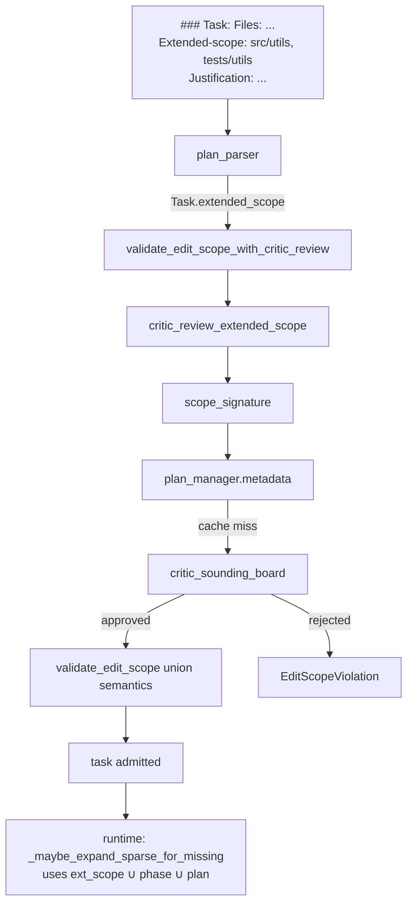

# Extended Scope Design

**Status:** Implemented
**Author:** Mohamed Ameen
**Date:** 2026-05-09
**Last Updated:** 2026-05-09
**Version:** v0.21.1 (introduced in v0.20.0)
**Reviewers:** --
**Package:** `src/orchestrator/extended_scope_critic.py`, `src/orchestrator/dag.py`, `src/state/schemas.py`
**Entry Point:** N/A (library-only; integrated into `validate_edit_scope_with_critic_review` in `dag.py` and `_maybe_expand_sparse_for_missing` in `execute_phase.py`)

## 1. Overview

### 1.1 Purpose

`Task.extended_scope` is a per-task escape hatch that lets an architect declare additional path prefixes a single task may modify on top of its phase/plan `EDIT_SCOPE`. The orchestrator routes every task with a non-empty `extended_scope` through `critic_sounding_board` for an EXTENDED SCOPE REVIEW; the critic returns a binary RESOLUTION token that admits or rejects the extension.

The feature lets a refactor that legitimately needs to touch one adjacent module proceed without forcing the architect to broaden the phase/plan scope (which would relax the constraint for every other task in that phase). The critic gate ensures the extension is structurally minimal — vague justifications are rejected.

### 1.2 Scope

**In scope:**
- `Task.extended_scope: list[str]` field with the same validators as `Plan.edit_scope` (`src/state/schemas.py`).
- Plan-markdown parser support for inline `Extended-scope: path/a, path/b` blocks.
- `critic_review_extended_scope()` — async critic delegate with per-decision caching keyed by `(task_id, sorted-scope)`.
- `validate_edit_scope_with_critic_review()` — async wrapper that gates the critic review BEFORE invoking the synchronous edit-scope validator.
- DAG-level union semantics: `resolved scope ∪ task.extended_scope` becomes the effective allow-list.
- Dynamic sparse-checkout repair: `_maybe_expand_sparse_for_missing` admits a missing path only when it falls under `extended_scope ∪ phase ∪ plan` scope.

**Out of scope:**
- Changing `Phase.edit_scope` / `Plan.edit_scope` resolution semantics.
- Auto-detecting candidate `extended_scope` paths from the plan body.
- Critic-side proposal of alternative scope layouts (the critic returns approve/reject only).

### 1.3 Context

```
architect -> plan markdown (Extended-scope: paths + Justification:) -> plan_parser
                                                                          |
                                                                          v
              validate_edit_scope_with_critic_review --> critic_sounding_board
                                                          |
                                                          v
                               cache to plan_manager.metadata['extended_scope_decisions']
                                                          |
                                                          v
                                                  validate_edit_scope (union semantics)
                                                          |
                                                          v
                                                  developer / reviewer / tournament
```

The feature also surfaces in the runtime repair flow: when a developer references a path missing from the sparse-checkout worktree, `_maybe_expand_sparse_for_missing` consults the union of `extended_scope ∪ phase.edit_scope ∪ plan.edit_scope` to decide whether the path may be admitted (one-shot widening per task; repeat misses fall through to normal retry).

## 2. Requirements

### 2.1 Functional Requirements

- **FR-1:** `Task.extended_scope` is a list of repo-relative path prefixes; same validators as `Plan.edit_scope` (no leading `/`, no `..` segments, trailing `/` trimmed).
- **FR-2:** Empty `extended_scope` (default) preserves byte-identical v0.19.0 behavior — critic never invoked.
- **FR-3:** Plan-markdown parser accepts `- Extended-scope: path/a, path/b` (comma-separated, mirrors the `Files:` parser).
- **FR-4:** Non-empty `extended_scope` triggers `critic_sounding_board` BEFORE `validate_edit_scope` admits the union scope. Rejection raises `EditScopeViolation`; approval admits the extension.
- **FR-5:** Approval decisions are cached in `plan_manager.metadata['extended_scope_decisions']` keyed by `scope_signature(task)`.
- **FR-6:** When the resolved phase/plan scope is empty (whole-repo), `extended_scope` is harmless.
- **FR-7:** Dynamic sparse-checkout expansion honors `extended_scope` as a legitimate widening source.

### 2.2 Non-Functional Requirements

- **Idempotent caching:** `scope_signature` is a deterministic SHA-256 truncation of `f"{task.id}/{sorted-scope-joined}"`; mutating the scope invalidates the cached decision. Cache writes go through the plan-manager's normal merge surface.
- **Fail-closed:** any error in the critic delegate (no delegate, exception, missing RESOLUTION token, unparseable response) is treated as rejection.
- **Pydantic v2 strict validation:** `Task.extended_scope` reuses `_validate_edit_scope_paths` for surface uniformity with `Plan.edit_scope`.
- **Asyncio:** the critic review and validator wrapper are async; the legacy sync `validate_edit_scope` remains for callers that don't need the critic gate.

### 2.3 Constraints

- Python 3.11+.
- Critic invocation goes through `DelegationEnvelope`; the delegate is late-bound via `_resolve_delegate(orch)` to break an import cycle with `execute_phase`.
- Cache persistence requires a `plan_manager` with `load()` / `save()`. Stub orchestrators without one skip the cache and re-invoke the critic on every call.

## 3. Architecture

### 3.1 High-Level Design



### 3.2 Component Structure

| File | Responsibility |
|------|----------------|
| `src/state/schemas.py` (lines 124–142) | `Task.extended_scope: list[str]` + shared validator |
| `src/orchestrator/plan_parser.py` (lines 74–82, 280, 397–407) | `_RE_EXTENDED_SCOPE` regex and inline parser branch |
| `src/orchestrator/extended_scope_critic.py` | `critic_review_extended_scope()`, `scope_signature()`, envelope builder, RESOLUTION parser, cache helpers |
| `src/orchestrator/dag.py` (lines 367–462) | Union semantics in `validate_edit_scope`; async wrapper `validate_edit_scope_with_critic_review` |
| `src/orchestrator/execute_phase.py` (lines 2020–2094) | `_maybe_expand_sparse_for_missing` consumes `task.extended_scope` |
| `src/orchestrator/worktree.py` (line 369+) | Sparse-checkout cone honors `extended_scope` |
| `src/agents/prompts/architect.md` (lines 1233+) | "EXTENDED SCOPE JUSTIFICATION" architect-side contract |
| `src/agents/prompts/critic_sounding_board.md` | Critic prompt that emits the RESOLUTION line |

### 3.3 Data Models

```python
class Task(BaseModel):
    model_config = ConfigDict(extra="forbid")
    # ...
    extended_scope: list[str] = Field(default_factory=list)

    @field_validator("extended_scope", mode="after")
    @classmethod
    def _validate_extended_scope(cls, v: list[str]) -> list[str]:
        return _validate_edit_scope_paths(v)
```

The architect's free-form justification flows via `task.metadata['extended_scope_justification']` (read by the validator wrapper to populate the critic envelope; missing/empty renders as `(none provided)`).

### 3.4 Protocol / Interface Contracts

**Critic envelope:**

```python
DelegationEnvelope(
    task_id=task.id,
    target_agent="critic_sounding_board",
    action="critique",
    files=list(task.files),
    constraints=[
        f"EXTENDED_SCOPE_REVIEW: task {task.id} declares paths outside its phase/plan EDIT_SCOPE",
        f"Extended-scope: {', '.join(task.extended_scope)}",
        f"Justification: {justification or '(none provided)'}",
    ],
    acceptance=(
        "Reply with EXACTLY ONE line of either 'RESOLUTION: approved-extended-scope' "
        "or 'RESOLUTION: rejected-extended-scope'."
    ),
    context={"task_title": task.title, "task_description": task.description, "extended_scope_count": len(task.extended_scope)},
)
```

**RESOLUTION tokens (rejection wins on conflict):**

```python
_APPROVAL_TOKEN  = "RESOLUTION: approved-extended-scope"
_REJECTION_TOKEN = "RESOLUTION: rejected-extended-scope"
```

### 3.5 Interfaces

| Function | Signature | Description |
|----------|-----------|-------------|
| `scope_signature(task)` | `Task -> str` | 16-char SHA-256 hex of `task.id + sorted(extended_scope)`; cache key |
| `critic_review_extended_scope(orch, task, *, justification)` | `(object, Task, str) -> bool` | Async — returns True (approved) or False (rejected, including all error paths); caches the decision |
| `validate_edit_scope_with_critic_review(orch, plan, tracked_files)` | `(object, Plan, set[str] \| None) -> None` | Async wrapper — invokes the critic for every task with non-empty `extended_scope`, then falls through to `validate_edit_scope` |
| `validate_edit_scope(plan, tracked_files)` | `(Plan, set[str] \| None) -> None` | Sync — unions `extended_scope` into the resolved scope per task; raises `EditScopeViolation` on out-of-scope paths |

## 4. Design Decisions

### 4.1 Key Decisions

| Decision | Rationale | Alternatives Considered |
|----------|-----------|------------------------|
| Per-task `extended_scope` rather than broadening `Phase.edit_scope` | Phase-wide broadening relaxes the constraint for every task in the phase; per-task scoping confines relaxation to the one task that needs it. | Phase-wide auto-broadening — silently degrades architect intent. |
| Critic-review gate (not auto-approve) | Unchecked extension would let architects sidestep edit-scope discipline entirely. | Auto-approve with post-hoc review — by the time it fires, the developer has already produced potentially out-of-scope code. |
| Cache keyed by `(task.id, sorted-scope)` | Validator runs in multiple paths; re-invoking the critic on each call would multiply LLM cost. | No cache — cost prohibitive. Cache by `task.id` only — masks scope mutations. |
| Fail-closed on any error | Mirrors the security posture of the rest of the gate. | Fail-open — transient adapter failure could silently admit out-of-scope changes. |
| Late-bind delegate via `_resolve_delegate(orch)` | The orchestrator imports `execute_phase`, which imports this module — top-level import would create a cycle. | Move delegate elsewhere — the canonical delegate IS `execute_phase.delegate`. |
| Free-form `Justification:` (not a typed schema field) | The justification is read by an LLM critic, not a parser. | Typed `JustificationKind` enum — premature structure. |
| Rejection wins on token conflict | A critic emitting both tokens (whether by mistake or adversarial prompt injection) should not over-approve. | Approval wins — over-approval risk. |

### 4.2 Trade-offs

- **Cost vs. discipline:** every new `(task_id, scope_signature)` pair costs one `critic_sounding_board` invocation. The cache reduces re-runs to free.
- **Cache invalidation:** any scope mutation invalidates prior decisions — correct posture, but means experimenting with scope variants during plan iteration costs one critic call per variant.
- **No partial approval:** the critic returns approve/reject for the whole list, not per-path. Architects must group only structurally-related paths into a single extension.

## 5. Implementation Details

### 5.1 Plan-markdown grammar

```markdown
### Task 1.4: Move retry helper into shared utils
  - Description: Relocate src/orchestrator/_retry.py into src/utils/retry.py and update imports.
  - Files: src/orchestrator/_retry.py, src/utils/retry.py, tests/utils/test_retry.py
  - Extended-scope: src/utils, tests/utils
  - Justification: The retry helper is consumed by both orchestrator and qa modules. Relocating into src/utils removes a circular import that blocks the migration in Task 1.5.
```

Parser regex (`plan_parser.py:79-82`):

```python
_RE_EXTENDED_SCOPE = re.compile(
    r"^\s*-\s*Extended[-_]scope\s*:\s*(.*?)\s*$",
    re.IGNORECASE,
)
```

The parser branch splits the captured payload on `,`, strips whitespace, trims trailing `/`, and stores it on `current_task["extended_scope"]`. The schema validator runs at `Task` construction and rejects malformed entries.

### 5.2 Critic invocation flow

`critic_review_extended_scope(orch, task, *, justification)`:

1. **Short-circuit on empty scope:** return True immediately.
2. **Cache check:** load the plan, read `metadata['extended_scope_decisions']`, look up `scope_signature(task)`. Cache hit returns the cached bool.
3. **Build envelope:** `DelegationEnvelope` with `EXTENDED_SCOPE_REVIEW:` constraint, comma-joined scope, prose justification.
4. **Resolve delegate:** late-bind via `_resolve_delegate(orch)`; tests inject stubs via `orch._extended_scope_delegate`.
5. **Invoke critic:** catch exceptions; return False on failure (fail-closed).
6. **Parse RESOLUTION:** scan for rejection token first, then approval token. Missing token → False.
7. **Persist decision:** write to `plan.metadata['extended_scope_decisions'][scope_sig]`; append `extended_scope_review` ledger entry.
8. **Return decision.**

### 5.3 Validator wrapper integration point

`validate_edit_scope_with_critic_review` (in `dag.py:418-462`) iterates every task with non-empty `extended_scope`, calls `critic_review_extended_scope`, and raises `EditScopeViolation` on rejection:

```python
for phase in plan.phases:
    for task in phase.tasks:
        ext = list(getattr(task, "extended_scope", []) or [])
        if not ext:
            continue
        justification = str(task.metadata.get("extended_scope_justification") or "")
        approved = await critic_review_extended_scope(orch, task, justification=justification)
        if not approved:
            raise EditScopeViolation(
                f"task {task.id!r} (phase {phase.id!r}) requested "
                f"extended_scope {ext!r} but critic rejected the review"
            )
# Fall through to the sync validator (union semantics).
validate_edit_scope(plan, tracked_files=tracked_files)
```

The gate fires **before** the developer is dispatched — at plan-load time during `execute_phase` startup. Tasks with empty `extended_scope` skip the loop body entirely; the wrapper degrades to a single `validate_edit_scope` call (byte-identical v0.19.0 behavior).

> **Integration note:** the wrapper is exercised by tests but is not yet wired into the live `execute_phase` startup as of v0.21.1 — the live path calls the sync `validate_edit_scope` directly (`execute_phase.py:636`). The sync validator's union semantics still admit the extension; the critic-gate enforcement is reserved for an upcoming wiring change. See section 14.

### 5.4 DAG union semantics

`validate_edit_scope` (in `dag.py:335-415`) unions `extended_scope` into the per-task effective scope:

```python
for task in phase.tasks:
    extended = list(getattr(task, "extended_scope", []) or [])
    effective_scope = list(resolved) + extended
    for file_path in task.files:
        # glob expansion + is_in_scope check against effective_scope
```

When the resolved phase/plan scope is empty (whole-repo), the validator short-circuits before the per-task loop — `extended_scope` is harmless because every path is implicitly in scope.

### 5.5 Dynamic sparse-checkout repair flow

`_maybe_expand_sparse_for_missing` (in `execute_phase.py:2020+`) fires when a developer references a path missing from the sparse-checkout worktree (typical of a refactor that needs to read a sibling module). It builds the broadest legitimate scope from `extended_scope ∪ phase.edit_scope ∪ plan.edit_scope` and admits the missing path only if it falls inside that union:

```python
scope: list[str] = list(task.extended_scope or [])
if orch.plan_manager is not None:
    plan = await orch.plan_manager.load()
    if plan is not None:
        scope.extend(plan.edit_scope or [])
        for ph in plan.phases:
            if ph.id == task.phase_id and ph.edit_scope is not None:
                scope.extend(ph.edit_scope)
                break
if not scope:
    return False  # safety: never admit arbitrary missing paths
```

One-shot per task (`task.metadata['dynamic_scope_expansion_used']` guards re-entry); repeat misses fall through to normal retry.

### 5.6 Failure mode

When the critic rejects:

1. `critic_review_extended_scope` returns `False`.
2. The wrapper raises `EditScopeViolation` with the rejection reason inline.
3. `execute_phase` blocks every pending task in every phase (current behavior for `EditScopeViolation`); a `WARNING` event (`execute_phase.edit_scope_violation`) is logged.
4. The architect must re-plan: narrow the task's `Files:`, expand the phase/plan `EDIT_SCOPE:`, or rewrite the `Justification:` to be structurally minimal.

There is no automatic retry-with-stricter-scope at this layer — the rejection is a planning-level decision that requires architect intervention.

### 5.7 Use cases

| Use case | Why extended_scope helps |
|----------|--------------------------|
| Cross-cutting refactor | A helper relocation crosses one sibling module without restructuring the whole phase. |
| Dependency bump that needs code adjustment | A library upgrade changes a signature; the call site is in a different module than the dependency declaration. |
| Related test updates | A behavior change in `src/foo.py` requires fixture updates in `tests/bar/` not in the phase scope. |
| Circular-import resolution | Moving a module to break a cycle by definition crosses the original module's scope. |
| Generated-code regeneration | Bumping a schema requires re-running a generator that writes into a sibling directory. |

### 5.8 Dependencies

- **pydantic v2:** `Task.extended_scope` field validation.
- **hashlib:** `scope_signature()` SHA-256 cache key.
- **Internal:** `state/schemas` (Task, validator), `orchestrator/delegation_envelope` (envelope), `orchestrator/execute_phase` (late-bound delegate), `state/plan_manager` (cache + ledger), `agents/prompts/critic_sounding_board.md` (critic prompt).

## 6. Integration Points

### 6.1 Dependencies on Other Components

| Component | Dependency |
|-----------|------------|
| `src/state/schemas.py` | `Task.extended_scope`, shared validator |
| `src/orchestrator/plan_parser.py` | Inline `Extended-scope:` block parser |
| `src/orchestrator/dag.py` | Union semantics + async wrapper |
| `src/orchestrator/execute_phase.py` | Late-bound delegate; dynamic-scope-expansion consumer |
| `src/orchestrator/delegation_envelope.py` | Envelope shape used by the critic invocation |
| `src/state/plan_manager` (load/save/ledger) | Decision cache and audit trail |

### 6.2 Adapter Contract Dependency

The critic invocation goes through the standard delegation pipeline; consumes whichever adapter the orchestrator is configured with (Claude Code, Cursor, inline). No special adapter contract required.

### 6.3 Ledger Event Emissions

| Event | Payload | When emitted |
|-------|---------|--------------|
| `extended_scope_review` | `{task_id, extended_scope, approved, signature}` | After every fresh critic invocation (cache misses) |
| `execute_phase.edit_scope_violation` (WARNING log) | rejection reason | When the critic rejects |
| `execute_phase.dynamic_scope_expanded` | `{task_id, admitted}` | When `_maybe_expand_sparse_for_missing` widens sparse-checkout |
| `sparse_checkout_expanded` | `{task_id, missing_paths, admitted_prefixes}` | Ledger entry mirroring the structured log |

### 6.4 Components That Depend on This

| Consumer | Usage |
|----------|-------|
| `orchestrator/execute_phase.py` | Reads `task.extended_scope` in the dynamic-scope-expansion repair flow |
| `orchestrator/worktree.py` | Honors `extended_scope` when computing the sparse-checkout cone (line 369+) |
| `orchestrator/dag.py::validate_edit_scope` | Unions `extended_scope` into the per-task allow-list |

### 6.5 External Systems

None directly. The critic invocation rides the existing LLM adapter pipeline.

## 7. Testing Strategy

### 7.1 Unit Tests

- `tests/test_orchestrator_dag_extended_scope.py` — validator union semantics, glob handling, empty-scope no-op, whole-repo harmless overlay.
- `tests/test_orchestrator_dag_extended_scope_critic_required.py` — critic-required path, rejection raises `EditScopeViolation`, deterministic `scope_signature` cache hit.
- `tests/test_orchestrator_extended_scope_critic.py` — `_parse_resolution()` token order (rejection wins), envelope construction, stub orchestrator with planted `_extended_scope_delegate`.

### 7.2 Integration Tests

- Full plan → parse → validate-with-critic flow with a stub adapter returning each RESOLUTION token.
- Cache write-back: verify `plan.metadata['extended_scope_decisions']` updates and second call is a cache hit.
- Dynamic-scope-expansion: simulate a missing-file error, confirm sparse-checkout widens only for paths in `extended_scope ∪ phase ∪ plan`.

### 7.3 Property-Based Tests

- Hypothesis: `scope_signature(task)` is deterministic for permutations of the same scope list (sort-key invariance).
- Hypothesis: `_validate_edit_scope_paths` rejects all `..` and absolute variants regardless of trailing `/`.

### 7.4 Test Data Requirements

- Plan markdown fixtures with inline `Extended-scope:` blocks.
- Stub `critic_sounding_board` adapter emitting each RESOLUTION token + the missing-token case.
- Stub `plan_manager` capturing cache writes for assertion.

## 8. Security Considerations

- **Critic-side prompt injection:** the architect's free-form justification is wrapped in a constraint line, not the system prompt — it cannot rewrite the critic's instructions. The critic prompt explicitly rejects vague or boilerplate justifications.
- **Token-conflict resolution:** rejection wins. An attempt to over-approve by emitting both tokens fails closed.
- **Fail-closed delegation:** any exception, missing delegate, or unparseable response is rejection. No path silently approves an unreviewed extension.
- **Cache poisoning:** keys are deterministic SHA-256 hashes; entries are written only by `_persist_decision` (bool only).

## 9. Performance Considerations

- One LLM call per fresh `(task_id, scope_signature)`; cache hits free.
- Cache lookup is O(plan size) for the load; dict lookup itself O(1).
- Parser overhead is negligible (one compiled regex per parse call).
- Dynamic-scope-expansion is one-shot per task; the `dynamic_scope_expansion_used` metadata flag prevents re-entry.

## 10. Installation & CLI Entry

### 10.1 Package Registration

Library-only. No CLI commands or entry-points registered.

### 10.2 CLI Commands

None. Consumed transparently via `autodev run`. The architect surfaces it through the plan markdown's `Extended-scope:` block.

### 10.3 Migration Strategy

Pre-v0.20.0 plans without `extended_scope` are byte-identical in behavior — the validator short-circuits per task and the critic is never invoked. No migration steps required.

## 11. Observability

### 11.1 Structured Logging

| Event | Key Fields | Description |
|-------|------------|-------------|
| `extended_scope_critic.cache_hit` | `task_id`, `approved` | Cached decision returned without invoking the critic |
| `extended_scope_critic.no_delegate` | `task_id` | No delegate could be resolved (rejection) |
| `extended_scope_critic.delegate_failed` | `task_id`, `err` | Critic invocation raised; rejected |
| `extended_scope_critic.metadata_read_failed` | `err` | Cache load failed; treated as cache miss |
| `extended_scope_critic.metadata_write_failed` | `err` | Cache persist failed; non-fatal |
| `extended_scope_critic.decision` | `task_id`, `approved`, `signature` | Final decision after a fresh review |
| `execute_phase.dynamic_scope_expanded` | `task_id`, `admitted` | Sparse-checkout widened to admit a missing path |

### 11.2 Audit Artifacts

- `plan.metadata['extended_scope_decisions']` — `dict[scope_signature, bool]` capturing every critic decision for the plan's lifetime.
- Ledger entries (`extended_scope_review`, `sparse_checkout_expanded`) — append-only audit trail.

### 11.3 Status Command

`autodev status` does not surface decisions directly. Visibility comes through plan metadata, ledger entries, or a blocked task's `blocked_reason`.

## 12. Cost Implications

| Operation | LLM Calls | Notes |
|-----------|-----------|-------|
| Plan with no `extended_scope` blocks | 0 | Wrapper degrades to sync `validate_edit_scope` |
| Plan with N tasks, each fresh `extended_scope` | N | One `critic_sounding_board` per task on first review |
| Re-validation of the same plan | 0 | Cache hits |
| Plan iteration with scope mutations | 1 per mutated `(task_id, scope)` pair | Mutation invalidates cached decision |

The architect prompt's "EXTENDED SCOPE JUSTIFICATION" section (architect.md lines 1233+) explicitly instructs "Use sparingly — extended scope is a load-bearing escape hatch, not a default."

## 13. Future Enhancements

- **Multi-line `Extended-scope:` block parser:** mirror the `EDIT_SCOPE:` block shape (one path per `  - <path>` item).
- **Per-path approval:** allow the critic to emit a partial-approval list so architects don't need to bundle by intent group.
- **Auto-detect candidate `extended_scope`:** static-analysis pre-population from `Files:` vs. phase scope.
- **Cache eviction policy:** TTL or LRU to cap memory under long-running plan iteration.
- **Critic-side restructuring proposals:** allow the critic to propose alternative scope layouts.
- **Wire `validate_edit_scope_with_critic_review` into `execute_phase` startup:** see section 14.

## 14. Open Questions

- [ ] Should the cache invalidate on `Plan.edit_scope` / `Phase.edit_scope` mutations as well? Currently a phase-scope broadening leaves stale cached approvals in place.
- [ ] Should `extended_scope` decisions be exposed via `autodev status`?
- [ ] Should the `validate_edit_scope_with_critic_review` wrapper be the default invocation in `execute_phase.py:636`? Currently the live path calls the sync `validate_edit_scope` directly; the critic gate is exercised by tests only. The sync validator's union semantics admit the extension, but the critic-gate enforcement is bypassed.

## 15. Related ADRs

- ADR-008: Deterministic FSM Orchestration — context for adding new validation steps as explicit state transitions rather than LLM-routed dispatch.
- (Candidate) ADR: Per-task scope extension semantics — formal rationale for `extended_scope` over phase-wide broadening.

## 16. References

- `src/orchestrator/extended_scope_critic.py` — implementation entry point.
- `src/orchestrator/dag.py` (lines 335–475) — sync validator and async critic wrapper.
- `src/state/schemas.py` (lines 124–142) — `Task.extended_scope` field and validator.
- `src/orchestrator/plan_parser.py` (lines 74–82, 280, 397–407) — inline `Extended-scope:` parser branch.
- `src/agents/prompts/architect.md` (lines 1233+) — architect-side contract.
- `src/agents/prompts/critic_sounding_board.md` — critic-side EXTENDED SCOPE REVIEW handling.
- [qa_gates_design.md](qa_gates_design.md) (section 5.7) — critic-gate integration from the QA-pipeline perspective.
- [orchestrator_design.md](orchestrator_design.md) — broader edit-scope discipline.

## 17. Revision History

| Date | Author | Changes |
|------|--------|---------|
| 2026-05-09 | Mohamed Ameen | Initial draft documenting the v0.20.0 `Task.extended_scope` field, the `critic_sounding_board` review gate, the `validate_edit_scope_with_critic_review` wrapper, the union-scope DAG semantics, and the dynamic sparse-checkout repair flow. |
