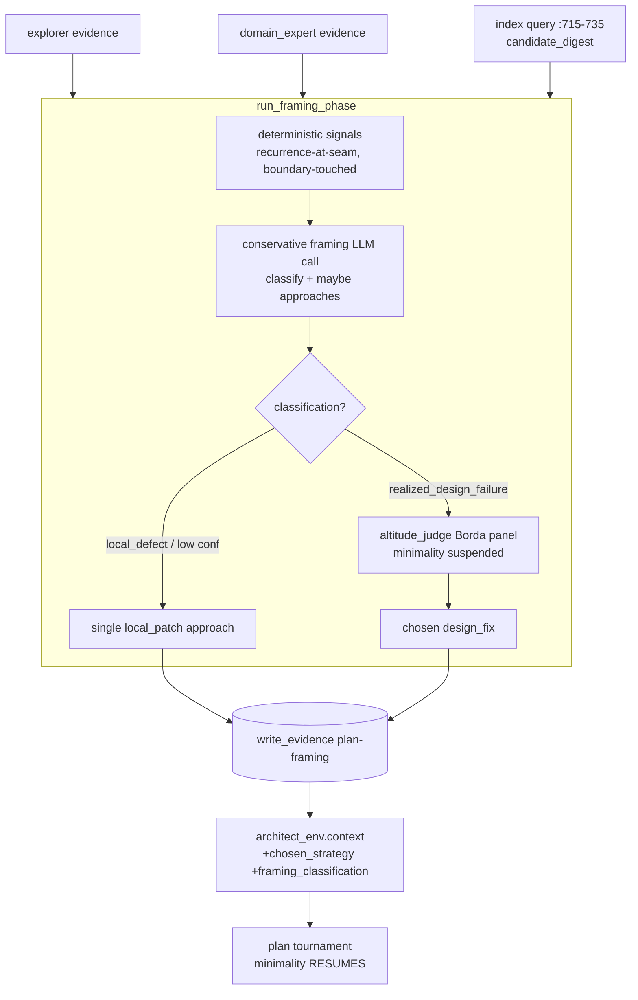
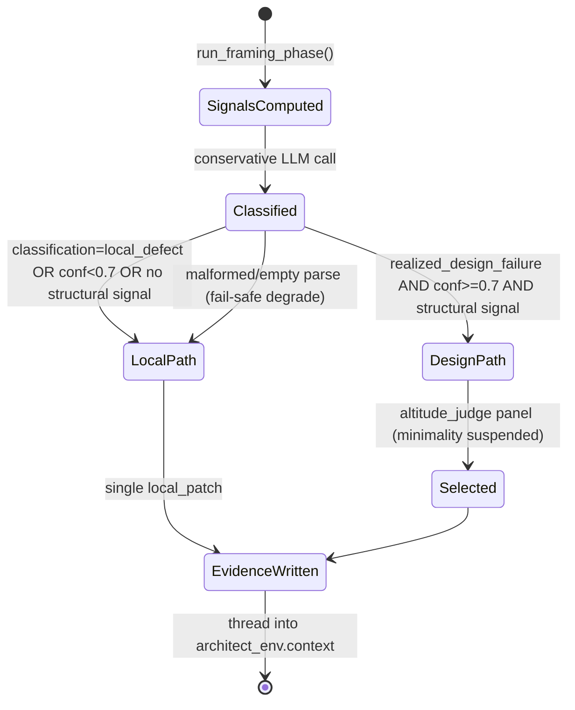

# Framing/Altitude Phase Design

**Status:** Draft
**Author:** Mohamed Ameen
**Date:** 2026-06-14
**Last Updated:** 2026-06-14
**Reviewers:** AutoDev maintainers
**Package:** `src/orchestrator/` (new `framing_phase.py`), `src/state/`, `src/config/`, `src/agents/prompts/`
**Entry Point:** Library-only — invoked inside `orchestrator.plan_phase.run_plan_phase`; no new CLI command.

> Companion to ADR-0044 ([`../decisions/0044-framing-altitude-phase.md`](../decisions/0044-framing-altitude-phase.md)). The ADR holds the decision (rationale, alternatives, drivers); this document holds the spec.

## 1. Overview

### 1.1 Purpose

Insert a **framing/altitude phase** between exploration and planning so AutoDev *poses* the patch-vs-architecture decision instead of defaulting to a localized patch. The phase challenges the user's hypothesis, classifies the defect (*local-defect* vs *realized-design-failure*), and — on the design-failure path — generates altitude-diverse strategies and selects one with **minimality pressure suspended**. The winner is handed to the existing architect, where minimality resumes.

### 1.2 Scope

**In scope:** the new module `framing_phase.py`; the `SolutionApproach` / `FramingEvidence` Pydantic models; the hybrid classifier (deterministic signals + one conservative LLM call); the `framing` and `altitude_judge` agent roles + prompts; the altitude-selection Borda panel; the `FramingPhaseConfig`; crash-safety/determinism plumbing (evidence + two ledger ops); the lever-suspension mechanics; the cost model; the test matrix incl. the #201/#200 merge gate.

**Out of scope:** changes to the architect's plan format or the downstream plan tournament (other than the architect-coupling prompt note); retiring `architect_b`/`re_architect`; any CLI ergonomics; the implementation itself (this is a design artifact).

### 1.3 Context

The host pipeline is `orchestrator.plan_phase.run_plan_phase` (`plan_phase.py:665`): explorer → domain_expert → index query → architect → tournament → ledger. The framing phase inserts **after the index query** (`plan_phase.py:715-735`) — so it can consume the candidate-file signal — and **before the architect envelope** (`:737`). Its output threads into the architect via two new keys on `architect_env.context` (`:753-758`). It reuses the Borda panel machinery from the tournament engine (`tournament/core.py:1244-1248`, `tournament/voting.py`) and the evidence/ledger plumbing from `state/`.

The relevant expert machinery already exists but is gated off the autonomous path: BRAINSTORM's Phase-3 APPROACHES contract (`architect.md:477-481`) and the `architect_b` (`execute_phase.py:899`) / `re_architect` (`repetition_recovery.py:118`) roles. This design routes that capability onto the autonomous path and adds an altitude-scoped value function.

## 2. Requirements

### 2.1 Functional Requirements

- **FR-1:** Classify each plan's defect as `local_defect` or `realized_design_failure` using a hybrid (deterministic-signals-gate + conservative-LLM-judge) classifier.
- **FR-2:** On `realized_design_failure`, autonomously generate 2–3 altitude-diverse `SolutionApproach`es (≥1 `local_patch`, ≥1 `design_fix`), one per distinct altitude band.
- **FR-3:** Select among approaches via a single-pass 3-judge Borda panel (`altitude_judge`) scoring *eliminate-vs-bound the failure class* — with all five minimality levers suspended for this step only.
- **FR-4:** On `local_defect` (or low confidence), emit exactly one `local_patch` approach and **skip** generation + panel.
- **FR-5:** Thread the chosen approach + classification into the architect via `architect_env.context`; the architect implements THAT strategy at THAT altitude (minimality resumes).
- **FR-6:** Persist `FramingEvidence` and append two ledger ops; on resume, re-read evidence rather than re-invoking the classifier.

### 2.2 Non-Functional Requirements

- **Crash-safety:** `FramingEvidence` is written via `state.evidence.write_evidence` (atomic tempfile + `os.replace`) **before** the architect envelope is built; SIGKILL mid-phase leaves either no evidence or a complete file.
- **Subprocess isolation:** each classifier / approach / judge call is a fresh stateless adapter invocation via the existing `_delegate` (`plan_phase.py:1583`); no shared mutable globals.
- **Asyncio concurrency:** the 3-judge altitude panel fans out with `asyncio.gather` under the tournament engine's existing semaphore; no event-loop blocking.
- **Pydantic v2 strict validation:** `SolutionApproach` and `FramingEvidence` use `ConfigDict(extra="forbid")`; a malformed/empty parse degrades to `local_defect`, never raises into the plan phase.
- **LLM cost efficiency:** common case = **1** extra call (classify+approaches folded on the local path → just classify); design-failure path = 4 (1 framing + 3 concurrent judges). Honor `classifier_model`/`altitude_judge_model` to run cheap.
- **Deterministic reproducibility:** `StubAdapter` yields byte-identical `FramingEvidence`; resume re-reads `plan-framing` evidence with zero extra LLM calls; same inputs → same FSM path.

### 2.3 Constraints

- Python 3.11+, Pydantic v2, asyncio; no new third-party dependencies.
- Single-machine, single-user; no operator in the loop (AUTONOMY clause, `architect.md:1372`).
- `FramingPhaseConfig` uses `extra="forbid"`, so **both** the schema field on `AutodevConfig` **and** a `default_factory` in `defaults.py` are mandatory for on-disk-config back-compat (an existing `config.json` lacking the field must still validate).

## 3. Architecture

### 3.1 High-Level Design



### 3.2 Component Structure

| File | Role |
|---|---|
| `src/orchestrator/framing_phase.py` *(new)* | `run_framing_phase(...) -> AltitudeDecision`; signal computation; classifier orchestration; panel dispatch; evidence + ledger writes. |
| `src/orchestrator/plan_phase.py` | Call site at `:735`; threads result into `architect_env.context` (`:753-758`). |
| `src/state/schemas.py` | `SolutionApproach`, `FramingEvidence(_BaseEvidence)` (`_BaseEvidence` `:441`); added to `Evidence` union (`:675`). |
| `src/config/schema.py` | `FramingPhaseConfig`; `framing` field on `AutodevConfig` (`:928`); `denylist_roles` update (`:885-893`). |
| `src/config/defaults.py` | `framing` default factory with `enabled=True` (in `default_config`, `:93-241`). |
| `src/agents/prompts/framing.md`, `src/agents/prompts/altitude_judge.md` *(new)* | Role prompts. |
| `src/agents/prompts/architect.md` | Append architect-coupling note. |

### 3.3 Data Models

All boundary models use `ConfigDict(extra="forbid")`, matching `_BaseEvidence` (`schemas.py:441-446`).

```python
from typing import Literal
from pydantic import BaseModel, ConfigDict, Field
from state.schemas import _BaseEvidence  # extra="forbid", task_id: str


class SolutionApproach(BaseModel):
    """One altitude-distinct candidate strategy (an internal artifact;
    the orchestrator selects — there is no user-facing presentation,
    unlike BRAINSTORM Phase 3)."""
    model_config = ConfigDict(extra="forbid")

    name: str
    altitude: Literal["local_patch", "component_refactor", "design_fix"]
    summary: str
    # LOAD-BEARING: the altitude_judge rubric scores against this field —
    # "does this eliminate the failure class or merely bound it?"
    eliminates_failure_class: bool
    primary_tradeoff: str
    primary_risk: str
    integration_surface: list[str] = Field(default_factory=list)
    est_blast_radius: str  # qualitative: "single function" .. "cross-module contract"


class FramingEvidence(_BaseEvidence):
    """Persisted as evidence kind 'framing' (file plan-framing-framing.json).
    Re-read on resume instead of re-invoking the classifier."""
    model_config = ConfigDict(extra="forbid")

    kind: Literal["framing"] = "framing"
    classification: Literal["local_defect", "realized_design_failure"]
    confidence: float = Field(ge=0.0, le=1.0)
    hypothesis_challenged: str
    signals_fired: list[str] = Field(default_factory=list)
    approaches: list[SolutionApproach] = Field(default_factory=list)
    chosen_approach_name: str
    altitude_rationale: str
```

`FramingEvidence` is added to the discriminated `Evidence` union (`schemas.py:675-687`) so `TypeAdapter(Evidence)` round-trips it by the `kind` discriminator. `run_framing_phase` returns an `AltitudeDecision` (a thin in-memory dataclass wrapping the chosen `SolutionApproach` + classification) for the call site; the durable record is `FramingEvidence`.

### 3.4 State Machine



### 3.5 Protocol / Interface Contracts

The phase consumes the existing `LLMAdapter` contract via `_delegate` — no new protocol. Approaches and judge rankings reuse the tournament engine's Borda `aggregate(...)` signature (`tournament/voting.py`, called from `core.py:1122`).

### 3.6 Interfaces

```python
async def run_framing_phase(
    orch: "Orchestrator",
    intent: str,
    explorer_findings: str,
    domain_expert_findings: str,
    candidate_digest: str,   # from IndexQuery.get_candidates_for_spec (plan_phase.py:728)
    spec_hash: str,
) -> AltitudeDecision: ...
```

Called from `run_plan_phase` between `plan_phase.py:735` (index query end) and `:737` (architect envelope). The result populates two new keys on the `architect_env.context` dict (`:753-758`): `chosen_strategy` and `framing_classification`.

## 4. Design Decisions

### 4.1 Key Decisions

| Decision | Rationale | Alternatives Considered |
|---|---|---|
| Hybrid classifier (deterministic signals seed one conservative LLM call) | Deterministic signals are cheap, reproducible, and hard to game; the LLM adds judgment on the fuzzy signals. Folding classify+generate into one call keeps the design-path at 4 total calls. | Pure-LLM classifier (less reproducible, no structural floor); pure-deterministic (can't read "concept-conflation"). |
| On by default (`enabled=True`) | Autonomy stance — an expert always asks "is this the right altitude?" (see ADR-0044). | Opt-in (under-reaches by default); see ADR. |
| Fold classify + approach generation into one `framing` LLM call | The design-failure path needs both; one call emits classification *and* the approaches, saving a round-trip. | Two calls (classify, then generate) — +1 call on the design path for no benefit. |
| Suspend minimality scoped to the altitude step only | Minimality is wrong when *choosing* altitude, right when *implementing*. Revert all five levers for the downstream plan tournament. | Globally reweight minimality (un-suppresses bloat at implementation altitude). |
| Strip DIALOGUE + user-presentation from the BRAINSTORM Phase-3 contract | Approaches are internal artifacts; there is no operator (`architect.md:1372`). Reuse the *contract* (name/summary/tradeoff/risk/integration-surface, `:478`) but drop Phase 2 DIALOGUE (`:470`) and the `:480` "present to the user" tail. | Un-gate BRAINSTORM as-is (blocks on a human reply that never comes). |
| Do NOT reuse `multi_branch_tournament.py` RNG seeding for approaches | RNG branches produce within-altitude variance — the exact failure being fixed (`plan_phase.py:1153`, `defaults.py:138-147`). | Reuse multi-branch fan-out (re-introduces the bug). |

### 4.2 Trade-offs

- **Determinism baseline shift** (global, because on-by-default) vs **posing the decision everywhere**. Accepted; golden-plan baselines regenerated, determinism preserved *on resume* by re-reading evidence.
- **+1 call/plan unconditionally** vs **a conservative, reproducible gate**. Accepted; tiny next to the plan tournament's tens of calls.
- **Architect coupling** (a new failure surface) vs **letting the design fix survive to implementation**. Mitigated by the explicit architect-coupling prompt note.

## 5. Implementation Details

### 5.1 Core Algorithm — Hybrid Classifier

**Step 1 — Deterministic signals (computed first, fed to the LLM as disconfirming evidence):**

- **Recurrence-at-seam** *(structural, strongest)*: grep the ledger + `git log` for prior fixes touching the same files/symbols the index returned (`candidate_digest`) → "Nth bug at this boundary."
- **Boundary-repeatedly-touched** *(structural)*: derived from the candidate digest (how many distinct prior tasks touched these paths).
- **Symptom-is-predictable-consequence** *(LLM-scored)*: does the symptom follow deterministically from the current design?
- **Concept-conflation** *(LLM-scored)*: the PR #200 control/data-plane signal — are two concerns fused in one path?
- **Hypothesis-is-a-trim** *(lexical, scrutiny-only)*: the user's hypothesis uses trim/shrink/remove language → **raises scrutiny but can never alone flip the class**.

**Step 2 — One conservative `framing` LLM call** receives the signals as disconfirming evidence and emits the classification (and, on the design path, the approaches).

**Step 3 — Conservatism gate (required for on-by-default):**
- Prior = `local_defect`.
- Flip to `realized_design_failure` **only** when `confidence >= design_smell_threshold` (default **0.7**) **and** ≥1 *structural* (non-lexical) signal fired (`require_structural_signal=True`).
- Malformed/empty parse → **fail-safe degrade** to `local_defect` + single `local_patch` approach (never raises into the plan phase).
- `local_defect` (or sub-threshold) → emit one patch approach, **skip** generation + panel.

### 5.2 Core Algorithm — Autonomous Multi-Approach Generation

New `framing` role, prompt `src/agents/prompts/framing.md`, reuses the BRAINSTORM Phase-3 contract (`architect.md:478`: name / summary / primary-tradeoff / primary-risk / integration-surface) and includes the shared **AUTONOMY clause** verbatim (`architect.md:1368-1382`). It **strips** the DIALOGUE phase (`architect.md:470`) and the user-presentation tail (`:480`) — approaches are internal artifacts. Mandate **one approach per distinct altitude band** (≥1 `local_patch`, ≥1 `design_fix`). Parse via a new `parse_approaches()` mirroring `parse_plan_markdown` (`plan_parser.py:242`); on parse failure, fail-safe degrade (FR-4).

Related machinery this supersedes/complements: `architect_b` (wired into tournaments but unused on the autonomous classify path — `plan_tournament_runner.py:51`, `execute_phase.py:899`) and `re_architect` (execute-only structural-rethink trigger — `repetition_recovery.py:118`).

### 5.3 Core Algorithm — Altitude-Selection Rubric

New `altitude_judge` role (`src/agents/prompts/altitude_judge.md`), a **single-pass 3-judge Borda panel** reusing `BordaAggregator` (`tournament/voting.py`, weight path `core.py:1107-1118`) and the judge-roles resolution seam (`core.py:1244-1248`), registered with `judge_roles=["altitude_judge"]` (**no** `minimality_judge`). Criteria:

1. **Eliminate-vs-bound the failure *class*** (scores against `SolutionApproach.eliminates_failure_class`).
2. **Blast-radius justified *iff* it eliminates a recurring class** (a large blast radius is only acceptable when it kills a class, not a single instance).
3. **Long-term design cost** — "the cost of the next bug at this seam."

#### The 5 minimality levers — suspended, scoped to this step only

| # | Lever | Location | Suspend how |
|---|---|---|---|
| 1 | `MANDATORY LENGTH PENALTY` (1.3×, JUDGE_RANK_3) | `tournament/prompts.py:117-121` (prompt `:104`) | Never invoked — `altitude_judge` uses its own prompt, not `JUDGE_RANK_3_PROMPT`. |
| 2 | Oversize demotion (default ~4000 tok) | `tournament/core.py:1142-1152`; threshold field `config/schema.py:310` | Pass step config `oversized_demotion_token_threshold=0`. |
| 3 | `minimality_judge` weight 0.5 | `config/defaults.py:186-190`; weight path `core.py:1107-1118` | Omit `minimality_judge` from `judge_roles` (panel is `["altitude_judge"]`). |
| 4 | `minimality_judge` prompt | `agents/prompts/minimality_judge.md` | Not loaded (role absent from the cohort). |
| 5 | `anti_bloat_v1` seed injection | `config/schema.py:924-925` (`seed_packs`); `denylist_roles` `:885-893` | **Add `framing` + `altitude_judge` to `denylist_roles`** — the easy-to-miss lever. |

All five **revert to normal** for the downstream plan tournament — minimality resumes at implementation altitude.

### 5.4 Architect Coupling (the subtle risk)

Append a short section to `src/agents/prompts/architect.md`: *"If `chosen_strategy` is present in your CONTEXT, implement THAT strategy at THAT altitude; do not re-litigate patch-vs-redesign."* Without this, the architect's own minimality conditioning silently shrinks a `design_fix` back to a `local_patch`, defeating the phase. The two new context keys (`chosen_strategy`, `framing_classification`) ride on the existing `DelegationEnvelope.context` dict (`delegation_envelope.py:42`), so no schema change to the envelope.

### 5.5 Atomic I/O & Crash-Safety

`FramingEvidence` is persisted via `state.evidence.write_evidence(cwd, "plan-framing", framing_ev)` (`evidence.py:47`) — atomic tempfile + `os.replace` — **before** the architect envelope is built (mirrors the explorer/domain_expert writes at `plan_phase.py:694`/`:713`; file lands at `evidence/plan-framing-framing.json`). On resume, the plan phase re-reads this evidence via `read_evidence(cwd, "plan-framing", "framing")` (`evidence.py:62`) and skips the classifier entirely — deterministic-on-resume, zero extra LLM calls.

Two ledger ops via `orch.plan_manager.ledger_append(op=..., payload=...)` (`plan_manager.py:1497`; same call pattern as `plan_phase.py:401`/`:451`):
- `framing_classified` — `{classification, confidence, signals_fired}`.
- `framing_strategy_chosen` — `{chosen_approach_name, altitude}`.

### 5.6 Error Handling

- Parse failure of the framing output → fail-safe degrade to `local_defect` + single `local_patch` (FR-4); emit `framing_classified` with `signals_fired=["parse_degraded"]`.
- Adapter/transport failure → propagate as the existing `_delegate` does, but the phase's degrade path means a classifier failure never blocks planning (the plan continues at `local_patch` altitude).
- All ledger writes are best-effort (wrapped, `noqa: BLE001`) matching the existing plan-phase convention (`plan_phase.py:870`).

### 5.7 Configuration

```python
class FramingPhaseConfig(BaseModel):
    model_config = ConfigDict(extra="forbid")  # mirrors TournamentPhaseConfig (schema.py:152)

    enabled: bool                                   # default True in the factory
    design_smell_threshold: float = 0.7
    num_approaches: int = Field(default=3, ge=2, le=3)
    require_structural_signal: bool = True
    altitude_judge_panel_size: int = 3
    classifier_model: str | None = None
    altitude_judge_model: str | None = None
```

- Top-level `framing: FramingPhaseConfig` field on `AutodevConfig` (`schema.py:928`), with a `default_factory` in `default_config` (`defaults.py:93-241`) setting `enabled=True`. Because `extra="forbid"`, **both** are required for on-disk back-compat.
- Add `framing`/`altitude_judge` to `KnowledgeConfig.denylist_roles` defaults (`schema.py:885-893`).
- **Kill-switch:** `framing.enabled=false` and/or `AUTODEV_FRAMING_DISABLED=1` env override (following the `AUTODEV_INDEX_DISABLED` precedent at `state/file_index.py:423`).

## 6. Integration Points

### 6.1 Dependencies on Other Components

- `orchestrator.plan_phase` (host; call site at `:735`).
- `orchestrator._delegate` (`:1583`) for adapter dispatch.
- `state.evidence.write_evidence`/`read_evidence` (`:47`/`:62`).
- `state.file_index.IndexQuery` (the `candidate_digest`, `plan_phase.py:728`).
- `tournament.voting.BordaAggregator` + `tournament.core` judge-roles seam (`:1244-1248`) for the altitude panel.

### 6.2 Adapter Contract Dependency

Consumes the existing `LLMAdapter` via `_delegate`; works across Claude Code / Cursor / Inline adapters. `StubAdapter` returns a fixed `framing` payload for deterministic tests.

### 6.3 Ledger Event Emissions

| Op | Payload |
|---|---|
| `framing_classified` | `{classification, confidence, signals_fired}` |
| `framing_strategy_chosen` | `{chosen_approach_name, altitude}` |

### 6.4 Components That Depend on This

- The architect (`plan_phase.py:737` envelope) consumes `chosen_strategy` + `framing_classification`.
- The downstream plan tournament inherits the (now altitude-correct) seed plan.

### 6.5 External Systems

LLM API (1 or 4 extra calls/plan), filesystem (evidence + ledger under `.autodev/`), `git log` (recurrence-at-seam signal).

## 7. Testing Strategy

### 7.1 Unit Tests

- `SolutionApproach` / `FramingEvidence` round-trip via `TypeAdapter(Evidence)`; `extra="forbid"` rejection of unknown fields.
- Per-signal tests: each deterministic signal fires on a crafted input; **lexical-only (`hypothesis-is-a-trim`) cannot flip the class** when `require_structural_signal=True`.
- `parse_approaches()` fail-safe degrade on malformed/empty output.
- Conservatism gate: `confidence < 0.7` → `local_defect`; no structural signal → `local_defect`.

### 7.2 Integration Tests — Merge Gates

**Gate 1 — #201/#200 regression benchmark (decisive).** Replay `/Users/mohamedameen/Personal/git/synaptix/core/bug.md` through `run_framing_phase` and assert:
- (a) `classification == "realized_design_failure"`, `confidence >= 0.7`;
- (b) `approaches` contains **both** a `local_patch` (≈ the #201 trim) **and** a `design_fix` at the control/data-plane-separation altitude (≈ #200);
- (c) the `altitude_judge` panel **selects** the `design_fix`.

**Gate 2 — conservatism corpus (false-positive gate).** A corpus of known-local bugs must each classify `local_defect` and **skip** approach generation; track the **false-positive rate** as the second merge gate.

### 7.3 Property-Based Tests

Optional Hypothesis round-trip on `SolutionApproach`/`FramingEvidence` (serialize → deserialize → equal). Not required for v1 — the corpus gates are the primary signal.

### 7.4 Test Data Requirements

- The `synaptix/core/bug.md` fixture for Gate 1.
- The conservatism corpus (curated known-local bugs) for Gate 2.
- `StubAdapter` `framing`-role canned responses for determinism tests.
- **Lever-suspension test:** assert the `altitude_judge` cohort never loads `minimality_judge.md`, and `anti_bloat` lessons are not injected into `framing`/`altitude_judge` (denylist effective).
- **Determinism/crash tests:** StubAdapter byte-identical `FramingEvidence`; resume re-reads evidence with **zero** extra LLM calls; regenerate golden-plan baselines (plan outputs change because the phase is on by default).

## 8. Security Considerations

Pydantic `extra="forbid"` validates the framing output boundary. The recurrence-at-seam signal shells out to `git log` — run with a fixed, non-interactive argument vector (no user-interpolated shell string). No secrets handled; no new network surface beyond the LLM adapter already in use.

## 9. Performance Considerations

The phase adds one synchronous LLM call before the architect on every plan; the 3-judge panel (design path only) fans out concurrently under the existing tournament semaphore. Latency is dominated by the single framing call on the common path. On huge repos, the recurrence-at-seam `git log` grep should be bounded (path-scoped to the candidate digest) to avoid the pathological scans ADR-0043 guards against.

## 10. Installation & CLI Entry

### 10.1 Package Registration

No new wheel package or entry point — `framing_phase.py` lands under the existing `src/orchestrator/` package.

### 10.2 CLI Commands

None. The phase is internal to `run_plan_phase`. Operators control it via `.autodev/config.json` (`framing.*`) or `AUTODEV_FRAMING_DISABLED=1`.

### 10.3 Migration Strategy

On-disk configs written before this feature validate unchanged thanks to the `default_factory` (`enabled=True`). Golden-plan / determinism baselines must be regenerated in the same change because plan outputs shift globally.

## 11. Observability

### 11.1 Structured Logging

```python
structlog.get_logger().info(
    "framing.classified",
    classification=ev.classification, confidence=ev.confidence,
    signals_fired=ev.signals_fired, chosen=ev.chosen_approach_name,
)
```

### 11.2 Audit Artifacts

- `evidence/plan-framing-framing.json` (the full `FramingEvidence`).
- Ledger ops `framing_classified` / `framing_strategy_chosen` in the append-only JSONL ledger.

### 11.3 Status Command

`autodev status` should surface the latest framing classification + chosen altitude for the active plan (read from the evidence file).

## 12. Cost Implications

| Operation | LLM Calls | Notes |
|---|---|---|
| Deterministic signals | 0 | grep ledger + `git log`; no LLM. |
| Framing classify (+approaches on design path) | 1 | Folded — classification and approaches in one call. |
| `local_defect` path total | **1** | Single extra call per plan (common case). |
| `altitude_judge` panel | 3 | Concurrent; design-failure path only. |
| `realized_design_failure` path total | **4** | 1 framing + 3 judges. |

Small vs. the existing plan tournament's tens of calls (3 branches × 3–5 passes × 5 judges, `defaults.py:147`/`:111`). Honor `classifier_model`/`altitude_judge_model` to run the framing phase on a cheaper model.

## 13. Future Enhancements

- Retire `architect_b` / `re_architect` if the framing phase fully subsumes their structural-rethink role.
- Promote successful design-failure framings into the knowledge tier (currently denylisted to keep them out of the anti-bloat cohort).
- A `component_refactor` mid-altitude judge specialization, if the binary patch/design framing proves too coarse.

## 14. Open Questions

- [ ] UNCONFIRMED: is `synaptix/core/bug.md` the right canonical fixture, or should the benchmark synthesize the #201/#200 inputs from the PR diffs directly?
- [ ] Final `design_smell_threshold` (0.7 default) and panel size (3) pending the first N=20-run review (ADR-0044 Monitoring).
- [ ] Whether the recurrence-at-seam signal should weight `git log` author (human vs AutoDev) to avoid counting AutoDev's own prior patches as "recurrence."

## 15. Related ADRs

- [0044 — Framing/Altitude Phase](../decisions/0044-framing-altitude-phase.md) (this design's decision record).
- [0043 — Huge-Repo Mode](../decisions/0043-huge-repo-mode.md) (huge-repo guardrails the `git log` signal must respect).
- ADR-003 (Borda Count Tournament Algorithm) — reused by the altitude panel.
- ADR-008 (Deterministic FSM Orchestration) — the on-resume re-read preserves this invariant.

## 16. References

- [orchestrator_design.md](orchestrator_design.md) — host pipeline.
- [tournaments.md](tournaments.md) — Borda panel + judge-roles mechanics.
- PR #201 (AutoDev trim patch) / PR #200 (human control/data-plane fix) — the motivating field evidence.
- `src/agents/prompts/architect.md:457-481` — BRAINSTORM contract reused.

## 17. Revision History

| Date | Author | Changes |
|------|--------|---------|
| 2026-06-14 | Mohamed Ameen | Initial draft (companion to ADR-0044). |
