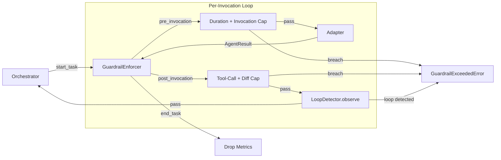
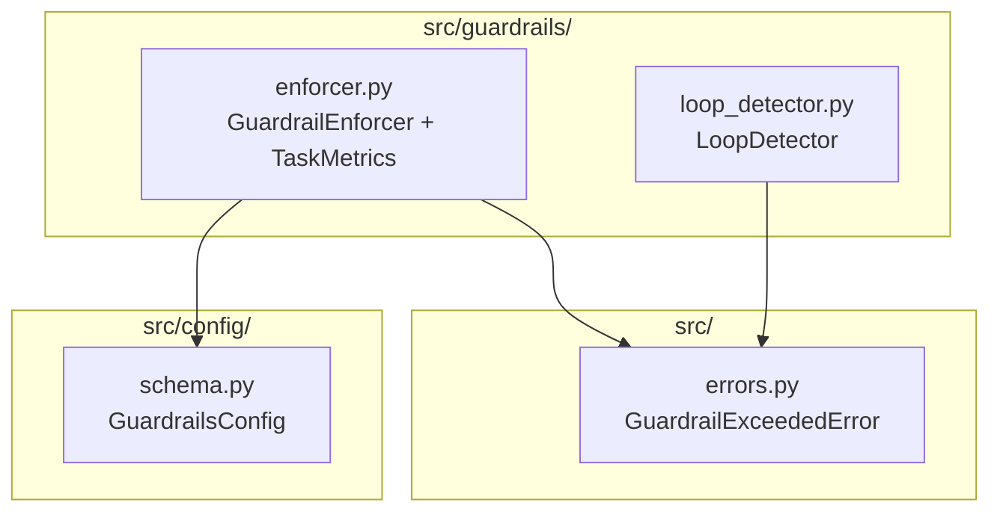
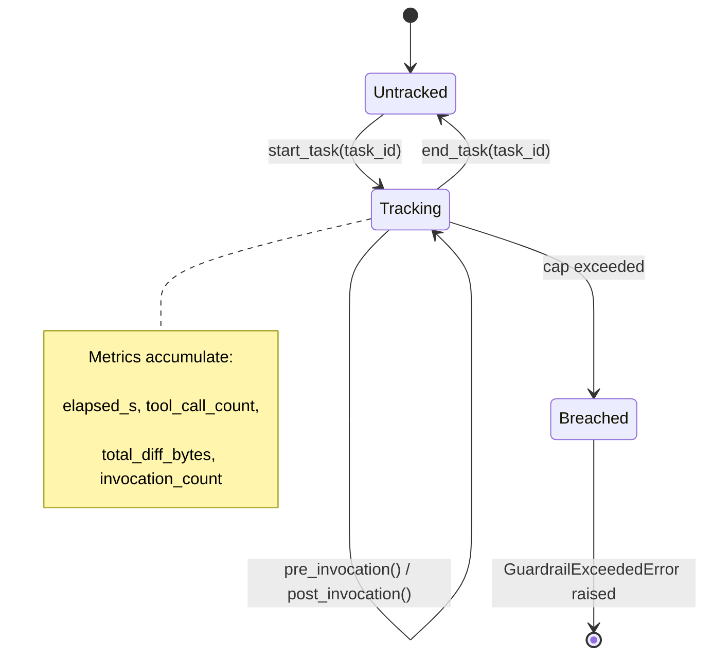

# Per-Task Guardrails Design

**Status:** Implemented
**Author:** Mohamed Ameen
**Date:** 2026-04-17
**Last Updated:** 2026-04-17
**Reviewers:** --
**Package:** `src/guardrails/`
**Entry Point:** N/A (library-only, consumed by the orchestrator)

## 1. Overview

### 1.1 Purpose

The guardrails subsystem prevents runaway cost and infinite loops from agent invocations. Every task delegated to an agent adapter passes through a `GuardrailEnforcer` that tracks wall-clock time, tool-call counts, invocation counts, and cumulative diff size. A companion `LoopDetector` catches repetitive agent output by hashing recent results within a sliding window. Together they ensure that no single task can consume unbounded resources -- even when the underlying LLM enters a degenerate loop.

### 1.2 Scope

**In scope:**

- Per-task duration, tool-call, invocation, and diff-size enforcement via `GuardrailEnforcer`.
- Repetition detection via `LoopDetector` (per `(task_id, role)` pair).
- Integration with `GuardrailsConfig` for user-configurable caps.
- Clean error propagation via `GuardrailExceededError`.

**Out of scope:**

- Global (cross-task) cost tracking and USD budget enforcement at the billing layer.
- Rate-limiting at the adapter or API level.
- QA gate enforcement (handled by the QA subsystem).
- Plan-phase enforcement (plan-phase invocations use a synthetic `"plan"` task id and skip enforcement by design).

### 1.3 Context

In the AutoDev pipeline (adapters -> orchestrator -> agents -> tournament -> QA), the guardrails sit between the orchestrator and the adapter layer. The `execute_phase` loop in the orchestrator wraps every agent `delegate` call with `pre_invocation` / `post_invocation` hooks. When a cap is breached, the enforcer raises `GuardrailExceededError`, the orchestrator marks the task `blocked` with a `guardrail_exceeded` reason, and the exception propagates up for clean user-facing error rendering.



## 2. Requirements

### 2.1 Functional Requirements

- **FR-1:** Track per-task wall-clock elapsed time starting from `start_task()` and enforce a configurable duration cap (`max_duration_s_per_task`, default 900s).
- **FR-2:** Track cumulative tool-call count across all invocations for a task and enforce a configurable tool-call cap (`max_tool_calls_per_task`, default 60).
- **FR-3:** Track cumulative diff size in UTF-8 bytes and enforce a configurable diff-size cap (`max_diff_bytes`, default 5 MB / 5,242,880 bytes).
- **FR-4:** Track invocation count (adapter round-trips) and enforce the tool-call cap as a proxy ceiling for invocations.
- **FR-5:** Detect repeated agent output within a sliding window per `(task_id, role)` pair and raise when the repetition threshold is met.
- **FR-6:** Provide a JSON-friendly metrics snapshot for introspection and logging.
- **FR-7:** Allow plan-phase invocations to bypass enforcement by not requiring `start_task()`.

### 2.2 Non-Functional Requirements

- **Crash-safety:** Guardrail state is ephemeral (in-memory dict). No disk I/O required. If the process crashes, state is simply lost -- acceptable because guardrails are a runtime safety net, not persistent state.
- **Subprocess isolation:** The enforcer runs in the orchestrator process, not in agent subprocesses. Agent subprocesses remain stateless.
- **Asyncio concurrency:** The enforcer is driven from a single asyncio event loop. Internal state is a plain `dict` with no locking. This is safe because the orchestrator serializes invocations per-task.
- **Pydantic v2 strict validation:** `GuardrailsConfig` uses `ConfigDict(extra="forbid")` to reject unknown fields at config load time.
- **LLM cost efficiency:** The guardrails are the cost-control mechanism itself. The duration and tool-call caps directly bound the number of LLM calls per task.
- **Deterministic reproducibility:** Enforcement decisions are deterministic given the same sequence of invocations and timing.
- **Maintainability:** All logging uses `structlog` via the project's `autologging` module.

### 2.3 Constraints

- Must run on Python 3.11+ with no compiled extensions.
- Must work within a single-machine, single-user context.
- Must not introduce dependencies beyond `pyproject.toml` (only stdlib `time`, `hashlib`, `collections`).

## 3. Architecture

### 3.1 High-Level Design

The guardrails subsystem consists of two independent classes that the orchestrator composes:



### 3.2 Component Structure

| File | Class | Responsibility |
|------|-------|---------------|
| `src/guardrails/enforcer.py` | `GuardrailEnforcer` | Tracks per-task metrics and raises on cap breach |
| `src/guardrails/enforcer.py` | `TaskMetrics` | Dataclass holding running counters for a single task |
| `src/guardrails/loop_detector.py` | `LoopDetector` | Sliding-window hash-based repetition detection |

### 3.3 Data Models

```python
@dataclass
class TaskMetrics:
    """Running per-task counters."""
    task_id: str
    start_time: float          # time.monotonic()
    tool_call_count: int = 0
    total_diff_bytes: int = 0
    invocation_count: int = 0

    @property
    def elapsed_s(self) -> float:
        return time.monotonic() - self.start_time
```

```python
class GuardrailsConfig(BaseModel):
    """Pydantic v2 model from src/config/schema.py."""
    model_config = ConfigDict(extra="forbid")

    max_tool_calls_per_task: int = 60
    max_duration_s_per_task: int = 900
    max_diff_bytes: int = 5_242_880       # 5 MB
    cost_budget_usd_per_plan: float | None = None
```

### 3.4 State Machine

The enforcer follows a strict lifecycle per task:



### 3.5 Protocol / Interface Contracts

The guardrails subsystem does not define protocols. It consumes `AgentInvocation` and `AgentResult` from `adapters.types` and `GuardrailsConfig` from `config.schema`.

### 3.6 Interfaces

**GuardrailEnforcer public API:**

| Method | Signature | Description |
|--------|-----------|-------------|
| `__init__` | `(cfg: GuardrailsConfig)` | Initialize with config caps |
| `start_task` | `(task_id: str) -> None` | Begin tracking. Idempotent -- resets timers on re-entry |
| `end_task` | `(task_id: str) -> None` | Drop tracking. Safe even if never started |
| `pre_invocation` | `(task_id: str, inv: AgentInvocation) -> None` | Check duration + invocation caps before adapter call. Raises `GuardrailExceededError` |
| `post_invocation` | `(task_id: str, result: AgentResult) -> None` | Update metrics, check tool-call + diff caps. Raises `GuardrailExceededError` |
| `metrics_snapshot` | `(task_id: str) -> dict[str, Any]` | JSON-friendly snapshot of current metrics |
| `is_tracking` | `(task_id: str) -> bool` | Whether the task is currently being tracked |

**LoopDetector public API:**

| Method | Signature | Description |
|--------|-----------|-------------|
| `__init__` | `(window: int = 5, threshold: int = 3)` | Configure sliding window size and repetition threshold |
| `observe` | `(task_id: str, role: str, text: str) -> None` | Record output hash, raise `GuardrailExceededError` if loop detected |
| `reset` | `(task_id: str) -> None` | Clear all history for a task (all roles) |
| `is_tracking` | `(task_id: str) -> bool` | Whether any history exists for this task |

## 4. Design Decisions

### 4.1 Key Decisions

| Decision | Rationale | Alternatives Considered |
|----------|-----------|------------------------|
| In-memory `dict` for metrics (no persistence) | Guardrails are a runtime safety net. Persisting metrics would add I/O overhead for no benefit -- if the process dies, the task is already failed. | SQLite, file-backed counters |
| Reuse `max_tool_calls_per_task` as invocation cap | Avoids adding a separate config field for a closely related concept. The tool-call cap is always >= invocation count, so this is a safe proxy ceiling. | Separate `max_invocations_per_task` config field |
| SHA-256 truncated to 16 hex chars for loop hashing | 64-bit collision resistance is sufficient for a window of 5 items. Full SHA-256 would waste memory for no practical gain. | MD5, full SHA-256, CRC32 |
| Per-`(task_id, role)` loop detection | Different agent roles working on the same task produce legitimately different outputs. Mixing them would cause false positives. | Per-task only (role-agnostic) |
| Plan-phase bypass via silent ignore on missing `start_task` | Plan-phase invocations use a synthetic `"plan"` task id. Requiring `start_task` would force every caller to bookend with lifecycle calls even when enforcement is unwanted. | Explicit `skip_enforcement` flag on each call |

### 4.2 Trade-offs

- **Simplicity vs. granularity:** The enforcer uses a single `max_tool_calls_per_task` for both tool-call count and invocation count. This sacrifices independent configurability for simplicity.
- **Pre-check vs. post-check:** Duration and invocation caps are checked in `pre_invocation` (before the adapter call), while tool-call and diff-size caps are checked in `post_invocation` (after the call). This means the last invocation that pushes tool-calls over the cap will complete before the error is raised. This is intentional -- aborting mid-call would leave the workspace in an indeterminate state.
- **Window size vs. detection speed:** The loop detector defaults to window=5, threshold=3. A smaller window catches loops faster but risks false positives on legitimately similar outputs.

## 5. Implementation Details

### 5.1 Core Algorithms/Logic

**GuardrailEnforcer enforcement flow:**

1. `start_task(task_id)` creates a `TaskMetrics` with `start_time = time.monotonic()`.
2. `pre_invocation(task_id, inv)`:
   - If `task_id` not tracked, return silently (plan-phase bypass).
   - Check `elapsed_s >= max_duration_s_per_task`. Raise if breached.
   - Check `invocation_count >= max_tool_calls_per_task`. Raise if breached.
3. Adapter call happens (outside enforcer).
4. `post_invocation(task_id, result)`:
   - If `task_id` not tracked, return silently.
   - Increment `invocation_count += 1`.
   - Increment `tool_call_count += len(result.tool_calls)`.
   - If `tool_call_count > max_tool_calls_per_task`, raise.
   - If `result.diff` is not None, accumulate `total_diff_bytes += len(result.diff.encode("utf-8"))`.
   - If `total_diff_bytes > max_diff_bytes`, raise.
5. `end_task(task_id)` pops the metrics entry.

**LoopDetector algorithm:**

1. Hash the agent output text: `sha256(text.encode()).hexdigest()[:16]`.
2. Look up or create a `deque(maxlen=window)` for the `(task_id, role)` key.
3. Append the hash to the deque.
4. Once the deque is full (`len >= window`), count occurrences of the most recent hash.
5. If `count >= threshold`, log a warning and raise `GuardrailExceededError`.

### 5.2 Concurrency Model

Both classes are designed for single-threaded, single-event-loop usage. The orchestrator serializes invocations per task, so no concurrent access to the same `TaskMetrics` or `(task_id, role)` deque is possible. No locks, semaphores, or thread-local storage are needed.

### 5.3 Subprocess Invocation Pattern

Not applicable. The guardrails run in the orchestrator process. Agent subprocesses are unaware of guardrail state.

### 5.4 Atomic I/O Pattern

Not applicable. All state is in-memory and ephemeral.

### 5.5 Error Handling

All enforcement breaches raise `GuardrailExceededError` (subclass of `AutodevError`). The error message includes the specific cap that was breached, the configured limit, and the actual value. The orchestrator's `execute_phase` loop catches this exception and:

1. Marks the task as `blocked` with reason `guardrail_exceeded`.
2. Propagates the exception to the top-level orchestrator for user-facing rendering.

The `LoopDetector.__init__` raises `ValueError` for invalid parameters (window < 1, threshold < 1 or > window) to fail fast at construction time.

### 5.6 Dependencies

- **Internal:** `config.schema.GuardrailsConfig`, `adapters.types.AgentInvocation` / `AgentResult`, `errors.GuardrailExceededError`, `autologging.get_logger`
- **stdlib:** `time`, `hashlib`, `collections.deque`, `dataclasses`
- **External:** None

### 5.7 Configuration

All caps are configurable via `GuardrailsConfig` in `.autodev/config.json`:

```json
{
  "guardrails": {
    "max_tool_calls_per_task": 60,
    "max_duration_s_per_task": 900,
    "max_diff_bytes": 5242880,
    "cost_budget_usd_per_plan": null
  }
}
```

The `LoopDetector` parameters (window, threshold) are currently hardcoded at construction time by the orchestrator. They are not yet exposed in `GuardrailsConfig`.

## 6. Integration Points

### 6.1 Dependencies on Other Components

- **`config.schema`**: `GuardrailsConfig` supplies all configurable caps.
- **`adapters.types`**: `AgentInvocation` (consumed by `pre_invocation`) and `AgentResult` (consumed by `post_invocation`, specifically `result.tool_calls` and `result.diff`).
- **`errors`**: `GuardrailExceededError` is the sole exception type raised.

### 6.2 Adapter Contract Dependency

The enforcer does not call adapters directly. It inspects `AgentInvocation` and `AgentResult` objects that the orchestrator passes through. Any adapter that produces conforming `AgentResult` objects (with `tool_calls: list[ToolCall]` and `diff: str | None`) is compatible.

### 6.3 Ledger Event Emissions

The guardrails subsystem does not write ledger events directly. When `GuardrailExceededError` is raised, the orchestrator writes a task-state transition event (`blocked` with `guardrail_exceeded` reason) to the ledger.

### 6.4 Components That Depend on This

- **Orchestrator (`execute_phase`)**: The primary consumer. Wraps every adapter call with `start_task` / `pre_invocation` / `post_invocation` / `end_task`.
- **Status rendering**: `metrics_snapshot()` may be consumed by `autodev status` or logging middleware.

### 6.5 External Systems

None. Guardrails are purely internal runtime controls.

## 7. Testing Strategy

### 7.1 Unit Tests

- **TaskMetrics elapsed_s**: Verify monotonic clock calculation.
- **GuardrailEnforcer.pre_invocation**: Duration cap and invocation cap breach raise `GuardrailExceededError` with correct message.
- **GuardrailEnforcer.post_invocation**: Tool-call cap and diff-size cap breach raise correctly.
- **GuardrailEnforcer untracked task**: Verify silent return when `start_task` was not called.
- **GuardrailEnforcer idempotent start**: Verify that calling `start_task` twice resets metrics.
- **GuardrailEnforcer end_task safety**: Verify no error when ending an untracked task.
- **LoopDetector.observe**: Verify loop detection fires at exactly the threshold.
- **LoopDetector below threshold**: Verify no false positive when count < threshold.
- **LoopDetector per-role isolation**: Verify that outputs from different roles do not interfere.
- **LoopDetector.reset**: Verify that reset clears all roles for the given task.
- **LoopDetector invalid params**: Verify `ValueError` on invalid window/threshold.

### 7.2 Integration Tests

- Simulate a full orchestrator loop with a mock adapter that returns progressively more tool calls until the cap is breached. Verify the task is marked `blocked`.
- Simulate a loop scenario where a mock adapter returns identical output N times. Verify the `LoopDetector` interrupts the loop.

### 7.3 Property-Based Tests

- **Hypothesis for TaskMetrics**: Generate random sequences of `post_invocation` calls with varying tool-call counts. Assert that `tool_call_count` is always the sum of all `len(result.tool_calls)`.
- **Hypothesis for LoopDetector**: Generate random window/threshold combinations and output sequences. Assert that the detector never fires when fewer than `threshold` identical hashes exist in the last `window` entries.

### 7.4 Test Data Requirements

- Mock `AgentInvocation` and `AgentResult` objects (via Pydantic factories or manual construction).
- Time mocking (`time.monotonic`) for deterministic duration tests.

## 8. Security Considerations

- **Input validation**: `GuardrailsConfig` uses Pydantic `extra="forbid"` to reject unknown fields. Integer caps prevent injection of nonsensical values at the schema level.
- **Denial of service**: The guardrails are themselves a DoS mitigation mechanism. They bound the maximum work any single task can perform.
- **No secrets**: The guardrails subsystem handles no secrets, API keys, or sensitive data.

## 9. Performance Considerations

- **Overhead per invocation**: Two dict lookups, a `time.monotonic()` call, integer comparisons, and optionally a `len(str.encode())` for diff measurement. Negligible compared to LLM round-trip latency.
- **LoopDetector memory**: One `deque(maxlen=5)` per `(task_id, role)` pair. With 14 roles and typical task counts, this is a few hundred entries at most.
- **No blocking I/O**: All operations are pure computation on in-memory data structures.

## 10. Installation & CLI Entry

### 10.1 Package Registration

The guardrails module is part of the `src/guardrails/` package, included in the main `autodev` wheel. No separate entry point registration needed.

### 10.2 CLI Commands

None. The guardrails are a library component consumed by the orchestrator. Users configure caps via `.autodev/config.json`.

## 11. Observability

### 11.1 Structured Logging

```python
# LoopDetector - emitted when a loop is detected (WARNING level)
log.warning("loop_detector.loop_detected",
    task_id=task_id,
    role=role,
    hash=digest,
    count=count,
    window=self._window,
)
```

The enforcer itself does not emit log events on breach -- it raises `GuardrailExceededError` which the orchestrator logs.

### 11.2 Audit Artifacts

The `metrics_snapshot()` method returns a JSON-serializable dict that the orchestrator may persist to the ledger or `.autodev/` audit trail:

```json
{
  "elapsed_s": 42.7,
  "tool_call_count": 15,
  "total_diff_bytes": 8192,
  "invocation_count": 3
}
```

### 11.3 Status Command

`autodev status` may display per-task guardrail metrics (elapsed time, tool calls used / cap, diff bytes used / cap) for tasks currently in progress.

## 12. Cost Implications

The guardrails subsystem does not make LLM calls. It exists to *bound* LLM calls made by other components.

| Parameter | Default | Effect |
|-----------|---------|--------|
| `max_tool_calls_per_task` | 60 | Upper bound on tool calls (and therefore LLM sub-invocations) per task |
| `max_duration_s_per_task` | 900s (15 min) | Wall-clock timeout per task |
| `max_diff_bytes` | 5 MB | Prevents runaway file generation |
| `cost_budget_usd_per_plan` | None (unbounded) | Reserved for future per-plan USD budget enforcement |

## 13. Future Enhancements

- **Expose LoopDetector parameters in GuardrailsConfig**: Allow users to tune `window` and `threshold` via config.
- **USD cost budget enforcement**: Implement `cost_budget_usd_per_plan` by integrating with adapter-reported token usage and model pricing tables.
- **Graduated response**: Instead of hard-stop on cap breach, introduce a warning threshold (e.g., 80% of cap) that emits a log event and optionally injects a system prompt nudge to wrap up.
- **Per-role caps**: Allow different guardrail caps for different agent roles (e.g., the `developer` role may need more tool calls than the `docs` role).
- **Cross-task budget**: Track aggregate cost across all tasks in a plan for global budget enforcement.

## 14. Open Questions

- [ ] Should `cost_budget_usd_per_plan` be enforced in the guardrails layer or in a separate billing/metering component?
- [ ] Should the LoopDetector use fuzzy/semantic similarity instead of exact hash matching to catch near-duplicate loops?
- [ ] Should the invocation cap be a separate config field rather than reusing `max_tool_calls_per_task`?

## 15. Related ADRs

- ADR-009: Pydantic v2 strict validation (governs `GuardrailsConfig` schema design)

## 16. References

- `src/guardrails/enforcer.py` -- GuardrailEnforcer and TaskMetrics implementation
- `src/guardrails/loop_detector.py` -- LoopDetector implementation
- `src/config/schema.py` -- GuardrailsConfig model
- `src/errors.py` -- GuardrailExceededError definition
- `src/adapters/types.py` -- AgentInvocation and AgentResult consumed by the enforcer

## 17. Revision History

| Date | Author | Changes |
|------|--------|---------|
| 2026-04-17 | Mohamed Ameen | Initial draft |
