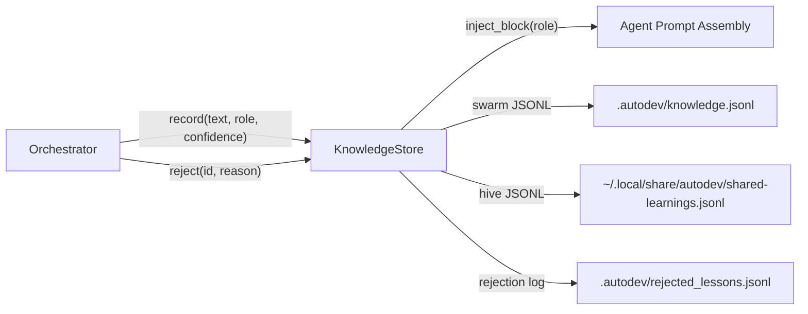
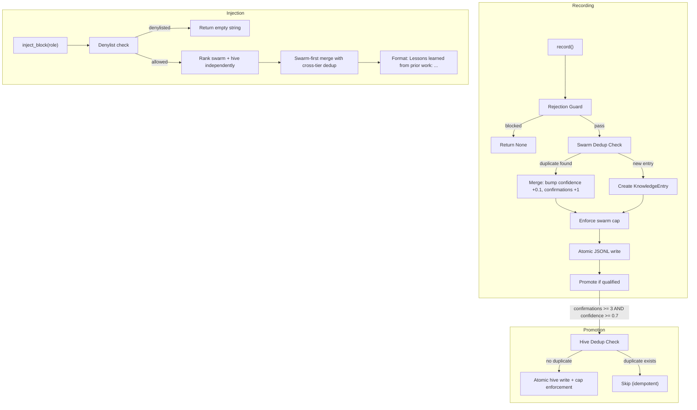
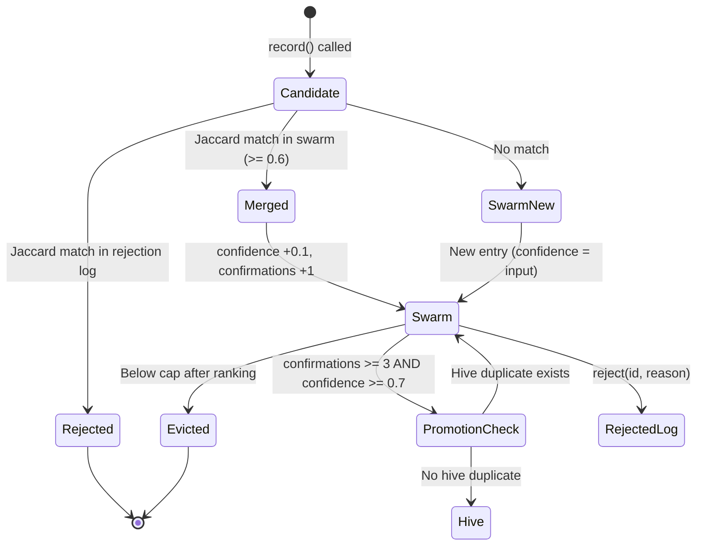
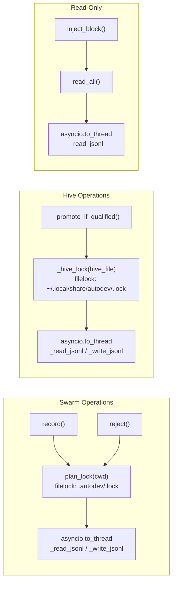

# Two-Tier Knowledge Store Design

**Status:** Implemented
**Author:** Mohamed Ameen
**Date:** 2026-04-17
**Last Updated:** 2026-04-17
**Reviewers:** --
**Package:** `src/state/knowledge.py`
**Entry Point:** N/A (library-only; surfaced via `autodev status` and injected into agent prompts)

## 1. Overview

### 1.1 Purpose

The Two-Tier Knowledge Store captures, ranks, deduplicates, and injects lessons learned across AutoDev orchestration runs. It prevents the system from repeating mistakes by feeding high-value observations back into agent prompts, while discarding low-quality or contradicted lessons through explicit rejection and automatic eviction.

### 1.2 Scope

**In scope:**

- Per-project (swarm) and global (hive) JSONL storage
- Recording new lessons with deduplication and rejection guards
- Ranking formula combining confidence, recency, and usage history
- Promotion of high-confidence lessons from swarm to hive
- Injection of ranked lessons into agent prompts with role-based denylist
- Capacity management via lowest-ranked eviction
- Concurrent access via file locks

**Out of scope:**

- The orchestrator's decision of *when* to call `record()` (that logic lives in `src/orchestrator/`)
- Agent prompt templates (the knowledge store only provides the injection block text)
- Semantic or embedding-based similarity (the system uses character-bigram Jaccard)

### 1.3 Context

The knowledge store sits between the orchestrator and the agent prompt assembly layer. After each agent run, the orchestrator may call `record()` to persist observations. Before each agent invocation, the orchestrator calls `inject_block()` to retrieve a ranked set of lessons for that role. The store is consumed by every role except those on the denylist (stateless or fact-finding roles that must not be biased by prior lessons).



## 2. Requirements

### 2.1 Functional Requirements

- **FR-1:** Record new lessons into the swarm tier with automatic deduplication (Jaccard bigram similarity >= 0.6 merges instead of creating a new entry)
- **FR-2:** Reject lessons by ID, moving them to a rejection log that blocks future re-learning of similar content
- **FR-3:** Read all entries from one or both tiers with Pydantic validation
- **FR-4:** Produce a compact injection block of ranked lessons for a given agent role, returning empty string for denylisted roles
- **FR-5:** Promote swarm entries to the hive tier when they meet confirmation and confidence thresholds
- **FR-6:** Enforce capacity caps (swarm: 100, hive: 200) by evicting lowest-ranked entries
- **FR-7:** Support both Phase-9 (positional) and Phase-4 (dict) calling conventions for `record()`

### 2.2 Non-Functional Requirements

- **Crash-safety:** All JSONL writes use atomic `tmp -> os.replace` pattern. A crash mid-write leaves either the old file or the new file, never a partial write.
- **Asyncio concurrency:** All blocking file I/O runs via `asyncio.to_thread`. The event loop is never blocked.
- **Cross-process safety:** Swarm writes serialize through `plan_lock` (per-project `filelock`). Hive writes use a dedicated `filelock` under the hive parent directory.
- **Pydantic v2 validation:** All entries are validated through `KnowledgeEntry` and `RejectedLesson` models on read; corrupt lines are logged and skipped.
- **Idempotency:** Promotion checks for near-duplicates in the hive before inserting, preventing double-promotion.
- **Line size cap:** Individual JSONL lines are capped at 64 KB. Lessons exceeding half that budget are truncated with a warning and `truncated: true` in metadata.

### 2.3 Constraints

- Must run on Python 3.11+ with no compiled extensions
- Must work within a single-machine, single-user context (no distributed consensus)
- Hive path is configurable but defaults to `~/.local/share/autodev/shared-learnings.jsonl`
- No external database dependencies; all persistence is JSONL on the local filesystem

## 3. Architecture

### 3.1 High-Level Design

The knowledge system is organized into two tiers: a project-local **swarm** and a cross-project **hive**. Lessons enter through the swarm. When a swarm entry accumulates enough confirmations and confidence, it is promoted (copied) to the hive. At injection time, both tiers are ranked independently, then merged with swarm-first priority and cross-tier dedup.



### 3.2 Component Structure

The entire knowledge system is implemented in a single module:

| File | Contents |
|------|----------|
| `src/state/knowledge.py` | `KnowledgeStore` class, `KnowledgeEntry`/`RejectedLesson` models, Jaccard helper, JSONL I/O, ranking, promotion |
| `src/config/schema.py` | `KnowledgeConfig` (behavioral tuning) and `HiveConfig` (path + master switch) |
| `src/state/lockfile.py` | `plan_lock` async context manager (reused for swarm serialization) |
| `src/state/paths.py` | `knowledge_path()`, `rejected_lessons_path()` path builders |

### 3.3 Data Models

```python
class KnowledgeEntry(BaseModel):
    """A single lesson persisted in either the swarm or hive tier."""
    id: str
    timestamp: str          # ISO-8601 UTC
    role_source: str        # Agent role that produced this lesson
    tier: Literal["swarm", "hive"]
    text: str               # The lesson body
    confidence: float = 0.5 # Range [0.0, 1.0]
    applied_count: int = 0  # Times this lesson was injected into a prompt
    succeeded_after_count: int = 0
    confirmations: int = 0  # Merged duplicate count (dedup hits)
    metadata: dict[str, Any] = Field(default_factory=dict)


class RejectedLesson(BaseModel):
    """An entry moved out of the knowledge store -- blocks re-learning."""
    id: str
    text: str
    reason: str
    rejected_at: str        # ISO-8601 UTC
```

### 3.4 Data Flow: Entry Lifecycle



### 3.5 Protocol / Interface Contracts

The knowledge store does not define a formal `Protocol`. It is instantiated directly by the orchestrator and CLI commands. The public API is:

- `record()` -- async, returns `KnowledgeEntry | None`
- `reject()` -- async, returns `None`
- `read_all()` -- async, returns `list[KnowledgeEntry]`
- `inject_block()` -- async, returns `str`

### 3.6 Interfaces

```python
class KnowledgeStore:
    def __init__(
        self,
        cwd: Path,
        cfg: AutodevConfig | None = None,
        hive_path: Path | None = None,
    ) -> None: ...

    async def record(
        self, *args: Any, **kwargs: Any,
    ) -> KnowledgeEntry | None: ...

    async def reject(self, lesson_id: str, reason: str) -> None: ...

    async def read_all(
        self, tier: Literal["swarm", "hive", "both"] = "both",
    ) -> list[KnowledgeEntry]: ...

    async def inject_block(
        self, role: str, limit: int | None = None,
        *, task_id: str | None = None,
    ) -> str: ...
```

**Constructor precedence for hive path:** explicit `hive_path` argument > `cfg.hive.path` > default `~/.local/share/autodev/shared-learnings.jsonl`.

**Hive enablement:** both `HiveConfig.enabled` and `KnowledgeConfig.hive_enabled` must be true for any hive I/O to occur. This dual-switch design lets operators disable the hive file entirely at the infrastructure level (`HiveConfig.enabled=false`) or per-project (`KnowledgeConfig.hive_enabled=false`).

## 4. Design Decisions

### 4.1 Key Decisions

| Decision | Rationale | Alternatives Considered |
|----------|-----------|------------------------|
| Two-tier architecture (swarm + hive) | Project-specific lessons stay local; battle-tested lessons promoted to a cross-project global store | Single global store (loses project specificity); database-backed store (adds dependency) |
| Character-bigram Jaccard for dedup | Fast, zero-dependency, works well for natural-language lesson text; O(n) in string length | TF-IDF cosine similarity (heavier); embedding-based similarity (requires model calls); exact hash (misses paraphrases) |
| 0.6 Jaccard threshold | Empirically balances catching paraphrases vs. false-positive merges of genuinely distinct lessons | Lower threshold (more false merges); higher threshold (more duplicates slip through) |
| JSONL format | Human-readable, append-friendly, easy to debug with `jq`; atomic rewrite keeps file consistent | SQLite (adds compiled extension); JSON array (not append-friendly); pickle (not human-readable) |
| Dual-lock strategy | Swarm and hive are independent resources; separate locks reduce contention | Single global lock (higher contention); no lock (data corruption risk) |
| Denylist roles get empty injection | Stateless/fact-finding agents (explorer, judge, critic_t, architect_b, synthesizer) must not be biased by prior lessons | Inject everywhere (biases evaluation); per-role injection limits (complex configuration) |
| Lowest-ranked eviction | Keeps the highest-value lessons; ranking naturally ages out stale entries | FIFO eviction (loses high-value old lessons); LRU (ignores quality signal) |

### 4.2 Trade-offs

- **Jaccard bigrams vs. semantic similarity:** Character-bigram Jaccard is fast and dependency-free but cannot detect semantic equivalence when phrasing differs significantly. This is acceptable because AutoDev lessons tend to be short, task-specific statements where phrasing similarity tracks meaning similarity closely.
- **Atomic rewrite vs. append-only:** The store rewrites the entire JSONL file on every write (to handle merges, evictions, and updates). This is safe via `tmp -> os.replace` but means write cost scales with entry count. At the configured caps (100 swarm, 200 hive) this is negligible.
- **Promotion copies, does not move:** A promoted entry exists in both swarm and hive. This is intentional -- the swarm copy remains relevant for local context, while the hive copy benefits other projects.

## 5. Implementation Details

### 5.1 Core Algorithms

#### Ranking Formula

```
rank(entry) = confidence * recency_factor * (1 + log(applied_count + 1))
```

Where:

- `confidence` is in `[0.0, 1.0]`, starts at the caller-provided value (default 0.5), and increases by 0.1 on each dedup merge (capped at 1.0)
- `recency_factor` decays linearly over 30 days from 1.0 (now) to 0.5 (30+ days old):
  ```
  recency_factor = 1.0 - 0.5 * (age_seconds / (30 * 86400))
  ```
  Floor at 0.5 -- old lessons are never worthless, just down-weighted.
- `applied_count` tracks how many times the lesson was injected into a prompt. The `log` boost rewards usage without letting a single frequently-injected lesson dominate.

#### Jaccard Bigram Deduplication

```python
def _bigrams(s: str) -> set[tuple[str, str]]:
    s = s.lower()
    return {(s[i], s[i + 1]) for i in range(len(s) - 1)}

def jaccard_bigrams(a: str, b: str) -> float:
    A, B = _bigrams(a), _bigrams(b)
    if not A or not B:
        return 0.0
    return len(A & B) / len(A | B)
```

- Input strings are lowercased before bigram extraction
- Strings shorter than 2 characters produce no bigrams, returning 0.0 (incomparable)
- Empty + empty returns 0.0 (treated as incomparable, not a perfect match)
- Threshold of 0.6 (60% overlap): at or above this value, the candidate is considered a duplicate

#### Dedup Merge Behavior

When a new candidate matches an existing swarm entry (Jaccard >= 0.6):

1. Existing entry's `confidence` increases by 0.1 (capped at 1.0)
2. `confirmations` incremented by 1
3. `metadata` updated with the candidate's metadata
4. `timestamp` refreshed to current time (resets recency decay)
5. No new entry is created

#### Promotion Logic

A swarm entry is promoted to the hive when ALL of:

1. Hive is enabled (both `HiveConfig.enabled` and `KnowledgeConfig.hive_enabled`)
2. `entry.confirmations >= promotion_min_confirmations` (default: 3)
3. `entry.confidence >= promotion_min_confidence` (default: 0.7)
4. No near-duplicate already exists in the hive (Jaccard >= dedup_threshold)

The promoted entry gets a new ID (with `salt="hive"`), its `tier` set to `"hive"`, and a fresh timestamp.

#### Rejection Guard

Before recording, the candidate is checked against `rejected_lessons.jsonl`:

```
for each rejected entry:
    if jaccard_bigrams(candidate.text, rejected.text) >= dedup_threshold:
        return None  # blocked
```

This prevents re-learning of lessons that were explicitly rejected by the user or orchestrator.

### 5.2 Concurrency Model



- **Swarm lock:** `plan_lock(cwd)` from `state.lockfile` -- a per-project `filelock` at `.autodev/.lock` with `thread_local=False` and 30-second timeout. All `record()` and `reject()` calls serialize through this lock.
- **Hive lock:** A dedicated `filelock` at `<hive_parent>/.lock` with `thread_local=False` and 30-second timeout. Only `_promote_if_qualified()` uses this lock; it is independent of the swarm lock.
- **Lock ordering:** Promotion acquires the hive lock *after* releasing the swarm lock (the promotion call happens outside the `plan_lock` context for new entries, inside for merged entries). This prevents deadlocks since the two locks are never held simultaneously for new entries.
- **Blocking I/O:** All `_read_jsonl` and `_write_jsonl` calls are wrapped in `asyncio.to_thread()`.

### 5.3 Atomic I/O Pattern

All JSONL writes use the `_atomic_write` helper:

```python
def _atomic_write(path: Path, content: str) -> None:
    path.parent.mkdir(parents=True, exist_ok=True)
    tmp = path.with_suffix(path.suffix + f".tmp-{os.getpid()}-{uuid.uuid4().hex[:6]}")
    tmp.write_text(content, encoding="utf-8")
    os.replace(str(tmp), str(path))
```

The temp file name includes the PID and a random suffix to prevent collisions between concurrent processes. `os.replace` is atomic on POSIX.

Additionally, individual JSONL lines exceeding `_MAX_LINE_BYTES` (64 KB) are skipped during write with a warning log, preventing any single oversized entry from wedging the file.

### 5.4 Error Handling

- **Corrupt JSONL lines:** Skipped with a `knowledge.jsonl.skip_corrupt` warning; the file remains usable.
- **Oversized lines on write:** Skipped with a `knowledge.jsonl.skip_oversized_line` warning.
- **Lock timeout:** `PlanLockTimeoutError` (for swarm) or `TimeoutError` (for hive) raised after 30 seconds.
- **Invalid entries on read:** `read_all()` catches validation exceptions per-entry and logs `knowledge.read.bad_swarm_entry` / `knowledge.read.bad_hive_entry`. Valid entries are still returned.
- **Missing files:** `_read_jsonl` returns `[]` if the file does not exist or cannot be read.
- **Truncation:** Lesson text exceeding ~32 KB is truncated; `metadata.truncated = true` is set.

### 5.5 Dependencies

- **filelock:** Cross-process file locking for swarm (via `plan_lock`) and hive (via `_hive_lock`)
- **pydantic:** `KnowledgeEntry` and `RejectedLesson` model validation
- **structlog:** Structured logging via `get_logger(__name__)`
- **Internal:** `config.schema` (`AutodevConfig`, `KnowledgeConfig`, `HiveConfig`), `state.lockfile` (`plan_lock`), `state.paths` (`knowledge_path`, `rejected_lessons_path`)

### 5.6 Configuration

All behavioral configuration lives on `KnowledgeConfig` (in `config.schema`):

| Field | Type | Default | Description |
|-------|------|---------|-------------|
| `enabled` | `bool` | `True` | Master switch for the knowledge system |
| `swarm_max_entries` | `int` | `100` | Maximum entries in the swarm tier |
| `hive_max_entries` | `int` | `200` | Maximum entries in the hive tier |
| `dedup_threshold` | `float` | `0.6` | Jaccard bigram threshold for dedup (0.0-1.0) |
| `max_inject_count` | `int` | `5` | Maximum lessons injected per agent prompt |
| `hive_enabled` | `bool` | `True` | Enable hive tier reads/writes (also requires `HiveConfig.enabled`) |
| `promotion_min_confirmations` | `int` | `3` | Minimum confirmations for swarm-to-hive promotion |
| `promotion_min_confidence` | `float` | `0.7` | Minimum confidence for swarm-to-hive promotion |
| `denylist_roles` | `list[str]` | `["explorer", "judge", "critic_t", "architect_b", "synthesizer"]` | Roles that receive empty injection blocks |

File-level hive settings live on `HiveConfig`:

| Field | Type | Default | Description |
|-------|------|---------|-------------|
| `enabled` | `bool` | `True` | Master switch for the hive JSONL file |
| `path` | `Path` | `~/.local/share/autodev/shared-learnings.jsonl` | Hive file location |

## 6. Integration Points

### 6.1 Dependencies on Other Components

| Component | Dependency |
|-----------|------------|
| `config.schema` | `AutodevConfig`, `KnowledgeConfig`, `HiveConfig` for configuration |
| `state.lockfile` | `plan_lock` for swarm serialization |
| `state.paths` | `knowledge_path()`, `rejected_lessons_path()` for file locations |

### 6.2 Components That Depend on This

| Component | Usage |
|-----------|-------|
| `src/orchestrator/` | Calls `record()` after agent runs, `inject_block()` before agent invocations, `reject()` on contradicted lessons |
| `src/cli/commands/status.py` | Calls `read_all()` to display swarm/hive entry counts |
| Agent prompt assembly | Consumes the string returned by `inject_block()` |

### 6.3 External Systems

- **Filesystem:** JSONL files under `.autodev/` (project) and `~/.local/share/autodev/` (global)
- No network calls, no LLM API calls, no database connections

## 7. Testing Strategy

### 7.1 Unit Tests

- Round-trip serialization of `KnowledgeEntry` and `RejectedLesson`
- `jaccard_bigrams()` with known inputs: identical strings (1.0), empty strings (0.0), single-char strings (0.0), known partial overlaps
- `_recency_factor()` at boundaries: now (1.0), 15 days (0.75), 30 days (0.5), 60 days (0.5)
- Ranking formula with controlled inputs
- `_truncate()` with strings under and over the 32 KB threshold
- `_normalize_record_args()` with both Phase-9 positional and Phase-4 dict forms

### 7.2 Integration Tests

- `record()` then `read_all()` round-trip via temp directory
- Dedup merge: record similar text twice, verify single entry with bumped confidence/confirmations
- Rejection guard: reject an entry, attempt to re-record similar text, verify blocked
- Promotion: record an entry multiple times to cross the threshold, verify hive file contains the promoted entry
- Capacity eviction: record more than `swarm_max_entries`, verify lowest-ranked entries evicted
- Cross-tier dedup in `inject_block()`: identical lessons in swarm and hive, verify no duplicates in output
- Denylist: verify `inject_block()` returns `""` for each denylisted role

### 7.3 Property-Based Tests

- Hypothesis strategy for `KnowledgeEntry` fields: arbitrary text, confidence in [0,1], non-negative counts. Verify `_rank_with_ts()` always returns a non-negative float.
- Hypothesis strategy for Jaccard: arbitrary string pairs. Verify `jaccard_bigrams(a, b) == jaccard_bigrams(b, a)` (symmetry) and result in [0.0, 1.0].

### 7.4 Test Data Requirements

- Temp directories for swarm/hive/rejection files (use `pytest tmp_path`)
- No mock adapters needed (knowledge store has no LLM dependency)
- Pre-written JSONL fixtures for corrupt-line and oversized-line edge cases

## 8. Security Considerations

- **No secrets in lessons:** The knowledge store records free-text lessons from agent outputs. Operators should ensure agents do not emit secrets; the store itself has no secret-scanning gate.
- **File permissions:** JSONL files inherit the process's umask. On shared machines, the hive file at `~/.local/share/autodev/` is user-private by default (0o644).
- **Path traversal:** The hive path is configurable. Pydantic does not restrict `Path` values, so the config loader should validate that the path is reasonable.

## 9. Performance Considerations

- **Read cost:** `_read_jsonl` parses the entire file on every call. At 100-200 entries with 64 KB line cap, this is under 13 MB worst case -- negligible.
- **Write cost:** Full file rewrite on every `record()` / `reject()`. At configured caps, this is fast (< 10 ms typical).
- **Injection cost:** `inject_block()` reads both tiers and sorts them. With 300 entries total, sorting is sub-millisecond.
- **Lock contention:** In normal single-process operation, lock contention is zero. In concurrent runs (multiple terminals), the 30-second timeout is generous.

## 10. Installation & CLI Entry

### 10.1 Package Registration

The knowledge module is part of the `state` package, included in the wheel via:

```toml
[tool.hatch.build.targets.wheel]
packages = ["src/state", ...]
```

### 10.2 CLI Commands

The knowledge store has no dedicated CLI command. It is surfaced through:

```bash
# View swarm/hive entry counts
autodev status
# Output: "Knowledge: 12 lessons in swarm tier, 5 in hive tier"
```

## 11. Observability

### 11.1 Structured Logging

| Event | Key Fields | Description |
|-------|-----------|-------------|
| `knowledge.record.disabled` | -- | Store is disabled in config |
| `knowledge.record.empty_text` | -- | Empty/whitespace-only lesson text |
| `knowledge.record.truncated` | `role` | Lesson text exceeded 32 KB, was truncated |
| `knowledge.record.rejected_duplicate` | `reason` | Candidate matched an entry in the rejection log |
| `knowledge.record.merged` | `id`, `confirmations` | Candidate merged into existing swarm entry |
| `knowledge.record.new` | `id`, `role`, `confidence` | New entry created in swarm |
| `knowledge.promoted` | `id` | Entry promoted from swarm to hive |
| `knowledge.reject.not_found` | `id` | Rejection target not found in swarm |
| `knowledge.reject.applied` | `id`, `reason` | Entry moved to rejection log |
| `knowledge.inject.skip_denylist` | `role` | Injection skipped for denylisted role |
| `knowledge.jsonl.skip_corrupt` | `path`, `line` (first 80 chars) | Corrupt JSONL line skipped on read |
| `knowledge.jsonl.skip_oversized_line` | `path`, `bytes` | Oversized line skipped on write |
| `knowledge.read.bad_swarm_entry` | `id` | Entry failed Pydantic validation on read |
| `knowledge.read.bad_hive_entry` | `id` | Entry failed Pydantic validation on read |

### 11.2 Audit Artifacts

| File | Location | Description |
|------|----------|-------------|
| `knowledge.jsonl` | `.autodev/knowledge.jsonl` | Swarm tier entries (JSONL, one entry per line) |
| `shared-learnings.jsonl` | `~/.local/share/autodev/shared-learnings.jsonl` | Hive tier entries |
| `rejected_lessons.jsonl` | `.autodev/rejected_lessons.jsonl` | Rejection log blocking re-learning |

All files are inspectable with `jq`:

```bash
# Count swarm entries
jq -s 'length' .autodev/knowledge.jsonl

# View highest-confidence lessons
jq -s 'sort_by(-.confidence) | .[0:5]' .autodev/knowledge.jsonl

# View rejection log
jq '.' .autodev/rejected_lessons.jsonl
```

### 11.3 Status Command

`autodev status` displays:

```
Knowledge: 12 lessons in swarm tier, 5 in hive tier
```

## 12. Cost Implications

The knowledge store makes zero LLM calls. All operations are local file I/O. The only cost impact is indirect: `inject_block()` adds a "Lessons learned" section to agent prompts, increasing input token count by a small, bounded amount (up to `max_inject_count` lessons, default 5).

| Operation | LLM Calls | Notes |
|-----------|-----------|-------|
| record() | 0 | Pure file I/O |
| reject() | 0 | Pure file I/O |
| read_all() | 0 | Pure file I/O |
| inject_block() | 0 | Pure file I/O; output consumed by agent prompts |

## 13. Future Enhancements

- **Semantic dedup:** Replace or augment Jaccard bigrams with embedding-based similarity for better paraphrase detection
- **Decay tuning:** Make recency window (currently 30 days) and floor (currently 0.5) configurable
- **Export/import:** CLI commands for exporting knowledge to share across teams and importing from external sources
- **Usage tracking:** Increment `applied_count` on injection (currently tracked in the model but not updated by `inject_block()`)
- **Conflict resolution:** Detect contradictory lessons (e.g., "always use X" vs. "never use X") and surface them for human review

## 14. Open Questions

- [ ] Should `inject_block()` increment `applied_count` to enable usage-based ranking in practice?
- [ ] Should the hive support multi-user access with advisory locking or is single-user sufficient?
- [ ] Should there be a CLI command (`autodev knowledge list/prune/export`) for direct knowledge management?

## 15. Related ADRs

- ADR-004: Two-tier knowledge with Jaccard dedup (referenced in module docstring)

## 16. References

- `src/state/knowledge.py` -- implementation
- `src/config/schema.py` -- `KnowledgeConfig` and `HiveConfig` models
- `src/state/lockfile.py` -- `plan_lock` async context manager
- `src/state/paths.py` -- filesystem path builders

## 17. Revision History

| Date | Author | Changes |
|------|--------|---------|
| 2026-04-17 | Mohamed Ameen | Initial draft |
