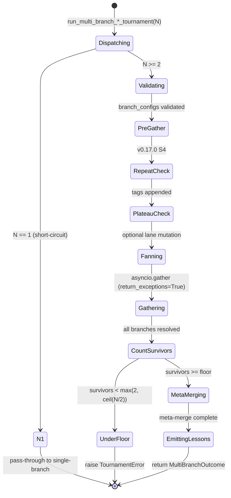

# Multi-Branch Tournament Design

**Status:** Implemented
**Author:** Mohamed Ameen
**Date:** 2026-05-09
**Last Updated:** 2026-05-09
**Reviewers:** --
**Package:** `src/orchestrator/multi_branch_tournament.py`, `src/orchestrator/impl_tournament_runner.py`
**Entry Point:** `orchestrator.multi_branch_tournament.run_multi_branch_plan_tournament` (plan); `orchestrator.impl_tournament_runner.run_multi_branch_impl_tournament` (impl)

## 1. Overview

### 1.1 Purpose

Single-branch tournaments converge to a local optimum. The same model,
seeded identically, tends to revisit the same critique → revision arc
across passes — even with judge randomization, the trajectory is
constrained by the model's prior. The multi-branch tournament fans out
N independent tournament trajectories (each with its own RNG seed and
optionally its own per-role models), then meta-merges the survivors
into a single output. The result is broader exploration of the solution
space at a controlled cost multiplier.

### 1.2 Scope

**In scope:**

- N parallel `Tournament[T]` runs from a single starting incumbent, each
  isolated by RNG seed and per-branch artifact directory.
- Per-branch heterogeneous-model overrides via `BranchConfig`
  (v0.14.0): each branch may specify a distinct `{role: model_name}`
  map, lane tag, risk tag, and family tag.
- Survivor floor enforcement (`max(2, ceil(N/2))`) so a single branch
  failure does not sink the run.
- Plan-side meta-merge: synthesizer-only pairwise reduction over the
  survivors (`PlanContentHandler.render_for_synthesizer`).
- Impl-side meta-merge (v0.21.0 A2): synthesizer-LLM-on-diffs followed
  by re-materialization in a fresh worktree.
- Cross-family plateau detection (v0.18.0 B2 / v0.20.0 A2): pre-fan-out
  consultation of the lessons knowledge layer; lane mutation when a
  family stops producing winners.
- Repeated-hypothesis detection (v0.17.0 S4): advisory tagging of
  branches whose family/initial hypothesis matches a recent discard.

**Out of scope:**

- Single-branch tournament internals (covered in
  [`tournament_engine_design.md`](tournament_engine_design.md)).
- Worktree lifecycle (delegated to `orchestrator.worktree.WorktreeManager`).
- Knowledge-store ranking and decay curves (covered in
  [`knowledge_system_design.md`](knowledge_system_design.md)).

### 1.3 Context

Multi-branch sits between the orchestrator's phase dispatcher and the
generic tournament engine:

```
adapters -> orchestrator -> [MULTI-BRANCH FAN-OUT] -> tournament -> QA gates -> state/ledger
```

The plan-phase dispatcher (`orchestrator/plan_phase.py:189-264`) consults
`cfg.tournaments.plan.num_branches` (and the optional
`cfg.tournaments.plan.branches` list) and routes through
`run_multi_branch_plan_tournament` when N > 1, falling through to
`run_plan_tournament` otherwise. The execute-phase dispatcher
(`orchestrator/execute_phase.py:1914-1950`) does the same for the impl
tournament, gated on `cfg.tournaments.impl.num_branches > 1` or a
non-None `cfg.tournaments.impl.branches`.

## 2. Requirements

### 2.1 Functional Requirements

- **FR-1:** Run N independent tournament trajectories concurrently from
  the same starting incumbent, each seeded distinctly so judges,
  synthesizer X/Y coin flips, and lane-aware lesson injection diverge.
- **FR-2:** Tolerate per-branch failure: if any branch raises during its
  per-branch tournament, surviving branches continue (no `asyncio.gather`
  cancellation cascade).
- **FR-3:** Enforce a survivor floor of `max(2, ceil(N/2))`. Below
  the floor, raise `TournamentError` so the dispatch site can fall back
  to single-branch or salvage from on-disk incumbents.
- **FR-4:** Meta-merge survivors into a single output:
  - Plan: pairwise synthesizer-only reduction
    (`synth(c0, c1) -> m1`, `synth(m1, c2) -> m2`, ...).
  - Impl: single synthesizer LLM call over N candidate diffs, then
    re-materialize the merged diff in a fresh worktree.
- **FR-5:** Support per-branch heterogeneous models via
  `BranchConfig.model_overrides`. Plan and impl runners thread these
  into `AdapterLLMClient(role_model_overrides=...)`.
- **FR-6:** Stamp each branch's artifact directory with its lane label
  (`branch-{i}-{lane}/` for plan, `{tournament_id}-{lane}/` for impl)
  so on-disk forensics record the divergent trajectory at a glance.
- **FR-7:** Pre-fan-out plateau detection (when
  `cfg.tournaments.plan.plateau_detection_enabled` or the cross-family
  variant is True): walk the lessons knowledge store, identify a family
  stuck without winners, mutate one branch's lane to `"distant-scout"`
  to break out of the local minimum.
- **FR-8:** Audit-trail breadcrumbs at each phase boundary:
  `multi_branch_plan_tournament_start`, `multi_branch_meta_merge_complete`,
  `multi_branch_plan_tournament_complete` (plan equivalents on impl).

### 2.2 Non-Functional Requirements

- **Crash-safety:** Each branch's tournament uses the existing
  `TournamentArtifactStore` atomic-write contract. A crash mid-fan-out
  leaves the per-branch dirs in their own consistent state; the
  salvage path (`tournament.state.latest_incumbent_md_across_branches`)
  walks them on the next run.
- **Cancellation isolation:** Branches are gathered with
  `asyncio.gather(..., return_exceptions=True)` so one branch's
  exception is captured into `BranchOutcome.error` rather than
  cancelling siblings.
- **Asyncio concurrency:** Branch-level concurrency is unbounded
  (N coroutines run simultaneously). Each branch's *internal* judge
  cohort is bounded by the existing `max_parallel_subprocesses`
  semaphore, and the v0.10.0 resource probe throttles cross-branch
  total subprocess count via `runtime.resource_probe.resolve_parallelism`.
- **Pydantic v2 strict validation:** `BranchConfig` enforces
  `extra="forbid"` and validates `model_overrides` entries are
  non-empty strings. `TournamentPhaseConfig._validate_branches`
  enforces the mutual-exclusion invariant between `branches` and
  `num_branches > 1`.
- **Deterministic reproducibility:** Per-branch seeds are
  `int(spec_hash, 16) + branch_index`. Meta-merge step seeds are
  derived via SHA-256 over truncated candidate texts
  (`_stable_seed`, `multi_branch_tournament.py:224`).

### 2.3 Constraints

- N is clamped to `[1, 5]` via Pydantic `Field(default=1, ge=1, le=5)`
  on `TournamentPhaseConfig.num_branches` (and validated again for
  `branches` length). Five is the cost ceiling — N=5 means 5× the LLM
  call volume of a single-branch run.
- Plan and impl multi-branch run in the same process; cross-machine
  fan-out is out of scope.
- Per-branch tournaments share the orchestrator's adapter, registry,
  and knowledge store. The per-role `model_overrides` swap happens
  inside `AdapterLLMClient` rather than instantiating a new adapter.

## 3. Architecture

### 3.1 High-Level Design

```mermaid
flowchart TB
    Start([Initial incumbent]) --> Dispatch{num_branches > 1<br/>OR branches list set?}
    Dispatch -->|No| Single[run_*_tournament<br/>single-branch path]
    Dispatch -->|Yes| Pre[Pre-gather:<br/>repeat-detection<br/>plateau-detection]
    Pre --> Fan[asyncio.gather N branches<br/>return_exceptions=True]
    Fan --> B0[Branch 0<br/>seed = base_seed + 0<br/>model_overrides[0]]
    Fan --> B1[Branch 1<br/>seed = base_seed + 1<br/>model_overrides[1]]
    Fan --> BN[Branch N-1<br/>seed = base_seed + N-1<br/>model_overrides[N-1]]
    B0 --> Floor{n_survivors >= floor?}
    B1 --> Floor
    BN --> Floor
    Floor -->|No| Err[raise TournamentError]
    Floor -->|Yes| Meta[Meta-merge survivors]
    Meta --> PlanMM[Plan: pairwise synth reduction]
    Meta --> ImplMM[Impl: diff-synth + re-materialize]
    PlanMM --> Out([Final output])
    ImplMM --> Out
    Err -.salvage.-> Walker[walk on-disk incumbents]
    Walker -.-> Out
```

### 3.2 Component Structure

| File | Purpose |
|------|---------|
| `orchestrator/multi_branch_tournament.py` | Plan-side fan-out + pairwise meta-merge. Defines `BranchOutcome`, `MultiBranchOutcome`, `_run_one_branch`, `_meta_merge_pairwise`, `_run_meta_merge_step`, `run_multi_branch_plan_tournament`. |
| `orchestrator/impl_tournament_runner.py` | Impl-side fan-out + diff-synth meta-merge. Function `run_multi_branch_impl_tournament` at line 556; helpers `_impl_survivor_floor` (line 721), `_impl_meta_merge_via_diff_synthesis` (line 728), `_extract_diff_block` (line 876), `_fallback_strongest_survivor` (line 849). |
| `orchestrator/plan_tournament_runner.py` | Per-branch plan-tournament runner (called from `_run_one_branch`). Threads `branch_config` through to suffix the artifact dir and override per-role models in `AdapterLLMClient`. |
| `orchestrator/plateau_detector.py` | `PlateauDetector` consulted pre-fan-out for plateau-and-mutate-lane logic. Methods: `detect_plateau`, `detect_cross_family_plateau`, regression variants, `force_distant_scout`. |
| `orchestrator/repeat_detector.py` | `RepeatedHypothesisDetector` consulted pre-fan-out (advisory only). Tags branches whose family/initial hypothesis matches a recent (≤14d) discard. |
| `config/schema.py` | `BranchConfig` (line 43); `TournamentPhaseConfig.num_branches` (line 155), `branches` (line 164), `plateau_detection_enabled` (line 226), and the validators (line 231). |

### 3.3 Data Models

```python
class BranchConfig(BaseModel):
    """v0.14.0: per-branch configuration for heterogeneous-model multi-branch
    plan tournaments."""
    model_config = ConfigDict(extra="forbid")

    model_overrides: dict[str, str] = Field(default_factory=dict)
    lane: Literal[
        "distant-scout",
        "local-tweak",
        "architectural",
        "constraint-removal",
        "incumbent-confirmation",
    ] = "local-tweak"
    risk: Literal["low", "medium", "high"] = "medium"
    family: str | None = None

@dataclass
class BranchOutcome:
    branch_index: int
    success: bool
    final_md: str | None
    error: str | None
    metadata: dict[str, object] = field(default_factory=dict)  # v0.17.0 S4 tags

@dataclass
class MultiBranchOutcome:
    branches: list[BranchOutcome]
    final_md: str
    meta_history: list[PassResult]
```

`BranchConfig` validators:

- `_validate_role_keys` (line 89): rejects entries mapping a role to an
  empty string. Empty `model_overrides` dict is fine; an empty value is
  almost certainly a typo.
- `TournamentPhaseConfig._validate_branches` (line 231): rejects empty
  list `[]` (use `None` to disable), enforces `len(branches) <= 5`,
  rejects the simultaneous use of `branches` and `num_branches > 1`
  (mutually exclusive paths to fan-out).

### 3.4 State Machine



### 3.5 Protocol / Interface Contracts

The multi-branch layer does not introduce new protocols. It consumes:

- `Tournament[T]` and the existing `ContentHandler[T]`, `LLMClient`,
  `CoderRunner` protocols from `src/tournament/`.
- `WorktreeManager` (the same one used by single-branch impl
  tournaments) for impl meta-merge re-materialization.
- `KnowledgeStore` for lessons emission and the plateau / repeat
  detectors' historical reads.

### 3.6 Public Interfaces

| Function | Signature | Description |
|----------|-----------|-------------|
| `run_multi_branch_plan_tournament` | `(orch, initial_md, spec, spec_hash, n_branches, branch_configs=None) -> MultiBranchOutcome` | Fan out N plan tournaments and meta-merge survivors. |
| `run_multi_branch_impl_tournament` | `(orch, task, initial_bundle, n_branches, branch_configs=None) -> ImplBundle` | Fan out N impl tournaments and meta-merge via diff synthesis. |
| `multi_branch_parent_dir` | `(cwd, spec_hash) -> Path` | Returns `{cwd}/.autodev/tournaments/multi-{spec_hash[:8]}/` — the parent dir for a multi-branch run, used by the salvage walker. |
| `_survivor_floor` / `_impl_survivor_floor` | `(n_branches: int) -> int` | `max(2, ceil(N/2))`. Identical shape on plan and impl. |

## 4. Design Decisions

### 4.1 Key Decisions

| Decision | Rationale | Alternatives Considered |
|----------|-----------|------------------------|
| Plan meta-merge: pairwise synth reduction (no critic / architect_b) | Both inputs to a meta-merge are already converged per-branch winners. Re-criticising them risks regressing quality and would double the meta-merge cost. The synthesizer-only contract is "pick the best of two existing answers". | Full Tournament[str] with critic/architect_b on the survivor cohort; tournament-of-tournaments. |
| Impl meta-merge: synthesizer LLM on diffs + re-materialize | Git 3-way merge fails on real code (conflict-prone); Borda-only on diffs loses information about *why* one diff is better. Diff-synth keeps the LLM in the loop and hands it concrete code to merge. Re-materialization in a fresh worktree validates the merged diff actually applies + tests pass. | `git merge-file`, `git apply --3way` with conflict markers, Borda-rank survivors and pick the winner verbatim. |
| Survivor floor `max(2, ceil(N/2))` | Below 2 survivors there's nothing to meta-merge (the pairwise reduction needs ≥2 inputs). Majority survival is the secondary floor — at N=3 the floor is 2 (one branch may fail); at N=5 the floor is 3. | Always require all N to survive (too brittle); pass through any single survivor (loses the meta-merge value). |
| Per-branch RNG seed = `int(spec_hash, 16) + branch_index` | Spec-derived so identical inputs reproduce identical fan-out; branch-index offset so the N branches diverge from pass 1. SHA-256-derived rather than `hash()` so PYTHONHASHSEED doesn't break determinism. | Random per-process seed (kills reproducibility); UUID per branch (kills cross-run forensics). |
| `BranchConfig.lane` constrained to a Literal enum | Lane labels are surfaced in artifact directory names, ledger metadata, and the lane-aware lesson injection filter. Constraining the set prevents typos and lets the plateau detector's `force_distant_scout` mutation guarantee a recognized lane. | Free-form string (typo risk); per-project enum override (deferred to a future ADR). |
| `branches` and `num_branches > 1` are mutually exclusive | Two paths to the same fan-out count is confusing. `branches` is the v0.14.0 hetero-model surface; `num_branches > 1` is the v0.12.0 homogeneous surface. Validator enforces exactly one. | Sum the two (silent ambiguity); make `num_branches` the source of truth and error if `branches` length differs. |
| Cross-family plateau detection runs **before** fan-out, not during | The detector consults the lessons knowledge store, which is populated from prior runs. Pre-fan-out is the correct moment to mutate the cohort because lane changes after dispatch would require cancelling and restarting branches. | In-loop plateau check (would cost a re-spawn); post-hoc plateau report (advisory only, doesn't break the local minimum). |

### 4.2 Trade-offs

- **Cost vs. exploration:** N branches multiplies LLM call volume by
  roughly N. Default `num_branches=3` (`config/defaults.py:143`) is the
  user-locked-in "maximum diversity" middle ground; N=5 is the schema
  ceiling.
- **Meta-merge information loss:** The plan meta-merge is a left-fold
  (`synth(c0, c1) -> m1; synth(m1, c2) -> m2; ...`). The first
  candidate becomes a "running incumbent" — its features get more
  chances to survive. Tested as acceptable for plan markdown; alternative
  reductions (tournament bracket, all-at-once N-way synth) deferred.
- **Impl meta-merge fragility:** If the synthesizer fails to emit a
  parseable diff block, or the merged diff fails to apply in a fresh
  worktree, the runner falls back to "longest survivor diff" via
  `_fallback_strongest_survivor`. This is a crude surrogate (length is
  not quality) — chosen for safety over precision because the
  alternative is dropping back to the original `initial_bundle`.
- **Lane mutation is destructive:** When the plateau detector forces a
  lane change to `"distant-scout"`, the prior lane is recorded in a
  `plateau_forced_lane_change` ledger op for forensics, but the branch
  itself runs with the mutated lane. There is no rollback.

## 5. Implementation Details

### 5.1 Core Algorithms

**Plan fan-out (`run_multi_branch_plan_tournament`,
`multi_branch_tournament.py:524`):**

1. **Validation** (lines 566-574): N ≥ 1; if `branch_configs` is set,
   `len(branch_configs) == n_branches`.
2. **N=1 short-circuit** (lines 582-604): single-branch
   pass-through wrapped in a `MultiBranchOutcome` with one
   `BranchOutcome`. Used by unit callers; production gates on N > 1.
3. **Pre-gather repeat-detection** (lines 624-665): `RepeatedHypothesisDetector`
   walks past 14 days of `discard` events. Branches whose family (or
   initial markdown prefix) match are tagged `metadata["hypothesis_repeat"] = True`.
   **Advisory only** — does not skip branches.
4. **Pre-gather plateau-detection** (lines 667-779): when
   `plateau_detection_enabled` or `cross_family_plateau_enabled` is
   True. Walks each branch's `family`, calls `detect_plateau` (or
   `detect_plateau_regression` when `cfg.plateau_detector.strategy == "regression"`).
   When triggered, calls `pd.force_distant_scout(branch_configs, ...)`
   to mutate one branch's lane and emits a `plateau_forced_lane_change`
   ledger op.
5. **Fan-out** (lines 783-797): `asyncio.gather(*coros, return_exceptions=True)`
   over N coroutines, each calling `_run_one_branch -> run_plan_tournament`.
6. **Survivor floor** (lines 831-843): `_survivor_floor(N)` =
   `max(2, ceil(N/2))`. Below floor → `TournamentError`.
7. **Meta-merge** (line 854): `_meta_merge_pairwise` over survivor
   markdowns.
8. **Lessons emission** (lines 884-899): one `discard` per failed
   branch + one `winner_promoted` for the meta-merged final, all
   tagged `family="multi-branch-meta-merge"`.

**Impl fan-out (`run_multi_branch_impl_tournament`,
`impl_tournament_runner.py:556`):**

Mirrors plan flow with three structural differences:

1. **No pre-gather repeat / plateau** — those detectors are
   plan-tournament-scoped in v0.21.0.
2. **Meta-merge is diff-synth** (line 685, calling
   `_impl_meta_merge_via_diff_synthesis`) instead of pairwise
   reduction.
3. **Survivor diffs** are extracted via `b.diff or ""` (line 684)
   from each surviving `ImplBundle`.

**Impl meta-merge (`_impl_meta_merge_via_diff_synthesis`,
`impl_tournament_runner.py:728`):**

1. Build `AdapterLLMClient` with the impl tournament's per-role
   overrides.
2. `ImplContentHandler.render_for_diff_synthesis(task_prompt, diffs)`
   produces the prompt (truncating each diff to 8000 chars).
3. Single synthesizer LLM call with `SYNTHESIZER_SYSTEM`.
4. `_extract_diff_block(synth_text)` extracts the merged diff —
   prefers ` ```diff ... ``` `, falls back to a fenced block
   containing `diff --git`, then a bare `diff --git` prefix.
5. Create a fresh worktree at `.autodev/tournaments/multi-impl-{task.id}-meta/worktrees/`.
6. Pass the merged diff to `_CoderRunner.run` as a "META-MERGE
   DIRECTIVE" — the coder applies the diff into the worktree and runs
   tests, returning a real `ImplBundle`.
7. Fall back to `_fallback_strongest_survivor` (longest diff) on any
   failure (synth error, no diff block, worktree creation failure,
   coder failure).

### 5.2 Concurrency Model

Branch-level fan-out is unbounded (N ≤ 5 simultaneous coroutines). Each
branch's *internal* judge cohort is bounded by the existing
`asyncio.Semaphore(max_parallel_subprocesses)` inside its `Tournament`.
The v0.10.0 resource probe
(`runtime.resource_probe.resolve_parallelism`) caps the global
subprocess concurrency based on host capacity, so fan-out cannot
saturate the machine.

```python
coros = [
    _run_one_branch(orch, initial_md, spec, spec_hash,
                    branch_index=i, branch_seed=branch_seeds[i],
                    branch_config=(branch_configs[i] if branch_configs else None))
    for i in range(n_branches)
]
raw_results = await asyncio.gather(*coros, return_exceptions=True)
```

`return_exceptions=True` is load-bearing: without it, the first branch
raise would cancel the rest, defeating the survivor-floor design.

### 5.3 Subprocess Invocation Pattern

Multi-branch does not directly spawn subprocesses — every LLM call
flows through the orchestrator's adapter and the per-branch
`AdapterLLMClient`. The impl meta-merge is the one place a fresh
worktree is created at the multi-branch layer
(`impl_tournament_runner.py:801-811`). The worktree is named `"meta"`
to distinguish from per-branch worktrees and lives under
`.autodev/tournaments/multi-impl-{task_id}-meta/worktrees/`.

### 5.4 Atomic I/O Pattern

All artifact writes (per-branch and meta-merge) reuse the existing
`TournamentArtifactStore` atomic-write contract from
`tournament/state.py`. Each meta-merge step writes its own
`step-{idx}/result.json`, `version_a.md`, `version_b.md`,
`version_ab.md`, etc. via the same `_atomic_write_text` pattern.

The salvage walker (`tournament.state.latest_incumbent_md_across_branches`)
relies on this — it reads `incumbent_after_NN.md` files across all
per-branch dirs and returns the highest-pass-num incumbent.

### 5.5 Error Handling

| Failure | Handling |
|---------|----------|
| Branch raises during its tournament | Captured as `BranchOutcome.error`, branch marked `success=False`. Sibling branches continue. |
| `len(survivors) < floor` | Raise `TournamentError`. Plan dispatcher (`plan_phase.py:213-264`) catches and runs the on-disk salvage walker. Impl dispatcher (`execute_phase.py:1937-1948`) catches and falls back to single-branch. |
| Plateau detector raises | Swallowed with a warning log. Detection is advisory. |
| Repeat detector raises | Swallowed with a warning log. Tagging is advisory. |
| Synth LLM fails (impl meta-merge) | `_fallback_strongest_survivor` returns the longest survivor diff. |
| No diff block extractable | Same as above. |
| Worktree creation fails (impl meta-merge) | Same as above. |
| Coder fails on merged diff | Same as above. |
| `_emit_meta_merge_lessons` raises | Swallowed with a warning log — knowledge writes never sink the dispatch. |

### 5.6 Dependencies

- **Internal:** `tournament/` (entire engine), `orchestrator/plan_tournament_runner.py`,
  `orchestrator/plateau_detector.py`, `orchestrator/repeat_detector.py`,
  `orchestrator/worktree.py`, `state/knowledge.py`,
  `runtime/resource_probe.py`.
- **External:** `asyncio`, `hashlib`, `random`, `math` — no new
  third-party dependencies.

### 5.7 Configuration

Configuration flows through `TournamentPhaseConfig` (`config/schema.py:103`):

```python
class TournamentPhaseConfig(BaseModel):
    # ... base fields (enabled, num_judges, convergence_k, max_rounds, ...) ...

    num_branches: int = Field(default=1, ge=1, le=5)
    branches: list[BranchConfig] | None = None

    plateau_detection_enabled: bool = False
    plateau_window: int = 4
    cross_family_plateau_enabled: bool = False
    cross_family_plateau_window: int = 10
```

**Defaults** (from `config/defaults.py:103-190`):

| Phase | `num_branches` | `branches` | Plateau detection |
|-------|----------------|------------|-------------------|
| Plan | **3** (user-locked-in maximum diversity) | `None` | Off |
| Impl | 1 (single-branch by default) | `None` | Off |
| Phase review | 1 (always single-branch in this release) | `None` | Off |

Operators opt into hetero-model plan branches by setting
`tournaments.plan.branches` to a list of `BranchConfig`. When set,
`num_branches` *must* remain at 1 (the default) — the validator
rejects the combination, and the dispatcher derives the actual count
from `len(branches)`.

## 6. Integration Points

### 6.1 Dependencies on Other Components

| Component | Dependency |
|-----------|------------|
| `orchestrator/plan_phase.py` | Dispatches `run_multi_branch_plan_tournament` when `cfg.tournaments.plan.num_branches > 1`. |
| `orchestrator/execute_phase.py` | Dispatches `run_multi_branch_impl_tournament` when `cfg.tournaments.impl.num_branches > 1` or `branches` is set. |
| `orchestrator/plan_tournament_runner.py` | Per-branch plan tournament runner. Threads `branch_config` through to `AdapterLLMClient(role_model_overrides=...)` and suffixes the artifact dir. |
| `orchestrator/impl_tournament_runner.py` | Hosts both `run_impl_tournament` (per-branch) and `run_multi_branch_impl_tournament` (fan-out + meta-merge) in the same module. |
| `tournament.state.TournamentArtifactStore` | Per-branch and meta-merge step artifact persistence. |
| `tournament.state.latest_incumbent_md_across_branches` | Salvage walker for on-disk recovery from a TournamentError. |

### 6.2 Adapter Contract Dependency

Multi-branch consumes the orchestrator's `adapter` field directly
(through `AdapterLLMClient`) for both per-branch tournaments and the
meta-merge synthesizer/judge calls. No new adapter contract is
introduced. The hetero-model swap happens at the
`AdapterLLMClient.call(model=...)` boundary — `role_model_overrides`
takes precedence over the global `model` parameter.

### 6.3 Ledger Event Emissions

| Op | When | Payload |
|----|------|---------|
| `multi_branch_plan_tournament_start` | Plan fan-out begins | `spec_hash`, `n_branches`, `branch_seeds` |
| `hypothesis_repeat_detected` | Pre-gather repeat detector fires (per branch) | `spec_hash`, `branch_index`, `family` |
| `plateau_detected` | Plateau detector triggers | `family`, `kind` ("per_family" or "cross_family"), `n_branches` |
| `plateau_forced_lane_change` | Lane mutation applied | `branch_index`, `prior_lane`, `new_lane`, `family` |
| `multi_branch_meta_merge_complete` | Plan meta-merge done | `spec_hash`, `n_survivors`, `n_steps`, `meta_passes` |
| `multi_branch_plan_tournament_complete` | Plan run done | `spec_hash`, `n_branches`, `n_survivors`, `final_hash` |
| `multi_branch_impl_start` | Impl fan-out begins | `task_id`, `n_branches`, `lanes` |
| `multi_branch_impl_meta_merge_complete` | Impl meta-merge done | `task_id`, `n_survivors`, `n_branches` |
| `multi_branch_impl_complete` | Impl run done | `task_id`, `n_branches`, `n_survivors`, `winner_diff_bytes` |

In addition, every per-branch tournament emits the standard
`plan_tournament_complete` / `impl_tournament_complete` breadcrumbs.

### 6.4 Components That Depend on This

- `orchestrator/plan_phase.py` — primary plan-side caller.
- `orchestrator/execute_phase.py` — primary impl-side caller.
- `state/knowledge.py` — consumes the meta-merge `winner_promoted` /
  `discard` lessons emitted by `_emit_meta_merge_lessons`.

### 6.5 External Systems

- **LLM APIs (via adapter):** N branch tournaments × per-pass calls +
  meta-merge synth/judges. Cost section §10 quantifies.
- **Filesystem:** `.autodev/tournaments/multi-{spec_hash[:8]}/` (plan)
  and `.autodev/tournaments/multi-impl-{task_id}-meta/` (impl).
  Per-branch dirs reuse the standard layout from
  `tournament_engine_design.md` §11.2.
- **Git worktrees:** Impl-side per-branch tournaments each create their
  own worktree pool; the meta-merge creates one additional worktree
  named `"meta"`.

## 7. Testing Strategy

### 7.1 Unit Tests

- `_survivor_floor` / `_impl_survivor_floor`: arithmetic at N=1..6.
- `_stable_seed`: determinism across process restarts (regression
  guard against `hash()` randomization).
- `_extract_diff_block`: each of the three extraction strategies
  (fenced ```diff, fenced generic with `diff --git`, bare prefix), plus
  malformed inputs returning `""`.
- `_fallback_strongest_survivor`: longest diff selected, all metadata
  preserved.
- `BranchConfig` validation: empty `model_overrides` value rejected;
  the lane Literal enum.
- `TournamentPhaseConfig._validate_branches`: empty list rejected,
  >5 entries rejected, mutual exclusion with `num_branches > 1`.

### 7.2 Integration Tests

- Multi-branch plan run with `StubLLMClient` and N=3: verify all
  branches reach the artifact store, verify meta-merge produces a
  valid winner, verify final lessons emission.
- One branch raises mid-tournament: verify others complete and the
  survivor floor is correctly computed.
- N=2 with one branch raising: verify `TournamentError` is raised
  (floor=2 needs both).
- Plateau detector triggers: verify lane mutation is applied to the
  correct branch and the `plateau_forced_lane_change` ledger op
  appears.
- Repeat detector tags a branch: verify
  `BranchOutcome.metadata["hypothesis_repeat"] = True`.
- Impl meta-merge: synth returns parseable diff, fresh worktree
  re-materializes successfully, final `ImplBundle.diff` reflects the
  merge.
- Impl meta-merge fallback: synth returns no diff block → strongest
  survivor returned.
- Salvage walk after `TournamentError`: incumbents recovered from
  per-branch dirs.

### 7.3 Property-Based Tests

- Hypothesis strategy for `_survivor_floor`: for any N ∈ [1, 100],
  `floor >= 2` and `floor <= N`.
- Hypothesis strategy for `_extract_diff_block`: any text containing
  a single fenced ```diff block returns exactly that block.

### 7.4 Test Data Requirements

- `StubLLMClient` configured with deterministic responses keyed by
  role + branch index so each branch produces a known synthesis.
- Mock `WorktreeManager` for impl meta-merge tests so no actual git
  operations are required.
- Pre-populated `KnowledgeStore` for plateau-detector integration
  tests (lessons with controlled timestamps + family tags).

## 8. Security Considerations

- **Heterogeneous models:** When `BranchConfig.model_overrides` swaps
  in a different model, that model receives the same prompts and
  evidence as the homogeneous baseline. There is no per-model
  sanitization — operators are responsible for ensuring the swapped
  model is appropriate for the role (e.g. a small model in the
  `judge` slot may produce noisy rankings).
- **Filesystem isolation:** Each per-branch tournament writes only to
  its own `branch-{i}-{lane}/` subdirectory. The meta-merge writes
  only to its own `meta-merge/step-{idx}/` subdirectory. No cross-branch
  filesystem contention.
- **Worktree isolation:** Each per-branch impl tournament has its own
  worktree pool; the meta-merge worktree is a fresh, separate worktree
  named `"meta"`. The merged diff is applied in this fresh worktree
  before any artifact is committed back to the main repo.

## 9. Performance Considerations

- **LLM call latency:** Branches run concurrently, so wall-clock latency
  is `max(branch_durations) + meta_merge_duration` rather than the
  sum. Empirically a 3-branch run finishes in ~1.5× the time of a
  single-branch run (not 3×) when the orchestrator has subprocess
  capacity.
- **Subprocess capacity:** The v0.10.0 resource probe caps total
  in-flight subprocesses across all branches' judge cohorts. On
  capacity-limited hosts, branches will serialize internally.
- **Meta-merge cost:** Plan meta-merge is `(N-1)` pairwise synth+judge
  steps. Impl meta-merge is exactly 1 synth call + 1 worktree
  re-materialization (which itself runs developer + test_engineer).
- **Salvage walk:** O(N) directory scans on `TournamentError`. Cheap
  relative to the cost of re-running the tournament from scratch.

## 10. Cost Implications

| Operation | LLM Calls | Notes |
|-----------|-----------|-------|
| Per-branch plan tournament | 4-12 calls/pass × passes | Standard `Tournament[str]` cost: `3 + num_judges` per pass. With `num_judges=5` and ~3 passes, ~24 calls per branch. |
| Per-branch impl tournament | ~4-8 calls/pass × passes | `3 + 1` per pass (single judge); ~12 calls per branch at default `max_rounds=3`. |
| Plan meta-merge | `(N-1) × (1 synth + num_judges)` | At N=3 / num_judges=5: 12 calls. |
| Impl meta-merge | `1 synth + 1 coder + 1 test_engineer` | One synthesizer LLM call + one worktree materialization. Worktree materialization itself = 2 LLM calls (developer + test_engineer). |
| **Plan total at N=3** | **~84 calls** | 3 branches × 24 + 12 meta-merge. ~3× single-branch cost. |
| **Impl total at N=3** | **~39 calls** | 3 branches × 12 + 3 meta-merge. ~3.25× single-branch cost. |

**Cost-reduction strategies:**

- `auto_disable_for_models: ["opus"]` — skip the entire tournament
  layer when the resolved model matches; multi-branch is also skipped.
- `complex_plan_num_judges_override` — escalates to 7 judges only
  when the architect tags the plan as "complex" (per-branch only;
  meta-merge uses `cfg.num_judges`).
- Plateau detection — when a family is plateaued, the lane mutation
  (forcing distant-scout) means the branches actually explore rather
  than retreading the same ground.
- Survivor-floor failure → cheap salvage walk rather than a full
  re-run.

## 11. Observability

### 11.1 Structured Logging

| Event | Key Fields | Description |
|-------|------------|-------------|
| `multi_branch.start` | `spec_hash`, `n_branches` | Plan fan-out begins. |
| `multi_branch.repeat_check_failed` | `branch_index`, `error` | Repeat detector raised; tagging skipped for this branch. |
| `multi_branch.hypothesis_repeat` | `branch_index`, `family` | Branch tagged as repeated hypothesis (advisory). |
| `multi_branch.plateau_detected` | `plateaued_family`, `kind` | Plateau detector triggered. |
| `multi_branch.plateau_check_failed` | `error` | Plateau detector raised; lane mutation skipped. |
| `multi_branch.branch_failed` | `branch_index`, `error` | One branch raised during its tournament. |
| `multi_branch.under_floor` | `survivors`, `floor`, `n_branches` | Survivor floor not met → `TournamentError` follows. |
| `multi_branch.survivors` | `survivors`, `of`, `floor` | Survivor count post-fan-out. |
| `multi_branch.meta_merge_step_done` | `step`, `winner`, `scores`, `valid_judges` | One pairwise meta-merge step complete (plan only). |
| `multi_branch.meta_merge_single_survivor` | --- | Edge case: only one survivor passed the floor; pass-through. |
| `multi_branch.lessons_emit_failed` | `spec_hash`, `error` | Lessons emission raised; swallowed. |
| `multi_branch.done` | `spec_hash`, `n_survivors`, `meta_passes` | Plan run complete. |
| `multi_branch_impl.start` | `task_id`, `n_branches` | Impl fan-out begins. |
| `multi_branch_impl.branch_failed` | `branch_index`, `err` | One impl branch raised. |
| `multi_branch_impl.under_floor` | `survivors`, `floor`, `n_branches` | Impl survivor floor not met. |
| `multi_branch_impl.meta_merge.synth_failed` | `task_id`, `err` | Diff-synth LLM call raised; falling back to strongest survivor. |
| `multi_branch_impl.meta_merge.no_diff_block` | `task_id`, `synth_text_excerpt` | Synth response had no extractable diff block. |
| `multi_branch_impl.meta_merge.worktree_failed` | `task_id`, `err` | Fresh worktree creation failed. |
| `multi_branch_impl.meta_merge.coder_failed` | `task_id`, `err` | Coder failed to apply the merged diff. |
| `multi_branch_impl.done` | `task_id`, `n_branches`, `n_survivors`, `winner_diff_bytes` | Impl run complete. |

### 11.2 Audit Artifacts

```
.autodev/tournaments/
  multi-{spec_hash[:8]}/                       # plan run root
    branch-0-local-tweak/                      # per-branch dir, suffixed with lane
      initial_a.md
      pass_NN/...
      incumbent_after_NN.md
      final_output.md
      history.json
    branch-1-distant-scout/...
    branch-2-architectural/...
    meta-merge/
      step-0/
        version_a.md
        version_b.md
        version_ab.md
        synth_meta.json
        judges/<i>_order.json
        judges/<i>_response.json
        result.json
      step-1/...
  {tournament_id}-{lane}/                      # impl per-branch dir
    pass_NN/...
    final_output.md
  multi-impl-{task_id}-meta/                   # impl meta-merge worktree root
    worktrees/
      meta/                                    # fresh worktree for the merged diff
```

### 11.3 Status Command

`autodev status` can display (planned):

- Whether a multi-branch tournament is currently running, including
  the count of in-flight branches.
- Last multi-branch run result: N branches, N survivors, meta-merge
  pass count, final hash.
- Per-branch directory paths for forensics.

## 12. Future Enhancements

- Phase-review multi-branch fan-out (currently single-branch only at
  `cfg.tournaments.phase_review.num_branches=1`, hard-coded in
  `config/defaults.py:189`).
- N-way synthesis for plan meta-merge (instead of left-fold pairwise).
- Bracket-style meta-merge tournament with judge ranking at each
  bracket node.
- PRM-aware meta-merge (consult trajectory pattern detector when
  picking which survivors to merge).
- Per-family budget caps so a single family can't dominate the cohort.

## 13. Open Questions

- [ ] Should the meta-merge synthesizer see the per-branch judge
      scores, not just the markdowns/diffs? Currently it operates blind
      to the per-branch quality signal.
- [ ] Should impl meta-merge fall back to a real `git merge-file`
      attempt before "longest survivor", to capture cases where the
      diffs are structurally compatible?
- [ ] Should `BranchConfig.risk` gate higher-risk branches behind
      a separate cohort (deferred from v0.14.0 advisory-only design)?

## 14. Related ADRs

- ADR-003: Borda count for tournament aggregation
- ADR-007: Worktree isolation for implementation variants
- ADR-010: Conservative tiebreak (incumbent wins ties)

## 15. References

- [`tournament_engine_design.md`](tournament_engine_design.md) —
  the per-branch tournament engine.
- [`knowledge_system_design.md`](knowledge_system_design.md) —
  the lessons knowledge store consulted by the plateau / repeat
  detectors.
- [`orchestrator_design.md`](orchestrator_design.md) — the dispatcher
  context for plan_phase and execute_phase.
- v0.14.0 release notes: `BranchConfig` introduction.
- v0.21.0 release notes: diff-based synthesis for impl meta-merge,
  `run_multi_branch_impl_tournament`.

## 16. Revision History

| Date | Author | Changes |
|------|--------|---------|
| 2026-05-09 | Mohamed Ameen | Initial draft. Covers v0.12.0 (plan multi-branch), v0.14.0 (BranchConfig + heterogeneous models), v0.17.0 S4 (repeat-hypothesis tagging), v0.18.0 B2 (plateau detection + lane mutation), v0.20.0 A2 (regression-based plateau strategy), v0.21.0 A2 (impl multi-branch + diff-synth meta-merge). |
