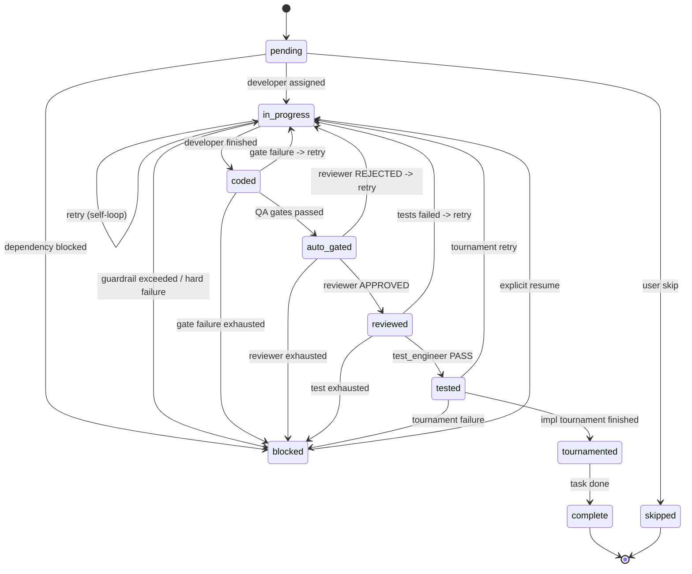
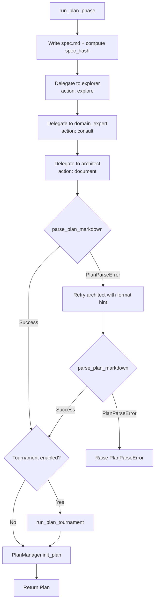
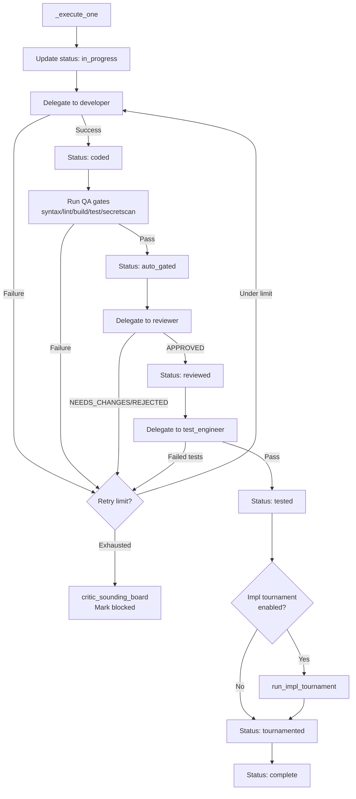
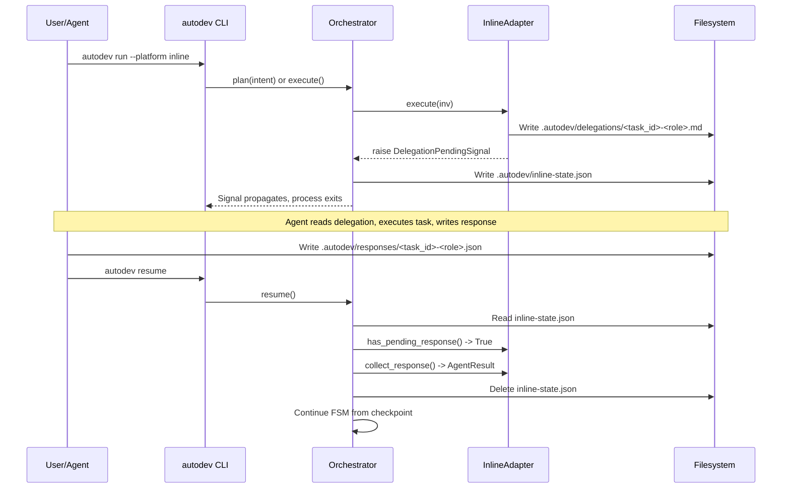

# FSM Orchestrator Design

**Status:** Implemented
**Author:** Mohamed Ameen
**Date:** 2026-04-17
**Last Updated:** 2026-04-17
**Reviewers:** --
**Package:** `src/orchestrator/`
**Entry Point:** `autodev run`, `autodev plan`, `autodev execute`, `autodev resume`, `autodev status`

## 1. Overview

### 1.1 Purpose

The FSM Orchestrator is the central coordination layer that drives AutoDev's multi-agent coding workflow. It owns the plan-phase finite state machine (exploration -> domain expertise -> architecture -> tournament gate -> approval) and the execute-phase per-task loop (developer -> QA gates -> reviewer -> test_engineer -> implementation tournament -> completion). The orchestrator wires together the configuration, platform adapter, agent registry, plan manager, knowledge store, guardrails, and loop detector into a deterministic pipeline that transforms a user intent into a reviewed, tested, tournament-refined implementation.

### 1.2 Scope

**In scope:**
- `Orchestrator` class: construction, property accessors, high-level `plan()`, `execute()`, `resume()`, `status()` methods
- Plan phase FSM (`plan_phase.py`): explorer -> domain_expert -> architect -> plan tournament -> save
- Execute phase loop (`execute_phase.py`): developer -> QA gates -> reviewer -> test_engineer -> impl tournament -> complete
- Task state FSM (`task_state.py`): `TASK_TRANSITIONS` dict, `can_transition()`, `assert_transition()`
- `DelegationEnvelope`: structured task handoff model
- `plan_parser.py`: `parse_plan_markdown()` for architect markdown output
- Inline state suspend/resume (`inline_state.py`)
- Plan tournament runner (`plan_tournament_runner.py`)
- Implementation tournament runner (`impl_tournament_runner.py`)
- Git worktree management (`worktree.py`) for tournament variant isolation

**Out of scope:**
- Platform adapter internals (covered in `adapters_design.md`)
- Agent prompt content (covered in `agents_design.md`)
- Tournament engine core algorithm (covered in `tournaments_design.md`)
- State/ledger persistence internals (`src/state/`)
- QA gate implementations (`src/qa/`)
- Guardrail and loop detection implementations (`src/guardrails/`)

### 1.3 Context

The orchestrator sits at the center of the AutoDev pipeline, coordinating all other subsystems:

```
User Intent
    |
    v
Orchestrator.plan()
    |-- explorer (adapter.execute)
    |-- domain_expert (adapter.execute)
    |-- architect (adapter.execute)
    |-- PlanTournament (tournament engine)
    |-- PlanManager.init_plan()
    v
Orchestrator.execute()
    |-- for each task:
    |   |-- developer (adapter.execute)
    |   |-- QA gates (src/qa/)
    |   |-- reviewer (adapter.execute)
    |   |-- test_engineer (adapter.execute)
    |   |-- ImplTournament (tournament engine)
    |   |-- PlanManager.update_task_status("complete")
    v
Completed Plan
```

The orchestrator references ADR-008 (deterministic FSM orchestration) for its design principle: every state transition is explicit, every delegation produces an evidence artifact, and every failure path has a defined recovery strategy.

## 2. Requirements

### 2.1 Functional Requirements

- FR-1: `Orchestrator.plan(intent)` must drive the plan phase to completion: explorer -> domain_expert -> architect -> optional plan tournament -> save to ledger.
- FR-2: `Orchestrator.execute(task_id=None)` must process all pending tasks in dependency order, or a single named task.
- FR-3: `Orchestrator.resume()` must re-enter the execute loop from the last checkpoint, supporting both subprocess and inline adapters.
- FR-4: `Orchestrator.status()` must return a JSON-serializable snapshot of the current plan state.
- FR-5: The execute phase must implement the full QA pipeline per task: developer -> auto-gates (syntax/lint/build/test/secretscan) -> reviewer -> test_engineer.
- FR-6: On retry exhaustion, the orchestrator must consult `critic_sounding_board`, write `CriticEvidence`, mark the task as escalated and blocked.
- FR-7: `DelegationEnvelope` must provide a structured handoff format with `task_id`, `target_agent`, `action`, `files`, `constraints`, `acceptance`, and `context`.
- FR-8: `parse_plan_markdown()` must extract `Plan` -> `Phase` -> `Task` hierarchy from architect markdown output.
- FR-9: The task state FSM must enforce valid transitions as defined in `TASK_TRANSITIONS`.
- FR-10: For inline adapter mode, `execute()` and `plan()` must suspend by writing `inline-state.json` and raising `DelegationPendingSignal`.
- FR-11: Implementation tournaments must run in isolated git worktrees, with the winning variant's diff applied back to the main repo.

### 2.2 Non-Functional Requirements

- **Crash-safety:** All plan state changes go through `PlanManager` which uses filelock + atomic writes. Evidence is written to `.autodev/evidence/` after each step. If the process crashes mid-task, `resume()` picks up from the last checkpoint.
- **Subprocess isolation:** Each agent invocation is a fresh subprocess with explicit parameters. No reliance on ambient state.
- **Asyncio concurrency:** All adapter calls use `await`. Tournament runner uses `asyncio.gather` for parallel judge invocations. Bounded by `asyncio.Semaphore(max_parallel_subprocesses)`.
- **Pydantic v2 strict validation:** `DelegationEnvelope`, `InlineSuspendState`, and all evidence schemas use `ConfigDict(extra="forbid")`.
- **Deterministic reproducibility:** Given the same inputs, the FSM follows the same transition sequence. Task ordering is deterministic (sorted by ID within phases).
- **LLM cost efficiency:** The orchestrator minimizes unnecessary invocations by checking for existing responses (inline resume shortcut), skipping completed tasks, and honoring the `qa_retry_limit` cap.

### 2.3 Constraints

- Must run on Python 3.11+ with no compiled extensions.
- Must work within a single-machine, single-user context.
- Tournament runners require subprocess adapters (not `InlineAdapter`).
- Git worktrees require a git repository at `cwd`.

## 3. Architecture

### 3.1 High-Level Design

```mermaid
flowchart TB
    subgraph OrchestratorClass["Orchestrator (src/orchestrator/__init__.py)"]
        ORCH["Orchestrator\n- cwd, cfg, adapter\n- registry, plan_manager\n- knowledge, guardrails\n- loop_detector"]
    end

    subgraph PlanPhase["Plan Phase (plan_phase.py)"]
        PP_SPEC[Write spec.md]
        PP_EXPLORE[explorer delegation]
        PP_DOMAIN[domain_expert delegation]
        PP_ARCH[architect delegation]
        PP_PARSE[parse_plan_markdown]
        PP_TOURN[PlanTournament]
        PP_SAVE[PlanManager.init_plan]
    end

    subgraph ExecutePhase["Execute Phase (execute_phase.py)"]
        EP_LOOP[Task loop]
        EP_DEV[developer delegation]
        EP_QA[QA gates]
        EP_REV[reviewer delegation]
        EP_TEST[test_engineer delegation]
        EP_ITOURN[ImplTournament]
        EP_DONE[Mark complete]
    end

    subgraph Support["Support Modules"]
        TS[task_state.py\nFSM transitions]
        DE[delegation_envelope.py\nDelegationEnvelope]
        PP[plan_parser.py\nparse_plan_markdown]
        IS[inline_state.py\nsuspend/resume]
        WT[worktree.py\nWorktreeManager]
    end

    ORCH -->|plan(intent)| PP_SPEC
    PP_SPEC --> PP_EXPLORE
    PP_EXPLORE --> PP_DOMAIN
    PP_DOMAIN --> PP_ARCH
    PP_ARCH --> PP_PARSE
    PP_PARSE --> PP_TOURN
    PP_TOURN --> PP_SAVE

    ORCH -->|execute(task_id)| EP_LOOP
    EP_LOOP --> EP_DEV
    EP_DEV --> EP_QA
    EP_QA --> EP_REV
    EP_REV --> EP_TEST
    EP_TEST --> EP_ITOURN
    EP_ITOURN --> EP_DONE

    EP_DEV --> DE
    EP_REV --> DE
    EP_TEST --> DE
    EP_LOOP --> TS
    EP_ITOURN --> WT
```

### 3.2 Component Structure

| File | Responsibility |
|------|---------------|
| `__init__.py` | `Orchestrator` class: wires all subsystems, exposes `plan()`, `execute()`, `resume()`, `status()` |
| `plan_phase.py` | `run_plan_phase()`: explorer -> domain_expert -> architect -> tournament -> save. Private `_delegate()` for plan-phase agent calls |
| `execute_phase.py` | `run_execute_phase()`: per-task developer -> QA -> reviewer -> test_engineer -> impl tournament. Public `delegate()` for execute-phase agent calls |
| `task_state.py` | `TASK_TRANSITIONS` dict, `can_transition()`, `assert_transition()` |
| `delegation_envelope.py` | `DelegationEnvelope` Pydantic model, `DelegationAction` literal type |
| `plan_parser.py` | `parse_plan_markdown()`: regex-based parser for architect markdown output |
| `inline_state.py` | `write_suspend_state()`, `load_suspend_state()`, `clear_suspend_state()` |
| `plan_tournament_runner.py` | `run_plan_tournament()`: glue between orchestrator and tournament engine for plan refinement |
| `impl_tournament_runner.py` | `run_impl_tournament()`: glue between orchestrator and tournament engine for implementation refinement |
| `worktree.py` | `WorktreeManager`: git worktree creation, removal, diffing, and patch application |

### 3.3 Data Models

**DelegationEnvelope:**

```python
DelegationAction = Literal[
    "implement", "review", "test", "explore",
    "critique", "consult", "document", "design",
]

class DelegationEnvelope(BaseModel):
    """Structured task handoff to a specialist role."""
    model_config = ConfigDict(extra="forbid")

    task_id: str
    target_agent: str
    action: DelegationAction
    files: list[str] = Field(default_factory=list)
    constraints: list[str] = Field(default_factory=list)
    acceptance: str | None = None
    context: dict[str, Any] = Field(default_factory=dict)
```

The envelope renders into a human-readable text block via `render_as_task_message()`:

```
TASK: 2.1
AGENT: developer
ACTION: implement
FILES:
  - src/models/user.py
ACCEPTANCE: User model with email validation
CONTEXT:
  task_title: Add user model
  task_description: Create User Pydantic model with email validation
```

**Plan hierarchy (from `src/state/schemas.py`):**

```python
class Plan(BaseModel):
    model_config = ConfigDict(extra="forbid")
    plan_id: str
    spec_hash: str
    phases: list[Phase]
    metadata: dict[str, Any] = Field(default_factory=dict)
    created_at: str
    updated_at: str
    content_hash: str = ""

class Phase(BaseModel):
    model_config = ConfigDict(extra="forbid")
    id: str          # "1", "2", "3"
    title: str
    description: str = ""
    tasks: list[Task]

class Task(BaseModel):
    model_config = ConfigDict(extra="forbid")
    id: str          # "1.1", "1.2", "2.1"
    phase_id: str
    title: str
    description: str
    status: TaskStatus = "pending"
    files: list[str] = Field(default_factory=list)
    acceptance: list[AcceptanceCriterion] = Field(default_factory=list)
    depends_on: list[str] = Field(default_factory=list)
    retry_count: int = 0
    escalated: bool = False
    assigned_agent: str | None = None
    evidence_bundle: str | None = None
    blocked_reason: str | None = None
    metadata: dict[str, Any] = Field(default_factory=dict)
```

**Evidence types (discriminated union on `kind` field):**

| Evidence Type | `kind` | Key Fields |
|--------------|--------|------------|
| `CoderEvidence` | `"developer"` | `diff`, `files_changed`, `output_text`, `duration_s`, `success` |
| `ReviewEvidence` | `"review"` | `verdict` (APPROVED/NEEDS_CHANGES/REJECTED), `issues` |
| `TestEvidence` | `"test"` | `passed`, `failed`, `total`, `coverage_pct` |
| `ExploreEvidence` | `"explore"` | `findings`, `files_referenced` |
| `SMEEvidence` | `"domain_expert"` | `topic`, `findings`, `confidence` (HIGH/MEDIUM/LOW) |
| `CriticEvidence` | `"critic"` | `verdict` (APPROVED/NEEDS_REVISION/REJECTED), `issues` |
| `TournamentEvidence` | `"tournament"` | `tournament_id`, `phase`, `passes`, `winner`, `converged`, `history` |

### 3.4 Task State Machine



**Transition table (`TASK_TRANSITIONS`):**

```python
TASK_TRANSITIONS: dict[TaskStatus, set[TaskStatus]] = {
    "pending":      {"in_progress", "skipped", "blocked"},
    "in_progress":  {"coded", "blocked", "in_progress"},
    "coded":        {"auto_gated", "in_progress", "blocked"},
    "auto_gated":   {"reviewed", "in_progress", "blocked"},
    "reviewed":     {"tested", "in_progress", "blocked"},
    "tested":       {"tournamented", "in_progress", "blocked"},
    "tournamented": {"complete", "blocked"},
    "complete":     set(),       # terminal
    "blocked":      {"in_progress"},
    "skipped":      set(),       # terminal
}
```

The `in_progress -> in_progress` self-loop is explicitly allowed for retry bookkeeping.

### 3.5 Protocol / Interface Contracts

The `Orchestrator` class does not define a Protocol -- it is a concrete class instantiated directly. However, it depends on the `PlatformAdapter` ABC:

```python
class PlatformAdapter(ABC):
    @abstractmethod
    async def execute(self, inv: AgentInvocation) -> AgentResult: ...
    @abstractmethod
    async def init_workspace(self, cwd: Path, agents: list[AgentSpec]) -> None: ...
    @abstractmethod
    async def healthcheck(self) -> tuple[bool, str]: ...
```

### 3.6 Interfaces

| Method | Signature | Description |
|--------|-----------|-------------|
| `Orchestrator.__init__` | `(cwd, cfg, adapter, registry, session_id, disable_impl_tournament, lock_timeout_s)` | Wires all subsystems |
| `Orchestrator.plan(intent)` | `str -> Plan` | Run plan phase end-to-end |
| `Orchestrator.execute(task_id)` | `str|None -> list[Task]` | Run execute loop for one or all pending tasks |
| `Orchestrator.resume()` | `-> list[Task]` | Re-enter execute loop from last checkpoint |
| `Orchestrator.status()` | `-> dict[str, Any]` | JSON-serializable plan snapshot |
| `run_plan_phase(orch, intent)` | `(Orchestrator, str) -> Plan` | Plan FSM implementation |
| `run_execute_phase(orch, task_id)` | `(Orchestrator, str|None) -> list[Task]` | Execute loop implementation |
| `delegate(orch, role, envelope, ...)` | `-> AgentResult` | Execute-phase agent invocation with guardrails |
| `parse_plan_markdown(md, spec_hash)` | `(str, str) -> Plan` | Deterministic markdown parser |

## 4. Design Decisions

### 4.1 Key Decisions

| Decision | Rationale | Alternatives Considered |
|----------|-----------|------------------------|
| Deterministic FSM with explicit transitions | Every state change is validated by `assert_transition()`. No implicit state leaks. Makes debugging straightforward because illegal transitions are caught immediately. (ADR-008) | Event-driven architecture -- rejected because it makes the execution order harder to reason about and debug. |
| Separate `_delegate()` in plan_phase and `delegate()` in execute_phase | The plan phase and execute phase have different guardrail/logging/inline-resume semantics. Keeping them separate avoids conditional branching on "which phase am I in?" | Single shared delegate function -- rejected because it would need to know whether it's in plan or execute context for inline state naming. |
| `DelegationEnvelope` as structured handoff | Forces every agent invocation to declare its `task_id`, `target_agent`, `action`, `files`, `constraints`, and `acceptance`. This traceability is essential for evidence correlation and debugging. | Passing raw prompt strings -- rejected because it loses structured metadata needed for evidence and audit. |
| Regex-based plan parser (not LLM-based) | Deterministic, fast, testable. The architect is instructed to produce a canonical markdown format; the parser validates that format. No LLM call overhead for parsing. | LLM-based plan extraction -- rejected because it adds cost, latency, and non-determinism to a critical path. |
| One retry loop per `_execute_one()` call | The entire developer -> QA -> reviewer -> test_engineer pipeline runs inside a single `while True` loop with `continue` on failure. This ensures that a reviewer rejection sends the task back to the developer with the issue list, not to a different step. | Separate retry loops per step -- rejected because it fragments the retry budget; a task that fails at reviewer should consume the same retry counter as one that fails at QA. |
| Critic sounding board as escalation path | When retries are exhausted, `critic_sounding_board` diagnoses the failure pattern before blocking the task. This provides actionable feedback to the user about why a task cannot proceed. | Immediate blocking without diagnosis -- rejected because it gives the user no information about the root cause. |
| Tournament runners as separate modules | `plan_tournament_runner.py` and `impl_tournament_runner.py` are glue modules that keep tournament wiring out of the FSM files. This separation lets the plan/execute phases remain focused on their core flow. | Inline tournament logic in plan_phase/execute_phase -- rejected because tournament configuration, model resolution, and worktree management would bloat the FSM files. |
| Git worktrees for impl tournament isolation | Each tournament variant (A, B, AB) runs in a detached git worktree. This provides true filesystem isolation without cloning the repo three times. The winning variant's diff is applied back via `git apply`. | Docker containers, temp directories with file copies -- worktrees are faster, share the git object store, and integrate naturally with diff/apply workflows. |

### 4.2 Trade-offs

- **QA gates currently pretend-pass in Phase 4.** The `_run_qa_gates()` function invokes real gate functions (`run_syntax_check`, `run_lint`, etc.) but the gate infrastructure is evolving. Phase 8 will wire full enforcement.
- **Inline mode does not support tournaments.** Tournament runners assert `not isinstance(orch.adapter, InlineAdapter)`. Tournaments require subprocess adapters for judge independence. Inline mode skips tournaments.
- **Plan parser is forgiving about structure but strict about hierarchy.** Missing `Description:` or `Files:` fields are tolerated (defaults to empty), but a phase with no tasks or a plan with no phases raises `PlanParseError`.

## 5. Implementation Details

### 5.1 Core Algorithms/Logic

**Plan Phase Flow:**



**Execute Phase Flow (per task):**



**Delegation function (execute_phase.delegate):**

1. Look up `AgentSpec` from registry by role.
2. Build prompt: `spec.prompt + "---" + envelope.render_as_task_message() + extra_context + knowledge.inject_block()`.
3. Construct `AgentInvocation` with role, prompt, cwd, model, allowed_tools, max_turns=1.
4. **Inline adapter shortcut:** If response file already exists, call `collect_response()` and return.
5. **Inline adapter delegation:** If no response, inject `task_id` into `inv.metadata`.
6. Call `orch.guardrails.pre_invocation()`.
7. Call `orch.adapter.execute(inv)`.
8. On `DelegationPendingSignal`: write suspend state, re-raise.
9. Call `orch.guardrails.post_invocation()`.
10. Call `orch.loop_detector.observe()` on success.
11. Return `AgentResult`.

**Retry and escalation (`_try_retry_or_escalate`):**

1. Increment retry count via `plan_manager.mark_task_retry()`.
2. If `new_count >= retry_limit`:
   a. Delegate to `critic_sounding_board` with failure context.
   b. Write `CriticEvidence` with `verdict=NEEDS_REVISION`.
   c. Call `plan_manager.mark_escalated()`.
   d. Update task status to `blocked` with `blocked_reason`.
   e. Return escalated task.
3. If under limit: update status to `in_progress` and return for retry.

### 5.2 Plan Parser

The `parse_plan_markdown()` function uses a set of compiled regexes to extract structured data from architect markdown:

| Regex | Purpose |
|-------|---------|
| `_RE_PLAN_TITLE` | Matches `# Plan: <title>` |
| `_RE_PHASE` | Matches `## Phase <id>: <title>` |
| `_RE_TASK` | Matches `### Task <id>: <title>` |
| `_RE_FILES` | Matches `- Files: path1, path2` |
| `_RE_DESC` | Matches `- Description: <text>` |
| `_RE_ACCEPT_HEADER` | Matches `- Acceptance:` |
| `_RE_ACCEPT_ITEM` | Matches `- [ ] <criterion>` |
| `_RE_DEPENDS` | Matches `- Depends: 1.0, 1.1` |

The parser is a single-pass line scanner that maintains `current_phase` and `current_task` state. Phases and tasks are finalized when a new heading is encountered or at end of input. Error conditions:

- Empty markdown -> `PlanParseError("empty plan markdown")`
- No `# Plan:` heading -> `PlanParseError("missing '# Plan: <title>' heading")`
- Task before any phase -> `PlanParseError("task appears before any phase heading")`
- Phase with no tasks -> `PlanParseError("phase has no tasks")`
- No phases found -> `PlanParseError("no phases found")`

Each parsed task is wrapped in `_make_task()` which constructs `AcceptanceCriterion` objects and defaults `assigned_agent` to `"developer"`.

### 5.3 Concurrency Model

**Plan tournament:**

```python
client = AdapterLLMClient(orch.adapter, cwd=orch.cwd)
tcfg = TournamentConfig(
    num_judges=cfg.num_judges,
    convergence_k=cfg.convergence_k,
    max_rounds=cfg.max_rounds,
    model=model,
    max_parallel_subprocesses=orch.cfg.tournaments.max_parallel_subprocesses,
)
tournament = Tournament(handler=PlanContentHandler(), client=client, cfg=tcfg, ...)
final_md, history = await tournament.run(task_prompt=spec, initial=initial_md)
```

The tournament engine internally uses `asyncio.gather` with a semaphore bound of `max_parallel_subprocesses` (default 3) for parallel judge invocations.

**Impl tournament:**

```python
wt_mgr = WorktreeManager(main_repo=orch.cwd, tournament_dir=worktree_dir)
coder_runner = _CoderRunner(orch)
tournament = ImplTournament(
    handler=ImplContentHandler(), client=client, cfg=tcfg,
    coder_runner=coder_runner, worktree_manager=wt_mgr,
)
try:
    final_bundle, history = await tournament.run(task_prompt=..., initial=initial_bundle)
finally:
    await wt_mgr.cleanup_all()
```

The `_CoderRunner` runs the developer and test_engineer in the worktree's `cwd`, providing filesystem isolation. The `WorktreeManager.cleanup_all()` is in a `finally` block to ensure worktrees are removed even on error.

### 5.4 Subprocess Invocation Pattern

The orchestrator itself does not spawn subprocesses -- it delegates to the adapter layer. However, the `WorktreeManager` uses `asyncio.create_subprocess_exec` for all git operations:

```python
async def _run_git(cwd: Path, args: Iterable[str], stdin: str | None = None,
                   timeout_s: float = 60.0) -> tuple[int, str, str]:
    proc = await asyncio.create_subprocess_exec(
        "git", *args,
        cwd=str(cwd),
        stdin=asyncio.subprocess.PIPE if stdin else None,
        stdout=asyncio.subprocess.PIPE,
        stderr=asyncio.subprocess.PIPE,
    )
    stdout_b, stderr_b = await asyncio.wait_for(
        proc.communicate(stdin.encode("utf-8") if stdin else None),
        timeout=timeout_s,
    )
    return (proc.returncode or -1, stdout_b.decode(...), stderr_b.decode(...))
```

### 5.5 Inline Suspend/Resume

When the orchestrator delegates to the `InlineAdapter`, the adapter writes a delegation file and raises `DelegationPendingSignal`. The orchestrator catches this and writes its FSM position to `.autodev/inline-state.json`:



The `InlineSuspendState` captures: `session_id`, `pending_task_id`, `pending_role`, `delegation_path`, `response_path`, `orchestrator_step` (which step in the FSM), `retry_count`, and `last_issues`.

### 5.6 Error Handling

| Error Condition | Handling |
|----------------|----------|
| Role not in registry | Raise `AutodevError(f"role {role!r} not in registry")` |
| Task not found in plan | Raise `AutodevError(f"task_id={task_id!r} not found in plan")` |
| `PlanParseError` on first attempt | Retry architect with `prior_attempt` and `parse_error` in context |
| `PlanParseError` on retry | Raise (propagates to CLI) |
| `GuardrailExceededError` during delegation | Mark task `blocked` with reason, return task |
| Developer adapter failure | Retry up to `qa_retry_limit`, then escalate |
| QA gate failure | Retry up to `qa_retry_limit`, then escalate |
| Reviewer NEEDS_CHANGES/REJECTED | Retry with issues injected as context |
| Test failures | Retry up to `qa_retry_limit`, then escalate |
| Retry exhaustion | `critic_sounding_board` -> `CriticEvidence` -> mark escalated + blocked |
| Response file missing on inline resume | Raise `AutodevError` with instructions |
| Impl tournament error | Log warning and continue (non-fatal) |
| `WorktreeError` | Propagates from worktree operations; cleanup_all in finally block |

### 5.7 Dependencies

- **pydantic:** `DelegationEnvelope`, all evidence schemas, `InlineSuspendState`
- **structlog:** Structured logging via `autologging.get_logger`
- **filelock:** Cross-process locking in `PlanManager` (via `lock_timeout_s` parameter)
- **Internal:**
  - `src/adapters/` -- `PlatformAdapter`, `InlineAdapter`, `AgentInvocation`, `AgentResult`, `DelegationPendingSignal`
  - `src/config/schema.py` -- `AutodevConfig`, tournament/guardrail/QA gate configs
  - `src/state/` -- `PlanManager`, `KnowledgeStore`, evidence writing, path helpers
  - `src/guardrails/` -- `GuardrailEnforcer`, `LoopDetector`
  - `src/qa/` -- `GateResult`, `detect_language`, individual gate functions
  - `src/tournament/` -- `Tournament`, `ImplTournament`, `AdapterLLMClient`, `TournamentConfig`
  - `src/errors.py` -- `AutodevError`, `GuardrailExceededError`

### 5.8 Configuration

| Config Path | Description | Default |
|-------------|-------------|---------|
| `AutodevConfig.qa_retry_limit` | Max retries before escalation | `3` |
| `AutodevConfig.tournaments.plan.enabled` | Enable plan tournament | Configured |
| `AutodevConfig.tournaments.impl.enabled` | Enable impl tournament | Configured |
| `AutodevConfig.tournaments.plan.num_judges` | Number of judges per round | Configured |
| `AutodevConfig.tournaments.plan.convergence_k` | Consecutive wins for convergence | Configured |
| `AutodevConfig.tournaments.plan.max_rounds` | Maximum tournament rounds | Configured |
| `AutodevConfig.tournaments.max_parallel_subprocesses` | Semaphore bound for parallel judge invocations | `3` |
| `AutodevConfig.tournaments.auto_disable_for_models` | Model substrings that disable tournaments | `["opus"]` |
| `AutodevConfig.qa_gates.*` | Enable/disable individual QA gates | Varies |
| `AutodevConfig.guardrails.max_tool_calls_per_task` | Per-task tool call limit | `60` |
| `AutodevConfig.guardrails.max_duration_s_per_task` | Per-task duration limit | `900` (15 min) |
| `AutodevConfig.guardrails.max_diff_bytes` | Maximum diff size before warning | `5 MB` |

## 6. Integration Points

### 6.1 Dependencies on Other Components

| Component | Dependency |
|-----------|-----------|
| `src/adapters/` | `PlatformAdapter.execute()` for all agent invocations |
| `src/agents/` | `build_registry()` produces the `dict[str, AgentSpec]` consumed by the orchestrator |
| `src/config/schema.py` | `AutodevConfig` provides all configuration |
| `src/state/plan_manager.py` | `PlanManager` for plan persistence, task status updates, ledger writes |
| `src/state/knowledge.py` | `KnowledgeStore.inject_block()` for knowledge injection into prompts |
| `src/state/evidence.py` | `write_evidence()`, `write_patch()` for evidence persistence |
| `src/state/schemas.py` | `Plan`, `Phase`, `Task`, all evidence types |
| `src/guardrails/` | `GuardrailEnforcer.pre_invocation()`, `.post_invocation()`, `LoopDetector.observe()` |
| `src/qa/` | `run_syntax_check()`, `run_lint()`, `run_build_check()`, `run_tests()`, `run_secretscan()` |
| `src/tournament/` | `Tournament`, `ImplTournament`, `AdapterLLMClient`, `PlanContentHandler`, `ImplContentHandler` |

### 6.2 Adapter Contract Dependency

The orchestrator consumes the `PlatformAdapter` protocol via `orch.adapter.execute()`. It also uses `isinstance(orch.adapter, InlineAdapter)` checks for inline-specific behavior (response file collection, delegation pending signal handling, tournament assertions).

### 6.3 Ledger Event Emissions

| Event | Written By | Purpose |
|-------|-----------|---------|
| `plan_tournament_complete` | `plan_tournament_runner.py` | Records tournament ID, passes, winner, artifact dir |
| `impl_tournament_complete` | `impl_tournament_runner.py` | Records tournament ID, task ID, passes, winner |
| Evidence: `CoderEvidence` | `execute_phase.py` | After each developer invocation |
| Evidence: `ReviewEvidence` | `execute_phase.py` | After each reviewer invocation |
| Evidence: `TestEvidence` | `execute_phase.py` | After each test_engineer invocation |
| Evidence: `ExploreEvidence` | `plan_phase.py` | After explorer during plan phase |
| Evidence: `SMEEvidence` | `plan_phase.py` | After domain_expert during plan phase |
| Evidence: `CriticEvidence` | `execute_phase.py` | After critic_sounding_board escalation |
| Evidence: `TournamentEvidence` | `impl_tournament_runner.py` | After impl tournament completion |

### 6.4 Components That Depend on This

| Consumer | Usage |
|----------|-------|
| `src/cli/` (Click commands) | `autodev run` constructs and calls `Orchestrator.plan()` + `.execute()` |
| `autodev resume` | Calls `Orchestrator.resume()` |
| `autodev status` | Calls `Orchestrator.status()` |

### 6.5 External Systems

| System | Interaction |
|--------|------------|
| LLM Platforms | Via adapter layer (Claude Code, Cursor subprocesses) |
| Git | Worktree management for impl tournaments (`git worktree add/remove`, `git diff`, `git apply`) |
| Filesystem | `.autodev/` directory for plan state, evidence, delegations, responses, inline state, tournament artifacts |

## 7. Testing Strategy

### 7.1 Unit Tests

- `can_transition()` and `assert_transition()` for all valid and invalid transitions in `TASK_TRANSITIONS`.
- `DelegationEnvelope.render_as_task_message()` output format.
- `parse_plan_markdown()` with valid markdown, missing title, missing phases, empty tasks, malformed headings.
- `_parse_review_verdict()` for APPROVED, NEEDS_CHANGES, REJECTED, and empty input.
- `_parse_test_counts()` for valid `RESULTS: passed=N failed=M total=T` and missing/malformed lines.
- `_developer_envelope()`, `_review_envelope()`, `_test_envelope()` builders.
- `_resolve_tournament_model()` and `_is_auto_disabled()` with various model/disable combinations.
- `write_suspend_state()` / `load_suspend_state()` / `clear_suspend_state()` round-trip.

### 7.2 Integration Tests

- Plan phase end-to-end with mock adapter: verify that explorer, domain_expert, architect are called in order, plan is parsed and saved.
- Execute phase with mock adapter: verify developer -> QA -> reviewer -> test_engineer sequence, status transitions, evidence writes.
- Retry and escalation: verify that critic_sounding_board is called and task is marked blocked after retry exhaustion.
- Inline suspend/resume: write delegation, create response file, call resume, verify FSM continues.
- Plan tournament: mock tournament engine, verify refined markdown replaces original.
- WorktreeManager: create worktree, make changes, get diff, apply patch, cleanup.

### 7.3 Property-Based Tests

- Hypothesis: random `TaskStatus` sequences are either all valid transitions or caught by `assert_transition()`.
- Hypothesis: random markdown input to `parse_plan_markdown()` either produces a valid `Plan` or raises `PlanParseError` (never crashes).
- Hypothesis: `DelegationEnvelope` round-trip through `model_dump_json()` / `model_validate_json()`.

### 7.4 Test Data Requirements

- Sample architect markdown output (valid, malformed, edge cases).
- Mock `AutodevConfig` with tournament enabled/disabled.
- Mock `PlatformAdapter` that returns canned `AgentResult` objects.
- Mock `PlanManager` that tracks status transitions in memory.

## 8. Security Considerations

- **Prompt injection:** The orchestrator passes user intent (from `autodev run` CLI) into the spec and subsequently into agent prompts. The intent is treated as untrusted input and is bounded by the spec file (not directly concatenated into executable commands).
- **Worktree isolation:** Tournament worktrees are detached from any branch (`--detach`). They cannot accidentally push changes or corrupt the main repo's branch state. The `cleanup_all()` in `finally` ensures no stale worktrees persist.
- **Guardrails:** `GuardrailEnforcer` enforces per-task limits on tool calls (`max_tool_calls_per_task=60`), duration (`max_duration_s_per_task=900`), and diff size (`max_diff_bytes=5MB`). These limits prevent runaway agent behavior.
- **Evidence integrity:** The `content_hash` field on `Plan` enables CAS (content-addressable storage) hash chaining so partial writes are detectable.

## 9. Performance Considerations

- **Sequential task execution:** The execute phase processes tasks one at a time within a phase. Cross-task parallelism is not implemented (tasks may have dependencies).
- **LLM latency dominates:** Each adapter call takes 10-120 seconds depending on the model and task complexity. The orchestrator overhead (state transitions, evidence writes) is negligible in comparison.
- **Tournament cost multiplier:** A plan tournament adds `max_rounds * (1 critic + 1 architect_b + 1 synthesizer + num_judges judge)` LLM calls. An impl tournament adds the same plus `num_rounds * (1 developer + 1 test_engineer)` calls per variant.
- **Worktree creation:** `git worktree add` is fast (< 1 second for typical repos). Cleanup via `git worktree remove` is also fast.
- **Inline mode latency:** The suspend/resume cycle adds human-in-the-loop time. The orchestrator itself adds no overhead -- it writes state and exits immediately.

## 10. Installation & CLI Entry

### 10.1 Package Registration

The orchestrator is a library package under `src/orchestrator/`. It is consumed by the CLI module.

### 10.2 CLI Commands

| Command | Description |
|---------|-------------|
| `autodev run --platform <P> "<intent>"` | Runs `plan()` then `execute()` |
| `autodev plan "<intent>"` | Runs `plan()` only |
| `autodev execute [--task-id T]` | Runs `execute()` for all or one task |
| `autodev resume` | Calls `resume()` |
| `autodev status` | Calls `status()` and prints JSON |

### 10.3 Migration Strategy

N/A -- this is the initial implementation.

## 11. Observability

### 11.1 Structured Logging

| Event | Key Fields | Description |
|-------|-----------|-------------|
| `orchestrator.plan.start` | `intent_bytes` | Plan phase begins |
| `orchestrator.plan.done` | `plan_id`, `phases` | Plan phase complete |
| `orchestrator.execute.start` | `task_id` | Execute phase begins |
| `orchestrator.execute.done` | `processed`, `complete`, `blocked` | Execute phase complete |
| `plan_phase.spec_written` | `bytes` | Spec file written |
| `plan_phase.parse_failed_retrying` | `err` | First parse attempt failed |
| `plan_phase.tournament_applied` | `pre_bytes`, `post_bytes` | Tournament refined the plan |
| `plan_phase.approved` | `plan_id`, `phases`, `tasks` | Plan saved to ledger |
| `execute_phase.developer_failed` | `task_id`, `err` | Developer invocation failed |
| `execute_phase.qa_gate_failed` | `task_id`, `details` | QA gate returned failure |
| `execute_phase.review_needs_changes` | `task_id`, `verdict`, `issues` | Reviewer not satisfied |
| `execute_phase.tests_failed` | `task_id`, `failed`, `total` | Test failures detected |
| `execute_phase.retry_exhausted` | `task_id`, `retry`, `reason` | Retry limit reached |
| `execute_phase.guardrail_exceeded` | `task_id`, `reason` | Guardrail limit hit |
| `execute_phase.task_complete` | `task_id` | Task finished successfully |
| `plan_tournament.start` | `tournament_id`, `model`, `num_judges`, `max_rounds` | Plan tournament begins |
| `plan_tournament.done` | `tournament_id`, `passes`, `winner_last` | Plan tournament complete |
| `impl_tournament.start` | `tournament_id`, `task_id`, `model`, `num_judges` | Impl tournament begins |
| `impl_tournament.done` | `tournament_id`, `task_id`, `passes`, `winner_last` | Impl tournament complete |

### 11.2 Audit Artifacts

| Artifact | Location | Description |
|----------|----------|-------------|
| Spec file | `.autodev/spec.md` | User intent captured at plan start |
| Plan file | `.autodev/plan.json` | Structured plan with phases and tasks |
| Evidence files | `.autodev/evidence/<task_id>-<kind>.json` | Per-step evidence records |
| Patch files | `.autodev/evidence/<task_id>.patch` | Developer diffs |
| Tournament artifacts | `.autodev/tournaments/<id>/` | Per-pass history, judge scores, worktree diffs |
| Inline state | `.autodev/inline-state.json` | Suspend checkpoint (cleared on resume) |
| Delegation files | `.autodev/delegations/<task_id>-<role>.md` | Inline mode delegation instructions |
| Response files | `.autodev/responses/<task_id>-<role>.json` | Inline mode agent responses |

### 11.3 Status Command

`autodev status` returns:

```json
{
  "plan": {
    "plan_id": "plan-abc123def456",
    "spec_hash": "a1b2c3d4e5f6g7h8",
    "phases": 3,
    "title": "Feature X Implementation",
    "created_at": "2026-04-17T10:00:00+00:00",
    "updated_at": "2026-04-17T12:30:00+00:00"
  },
  "session_id": "sess-abc123def456",
  "tasks": [
    {"id": "1.1", "phase_id": "1", "title": "...", "status": "complete", ...},
    {"id": "1.2", "phase_id": "1", "title": "...", "status": "in_progress", ...}
  ],
  "totals": {
    "pending": 5, "in_progress": 1, "complete": 3, "blocked": 0, "total": 9
  }
}
```

## 12. Cost Implications

| Operation | LLM Calls | Notes |
|-----------|-----------|-------|
| Plan phase (no tournament) | 3 | explorer + domain_expert + architect |
| Plan phase (architect retry) | 4 | + 1 architect retry on parse failure |
| Plan tournament (per round) | 3 + num_judges | critic_t + architect_b + synthesizer + N judges |
| Execute task (happy path) | 3 | developer + reviewer + test_engineer |
| Execute task (1 retry) | 6 | 2x (developer + reviewer + test_engineer) |
| Execute task (exhausted, 3 retries) | 10 | 3x developer + 3x QA/reviewer/test + critic_sounding_board |
| Impl tournament (per round) | 3 + num_judges + 2 per variant | critic_t + architect_b + synthesizer + N judges + developer + test_engineer per variant |
| Full run (3 phases, 9 tasks, no retries) | 30 | 3 (plan) + 27 (9 tasks x 3 calls) |

**Cost reduction strategies:**
- `auto_disable_for_models: ["opus"]` skips tournaments when using expensive models.
- `qa_retry_limit: 3` caps the maximum number of retries per task.
- `guardrails.max_tool_calls_per_task: 60` prevents runaway agent loops.
- `guardrails.cost_budget_usd_per_plan` (optional) enables per-plan cost caps.

## 13. Future Enhancements

- **Phase 8: Full QA gate enforcement.** The `_run_qa_gates()` function will wire real gate results into the FSM with per-gate retry logic.
- **Cross-task parallelism.** Tasks within a phase that have no dependency edges could be executed in parallel.
- **Streaming progress.** Real-time progress reporting via SSE or WebSocket for long-running plan/execute operations.
- **Plan revision loop.** A `critic_t` gate before plan approval (currently handled by the plan tournament) with explicit revision cycles.
- **Incremental re-planning.** On task failure patterns, re-invoke the architect to revise the remaining plan.

## 14. Open Questions

- [ ] Should the orchestrator support partial plan execution (e.g., "execute only Phase 2")?
- [ ] Should the inline adapter support a "multi-delegation" mode where multiple delegation files are written before suspend?
- [ ] Should the `_run_qa_gates()` function run gates in parallel (currently sequential)?
- [ ] Should the worktree manager support branch-based isolation in addition to detached worktrees?

## 15. Related ADRs

- ADR-001: Stateless subprocesses -- every agent invocation is a fresh subprocess.
- ADR-006: Platform adapter abstraction -- the orchestrator delegates to `PlatformAdapter.execute()`.
- ADR-008: Deterministic FSM orchestration -- all state transitions are explicit and validated.

## 16. References

- [asyncio documentation](https://docs.python.org/3/library/asyncio.html)
- [git worktree documentation](https://git-scm.com/docs/git-worktree)
- [Pydantic v2 discriminated unions](https://docs.pydantic.dev/latest/concepts/unions/#discriminated-unions)

## 17. Revision History

| Date | Author | Changes |
|------|--------|---------|
| 2026-04-17 | Mohamed Ameen | Initial draft |
