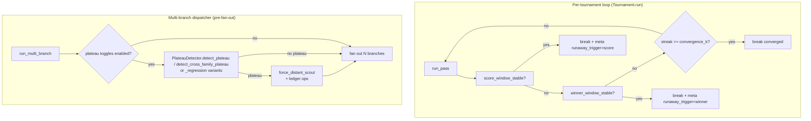

# Plateau Detection Design

**Status:** Implemented
**Author:** Mohamed Ameen
**Date:** 2026-05-09
**Last Updated:** 2026-05-09
**Reviewers:** --
**Package:** `src/orchestrator/plateau_detector.py`, `src/tournament/core.py`
**Entry Point:** N/A (library; consumed by tournament loop and multi-branch dispatcher)
**Versions:**
- v0.6.0 — score-stability (`score_stability_window`/`max_delta`) and winner-stability (`winner_stability_window`) detectors
- v0.18.0 B2 — per-family + cross-family rule-based plateau detector
- v0.20.0 A2 — regression-based plateau detector (`PlateauDetectorConfig.strategy="regression"`)

## 1. Overview

### 1.1 Purpose

Tournament loops can run their full `max_rounds` without converging — the streak counter never reaches `convergence_k`, but each pass also fails to produce *new* progress. Detecting these structural plateaus early lets the runner break out (per-tournament loop) or force a divergence-injecting lane change (cross-tournament multi-branch dispatcher) instead of burning the remaining round budget on identical work.

This document covers the three plateau-class detectors that ship in v0.21.1:

1. **Score-stability** (per-tournament, in-loop) — Borda scores frozen across the trailing window.
2. **Winner-stability** (per-tournament, in-loop) — `effective_winner` label frozen on a non-A label across the trailing window. Catches the QNX `[AB, AB, AB]` runaway pattern.
3. **Plateau detection** (cross-tournament, pre-fan-out) — operates over the swarm-tier knowledge event stream. Available in two strategies: `rules` (no-`winner_promoted`-in-window) and `regression` (OLS slope on cumulative `winner_promoted` count).

The first two are runaway detectors inside `tournament.core.Tournament.run`; they break the per-tournament loop early. The third is the multi-branch dispatcher's pre-gather check — when fired, it forces one branch's `lane` to `"distant-scout"` to inject divergence.

### 1.2 Scope

**In scope:**

- `_score_window_stable` and `_winner_window_stable` helpers in `src/tournament/core.py`.
- `PlateauDetector` class in `src/orchestrator/plateau_detector.py` with four detection methods (rule-based and regression-based per-family and cross-family).
- `force_distant_scout()` lane-mutation action.
- `_ols_slope` pure-Python OLS implementation.
- `PlateauDetectorConfig` and the per-phase plateau toggles on `TournamentPhaseConfig`.
- Wiring in `orchestrator.multi_branch_tournament` (lines 667-779) and `tournament.core.Tournament.run` (lines 835-895).

**Out of scope:**

- Cross-pass tournament-level convergence (owned by `convergence_k` + `streak` counter).
- PRM trajectory pattern detection (sister system; see [`prm.md`](prm.md)).
- The promotion-grade ladder (separate concern; see `tournament.promotion.decide`).

### 1.3 Context



## 2. Requirements

### 2.1 Functional Requirements

- **FR-1:** When `cfg.score_stability_window` and `cfg.score_stability_max_delta` are both set, halt the tournament loop early when the trailing-window Borda scores' total \|Δ\| ≤ max_delta.
- **FR-2:** When `cfg.winner_stability_window` is set, halt the tournament loop early when the trailing window's `effective_winner` is stable on a non-A label.
- **FR-3:** When `cfg.tournaments.plan.plateau_detection_enabled`, consult `PlateauDetector.detect_plateau` (or its regression sibling) for each branch's family; if a plateau is detected, force one branch's lane to `"distant-scout"`.
- **FR-4:** When `cfg.tournaments.plan.cross_family_plateau_enabled`, consult `PlateauDetector.detect_cross_family_plateau` (or its regression sibling); if a project-wide plateau is detected, force one branch's lane to `"distant-scout"`.
- **FR-5:** Honor `cfg.plateau_detector.strategy` to choose between rule-based (`"rules"`, default) and regression-based (`"regression"`) detection.
- **FR-6:** On every fired detector, append a structured ledger op (`plateau_detected`, `plateau_forced_lane_change`) so post-run analysis can attribute outcomes to the intervention.
- **FR-7:** All detectors must gracefully degrade — any exception logs a warning and falls through (advisory only, never blocks fan-out).

### 2.2 Non-Functional Requirements

- **Crash-safety:** `force_distant_scout()` returns a NEW list — input is never mutated in place. Ledger ops use the standard CAS-protected JSONL append.
- **Subprocess isolation:** Detectors are pure Python and run in the orchestrator process; no subprocess.
- **Asyncio concurrency:** `PlateauDetector` methods are async because they read from `KnowledgeStore` (file I/O abstracted behind awaitable). The score/winner detectors are pure sync helpers.
- **Pydantic v2 strict validation:** `PlateauDetectorConfig` uses `extra="forbid"` and validates `regression_window ≥ 3`, `plateau_slope_threshold ≥ 0.0`. `score_stability_*` and `winner_stability_window` live on `TournamentPhaseConfig` (also `extra="forbid"`).
- **LLM cost efficiency:** All detectors are 100% local — no LLM calls.
- **Deterministic reproducibility:** Given the same on-disk knowledge state and config, all four `PlateauDetector` methods return identical booleans.
- **Maintainability:** OLS slope is computed via `_ols_slope`, a 23-line pure-Python helper — no numpy / scipy dependency.

### 2.3 Constraints

- Must not introduce numpy or scipy.
- Must not block tournament fan-out on detector failure.
- Must remain stable when knowledge events have no `event_type` metadata (filtered out in cross-family path).

## 3. Architecture

### 3.1 Detector Catalogue

| Detector | Layer | Strategy | Window meaning | Threshold |
|----------|-------|----------|----------------|-----------|
| `_score_window_stable` | Per-tournament loop (in-loop) | Borda-score delta | trailing N **passes** | `sum(\|Δscore\|) ≤ max_delta` |
| `_winner_window_stable` | Per-tournament loop (in-loop) | label freeze | trailing N **passes** | all non-A labels equal |
| `PlateauDetector.detect_plateau` | Multi-branch dispatcher (pre-fan-out) | `rules` | trailing N **events for family** | `≥3 events AND zero winner_promoted` |
| `PlateauDetector.detect_plateau_regression` | Multi-branch dispatcher (pre-fan-out) | `regression` | trailing N **events for family** | OLS slope of cumulative `winner_promoted` < `plateau_slope_threshold` |
| `PlateauDetector.detect_cross_family_plateau` | Multi-branch dispatcher (pre-fan-out) | `rules` | trailing N **tournament events** (any family) | `≥3 events AND zero winner_promoted` |
| `PlateauDetector.detect_cross_family_plateau_regression` | Multi-branch dispatcher (pre-fan-out) | `regression` | trailing N **tournament events** (any family) | OLS slope < `plateau_slope_threshold` |

### 3.2 Component Structure

| File | Element | Responsibility |
|------|---------|---------------|
| `src/tournament/core.py` lines 367-381 | `_score_window_stable(history, window, max_delta)` | Pure helper — sum of \|Δscore\| across A/B/AB |
| `src/tournament/core.py` lines 428-465 | `_winner_window_stable(history, window)` | Pure helper — non-A label freeze |
| `src/tournament/core.py` lines 835-895 | `Tournament.run` integration | Reads `cfg.score_stability_*` and `cfg.winner_stability_window`; sets `result.meta["runaway_detected"]` and `meta["runaway_trigger"]` on early break |
| `src/orchestrator/plateau_detector.py` lines 40-203 | `PlateauDetector` class | Four detection methods + `force_distant_scout` |
| `src/orchestrator/plateau_detector.py` lines 206-228 | `_ols_slope(ys)` | Pure-Python OLS slope |
| `src/orchestrator/multi_branch_tournament.py` lines 667-779 | Pre-fan-out integration | Selects strategy, runs detector(s), forces lane change |
| `src/config/schema.py` lines 389-403 | `PlateauDetectorConfig` | Top-level config (`strategy`, `regression_window`, `plateau_slope_threshold`) |
| `src/config/schema.py` lines 220-229 | Per-phase plateau toggles | `plateau_detection_enabled`, `plateau_window`, `cross_family_plateau_enabled`, `cross_family_plateau_window` |

### 3.3 Configuration

#### Top-level (`AutodevConfig.plateau_detector`)

```python
class PlateauDetectorConfig(BaseModel):
    """v0.20.0 A2: plateau-detector strategy."""
    model_config = ConfigDict(extra="forbid")

    strategy: Literal["rules", "regression"] = "rules"
    regression_window: int = Field(default=10, ge=3)
    plateau_slope_threshold: float = Field(default=0.1, ge=0.0)
```

| Field | Default | Meaning |
|-------|---------|---------|
| `strategy` | `"rules"` | Selects rule-based (legacy v0.18.0 — no `winner_promoted` in window) or regression-based (v0.20.0 — OLS slope on cumulative wins) |
| `regression_window` | `10` | Sliding-window size when `strategy="regression"`. Minimum 3 (need ≥3 points for a meaningful slope) |
| `plateau_slope_threshold` | `0.1` | OLS slope below this → plateau flagged. With cumulative wins ranging 0..N, a slope of 0.1 means roughly 1 new win every 10 events |

#### Per-phase (`TournamentPhaseConfig`)

```python
plateau_detection_enabled: bool = False
plateau_window: int = 4
cross_family_plateau_enabled: bool = False
cross_family_plateau_window: int = 10
```

| Field | Default | Meaning |
|-------|---------|---------|
| `plateau_detection_enabled` | `False` | When True, check per-family plateau before fan-out (uses `plateau_window` for rules strategy or `regression_window` for regression strategy) |
| `plateau_window` | `4` | Per-family rule-based window count |
| `cross_family_plateau_enabled` | `False` | When True, check project-wide plateau across all families |
| `cross_family_plateau_window` | `10` | Cross-family rule-based window count |

#### Per-tournament (`TournamentConfig` in `tournament/core.py`)

```python
score_stability_window: int | None = None
score_stability_max_delta: int | None = None
winner_stability_window: int | None = None
```

All three default to `None` (off). The plan-tournament defaults in `config/defaults.py` opt them in for the plan tournament; impl tournaments leave them off because impl artifacts aren't measured by line/score deltas.

### 3.4 Action: `force_distant_scout`

```python
async def force_distant_scout(
    branch_configs: list[BranchConfig],
    plateaued_family: str | None = None,
) -> list[BranchConfig]:
    """Replace one branch's lane with "distant-scout" and return the list."""
```

Selection priority:

1. The first branch whose `family == plateaued_family` (when family-specific plateau triggered).
2. The first branch in the list (when no family match or cross-family plateau).

The returned list is a NEW list (input never mutated). Only the `lane` field changes — `model_overrides`, `risk`, `family` carry over via `model_copy(update={"lane": "distant-scout"})`.

The `"distant-scout"` lane is the most aggressive divergence lane in the catalogue (`"distant-scout" | "local-tweak" | "architectural" | "constraint-removal" | "incumbent-confirmation"`). Its prompt addendum signals the architect to explore far from the incumbent rather than refining locally — the structural cure for a plateaued cohort.

## 4. Design Decisions

### 4.1 Key Decisions

| Decision | Rationale | Alternatives Considered |
|----------|-----------|------------------------|
| Three independent plateau detectors at three layers | Score / winner / cross-tournament plateaus have different time scales (per pass vs. per multi-branch run) and require different signals (Borda numbers, label sequence, knowledge events). Unifying them would require lifting tournament-internal state into the dispatcher. | Single unified detector (lossy) |
| Score-stability + winner-stability deliberately co-existing | The score detector fires when Borda numbers stop moving; the winner detector fires when the *label* freezes on a non-A value. They cover orthogonal failure modes — score-only would miss QNX-style `[AB, AB, AB]` (the synthesizer keeps "winning" with new content); winner-only would miss `[A, AB, A, AB, A, AB]` runaway oscillation with stable scores. | Single combined detector |
| `_winner_window_stable` excludes `A` | A-streak is owned by `convergence_k` via the `streak` counter — the two detectors must not double-fire on the converged case (which is a *good* outcome, not a runaway). | Detector includes A (would trigger on every successful convergence and double-emit) |
| Rule-based default, regression opt-in | Rules are deterministic, free, and well-understood. Regression adds power but requires more events to converge on a stable signal. Default `strategy="rules"` is byte-identical to v0.19.0 behavior. | Regression default (would silently change behavior on upgrade) |
| Pure-Python OLS instead of numpy | Avoids a 50MB optional dependency for a 23-line linear regression. Slope computation is the only numerical operation. | numpy / scipy.stats.linregress |
| Knowledge store as the cross-tournament event source | The swarm-tier `shared-learnings.jsonl` already records `winner_promoted` events for forensics. Reusing it for plateau detection avoids a parallel event channel. | Custom event log just for plateau detection |
| `force_distant_scout` returns a new list | Input mutation would surprise callers who hold the original `branch_configs`. `model_copy(update=...)` is Pydantic-idiomatic. | In-place mutation |
| Family-specific selection priority | When per-family plateau fires for family `"X"`, the most informative branch to flip is the one already in family `"X"` — flipping a sibling family's branch wouldn't break the local minimum. | Always flip branch[0] |

### 4.2 Trade-offs

- **Cost vs benefit of cross-family detection:** The cross-family detector reads the entire swarm-tier event stream every time. On a project with thousands of historical events this is O(n) read; the trailing-window slice keeps detection itself O(window). Acceptable for v0.21.1; future optimization could push the filter down to the store.
- **Slope threshold tuning:** `plateau_slope_threshold=0.1` is the default but is highly project-dependent. Aggressive projects (many tournaments) want a higher threshold (insist on faster wins); slow projects want a lower one. No automatic tuning — operators must observe and adjust.
- **Per-family plateau requires a `family` tag:** Branches without `BranchConfig.family` set are skipped by per-family detection (loop `continue` at `bc.family is None`). Operators who want per-family detection must explicitly tag their branches.
- **Single lane forced per detection:** `force_distant_scout` flips at most one branch even on cross-family plateau. Aggressive divergence (flipping multiple) could destabilize the cohort; conservative single-flip preserves N-1 branches' continuity.

## 5. Implementation Details

### 5.1 In-Loop Detectors (Tournament.run)

`tournament/core.py` lines 835-895:

```python
# Score detector
window = self.cfg.score_stability_window
max_delta = self.cfg.score_stability_max_delta
if (window is not None and max_delta is not None
        and len(history) >= window
        and _score_window_stable(history, window, max_delta)):
    result.meta["runaway_detected"] = True
    result.meta["runaway_trigger"] = "score"
    self.store.write_pass_result(pass_num, result)
    break

# Winner detector
winner_window = self.cfg.winner_stability_window
if (winner_window is not None
        and _winner_window_stable(history, winner_window)):
    result.meta["runaway_detected"] = True
    result.meta["runaway_trigger"] = "winner"
    self.store.write_pass_result(pass_num, result)
    break
```

The early break re-persists the pass result with the runaway annotation — on-disk artifacts surface the cause for post-hoc analysis. `convergence_k` is checked first, so true convergence still wins.

### 5.2 Per-Family Rule-Based (`detect_plateau`)

`src/orchestrator/plateau_detector.py` lines 46-74:

1. Read all swarm-tier entries.
2. Filter to `metadata.get("family") == family`.
3. Sort by timestamp descending.
4. Take the trailing `window` entries.
5. If fewer than 3 entries → False (insufficient signal).
6. If any entry has `event_type == "winner_promoted"` → False (genuine progress).
7. Otherwise → True (plateau).

### 5.3 Regression-Based (`detect_plateau_regression`)

`src/orchestrator/plateau_detector.py` lines 101-142:

1. Read all swarm-tier entries.
2. Filter to family.
3. Sort by timestamp descending; take trailing `window`.
4. Reverse to chronological order (regression expects monotonic x).
5. If fewer than 3 entries → False.
6. Build cumulative `winner_promoted` counts: `[wins_at_0, wins_at_1, ..., wins_at_n-1]`.
7. Compute `slope = _ols_slope(cumulative)`.
8. Return `slope < slope_threshold`.

`_ols_slope` formula: `Σ((x_i - x̄)(y_i - ȳ)) / Σ((x_i - x̄)²)` with x = `range(n)`. Returns `0.0` when `n < 2` or x-variance is zero (degenerate).

### 5.4 Cross-Family Variants

Identical to per-family except no `family` filter — instead, filter to entries with `event_type is not None` (i.e. tournament events; non-tournament entries like manual notes are skipped). Same window-and-threshold logic applies.

### 5.5 Multi-Branch Dispatcher Wiring

`src/orchestrator/multi_branch_tournament.py` lines 667-779:

```python
plan_cfg = orch.cfg.tournaments.plan
if branch_configs is not None and (
    plan_cfg.plateau_detection_enabled
    or plan_cfg.cross_family_plateau_enabled
):
    try:
        pd = PlateauDetector(orch.knowledge)
        strategy = orch.cfg.plateau_detector.strategy
        slope_threshold = orch.cfg.plateau_detector.plateau_slope_threshold
        regression_window = orch.cfg.plateau_detector.regression_window

        # 1. Per-family pass
        if plan_cfg.plateau_detection_enabled:
            window = plan_cfg.plateau_window
            for bc in branch_configs:
                if bc.family is None:
                    continue
                plateaued = await (
                    pd.detect_plateau_regression(bc.family, regression_window, slope_threshold)
                    if strategy == "regression"
                    else pd.detect_plateau(bc.family, window=window)
                )
                if plateaued:
                    plateaued_family, triggered, kind = bc.family, True, "per_family"
                    break

        # 2. Cross-family pass (only if per-family didn't trigger)
        if not triggered and plan_cfg.cross_family_plateau_enabled:
            window = plan_cfg.cross_family_plateau_window
            plateaued_x = await (
                pd.detect_cross_family_plateau_regression(regression_window, slope_threshold)
                if strategy == "regression"
                else pd.detect_cross_family_plateau(window=window)
            )
            if plateaued_x:
                triggered, kind = True, "cross_family"

        if triggered:
            await orch.plan_manager.ledger_append(
                op="plateau_detected",
                payload={"family": plateaued_family, "kind": kind, "n_branches": n_branches},
            )
            # Mutate branch_configs (replace target with distant-scout copy)
            target_idx = ... # family-specific or 0
            prior_lane = branch_configs[target_idx].lane
            branch_configs = await pd.force_distant_scout(branch_configs, plateaued_family=plateaued_family)
            await orch.plan_manager.ledger_append(
                op="plateau_forced_lane_change",
                payload={"branch_index": target_idx, "prior_lane": prior_lane,
                         "new_lane": "distant-scout", "family": plateaued_family},
            )
    except Exception as exc:
        logger.warning("multi_branch.plateau_check_failed", error=str(exc))
```

Precedence: per-family is checked first. Cross-family fires only if no per-family branch already triggered, so a single multi-branch run produces at most one forced lane change.

### 5.6 Error Handling

Both layers swallow exceptions:

- `tournament.core.Tournament.run` does not have an explicit try/except — the helpers are pure functions of `history` and never raise. If `cfg.score_stability_*` or `cfg.winner_stability_window` are misconfigured (e.g. negative window), `_winner_window_stable` returns `False` defensively.
- `multi_branch_tournament` wraps the entire plateau check in try/except and logs `multi_branch.plateau_check_failed`. The fan-out continues unchanged.

### 5.7 Dependencies

- **Internal:** `state.knowledge.KnowledgeStore.read_all`, `state.plan_manager.PlanManager.ledger_append`, `config.schema.{BranchConfig,PlateauDetectorConfig,TournamentPhaseConfig}`
- **External:** stdlib only (`typing`, `dataclasses`)

## 6. Integration Points

### 6.1 Dependencies on Other Components

- `state.knowledge.KnowledgeStore` — source of truth for cross-tournament events (`winner_promoted`, `discard`, etc.).
- `state.plan_manager.PlanManager.ledger_append` — for `plateau_detected` and `plateau_forced_lane_change` audit ops.
- `config.schema.BranchConfig` — the data the detector mutates via `force_distant_scout`.

### 6.2 Ledger Event Emissions

| Op | Payload | When |
|----|---------|------|
| `plateau_detected` | `{family, kind, n_branches}` where `kind ∈ {"per_family","cross_family"}` | After any plateau detector returns True. Defined in `state/ledger.py` line 138. |
| `plateau_forced_lane_change` | `{branch_index, prior_lane, new_lane, family}` | After `force_distant_scout` replaces a branch's lane. Defined in `state/ledger.py` line 139. |

In-loop runaway detectors do NOT append a ledger op — they record `result.meta["runaway_detected"]=True` and `result.meta["runaway_trigger"] in {"score","winner"}` on the final pass result. This is captured in the per-pass on-disk artifact (`pass-NN.json`) for forensics.

### 6.3 Components That Depend on This

- `orchestrator.multi_branch_tournament.run_multi_branch_tournament` — the only consumer of `PlateauDetector`.
- `tournament.core.Tournament.run` — the only consumer of `_score_window_stable` and `_winner_window_stable`.

### 6.4 External Systems

- Reads from `~/.local/share/autodev/shared-learnings.jsonl` (or per-project `.autodev/swarm-learnings.jsonl`) via `KnowledgeStore`.

## 7. Testing Strategy

### 7.1 Unit Tests

- `_score_window_stable`: zero-delta, exactly-at-threshold, above-threshold, varying score keys.
- `_winner_window_stable`: A-only window (returns False), all-AB window (True), mixed window (False), single-pass window (False).
- `_ols_slope`: monotonic-increasing input (positive slope), constant input (zero slope), `n < 2` (returns 0.0), all-equal-x defensive guard.
- `PlateauDetector.detect_plateau`: <3 events (False), 3 events with one `winner_promoted` (False), 3 events with no `winner_promoted` (True), per-family filter excludes other families.
- `PlateauDetector.detect_plateau_regression`: monotonic wins (slope > threshold → False), zero wins (slope = 0 → True), exactly-at-threshold edge case.
- `force_distant_scout`: empty input (empty output), no family match (flips index 0), family match (flips matched index), non-mutating (input unchanged after call).

### 7.2 Integration Tests

- Multi-branch dispatcher with seeded `KnowledgeStore` containing only `discard` events for family `"X"`. Assert `plateau_detected` and `plateau_forced_lane_change` ops appear, and the branch with `family="X"` has `lane="distant-scout"`.
- Same scenario with `cfg.plateau_detector.strategy="regression"` — assert the same outcome via the regression code path.
- Tournament loop with seeded history producing `[AB, AB, AB]` winners — assert early break with `meta["runaway_trigger"]="winner"`.
- Tournament loop with seeded history producing near-stable Borda scores — assert early break with `meta["runaway_trigger"]="score"`.

### 7.3 Property-Based Tests

- Hypothesis strategy generating random `KnowledgeEntry` lists with varying `event_type` mixes. Assert detectors are total (never raise) and symmetric (changing only the family of a non-target entry does not change the per-family result).

## 8. Security Considerations

- Detector inputs come from the trusted local knowledge store and the orchestrator's in-memory `branch_configs`. No external input.
- `force_distant_scout` uses `model_copy(update={"lane": "distant-scout"})` — Pydantic validates the lane value against the `Literal[...]` enum, rejecting any tampered string.

## 9. Performance Considerations

- `_score_window_stable` and `_winner_window_stable`: O(window) — typically ≤10. Negligible.
- `PlateauDetector.detect_plateau`: O(N) where N is the total swarm-tier event count, dominated by `read_all`. Filtered to family in O(N), sorted in O(K log K) where K ≤ N. Window slice is O(window). For the typical project (≤ 10k events), single-digit milliseconds.
- `PlateauDetector.detect_plateau_regression`: same as above plus O(window) for `_ols_slope`.
- All detectors run at most once per multi-branch fan-out (per-family loop terminates on first match; cross-family runs at most once).

## 10. CLI Entry

None. Plateau detection is a library and is consumed by the multi-branch dispatcher and tournament loop only. Configuration is via `.autodev/config.json`.

## 11. Observability

### 11.1 Structured Logging

| Event | When | Key fields |
|-------|------|-----------|
| `multi_branch.plateau_detected` | Plateau fires | `plateaued_family`, `kind` |
| `multi_branch.plateau_check_failed` | Detector raised | `error` |
| `tournament.runaway_detected` | In-loop runaway fires | `pass_num`, `window`, `trigger` ∈ {`score`,`winner`}, plus `total_delta` (score) or `winners` (winner) |

### 11.2 Audit Artifacts

- `plateau_detected` and `plateau_forced_lane_change` ops in `.autodev/ledger.jsonl`.
- `result.meta["runaway_detected"]` + `meta["runaway_trigger"]` on the final `pass-NN.json` artifact.

### 11.3 Status Command

`autodev status` does not currently surface plateau state. Future enhancement: count of forced lane changes per session, cumulative-win slope over the last N events.

## 12. Cost Implications

All four detectors and helpers run locally with zero LLM calls. Indirect cost impact:

| Scenario | Cost effect |
|----------|-------------|
| Without plateau detection | Worst case: all branches converge on the same local minimum, burning N × max_rounds × per-pass cost on duplicates |
| With plateau detection (default rules) | One forced lane change saves an entire branch's redundant work (~N×judge cost per saved pass) |
| Regression strategy | Slightly more aggressive (catches gradual stalls); marginal extra value depends on project event volume |

Net: plateau detection is a cost *reducer* — it prevents wasted multi-branch fan-out by injecting divergence early.

## 13. Future Enhancements

- **Auto-tune `plateau_slope_threshold`** from historical project event distribution rather than relying on the static `0.1` default.
- **Per-phase override of `plateau_detector.strategy`** so plan tournaments can use regression while impl tournaments stay on rules.
- **Multiple lane changes on cross-family plateau** when the cohort is severely stuck (e.g. flip 2 branches when no `winner_promoted` in 30+ events).
- **Score-stability + winner-stability lifted into the cross-tournament path** so single-tournament-mode runs benefit from `PlateauDetector` semantics.
- **Surface plateau counters in `autodev status`** for at-a-glance diagnosis.

## 14. Open Questions

- [ ] Should `PlateauDetector.detect_plateau_regression` weight recent events more (e.g. EWMA slope) instead of unweighted OLS?
- [ ] Should `force_distant_scout` consider `BranchConfig.risk` when picking the target index (avoid flipping high-risk branches)?
- [ ] Should the regression strategy fall back to the rule-based result when `len(events) < regression_window` instead of returning False?
- [ ] Should the in-loop detectors get a config flag to also append `plateau_detected` to the ledger for cross-tournament visibility?

## 15. Related ADRs

- ADR-002: Append-only JSONL ledger with CAS — governs `plateau_detected` and `plateau_forced_lane_change` op shapes.

## 16. References

- `src/orchestrator/plateau_detector.py` — `PlateauDetector` class and `_ols_slope`
- `src/orchestrator/multi_branch_tournament.py` lines 667-779 — dispatcher integration
- `src/tournament/core.py` lines 367-381, 428-465 — `_score_window_stable`, `_winner_window_stable`
- `src/tournament/core.py` lines 835-895 — in-loop detector wiring
- `src/config/schema.py` lines 220-229 — per-phase plateau toggles
- `src/config/schema.py` lines 389-403 — `PlateauDetectorConfig`
- `src/state/knowledge.py` line 117 — `winner_promoted` event type registration
- `src/state/ledger.py` lines 138-139 — `plateau_detected` and `plateau_forced_lane_change` op registration
- [`config_system_design.md`](config_system_design.md) — full plateau-related field documentation
- [`prm.md`](prm.md) — sister in-task pattern detector (different scope, complementary)
- [`tournament_engine_design.md`](tournament_engine_design.md) — surrounding tournament loop design

## 17. Revision History

| Date | Author | Changes |
|------|--------|---------|
| 2026-05-09 | Mohamed Ameen | Initial draft documenting score-stability (v0.6.0), winner-stability (v0.6.0), rule-based plateau detection (v0.18.0 B2), and regression-based plateau detection (v0.20.0 A2). |
