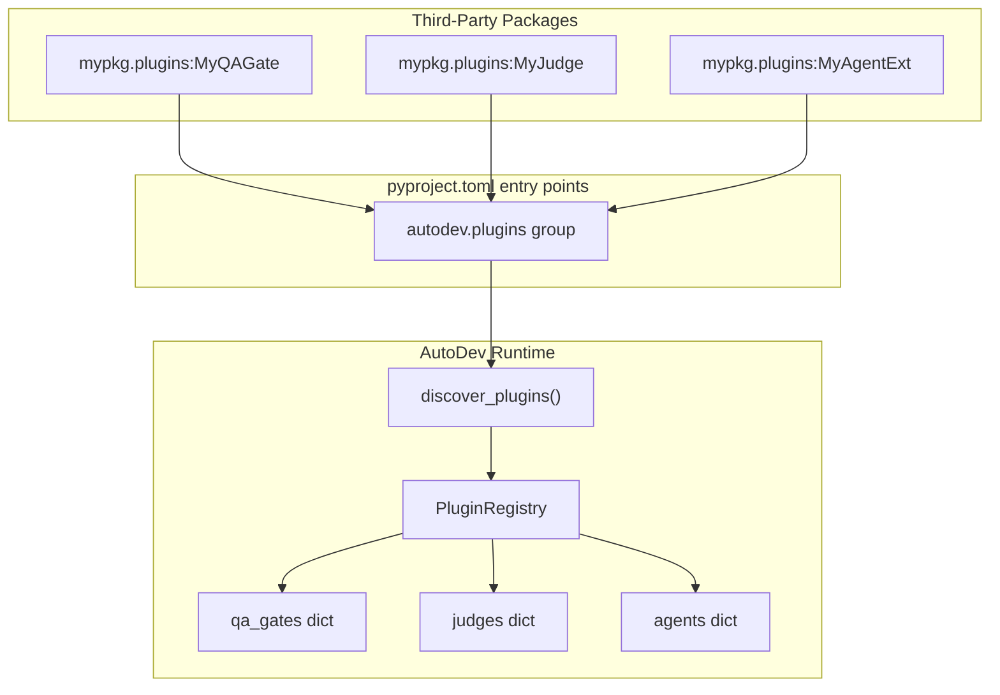
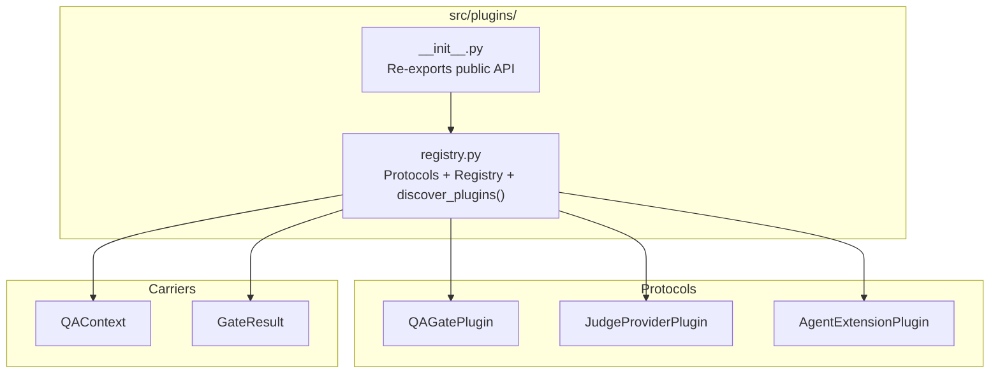
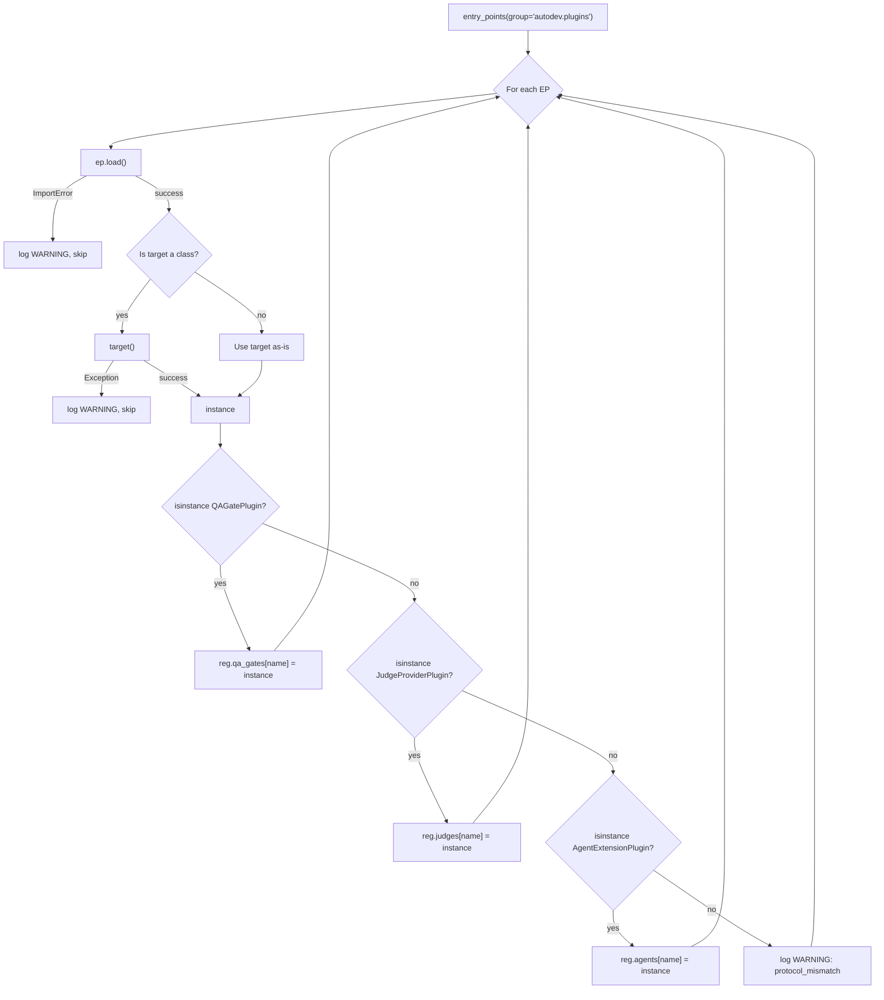

# Plugin Discovery & Protocols Design

**Status:** Implemented
**Author:** Mohamed Ameen
**Date:** 2026-04-17
**Last Updated:** 2026-04-17
**Reviewers:** --
**Package:** `src/plugins/`
**Entry Point:** N/A (library-only, consumed at orchestrator startup)

## 1. Overview

### 1.1 Purpose

The plugin system allows third-party packages to extend AutoDev without modifying its source. Plugins are discovered at runtime via Python's `importlib.metadata.entry_points` mechanism and classified into three kinds: QA gates, tournament judges, and agent extensions. The system achieves zero coupling -- plugin authors need not import any AutoDev types. Instead, they implement one of three `@runtime_checkable` Protocol classes that define the required shape (structural subtyping).

### 1.2 Scope

**In scope:**

- Three plugin protocols: `QAGatePlugin`, `JudgeProviderPlugin`, `AgentExtensionPlugin`.
- `PluginRegistry` dataclass that buckets discovered instances by kind.
- `discover_plugins()` function that walks entry points, loads, instantiates, classifies, and registers plugins.
- Carrier dataclasses `QAContext` and `GateResult` for QA gate plugins.
- Failure isolation guarantees.

**Out of scope:**

- Built-in QA gate implementations (Phase 8).
- Plugin configuration / parameterization beyond zero-arg construction.
- Plugin lifecycle management (hot-reload, unload).
- Plugin versioning or compatibility negotiation.

### 1.3 Context

Plugins sit at the boundary of AutoDev's core pipeline. QA gate plugins are invoked during the QA phase after agent code generation. Judge provider plugins are invoked during tournament rounds to rank candidate solutions. Agent extension plugins contribute or override agent definitions during workspace initialization. All three are optional extensions -- AutoDev functions fully without any plugins installed.



## 2. Requirements

### 2.1 Functional Requirements

- **FR-1:** Discover all plugins declared under the `autodev.plugins` entry-point group using `importlib.metadata.entry_points`.
- **FR-2:** Classify each discovered plugin into exactly one of three buckets (QA gate, judge, agent extension) based on which `@runtime_checkable` Protocol it satisfies.
- **FR-3:** Plugins that fail to load (`ImportError`), fail to instantiate (exception in `__init__`), or match no supported Protocol are logged at WARNING level and skipped -- never crash the host.
- **FR-4:** Each plugin must expose a `name: str` attribute. If missing or empty, the entry-point name is used as fallback.
- **FR-5:** Name collisions within a bucket are resolved by last-writer-wins (entry-point iteration order is deterministic by package name).
- **FR-6:** Pre-instantiated values (non-class targets) are accepted directly without calling `target()`.
- **FR-7:** Provide `QAContext` and `GateResult` carrier dataclasses for QA gate plugins.

### 2.2 Non-Functional Requirements

- **Crash-safety:** A malformed or broken plugin must never crash the AutoDev host process. All failures are caught, logged, and skipped.
- **Subprocess isolation:** Plugin discovery runs in the main orchestrator process. Plugin execution (e.g., `QAGatePlugin.run()`) is async and must not block the event loop.
- **Asyncio concurrency:** `QAGatePlugin.run()` and `JudgeProviderPlugin.rank()` are async methods, allowing the orchestrator to invoke them concurrently with bounded semaphores.
- **Pydantic v2 strict validation:** The plugin system itself does not use Pydantic models for plugin data (carrier dataclasses are plain `@dataclass`), preserving the zero-coupling guarantee.
- **LLM cost efficiency:** Plugins do not inherently make LLM calls. However, judge provider plugins will make LLM calls when ranking -- this is bounded by the tournament engine's round limits.
- **Maintainability:** All logging uses `structlog` via the project's `autologging` module.

### 2.3 Constraints

- Plugin classes must be instantiable with zero arguments (`cls()`).
- Plugins must not import AutoDev types at module level (zero-coupling).
- Entry-point group name is fixed to `autodev.plugins`.
- `runtime_checkable` Protocol checking only validates attribute presence, not method signatures. This is a known Python limitation accepted as sufficient for this loose contract.

## 3. Architecture

### 3.1 High-Level Design



### 3.2 Component Structure

| File | Element | Responsibility |
|------|---------|---------------|
| `src/plugins/__init__.py` | Module init | Re-exports all public symbols from `registry.py` |
| `src/plugins/registry.py` | `QAGatePlugin` | Protocol for custom QA gates |
| `src/plugins/registry.py` | `JudgeProviderPlugin` | Protocol for custom tournament judges |
| `src/plugins/registry.py` | `AgentExtensionPlugin` | Protocol for agent definition contributors |
| `src/plugins/registry.py` | `QAContext` | Dataclass carrier: inputs for QA gate execution |
| `src/plugins/registry.py` | `GateResult` | Dataclass carrier: verdict from a QA gate |
| `src/plugins/registry.py` | `PluginRegistry` | Dataclass bucketing discovered plugins by kind |
| `src/plugins/registry.py` | `discover_plugins()` | Entry-point walker and classifier |
| `src/plugins/registry.py` | `_plugin_name()` | Helper to extract `name` from instance or fallback to entry-point name |

### 3.3 Data Models

```python
@dataclass
class QAContext:
    """Inputs handed to QAGatePlugin.run()."""
    cwd: Path           # Repo worktree path
    task_id: str        # Task correlation ID
    diff: str | None = None  # Optional raw diff text

@dataclass
class GateResult:
    """Verdict emitted by a QAGatePlugin."""
    passed: bool
    details: str = ""
```

```python
@dataclass
class PluginRegistry:
    """Buckets discovered plugin instances by kind."""
    qa_gates: dict[str, QAGatePlugin] = field(default_factory=dict)
    judges: dict[str, JudgeProviderPlugin] = field(default_factory=dict)
    agents: dict[str, AgentExtensionPlugin] = field(default_factory=dict)

    @property
    def total(self) -> int:
        return len(self.qa_gates) + len(self.judges) + len(self.agents)

    def is_empty(self) -> bool:
        return self.total == 0
```

### 3.5 Protocol / Interface Contracts

```python
@runtime_checkable
class QAGatePlugin(Protocol):
    """A custom QA gate that evaluates a checked-out diff."""
    name: str
    async def run(self, ctx: QAContext) -> GateResult: ...

@runtime_checkable
class JudgeProviderPlugin(Protocol):
    """A custom tournament judge returning a ranking of version ids."""
    name: str
    async def rank(self, task: str, versions: list[Any]) -> list[str]: ...

@runtime_checkable
class AgentExtensionPlugin(Protocol):
    """A plugin that contributes or overrides an agent definition."""
    name: str
    def get_spec(self) -> Any: ...
    def render_platform(self, platform: str) -> str: ...
```

Key design points:

- All three protocols are `@runtime_checkable`, enabling `isinstance()` checks at discovery time.
- `QAGatePlugin.run()` and `JudgeProviderPlugin.rank()` are `async` so long-running operations (subprocess gates, LLM calls) do not block the event loop.
- `AgentExtensionPlugin.get_spec()` returns `Any` (duck-typed) to avoid a hard import cycle with `adapters.types.AgentSpec`.
- The `name: str` attribute is required by all three protocols for registration keying.

### 3.6 Interfaces

**`discover_plugins(group: str = "autodev.plugins") -> PluginRegistry`**

The sole entry point for the plugin system. Called once at orchestrator startup.

| Parameter | Type | Default | Description |
|-----------|------|---------|-------------|
| `group` | `str` | `"autodev.plugins"` | Entry-point group to scan. Override only in tests. |

Returns a `PluginRegistry` populated with all successfully loaded plugins.

## 4. Design Decisions

### 4.1 Key Decisions

| Decision | Rationale | Alternatives Considered |
|----------|-----------|------------------------|
| `@runtime_checkable Protocol` for plugin contracts | Zero coupling -- plugin authors never need to `import autodev`. Structural subtyping checks shape at runtime. | ABC with `register()`, zope.interface, explicit marker base class |
| Plain `@dataclass` for carriers (not Pydantic) | Carriers cross the plugin boundary. Requiring Pydantic would force a dependency on autodev's Pydantic version in every plugin package. | Pydantic `BaseModel`, TypedDict, plain dict |
| Entry-point group `autodev.plugins` (single group) | Simplicity. One group for all plugin kinds; classification is done via Protocol isinstance check. | Separate groups per kind (`autodev.qa_gates`, `autodev.judges`, `autodev.agents`) |
| Last-writer-wins for name collisions | Entry-point iteration order is alphabetical by package name (stdlib behavior), making this deterministic. Explicit collision handling would add complexity for an unlikely scenario. | Raise on collision, merge, first-writer-wins |
| Instantiate targets with `target()` only if they are classes | Supports both class-based plugins (`cls()`) and pre-instantiated module-level singletons. | Always require classes, always require instances |

### 4.2 Trade-offs

- **Loose contract vs. strong typing:** `runtime_checkable` only checks attribute presence, not method signatures or return types. A plugin could satisfy the Protocol check but return wrong types at runtime. This is accepted as the cost of zero-coupling.
- **Single-group vs. multi-group:** Using one entry-point group means every plugin is loaded and checked against all three Protocols. With many plugins, this is O(N * 3) isinstance checks. Acceptable for the expected plugin count (< 50).
- **No plugin configuration:** Plugins must be constructable with zero arguments. Any configuration must come from the plugin's own environment variables or config files. This simplifies discovery but limits parameterization.

## 5. Implementation Details

### 5.1 Core Algorithms/Logic

**Discovery pipeline (`discover_plugins`):**



The classification uses `elif` chains (not independent `if` blocks), meaning a plugin is bucketed into exactly one kind even if it satisfies multiple protocols. Priority order: QAGatePlugin > JudgeProviderPlugin > AgentExtensionPlugin.

**Name resolution (`_plugin_name`):**

Returns `instance.name` if it exists and is a non-empty string; otherwise falls back to the entry-point name (`ep.name`).

### 5.2 Concurrency Model

Discovery (`discover_plugins`) is synchronous and runs once at startup. Plugin execution (`QAGatePlugin.run()`, `JudgeProviderPlugin.rank()`) is async and can be run concurrently by the orchestrator using `asyncio.gather` with bounded semaphores.

### 5.3 Subprocess Invocation Pattern

Not applicable. Plugins run in-process. If a plugin needs to spawn a subprocess (e.g., a linter gate), that is the plugin's responsibility.

### 5.4 Atomic I/O Pattern

Not applicable. The plugin system does not write to disk.

### 5.5 Error Handling

The discovery pipeline wraps every step in `try/except Exception`:

| Step | Failure Mode | Handling |
|------|-------------|----------|
| `entry_points(group=group)` | stdlib failure (defensive) | Log WARNING, return empty registry |
| `ep.load()` | `ImportError`, missing dependency | Log WARNING with entry-point name and error, `continue` |
| `target()` instantiation | Exception in `__init__` | Log WARNING with entry-point name and error, `continue` |
| Protocol `isinstance` check | No match | Log WARNING `protocol_mismatch` with type name, `continue` |

This ensures that a single broken plugin never takes down the entire AutoDev process.

### 5.6 Dependencies

- **Internal:** `autologging.get_logger`
- **stdlib:** `importlib.metadata.entry_points`, `dataclasses`, `pathlib`, `typing`
- **External:** None

### 5.7 Configuration

Plugin discovery is configuration-free. Plugins are registered solely through `pyproject.toml` entry points:

```toml
[project.entry-points."autodev.plugins"]
my_qa_gate = "mypkg.plugins:MyQAGate"
my_judge   = "mypkg.plugins:MyJudge"
my_agent   = "mypkg.plugins:MyAgentExtension"
```

The `group` parameter of `discover_plugins()` defaults to `"autodev.plugins"` and can be overridden in tests.

## 6. Integration Points

### 6.1 Dependencies on Other Components

- **`autologging`**: Structured logging for discovery events.
- No other AutoDev components are imported by the plugin system.

### 6.2 Adapter Contract Dependency

`AgentExtensionPlugin.get_spec()` returns an `AgentSpec`-compatible object (duck-typed from `adapters.types`). The import is intentionally lazy to avoid a hard cycle. The consuming component (workspace initializer) is responsible for validating the returned spec.

### 6.3 Ledger Event Emissions

The plugin system does not write ledger events. Plugin discovery results may be logged by the orchestrator.

### 6.4 Components That Depend on This

- **QA phase engine**: Iterates `registry.qa_gates` and invokes each gate's `run()` method.
- **Tournament engine**: Iterates `registry.judges` and invokes each judge's `rank()` method.
- **Workspace initializer**: Iterates `registry.agents` and merges contributed specs into the agent roster.
- **Orchestrator startup**: Calls `discover_plugins()` once and passes the `PluginRegistry` to downstream components.

### 6.5 External Systems

- **Python packaging ecosystem**: Plugins are installed as standard Python packages with entry-point declarations. `pip install mypkg` is the only step needed to make a plugin visible.

## 7. Testing Strategy

### 7.1 Unit Tests

- **Protocol satisfaction**: Create minimal classes that satisfy each protocol and verify `isinstance()` returns True.
- **Protocol rejection**: Create classes missing required attributes and verify `isinstance()` returns False.
- **PluginRegistry.total and is_empty**: Verify counting across all three buckets.
- **_plugin_name**: Verify fallback to entry-point name when `name` attribute is missing, empty, or non-string.
- **GateResult and QAContext**: Verify construction and field access.

### 7.2 Integration Tests

- **Mock entry points**: Use `importlib.metadata` test utilities or monkeypatching to simulate entry points with valid plugins, broken plugins, and protocol mismatches. Verify the registry is populated correctly and warnings are logged.
- **Name collision**: Register two plugins with the same `name`. Verify the latter wins.
- **Pre-instantiated target**: Register a module-level instance (not a class) as an entry point. Verify it is accepted without calling `target()`.

### 7.3 Property-Based Tests

- **Hypothesis for PluginRegistry**: Generate random combinations of plugin instances across buckets. Assert `total` always equals the sum of bucket sizes.

### 7.4 Test Data Requirements

- Minimal stub classes implementing each protocol (3 stubs).
- Broken stub classes that raise in `__init__`, miss the `name` attribute, or implement no protocol.
- Mock entry-point objects or monkeypatched `importlib.metadata.entry_points`.

## 8. Security Considerations

- **Arbitrary code execution**: Loading an entry point executes arbitrary Python code. This is inherent to the entry-point mechanism. Operators must trust installed packages, just as they trust any `pip install`.
- **No sandboxing**: Plugins run in the same process as AutoDev. A malicious plugin has full access to the filesystem and environment. Future work may introduce subprocess isolation for untrusted plugins.
- **No secret exposure**: The plugin system does not handle secrets. `QAContext` contains only the working directory, task ID, and diff text.

## 9. Performance Considerations

- **Discovery latency**: `entry_points()` scans installed package metadata, which is I/O-bound on first call but typically cached by the Python runtime. Expected latency: < 100ms for typical environments.
- **Classification overhead**: Three `isinstance()` checks per plugin, each O(1) attribute lookup. Negligible.
- **Plugin execution**: Entirely dependent on the plugin implementation. Async methods prevent blocking the event loop, but expensive plugins (e.g., running a full test suite) should be bounded by the orchestrator's concurrency semaphore.

## 10. Installation & CLI Entry

### 10.1 Package Registration

The plugin system is part of the core `autodev` wheel (`src/plugins/`). No separate entry point is needed for the discovery mechanism itself.

Third-party plugins register via their own `pyproject.toml`:

```toml
[project.entry-points."autodev.plugins"]
my_qa_gate = "mypkg.plugins:MyQAGate"
```

### 10.2 CLI Commands

None. Plugin discovery is automatic at orchestrator startup. Discovered plugins may be listed via `autodev status` or a future `autodev plugins list` command.

## 11. Observability

### 11.1 Structured Logging

```python
# Successful discovery summary
log.info("plugins.discover.done",
    qa_gates=len(reg.qa_gates),
    judges=len(reg.judges),
    agents=len(reg.agents),
)

# Failed to load entry point
log.warning("plugins.load_failed", name=ep.name, error=str(exc))

# Failed to instantiate plugin class
log.warning("plugins.instantiate_failed", name=ep.name, error=str(exc))

# Plugin matches no supported protocol
log.warning("plugins.protocol_mismatch",
    name=ep.name,
    type=type(instance).__name__,
)
```

### 11.2 Audit Artifacts

None. Plugin discovery results are logged but not persisted to `.autodev/`.

### 11.3 Status Command

A future `autodev status` or `autodev plugins list` could display:

- Number of discovered plugins per bucket.
- Plugin names and source packages.
- Any plugins that failed to load (from structured logs).

## 12. Cost Implications

The plugin system itself makes zero LLM calls. Cost implications depend on the plugins:

| Plugin Kind | LLM Calls | Notes |
|-------------|-----------|-------|
| QA gate | 0 (typically) | Most QA gates run linters/tests, not LLM calls |
| Judge provider | 1 per ranking call | Custom judges may invoke LLMs; bounded by tournament `max_rounds` |
| Agent extension | 0 | Contributes specs, does not invoke LLMs directly |

## 13. Future Enhancements

- **Plugin configuration**: Allow plugins to declare configuration schemas that are merged into `.autodev/config.json` under a `plugins` key.
- **Plugin versioning**: Support version constraints so AutoDev can reject incompatible plugins.
- **Hot-reload**: Detect newly installed plugins without restarting AutoDev.
- **Subprocess isolation**: Run untrusted plugins in isolated subprocesses for security.
- **Multi-protocol plugins**: Allow a single plugin to satisfy multiple protocols (currently only the first match is used due to `elif` chaining).
- **Built-in QA gates (Phase 8)**: Implement the default gates (syntax, lint, build, test, secretscan) as internal plugins using the same Protocol.

## 14. Open Questions

- [ ] Should plugins be able to declare dependencies on other plugins?
- [ ] Should the `elif` classification be changed to allow multi-protocol plugins (e.g., a plugin that is both a QA gate and a judge)?
- [ ] Should plugin execution have its own timeout/guardrail independent of the task-level guardrails?
- [ ] Should `QAContext` be extended with additional fields (e.g., config reference, repo metadata) for Phase 8?

## 15. Related ADRs

- ADR-005: Protocol-based plugin system (rationale for `@runtime_checkable` Protocol over ABC/marker class)

## 16. References

- `src/plugins/__init__.py` -- Public API re-exports
- `src/plugins/registry.py` -- Protocol definitions, PluginRegistry, discover_plugins()
- `src/adapters/types.py` -- AgentSpec (duck-typed by AgentExtensionPlugin)
- Python documentation: [importlib.metadata entry points](https://docs.python.org/3/library/importlib.metadata.html#entry-points)
- Python documentation: [typing.runtime_checkable](https://docs.python.org/3/library/typing.html#typing.runtime_checkable)

## 17. Revision History

| Date | Author | Changes |
|------|--------|---------|
| 2026-04-17 | Mohamed Ameen | Initial draft |
