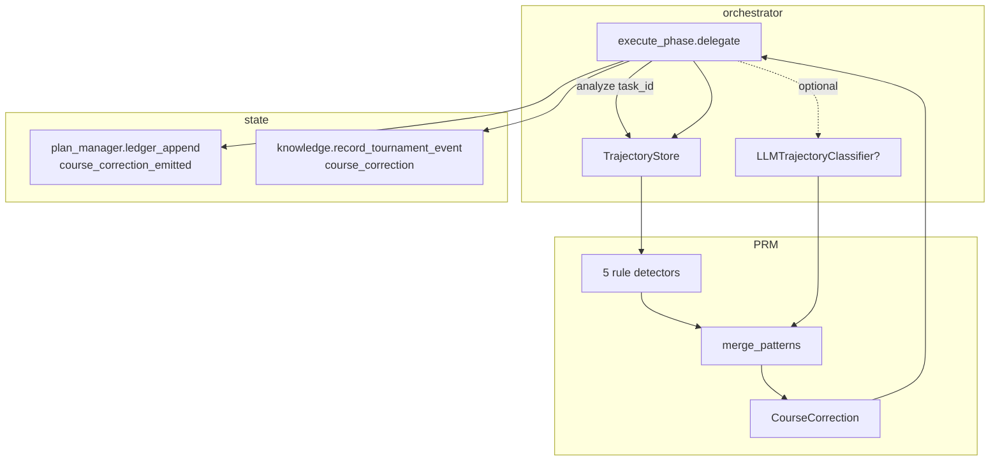

# PRM (Process Reward Model) Design

**Status:** Implemented
**Author:** Mohamed Ameen
**Date:** 2026-05-09
**Last Updated:** 2026-05-09
**Reviewers:** --
**Package:** `src/orchestrator/prm.py`
**Entry Point:** N/A (library + executor integration; no CLI command)
**Version Introduced:** v0.15.0 (rule-based detectors); v0.20.0 A1 (LLM augmentation, `PRMConfig`)

## 1. Overview

### 1.1 Purpose

The PRM (Process Reward Model) scores a task's *trajectory* — the chronological sequence of agent dispatches — and detects failure-mode patterns that a single-step reward signal would miss. When a pattern fires, the PRM emits a `CourseCorrection` markdown block that the executor splices into the next agent's prompt, nudging the agent off a stuck path before the budget is exhausted.

It is the in-loop, per-dispatch counterpart to the tournament-scoped `PlateauDetector`. Where the plateau detector watches *outcome quality* across passes, the PRM watches *process patterns* across dispatches within a single execute task.

### 1.2 Scope

**In scope:**

- `TrajectoryEvent` and `TrajectoryStore` — append-only, FIFO-evicted per-task event log.
- Five rule-based detectors (`detect_repetition_loop`, `detect_ping_pong`, `detect_expansion_drift`, `detect_stuck_on_test`, `detect_context_thrash`).
- `LLMTrajectoryClassifier` — opt-in LLM-augmentation that emits the same `Pattern` objects from a Haiku-class model.
- `merge_patterns` — rules-primary deduplication policy.
- `CourseCorrection` — formatting + fingerprint cap (one correction per fingerprint per task).
- Wiring into `orchestrator.execute_phase.delegate`.
- Configuration via `PRMConfig` (`strategy`, `ml_threshold`, `ml_min_events`).

**Out of scope:**

- Trajectory persistence beyond a single executor session (the store is in-memory only).
- Reward learning (no policy update; the PRM only emits suggestions).
- Per-tournament-pass scoring (that is the tournament Borda/veto aggregator's job).

### 1.3 Context

The PRM lives between the executor's pre-invocation lessons-injection step and the post-invocation result-recording step. Its place in the pipeline:

```mermaid
flowchart TB
    A["delegate(task, role)"] --> B[inject lessons block]
    B --> C{trajectory_store.analyze(task_id)}
    C -->|patterns empty| D[run agent]
    C -->|patterns matched| C2{cfg.prm.strategy == "rules+ml"?}
    C2 -->|yes + classifier wired| C3[LLMTrajectoryClassifier.classify]
    C3 --> C4[merge_patterns]
    C2 -->|no| C5[use rule patterns]
    C4 --> E
    C5 --> E[CourseCorrection.from_pattern top]
    E --> F{has_emitted fingerprint?}
    F -->|yes| D
    F -->|no| G[splice CC block + ledger op + knowledge event]
    G --> D
    D --> H[record TrajectoryEvent]
    H --> I[return AgentResult]
```

## 2. Requirements

### 2.1 Functional Requirements

- **FR-1:** Record one `TrajectoryEvent` per delegate dispatch, capturing role, action, target files, success flag, duration, and timestamp.
- **FR-2:** Run five rule-based detectors against the trailing event window of each task and return matched `Pattern` objects ranked by severity.
- **FR-3:** Allow opt-in LLM augmentation that emits additional patterns at confidence ≥ `cfg.prm.ml_threshold`.
- **FR-4:** Cap the per-task event log at 50 entries; evict FIFO when full.
- **FR-5:** Emit at most one `CourseCorrection` per `(taxonomy, pattern)` fingerprint per task.
- **FR-6:** When a correction is emitted, append a `course_correction_emitted` ledger op AND record a `course_correction` `TournamentEvent` in the swarm-tier knowledge store.
- **FR-7:** Gracefully degrade on any error (LLM failure, ledger failure, knowledge-store failure) — never block dispatch.

### 2.2 Non-Functional Requirements

- **Crash-safety:** The trajectory store is in-memory only by design — a crash mid-run loses trajectory data. This mirrors the rest of v0.15.0's stuck-state design (the persistent signal is the `course_correction_emitted` ledger op).
- **Subprocess isolation:** The PRM runs entirely in the orchestrator process; no subprocess.
- **Asyncio concurrency:** `LLMTrajectoryClassifier.classify` is async (it awaits the completer). The rule-based detectors are pure sync. The store is NOT thread-safe — consumers must serialize via the per-task worker (which the executor already does).
- **Pydantic v2 strict validation:** `PRMConfig` uses `ConfigDict(extra="forbid")` and validates `ml_threshold ∈ [0,1]` and `ml_min_events ≥ 1`.
- **LLM cost efficiency:** Default `strategy="rules"` makes zero LLM calls. `"rules+ml"` adds one Haiku-class call per dispatch when the trajectory has ≥ `ml_min_events` events; cold-start guard skips early dispatches.
- **Deterministic reproducibility:** Rule-based detectors are deterministic (pure functions of the event list). LLM detectors are not deterministic; merge policy ensures rule-only output is stable when ML is off.
- **Maintainability:** Patterns + taxonomy + default suggestions are colocated in `prm.py` lookup tables (`_PATTERN_SEVERITY`, `_PATTERN_TAXONOMY`, `_PATTERN_DEFAULT_SUGGESTION`). Adding a pattern is a 3-table edit + new detector function.

### 2.3 Constraints

- Must not introduce a numpy / scikit-learn dependency.
- Must not block executor dispatch on classifier failure.
- Must work with the existing `TrajectoryStore` (no schema migration of existing events when ML is opted in).

## 3. Architecture

### 3.1 High-Level Design



### 3.2 Component Structure

| File | Element | Responsibility |
|------|---------|---------------|
| `src/orchestrator/prm.py` | `TrajectoryEvent` | Frozen dataclass — one dispatch event |
| `src/orchestrator/prm.py` | `TrajectoryStore` | Per-task in-memory log + `analyze()` orchestration |
| `src/orchestrator/prm.py` | `Pattern` | Detected pattern with derived `taxonomy` + `severity` |
| `src/orchestrator/prm.py` | `CourseCorrection` | Markdown block + fingerprint for emission cap |
| `src/orchestrator/prm.py` | `detect_*` functions | Five rule-based detectors |
| `src/orchestrator/prm.py` | `LLMTrajectoryClassifier` | Opt-in LLM augmentation |
| `src/orchestrator/prm.py` | `merge_patterns` | Rules-primary dedup |
| `src/config/schema.py` | `PRMConfig` | Strategy + thresholds (`extra="forbid"`) |
| `src/orchestrator/__init__.py` | `Orchestrator._trajectory_store` | Lazy slot wired in `__init__` |
| `src/orchestrator/execute_phase.py` (lines 2460-2554, 2694-2719) | `delegate` integration | Analyze → emit → record |

### 3.3 Data Models

```python
@dataclass(frozen=True)
class TrajectoryEvent:
    timestamp: float          # epoch seconds — used by detect_context_thrash
    role: str                 # "developer", "test_engineer", ...
    action: str               # "edit", "test", "review", or envelope.action
    target_files: tuple[str, ...]
    success: bool
    duration_s: float

@dataclass
class Pattern:
    name: str                 # one of PatternName
    @property
    def taxonomy(self) -> str:    # derived via _PATTERN_TAXONOMY
    @property
    def severity(self) -> int:    # derived via _PATTERN_SEVERITY

@dataclass
class CourseCorrection:
    taxonomy: str
    pattern: str
    suggestion: str
    @classmethod
    def from_pattern(cls, p: Pattern) -> "CourseCorrection": ...
    def format_for_prompt(self) -> str: ...   # markdown block
    def fingerprint(self) -> str:              # f"{taxonomy}:{pattern}"
```

### 3.4 Pattern Catalogue

Five canonical patterns. Severity governs which `CourseCorrection` is emitted when multiple patterns fire simultaneously (`analyze()` pre-sorts descending).

| Pattern | Severity | Taxonomy | Threshold | What it catches |
|---------|----------|----------|-----------|-----------------|
| `stuck_on_test` | 5 | `coordination_error` | 3 consecutive failed `test_engineer` events at tail | Test engineer hammering a failure without varying |
| `expansion_drift` | 4 | `specification_error` | 3 events at tail with strictly growing `target_files` set + no success | Scope creep without progress |
| `context_thrash` | 3 | `coordination_error` | 5 events at tail with no shared files between consecutive pairs | Rapid topic-switching producing shallow changes |
| `ping_pong` | 2 | `reasoning_error` | 4 events at tail alternating between exactly two distinct `target_files` sets | Bouncing between two files without committing |
| `repetition_loop` | 1 | `reasoning_error` | 3 consecutive events at tail with identical `(role, action, target_files)` | Same edit on same files repeatedly |

Detector source: `src/orchestrator/prm.py` lines 286-367. Each detector is a pure function returning `Pattern \| None`.

### 3.5 PRMConfig

```python
class PRMConfig(BaseModel):
    """v0.20.0 A1: configuration for the trajectory PRM."""
    model_config = ConfigDict(extra="forbid")

    strategy: Literal["rules", "rules+ml"] = "rules"
    ml_threshold: float = Field(default=0.7, ge=0.0, le=1.0)
    ml_min_events: int = Field(default=3, ge=1)
```

| Field | Type | Default | Meaning |
|-------|------|---------|---------|
| `strategy` | `Literal["rules","rules+ml"]` | `"rules"` | Rules-only (byte-identical to v0.19.0) or rules-primary + LLM-secondary |
| `ml_threshold` | `float ∈ [0,1]` | `0.7` | Confidence cutoff below which the LLM classifier discards a pattern |
| `ml_min_events` | `int ≥ 1` | `3` | Cold-start guard — skip the LLM call when the task has fewer events than this |

### 3.6 LLM Classifier Wire Format

`_build_classify_prompt()` (line 406) renders a Haiku-friendly prompt. Expected response:

```json
{"patterns": [{"name": "stuck_on_test", "confidence": 0.85}]}
```

`_parse_classify_response()` (line 434) is defensive: tries strict JSON first (locating the first `{...}` block to skip prose), falls back to regex extraction of paired `(name, confidence)` so a slightly malformed response still yields useful patterns. Any name not in `_PATTERN_TAXONOMY` is dropped; any confidence below `ml_threshold` is dropped.

## 4. Design Decisions

### 4.1 Key Decisions

| Decision | Rationale | Alternatives Considered |
|----------|-----------|------------------------|
| Rule-based detectors as primary, LLM as secondary | Rules are precise, deterministic, and free; LLM adds recall on novel patterns the rules don't encode. Inverting the priority would burn tokens on every dispatch. | LLM-only (too expensive + non-deterministic); rules-only (misses novel modes — the v0.19.0 baseline) |
| In-memory store, FIFO eviction at 50 events | Trajectory data is only useful within one execute task; persistence buys nothing but disk cost. The 50-event cap bounds memory on long-running tasks while keeping the trailing window fresh. | Persistent ledger (overkill — `course_correction_emitted` already carries the audit signal); unbounded log (memory bomb on huge tasks) |
| Cap one CourseCorrection per fingerprint per task | A pattern that already fired and was acted on shouldn't re-fire and re-prompt every dispatch. Fingerprint = `taxonomy:pattern` ensures genuinely different patterns can each fire once. | No cap (annoying + token waste); cap by pattern name only (would suppress same-pattern-different-taxonomy cases — but no such case exists today) |
| `LLMTrajectoryClassifier` swallows all exceptions | The PRM is advisory; an LLM hiccup must never block the executor. Returning `[]` falls through to rule-only patterns, which is the correct degraded behavior. | Surface the error (would force the executor to handle it inline); retry (latency cost without clear benefit) |
| `merge_patterns` is rules-first dedup | Rule patterns are canonical (no confidence to attach); when both lists carry the same pattern, the rule version wins for stable reporting. | LLM-first (less stable across runs); union without dedup (inflates the pattern list) |
| `PRMConfig.strategy` as a `Literal` (not boolean) | Future strategies (e.g. `"ml-only"`, `"rules+ml-shadow"`) can be added without a schema break. | `bool ml_enabled` (less extensible) |

### 4.2 Trade-offs

- **Recall vs cost:** `"rules+ml"` adds one LLM call per dispatch with a sufficiently long trajectory. On a task with 30 dispatches that exceeds `ml_min_events` after dispatch 3, that's ~27 extra calls per task. Set `ml_threshold=0.85+` to suppress low-confidence noise; raise `ml_min_events` to delay the first call.
- **Determinism vs adaptability:** Rule-based detectors are deterministic and reviewable; LLM patterns are not. `"rules"` is the safe default; `"rules+ml"` is opt-in.
- **In-memory loss:** A crash mid-run loses the trajectory. This is acceptable because (a) the executor restarts the task on resume from the last completed dispatch, and (b) the persistent signal — `course_correction_emitted` ops in the ledger — is preserved.

## 5. Implementation Details

### 5.1 Core Algorithm

`TrajectoryStore.analyze(task_id)`:

1. Snapshot events via `events_for(task_id)`.
2. Run all five detectors in declaration order; collect non-`None` `Pattern` objects.
3. Sort descending by `severity`.
4. Return list (empty if no detectors fired).

`merge_patterns(rules_patterns, ml_patterns)`:

1. Iterate `rules_patterns`, add to `out` and `seen` sets.
2. Iterate `ml_patterns`, skip any in `seen`, otherwise add.
3. Sort descending by `severity`.
4. Return `out`.

### 5.2 Executor Integration (`execute_phase.delegate`)

Pre-dispatch (lines 2460-2554):

1. Resolve `trajectory_store = getattr(orch, "trajectory_store", None)`. Skip if missing.
2. Call `trajectory_store.analyze(envelope.task_id)`. Catch any exception, log `execute_phase.prm_analyze_failed`, fall through with `patterns=[]`.
3. Read `cfg.prm.strategy`. If `"rules+ml"` and `orch.llm_trajectory_classifier` is wired:
   - Snapshot `events_for(task_id)`.
   - `await ml_clf.classify(events)`.
   - On exception, log `execute_phase.prm_ml_classify_failed`; fall back to `ml_patterns=[]`.
   - If `ml_patterns` non-empty, `patterns = merge_patterns(patterns, ml_patterns)`.
4. If `patterns` non-empty, take `top = patterns[0]`, build `cc = CourseCorrection.from_pattern(top)`, compute `fingerprint = cc.fingerprint()`.
5. If not `trajectory_store.has_emitted(task_id, fingerprint)`:
   - Append `cc.format_for_prompt()` to the prompt parts.
   - `trajectory_store.mark_emitted(task_id, fingerprint)`.
   - Append `course_correction_emitted` ledger op (payload: `task_id, taxonomy, pattern, suggestion[:500]`). Catch + log on failure.
   - Record `course_correction` `TournamentEvent` (family `"prm"`, hypothesis includes pattern name + task id, evidence is the suggestion). Catch + log on failure.

Post-dispatch (lines 2694-2719):

1. Build `TrajectoryEvent(timestamp=_t0, role, action, target_files, success, duration_s)`.
2. `trajectory_store.record(envelope.task_id, event)`. Catch + log on failure.

### 5.3 Atomic I/O

The PRM does not write its own files. The two persistence points — `course_correction_emitted` ledger op and `course_correction` knowledge event — go through `plan_manager.ledger_append` (CAS-protected JSONL append) and `knowledge.record_tournament_event` (atomic JSONL append) respectively.

### 5.4 Error Handling

Every external call (`analyze`, `classify`, `ledger_append`, `record_tournament_event`, `record`) is wrapped in a try/except that logs a structured warning and continues. The PRM is *advisory* — its failures must never block the executor.

### 5.5 Dependencies

- **Internal:** `state.knowledge.TournamentEvent`, `state.plan_manager.PlanManager.ledger_append`, `config.schema.PRMConfig`
- **External:** stdlib only (`json`, `re`, `dataclasses`, `collections.deque`, `typing`). No numpy / scikit-learn / pydantic dependency in `prm.py` itself.

### 5.6 Configuration

`AutodevConfig.prm` is the single configuration point. Default `PRMConfig()` is safe (rules-only, no LLM calls). Operators flip on LLM augmentation by editing `.autodev/config.json`:

```json
{
  "prm": {
    "strategy": "rules+ml",
    "ml_threshold": 0.75,
    "ml_min_events": 5
  }
}
```

Wiring the classifier: when `strategy == "rules+ml"`, the orchestrator must additionally attach an `llm_trajectory_classifier` instance to itself (the `getattr(orch, "llm_trajectory_classifier", None)` call site is the contract). Today this wiring lives outside the orchestrator constructor — the integration test or runtime entrypoint constructs `LLMTrajectoryClassifier(completer=..., threshold=cfg.prm.ml_threshold, min_events=cfg.prm.ml_min_events)` and assigns it.

## 6. Integration Points

### 6.1 Dependencies on Other Components

- `state.plan_manager.PlanManager.ledger_append` for the `course_correction_emitted` op.
- `state.knowledge.KnowledgeStore.record_tournament_event` for the `course_correction` event.
- An `LLMCompleter` callable (typed as `Callable[[str], Awaitable[str]]`) when `"rules+ml"` is enabled.

### 6.2 Adapter Contract Dependency

None directly. The `LLMCompleter` callable is provider-agnostic — production wires it to a Haiku-class adapter via the platform adapter; tests stub it with a deterministic function.

### 6.3 Ledger Event Emissions

| Op | Payload | When |
|----|---------|------|
| `course_correction_emitted` | `{task_id, taxonomy, pattern, suggestion[:500]}` | After a `CourseCorrection` is spliced into a prompt for the first time per fingerprint per task. Defined in `state/ledger.py` line 99 + `plan_manager.py` line 991. |

### 6.4 Knowledge Events

| Event | Family | Confidence | When |
|-------|--------|-----------|------|
| `course_correction` | `prm` | `0.6` (per `_BASE_CONFIDENCE` in `state/knowledge.py` line 133) | Same trigger as `course_correction_emitted`. Recorded via `record_tournament_event`. |

### 6.5 Components That Depend on This

- `orchestrator.execute_phase.delegate` — the only consumer.
- `orchestrator.Orchestrator.__init__` (line 76) — owns the `TrajectoryStore` instance.

### 6.6 External Systems

When `"rules+ml"` is enabled and the classifier is wired to a real adapter, one Haiku-class LLM call per dispatch (subject to the cold-start guard).

## 7. Testing Strategy

### 7.1 Unit Tests

- Each `detect_*` function: positive cases, threshold-just-below cases, negative cases (no overlap, success interspersed).
- `merge_patterns`: dedup, ordering, severity sorting.
- `LLMTrajectoryClassifier.classify`: cold-start (returns `[]`), happy path (parses pattern), malformed JSON (regex fallback), thrown completer (returns `[]`).
- `_parse_classify_response`: strict JSON, trailing prose, regex fallback, unknown pattern names dropped, sub-threshold confidences dropped.
- `CourseCorrection.from_pattern` + `format_for_prompt` + `fingerprint`: round-trip and stability.
- `PRMConfig` round-trip via Pydantic `model_dump_json` / `model_validate_json`.

### 7.2 Integration Tests

- Run `delegate` with a mock orchestrator carrying a stub `trajectory_store` that pre-loaded events triggering `repetition_loop`. Assert the `## COURSE CORRECTION` block appears in the prompt and the ledger op is recorded.
- Run twice — assert the second call does NOT re-emit (fingerprint cap).
- Run with `cfg.prm.strategy="rules+ml"` and a stub classifier returning a novel pattern. Assert `merge_patterns` ordering.
- Run with a classifier that raises. Assert no exception escapes `delegate` and the rule-only pattern still emits.

### 7.3 Property-Based Tests

- Hypothesis strategy generating random `TrajectoryEvent` lists. Assert `analyze()` is total (never raises) and that returned patterns are sorted by severity descending.

## 8. Security Considerations

- The `suggestion` text injected into prompts is hardcoded in `_PATTERN_DEFAULT_SUGGESTION` (no user input). The LLM-classifier path only consumes pattern *names* (matched against the canonical taxonomy table), not suggestion text — so a malicious LLM response cannot inject prompt content.
- `ledger_append` and `record_tournament_event` truncate the suggestion to 500 chars defensively even though the source is already bounded.

## 9. Performance Considerations

- Rule detectors operate on at most 50 events (the FIFO cap) and are O(n) per detector; total per-`analyze()` cost is O(5n) ≈ O(n). Negligible.
- LLM classifier latency is ~300-800ms for a Haiku-class call on a typical 20-event trajectory summary. The cold-start guard (`ml_min_events`) defers the first call until the trajectory is genuinely long enough to yield signal.
- The fingerprint cap means at most one classifier round-trip pays off per task per pattern type — subsequent dispatches with the same pattern still call `classify` but the result is suppressed at the emit step. Future enhancement: short-circuit `classify` when all known patterns are already emitted.

## 10. CLI Entry

None. The PRM has no CLI command. Configuration is via `.autodev/config.json` only.

## 11. Observability

### 11.1 Structured Logging

| Event | When | Key fields |
|-------|------|-----------|
| `execute_phase.prm_analyze_failed` | `analyze()` raised | `task_id`, `err` |
| `execute_phase.prm_ml_classify_failed` | LLM classifier raised | `task_id`, `err` |
| `execute_phase.prm_record_failed` | `record()` raised | `task_id`, `err` |
| `execute_phase.ledger_append_failed` | Ledger op append failed | `op`, `err` |
| `execute_phase.knowledge_record_failed` | Knowledge event record failed | `event`, `err` |

### 11.2 Audit Artifacts

- `course_correction_emitted` ledger ops in `.autodev/ledger.jsonl` — every emitted correction is replayable.
- `course_correction` events in the swarm-tier knowledge store — feed back into the next session's ranked-lessons block.

### 11.3 Status Command

`autodev status` does not currently display PRM state. Future enhancement: surface "course corrections emitted this run" as a status counter.

## 12. Cost Implications

| Operation | LLM Calls | Notes |
|-----------|-----------|-------|
| Default (`strategy="rules"`) | 0 | Pure rule-based, no extra calls |
| `strategy="rules+ml"`, per dispatch with len(events) ≥ `ml_min_events` | 1 | Haiku-class call, ~150-400 input tokens (event summary), ≤100 output tokens |
| Per task (worst case, 30 dispatches, all qualifying) | ~27 | Subtract the first `ml_min_events` cold-start dispatches |
| Per plan with 10 tasks | ~270 | Multiply per-task cost by task count |

Mitigations: raise `ml_threshold` (admit fewer patterns), raise `ml_min_events` (delay the first call), keep `strategy="rules"` for routine work and only enable on high-stakes refactors.

## 13. Future Enhancements

- **Short-circuit when all patterns already emitted:** Skip `classify` once every fingerprint in `_PATTERN_TAXONOMY` has been emitted for a task.
- **Persistent trajectory across resume:** Currently in-memory; persisting would let resumed tasks consult earlier-pre-crash patterns.
- **Pattern-confidence weighting in `merge_patterns`:** Today rules win on dedup with no confidence attached. Could attach a synthetic confidence (1.0 for rules) and pick the higher-confidence variant.
- **Telemetry counters:** Aggregate per-session counts of (analyzed, fired-by-rule, fired-by-ml, suppressed-by-fingerprint, suggested-and-followed) to evaluate PRM efficacy.

## 14. Open Questions

- [ ] Should `LLMTrajectoryClassifier` get a per-call cache keyed on the event-list digest to dedupe rapid back-to-back classifications within one dispatch round?
- [ ] Should the `course_correction` knowledge event respect `KnowledgeConfig.denylist_roles`? Today it is recorded under family `"prm"` with no role attribution.
- [ ] Should the fingerprint also include `task_phase` to allow re-emission across phase boundaries for the same pattern?

## 15. Related ADRs

- ADR-002: Append-only JSONL ledger with CAS — governs `course_correction_emitted` op shape.

## 16. References

- `src/orchestrator/prm.py` — full module
- `src/orchestrator/execute_phase.py` lines 2460-2554 (analyze + emit) and 2694-2719 (record)
- `src/orchestrator/__init__.py` lines 73-76, 163-165 (TrajectoryStore wiring)
- `src/config/schema.py` lines 361-386 (`PRMConfig`)
- `src/state/knowledge.py` lines 117-133 (`course_correction` event type + base confidence)
- `src/state/ledger.py` line 99, `src/state/plan_manager.py` line 991 (`course_correction_emitted` op registration)
- [`config_system_design.md`](config_system_design.md) — `PRMConfig` field documentation
- [`plateau_detection_design.md`](plateau_detection_design.md) — sister detector for tournament-pass plateaus

## 17. Revision History

| Date | Author | Changes |
|------|--------|---------|
| 2026-05-09 | Mohamed Ameen | Initial draft documenting v0.15.0 rule-based PRM + v0.20.0 A1 LLM augmentation. |
