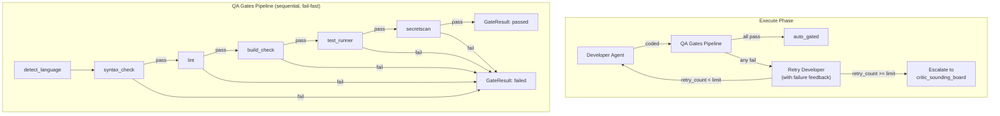

# QA Gates Pipeline Design

**Status:** Implemented
**Author:** Mohamed Ameen
**Date:** 2026-04-17
**Last Updated:** 2026-04-17
**Reviewers:** --
**Package:** `src/qa/`
**Entry Point:** Invoked by `orchestrator/execute_phase.py` after the `coded` status; no standalone CLI subcommand.

## 1. Overview

### 1.1 Purpose

The QA Gates Pipeline provides a sequential battery of local, zero-LLM-cost quality checks that run automatically after a developer agent produces code and before a reviewer sees it. Each gate validates one dimension of code quality (syntax correctness, lint compliance, build integrity, test passage, secret absence) and returns a pass/fail verdict. A failed gate triggers a developer retry with structured feedback, preventing obviously broken code from consuming expensive reviewer and tournament cycles.

### 1.2 Scope

**In scope:**

- Language and toolchain detection from project manifest files
- Five built-in gates: `syntax_check`, `lint`, `build_check`, `test_runner`, `secretscan`
- Sequential fail-fast pipeline execution
- Per-gate configuration toggles via `QAGatesConfig`
- Graceful degradation when tools are not installed
- `GateResult` return type for uniform verdict reporting
- Extension via `QAGatePlugin` protocol for third-party gates

**Out of scope:**

- SAST scanning (toggle exists in config but not yet implemented)
- Mutation testing (toggle exists in config but not yet implemented)
- LLM-based code review (that is the `reviewer` agent role, not a QA gate)
- Retry/escalation logic (handled by `orchestrator/execute_phase.py`)

### 1.3 Context

The QA Gates Pipeline sits between the developer agent and the reviewer agent in the execute phase:

```
developer (coded) -> [QA GATES] -> auto_gated -> reviewer -> tested -> tournament -> complete
```

Gates run locally using the project's own toolchain. They are the cheapest validation layer in the pipeline (zero LLM calls) and serve as the first filter, catching syntax errors, lint violations, build failures, test regressions, and leaked secrets before any LLM-based review occurs.

## 2. Requirements

### 2.1 Functional Requirements

- **FR-1:** Detect the project's primary language from manifest files (`pyproject.toml`, `package.json`, `Cargo.toml`, etc.).
- **FR-2:** Run each enabled gate in sequence: syntax_check -> lint -> build_check -> test_runner -> secretscan.
- **FR-3:** Stop at the first failed gate and return the failure details (fail-fast).
- **FR-4:** When a gate's required tool is not installed, pass gracefully with an informational message rather than failing.
- **FR-5:** Support per-gate enable/disable toggles via `QAGatesConfig`.
- **FR-6:** Support third-party gate extensions via the `QAGatePlugin` protocol.
- **FR-7:** Secret scanning must detect well-known secret patterns (AWS keys, GitHub PATs, Slack tokens, Stripe keys, private key headers) and high-entropy strings.

### 2.2 Non-Functional Requirements

- **Zero LLM cost:** All gates are local subprocess executions or in-process analysis. No LLM calls.
- **Asyncio concurrency:** All gates use `asyncio.create_subprocess_exec` and `asyncio.wait_for` with configurable timeouts. No blocking I/O on the event loop.
- **Fail-fast:** The pipeline short-circuits on the first failure. Remaining gates are not executed, minimizing time spent on a known-bad state.
- **Graceful degradation:** A missing tool (e.g., `ruff` not installed) causes the gate to pass with an informational message, not crash the pipeline. This ensures the orchestrator can run in minimal environments.
- **Maintainability:** Each gate is a standalone module with a single async entry function. Adding a new gate requires one new module and one entry in the pipeline list.

### 2.3 Constraints

- Must run on Python 3.11+ with no compiled extensions.
- Must work within a single-machine context.
- Tool availability depends on the user's environment (ruff, eslint, cargo, etc. are not bundled).
- Timeout defaults to 60 seconds per gate to prevent runaway subprocesses.

## 3. Architecture

### 3.1 High-Level Design



### 3.2 Component Structure

| File | Purpose |
|------|---------|
| `qa/__init__.py` | Re-exports all public gate functions and `GateResult` |
| `qa/detect.py` | `detect_language()` and `detect_toolchain()` -- manifest-based detection |
| `qa/syntax_check.py` | `run_syntax_check()` -- Python `py_compile`, Node.js `node --check` |
| `qa/lint.py` | `run_lint()` -- ruff (Python), eslint (Node.js), cargo clippy (Rust), golangci-lint (Go) |
| `qa/build_check.py` | `run_build_check()` -- py_compile (Python), tsc/npm build (Node.js), cargo check (Rust), go build (Go) |
| `qa/test_runner.py` | `run_tests()` -- pytest (Python), npm test (Node.js), cargo test (Rust), go test (Go) |
| `qa/secretscan.py` | `run_secretscan()` -- regex patterns + Shannon entropy heuristics |
| `plugins/registry.py` | `QAGatePlugin` protocol, `GateResult` dataclass, `QAContext`, plugin discovery |

### 3.3 Data Models

```python
@dataclass
class GateResult:
    """Verdict emitted by a QA gate."""
    passed: bool
    details: str = ""

@dataclass
class QAContext:
    """Inputs handed to QAGatePlugin.run()."""
    cwd: Path
    task_id: str
    diff: str | None = None

class QAGatesConfig(BaseModel):
    model_config = ConfigDict(extra="forbid")

    syntax_check: bool = True
    lint: bool = True
    build_check: bool = True
    test_runner: bool = True
    secretscan: bool = True
    sast_scan: bool = False       # not yet implemented
    mutation_test: bool = False    # not yet implemented
```

### 3.4 Protocol / Interface Contracts

```python
@runtime_checkable
class QAGatePlugin(Protocol):
    """A custom QA gate. Runs against a checked-out diff.

    Third-party gates are discovered via entry-points:
        [project.entry-points."autodev.plugins"]
        my_qa_gate = "mypkg.plugins:MyQAGate"
    """
    name: str

    async def run(self, ctx: QAContext) -> GateResult:
        """Evaluate the gate and return a GateResult.

        Must be async so long-running subprocess gates don't block
        the orchestrator event loop.
        """
        ...
```

Third-party plugins are discovered via `importlib.metadata.entry_points(group="autodev.plugins")` at runtime. Plugins that fail to load or don't satisfy the protocol are logged at WARNING level and skipped.

### 3.5 Interfaces

**Gate functions (all async, all return `GateResult`):**

| Function | Module | Description |
|----------|--------|-------------|
| `detect_language(cwd) -> str \| None` | `qa/detect.py` | Detect primary language from manifests |
| `detect_toolchain(cwd) -> str \| None` | `qa/detect.py` | Map language to canonical lint/build tool |
| `run_syntax_check(cwd, language, timeout_s) -> GateResult` | `qa/syntax_check.py` | Compile/parse all source files |
| `run_lint(cwd, language, timeout_s) -> GateResult` | `qa/lint.py` | Run language-appropriate linter |
| `run_build_check(cwd, language, timeout_s) -> GateResult` | `qa/build_check.py` | Run build/typecheck tool |
| `run_tests(cwd, language, timeout_s) -> GateResult` | `qa/test_runner.py` | Run project test suite |
| `run_secretscan(cwd) -> GateResult` | `qa/secretscan.py` | Scan for hard-coded secrets |

**Pipeline entry (in `execute_phase.py`):**

```python
async def _run_qa_gates(orch, task) -> str | None:
    """Run enabled QA gates. Returns the first failure detail string, or None if all pass."""
    cfg = orch.cfg.qa_gates
    language = detect_language(cwd)

    gates = [
        (cfg.syntax_check, lambda: run_syntax_check(cwd, language)),
        (cfg.lint,         lambda: run_lint(cwd, language)),
        (cfg.build_check,  lambda: run_build_check(cwd, language)),
        (cfg.test_runner,  lambda: run_tests(cwd)),
        (cfg.secretscan,   lambda: run_secretscan(cwd)),
    ]

    for enabled, gate_fn in gates:
        if not enabled:
            continue
        result = await gate_fn()
        if not result.passed:
            return result.details or "QA gate failed"
    return None
```

## 4. Design Decisions

### 4.1 Key Decisions

| Decision | Rationale | Alternatives Considered |
|----------|-----------|------------------------|
| Sequential fail-fast pipeline | A syntax error makes lint and build results meaningless. Failing fast saves time and provides a clear, focused error message for the developer retry. | Parallel execution (more expensive, confusing multi-error feedback), run all gates regardless (wastes time) |
| Graceful degradation on missing tools | AutoDev must work in minimal environments where not all tools are installed. A missing linter should not block the pipeline. | Hard-fail on missing tools (too strict), skip gates entirely (loses coverage) |
| Language detection via manifest files | Manifest files (pyproject.toml, package.json, etc.) are the most reliable indicator of project language and toolchain. | File extension heuristics (error-prone for polyglot repos), explicit config (extra burden) |
| In-process secret scanning | Avoids dependency on external tools like `trufflehog` or `gitleaks`. Uses well-known regex patterns and Shannon entropy for high-entropy string detection. | External tool dependency (not always available), git-hooks-only (doesn't catch secrets in non-git context) |
| `GateResult` as a simple dataclass | Gates need to return only pass/fail and details. No need for Pydantic validation at this boundary -- the data never crosses a serialization boundary. | Pydantic model (overhead not justified), exception-based signaling (less composable) |
| Plugin protocol for extensibility | Third-party gates (SAST tools, custom checks) can be added via entry-points without modifying AutoDev source. | Config-driven command list (less type-safe), monkey-patching (fragile) |

### 4.2 Trade-offs

- **Detection accuracy vs. simplicity:** Manifest-based detection uses first-match ordering. A polyglot repo with both `pyproject.toml` and `package.json` will be detected as Python. This is correct for AutoDev's single-language-at-a-time model but may miss secondary languages.
- **Coverage vs. tool dependency:** Built-in gates cover Python, Node.js, Rust, and Go. Other languages (Java, .NET, Ruby, Swift) are detected but gates pass with "no checker configured" -- coverage is language-dependent.
- **Entropy threshold:** The `_ENTROPY_THRESHOLD = 4.5` for secret scanning balances false positives (random IDs, hashes) against false negatives (short or low-entropy secrets). The threshold is tunable but not yet exposed in config.

## 5. Implementation Details

### 5.1 Core Algorithms/Logic

**Language detection (`detect_language`):**

First-match ordering against manifest files:

| Priority | File | Language |
|----------|------|----------|
| 1 | `pyproject.toml` or `setup.py` | `python` |
| 2 | `package.json` | `nodejs` |
| 3 | `Cargo.toml` | `rust` |
| 4 | `go.mod` | `go` |
| 5 | `pom.xml` or `build.gradle` | `java` |
| 6 | `*.csproj` | `dotnet` |
| 7 | `Gemfile` | `ruby` |
| 8 | `*.swift` | `swift` |

**Toolchain mapping (`detect_toolchain`):**

| Language | Tool |
|----------|------|
| python | ruff |
| nodejs | eslint |
| rust | cargo |
| go | golangci-lint |
| java | maven (or gradle if `build.gradle` present) |
| dotnet | dotnet |
| ruby | rubocop |
| swift | swiftlint |

**Secret scanning algorithm:**

1. **File filtering:** Skip known noise directories (`.git`, `node_modules`, `.venv`, `__pycache__`, etc.) and binary file extensions (`.pyc`, `.so`, `.png`, `.zip`, etc.).
2. **Regex pattern scan:** Match against 8 known secret patterns:
   - AWS access keys (`AKIA[0-9A-Z]{16}`)
   - GitHub PATs/OAuth/Actions tokens (`ghp_`, `gho_`, `ghs_` prefixes)
   - Private key headers (`-----BEGIN ... PRIVATE KEY-----`)
   - Slack tokens (`xox[baprs]-...`)
   - Stripe secret keys (`sk_live_...`)
   - Generic API key assignments (`api_key = "..."`)
3. **Shannon entropy scan:** Find quoted strings of 20+ alphanumeric characters and flag those with entropy >= 4.5 bits/char.

```python
def _shannon_entropy(text: str) -> float:
    if not text:
        return 0.0
    freq: dict[str, int] = {}
    for ch in text:
        freq[ch] = freq.get(ch, 0) + 1
    length = len(text)
    return -sum((c / length) * math.log2(c / length) for c in freq.values())
```

### 5.2 Concurrency Model

Each gate runs a subprocess asynchronously:

```python
async def _run_subprocess(
    args: list[str], cwd: Path, *, timeout_s: float, tool_name: str
) -> GateResult:
    try:
        proc = await asyncio.wait_for(
            asyncio.create_subprocess_exec(
                *args, cwd=cwd,
                stdout=asyncio.subprocess.PIPE,
                stderr=asyncio.subprocess.PIPE,
            ),
            timeout=timeout_s,
        )
        stdout, stderr = await asyncio.wait_for(proc.communicate(), timeout=timeout_s)
    except FileNotFoundError:
        return GateResult(passed=True, details=f"{tool_name} not found, skipping")
    except asyncio.TimeoutError:
        return GateResult(passed=False, details=f"{tool_name} timed out")

    if proc.returncode == 0:
        return GateResult(passed=True, details=f"{tool_name} passed")
    return GateResult(passed=False, details=f"{tool_name} failed:\n{combined}")
```

Key design points:
- `asyncio.create_subprocess_exec` avoids shell injection.
- `asyncio.wait_for` with configurable timeout prevents runaway processes.
- `FileNotFoundError` is caught for graceful degradation when the tool is not installed.
- `stdout` and `stderr` are captured via `PIPE` for inclusion in failure details.

Gates run sequentially (fail-fast), so no concurrent gate execution occurs within a single pipeline run.

### 5.3 Subprocess Invocation Pattern

All gate subprocesses follow a common pattern:

| Gate | Command(s) |
|------|-----------|
| **syntax_check (Python)** | `python -m py_compile <files>` |
| **syntax_check (Node.js)** | `node --check <file>` (per-file) |
| **lint (Python)** | `ruff check .` |
| **lint (Node.js)** | `npx eslint .` |
| **lint (Rust)** | `cargo clippy` |
| **lint (Go)** | `golangci-lint run` |
| **build_check (Python)** | `python -m py_compile <files>` |
| **build_check (Node.js)** | `npm run build` (if script exists) or `npx tsc --noEmit` |
| **build_check (Rust)** | `cargo check` |
| **build_check (Go)** | `go build ./...` |
| **test_runner (Python)** | `pytest` |
| **test_runner (Node.js)** | `npm test` |
| **test_runner (Rust)** | `cargo test` |
| **test_runner (Go)** | `go test ./...` |
| **secretscan** | (in-process, no subprocess) |

Python syntax check and build check filter files to exclude `.venv` and `__pycache__` directories. Node.js syntax check excludes `node_modules`.

### 5.4 Error Handling

Gates handle three error categories:

1. **Tool not found (`FileNotFoundError`):** Gate passes with informational message. This is graceful degradation, not an error.
2. **Timeout (`asyncio.TimeoutError`):** Gate fails. The timeout message is returned as the failure detail.
3. **Non-zero exit code:** Gate fails. Combined stdout+stderr is returned as the failure detail (truncated to first 20 findings for secretscan).

The pipeline caller (`_run_qa_gates` in `execute_phase.py`) returns the first failure detail string, which the orchestrator passes to `_try_retry_or_escalate`:
- If `retry_count < qa_retry_limit` (default 3): the developer is retried with the gate failure injected as `last_issues` context.
- If `retry_count >= qa_retry_limit`: the task is escalated to `critic_sounding_board` and marked as `blocked`.

### 5.5 Dependencies

- **asyncio:** Subprocess execution and timeout management.
- **re / math:** Secret scanning (regex patterns, Shannon entropy).
- **Internal:** `plugins/registry` for `GateResult` and `QAGatePlugin`, `qa/detect` for language detection.

No external Python dependencies. The gates invoke external CLI tools (ruff, eslint, pytest, etc.) as subprocesses, but these are not Python package dependencies.

### 5.6 Configuration

From `.autodev/config.json`:

```json
{
  "qa_gates": {
    "syntax_check": true,
    "lint": true,
    "build_check": true,
    "test_runner": true,
    "secretscan": true,
    "sast_scan": false,
    "mutation_test": false
  },
  "qa_retry_limit": 3
}
```

Each gate can be individually enabled or disabled. `sast_scan` and `mutation_test` are config placeholders for future gates.

## 6. Integration Points

### 6.1 Dependencies on Other Components

| Component | Dependency |
|-----------|------------|
| `plugins/registry.py` | `GateResult`, `QAGatePlugin`, `QAContext` types |
| `config/schema.py` | `QAGatesConfig` for per-gate toggles |

### 6.2 Adapter Contract Dependency

The QA gates do not depend on any adapter. They are pure local checks.

### 6.3 Ledger Event Emissions

The QA gates do not write to the ledger directly. The orchestrator's execute phase handles state transitions:
- On gate success: `update_task_status(task_id, "auto_gated")`
- On gate failure: retry via `_try_retry_or_escalate` (which may emit `update_task_status` entries)

### 6.4 Components That Depend on This

| Consumer | Usage |
|----------|-------|
| `orchestrator/execute_phase.py` | `_run_qa_gates()` calls all enabled gates sequentially |
| Plugin system | Third-party `QAGatePlugin` implementations discovered via entry-points |

### 6.5 External Systems

- **Local CLI tools:** ruff, eslint, cargo, go, pytest, npm, node, tsc, golangci-lint. Availability depends on the user's environment.
- **Filesystem:** Gates read source files for syntax checking and secret scanning. Subprocesses operate on the repository working directory.

## 7. Testing Strategy

### 7.1 Unit Tests

- `detect_language`: each manifest file type detected correctly; no manifest returns None; priority ordering verified.
- `detect_toolchain`: language-to-tool mapping for all supported languages; Java gradle override.
- `run_secretscan`: detection of each secret pattern type; entropy threshold; file filtering (skip dirs/extensions); no false positives on safe files.
- `_shannon_entropy`: known entropy values for uniform and biased distributions.
- `GateResult` construction and field defaults.

### 7.2 Integration Tests

- Full pipeline with a Python project fixture: all gates pass on clean code.
- Pipeline with syntax error: `syntax_check` fails, subsequent gates are not run.
- Pipeline with missing tools (mock `FileNotFoundError`): gates pass gracefully.
- Pipeline with timeout (mock slow subprocess): gate returns failure.
- Plugin discovery: register a mock `QAGatePlugin` via test entry-point and verify it is discovered.

### 7.3 Property-Based Tests

- Hypothesis strategy for `_shannon_entropy`: entropy of a string of N identical characters is 0; entropy increases with character diversity.
- Hypothesis strategy for `detect_language`: creating any supported manifest file causes the correct language to be detected.

### 7.4 Test Data Requirements

- Fixture projects for each supported language (Python, Node.js, Rust, Go) with valid and invalid source files.
- Files containing known secret patterns for secretscan testing.
- Files with high-entropy strings that should and should not trigger.

## 8. Security Considerations

- **Secret detection:** The secretscan gate is the primary defense against accidentally committing secrets. It runs before the reviewer sees the code, catching secrets at the earliest possible point.
- **Subprocess sandboxing:** Gates run subprocesses with captured stdout/stderr. They do not execute arbitrary user code -- only well-known CLI tools with fixed arguments. The `cwd` is always the repository root.
- **No network access:** All gates are local. No data is sent to external services.
- **Entropy false positives:** High-entropy detection may flag legitimate random strings (UUIDs, hashes). The 4.5-bit threshold and 20-char minimum length are tuned to reduce false positives, but operators may need to adjust or disable the entropy scan for hash-heavy codebases.

## 9. Performance Considerations

- **Total pipeline time:** Typically 5-30 seconds depending on project size and which tools are available. Each gate has a 60-second default timeout.
- **Fail-fast benefit:** If syntax_check fails (usually <1s), the pipeline exits without running the more expensive lint, build, and test gates.
- **Secret scan I/O:** The in-process scanner reads all text files under `cwd` (excluding filtered directories). For large codebases, this is bounded by filesystem I/O. The `_SKIP_DIRS` and `_SKIP_EXTENSIONS` filters exclude noise directories (`node_modules`, `.git`, `.venv`).
- **No LLM latency:** Zero network calls. Gates are limited only by local tool execution time.

## 10. Installation & CLI Entry

### 10.1 Package Registration

The QA gates are an internal library package under `src/qa/`. No standalone CLI entry points.

### 10.2 CLI Commands

No direct CLI commands. Gates are triggered automatically during `autodev run` as part of the execute phase. Gate behavior is controlled via `.autodev/config.json`:

```bash
# Disable lint gate
autodev config set qa_gates.lint false

# Full run with all gates enabled (default)
autodev run
```

## 11. Observability

### 11.1 Structured Logging

| Event | Key Fields | Description |
|-------|------------|-------------|
| `execute_phase.qa_gate_failed` | `task_id`, `details` | First failing gate's output |
| (gate-level logging is minimal; gates report via `GateResult`) | | |

### 11.2 Audit Artifacts

Gate results are not persisted as separate artifacts. They are captured in the orchestrator's retry flow:
- Gate failure details appear in the `last_issues` context passed to the developer on retry.
- If a task is escalated, the gate failure reason appears in the `CriticEvidence` and the task's `blocked_reason`.

### 11.3 Status Command

`autodev status` does not display QA gate history directly. Gate outcomes are visible through task status transitions (e.g., a task stuck at `coded` with `retry_count > 0` indicates gate failures).

## 12. Cost Implications

| Operation | LLM Calls | Notes |
|-----------|-----------|-------|
| syntax_check | 0 | Local subprocess |
| lint | 0 | Local subprocess |
| build_check | 0 | Local subprocess |
| test_runner | 0 | Local subprocess |
| secretscan | 0 | In-process regex + entropy |
| **Total per pipeline run** | **0** | Zero LLM cost |

The QA gates save LLM costs by catching issues locally before they reach the reviewer agent or tournament engine. A syntax error caught by `syntax_check` costs 0 LLM calls; the same error caught by the reviewer would cost at least 1 reviewer call + the retry developer call.

## 13. Future Enhancements

- **SAST scanning:** Integrate `bandit` (Python), `semgrep`, or similar static analysis tools. Config toggle exists (`sast_scan: false`).
- **Mutation testing:** Integrate `mutmut` (Python) or equivalent. Config toggle exists (`mutation_test: false`).
- **Tree-sitter integration:** Replace `py_compile` / `node --check` with tree-sitter grammars for faster, language-agnostic syntax validation without requiring the language runtime.
- **Per-file gating:** Run gates only on changed files (from the diff) rather than the entire project, for faster feedback on large codebases.
- **Configurable entropy threshold:** Expose `_ENTROPY_THRESHOLD` in `QAGatesConfig` for operators to tune.
- **Gate result persistence:** Write `GateResult` objects as evidence bundles for auditability.
- **Parallel gate execution:** For independent gates (e.g., secretscan does not depend on lint), run in parallel to reduce total pipeline time.

## 14. Open Questions

- [ ] Should gate results be persisted as evidence bundles for full auditability?
- [ ] Should the pipeline support running gates only on changed files (diff-scoped)?
- [ ] Should the entropy threshold for secret scanning be configurable?
- [ ] Should gates have a retry mechanism of their own (e.g., flaky test re-run)?

## 15. Related ADRs

No specific ADRs have been created for the QA gates pipeline yet. Candidates:

- ADR: Sequential fail-fast vs. parallel gate execution
- ADR: Graceful degradation policy for missing tools

## 16. References

- [ruff documentation](https://docs.astral.sh/ruff/)
- [eslint documentation](https://eslint.org/)
- [Shannon entropy](https://en.wikipedia.org/wiki/Entropy_(information_theory))
- [py_compile module](https://docs.python.org/3/library/py_compile.html)
- `plugins/registry.py` -- `QAGatePlugin` protocol definition

## 17. Revision History

| Date | Author | Changes |
|------|--------|---------|
| 2026-04-17 | Mohamed Ameen | Initial draft |
