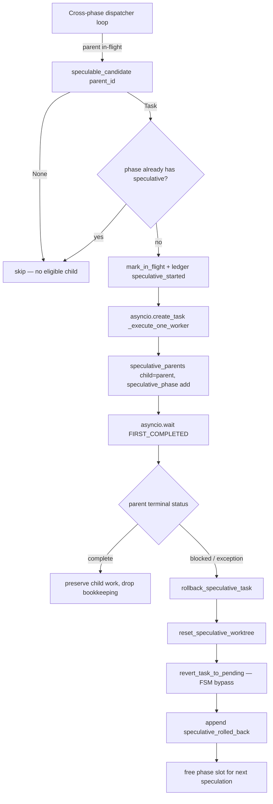
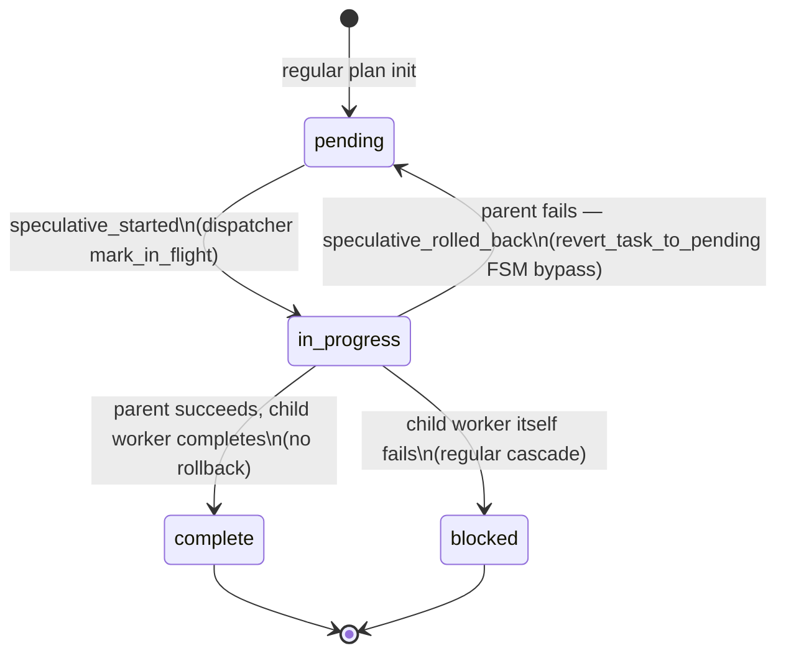

# Speculative Execution Design

**Status:** Implemented
**Author:** Mohamed Ameen
**Date:** 2026-05-09
**Last Updated:** 2026-05-09
**Version:** v0.21.0 (introduced); v0.21.1 (current)
**Reviewers:** --
**Package:** `src/orchestrator/`
**Entry Point:** N/A — internal optimization opted into via `cfg.speculative_execution_enabled`

## 1. Overview

### 1.1 Purpose

Speculative execution is an opt-in optimization in the cross-phase parallelism dispatcher (v0.21.0 B1) that opportunistically starts ONE child task per phase while its parent is still in-flight, betting that the parent will succeed. When the parent succeeds, the child's work is valid with no extra step. When the parent fails, the child's worktree is reset to baseline and the child is re-queued as `pending`.

The win is amortizing per-task setup (worktree claim, sparse-checkout, env preparation, agent cold-start) across the parent's tail — under typical execute-phase workloads parent and child of a serial chain spend most of their wall-clock waiting on LLM I/O, so the worktree pool sits idle. Speculative execution turns idle pool capacity into work that's *probably* useful.

### 1.2 Scope

**In scope:**
- The rollback handler (`src/orchestrator/speculative.py`) and its three public functions: `rollback_speculative_task`, `commit_speculative_task`, `reset_speculative_worktree`.
- Dispatcher integration in `_execute_cross_phase_dag` (`src/orchestrator/execute_phase.py:989-1234`): when speculation fires, how the per-phase cap is enforced, and how rollback is triggered on parent failure.
- Candidate-selection contract in `PlanManager.speculable_candidate` (`src/state/plan_manager.py:431`).
- The FSM bypass `PlanManager.revert_task_to_pending` (`src/state/plan_manager.py:371`) — the one legitimate caller for the in_progress→pending transition.
- Ledger surface: `speculative_started`, `speculative_rolled_back`, `speculative_committed` (`src/state/ledger.py:152-162`).
- Interaction with `WorktreePool` warm-start (v0.21.0 A1).

**Out of scope:**
- The cross-phase dispatcher's overall lifecycle and DAG validation (covered in `orchestrator_design.md` § 5.6).
- The default per-phase dispatcher (`_execute_phase_dag`); speculative execution does NOT fire under it.
- Inline-mode adapter behavior; speculative execution runs only under subprocess adapters (the cross-phase dispatcher is the gate).

### 1.3 Context

This design sits inside the v0.21.0 B-series of execute-phase enhancements:

```
v0.21.0 A1: WorktreePool warm-start (worktree_pool.py)
v0.21.0 B1: Cross-phase parallelism dispatcher (_execute_cross_phase_dag)
v0.21.0 B2: Speculative execution + rollback handler (speculative.py)  <-- this doc
```

The dispatcher contract is: workers must return a final `Task` and never raise plan-fatal exceptions to the dispatcher (they go through `_execute_one_worker`'s exception sink). Speculative execution preserves this contract by doing all its bookkeeping in the dispatcher loop, never inside the worker.

## 2. Requirements

### 2.1 Functional Requirements

- **FR-1:** When `cfg.speculative_execution_enabled` is True AND the cross-phase dispatcher is active, the dispatcher MAY start one speculative child task per phase per polling round.
- **FR-2:** A child is eligible only if it has a SINGLE `depends_on` entry pointing at a parent that is in-flight, the parent's `retry_count == 0`, the child's files are disjoint with every in-flight task's files, and the child is currently `pending`. (`PlanManager.speculable_candidate`.)
- **FR-3:** At most ONE speculative task may be active per phase at any time.
- **FR-4:** When the parent reaches a terminal `blocked` status (or raises an unhandled exception), every speculative child whose parent failed must be rolled back: worktree reset to baseline, child re-queued as `pending`, `speculative_rolled_back` ledger op emitted.
- **FR-5:** When the parent reaches `complete` (or any non-blocked terminal status), the speculative child's work is preserved unmodified — no extra step in the dispatcher.
- **FR-6:** Rollback must be idempotent: re-running with an already-pending task produces a duplicate ledger entry but no double mutation.
- **FR-7:** Failures in any rollback step (worktree reset, requeue, ledger append) must be logged but never raised — rollback is best-effort.
- **FR-8:** The `revert_task_to_pending` path resets `retry_count` and `escalated` so the next dispatch treats the rolled-back task as a fresh attempt.

### 2.2 Non-Functional Requirements

- **Crash-safety:** All plan state mutations go through `PlanManager` (filelock + atomic writes + ledger append). A crash mid-rollback leaves the speculative task either still in `in_progress` (will be rolled back on next dispatch entry) or already `pending` (no further action needed).
- **Subprocess isolation:** Speculative workers spawn through the same `_execute_one_worker` path as regular workers. No special subprocess plumbing.
- **Asyncio-safety:** All operations are `async`. The dispatcher's `speculative_parents: dict[str, str]` and `speculative_phase: set[str]` are mutated only inside the dispatcher loop (single-threaded asyncio context), no locks needed.
- **Pydantic v2 strict validation:** Ledger entries flow through the existing `LedgerEntry` schema with `extra="forbid"`; payloads are plain dicts and validated by the ledger's apply layer.
- **Cost efficiency:** A successful speculative chain costs the same LLM calls as a serial run. A failed speculative chain costs at most one extra speculative attempt's LLM calls (capped at 1 per phase). The per-phase cap is the primary cost guard.
- **Deterministic replay:** The actual status transitions (`update_task_status`) are replayed in order. The audit ops (`speculative_started`, `speculative_rolled_back`, `speculative_committed`) are no-ops in the ledger replay layer (`src/state/ledger.py:530-538`) so they don't influence reconstructed plan state.

### 2.3 Constraints

- Must run on Python 3.11+.
- Requires the cross-phase dispatcher (`cfg.cross_phase_parallelism_enabled = True`) — speculation is a layer on top of cross-phase scheduling, not a standalone path.
- Worktree reset assumes the speculative worktree was created against a known baseline SHA (typically the `WorktreePool.baseline_commit` or an explicit per-task baseline); without a baseline the reset step is skipped (logged warning) and only `git clean -fdx` runs.
- Must coexist with `WorktreePool` warm-start without double-managing worktrees (the rollback path supports both pool-claimed and per-task worktrees via the optional `worktree_mgr` parameter).

## 3. Architecture

### 3.1 High-Level Design



### 3.2 Component Structure

| File | Responsibility |
|------|----------------|
| `src/orchestrator/speculative.py` | `rollback_speculative_task`, `commit_speculative_task`, `reset_speculative_worktree`. All async, all best-effort (errors logged, never raised). |
| `src/orchestrator/execute_phase.py:989-1234` | `_execute_cross_phase_dag` — dispatcher integration: candidate gating, per-phase cap, parent-failure rollback orchestration. |
| `src/state/plan_manager.py:371-429` | `revert_task_to_pending` — FSM bypass for the in_progress→pending transition. |
| `src/state/plan_manager.py:431-496` | `speculable_candidate` — child eligibility filter. |
| `src/state/ledger.py:140-162, 530-538` | `speculative_started`, `speculative_rolled_back`, `speculative_committed` op declarations and replay handlers (no-op). |
| `src/orchestrator/worktree_pool.py:214-297` | `WorktreePool.release` — same reset semantics that `reset_speculative_worktree` mirrors. |

### 3.3 Data Models

Speculative execution does not introduce new Pydantic models. It reuses:

- `Task` (`src/state/schemas.py`) — the unit being speculated; mutated via `update_task_status` and `revert_task_to_pending`.
- `LedgerEntry` (`src/state/ledger.py:165`) — the existing append-only record; speculative ops use the standard envelope with `op` set to one of the three new literals.

**Ledger op payload shapes** (declared in `src/state/ledger.py:152-162`):

```python
# speculative_started
{"task_id": str, "parent_task_id": str}

# speculative_rolled_back
{"task_id": str, "parent_task_id": str, "reason": str}

# speculative_committed
{"task_id": str, "parent_task_id": str}
```

All three ops are observability-only. The actual plan-state transitions (in_progress, pending, etc.) flow through regular `update_task_status` ops emitted alongside.

### 3.4 State Machine — Speculative Task Lifecycle



**Note on the in_progress→pending edge.** The standard `TASK_TRANSITIONS` table in `src/orchestrator/task_state.py` does NOT include this transition. `revert_task_to_pending` deliberately bypasses `assert_transition` for this single legitimate use case. Callers other than the speculative rollback path MUST use `update_task_status` with the FSM check.

### 3.5 Protocol / Interface Contracts

```python
# src/orchestrator/speculative.py

async def rollback_speculative_task(
    orch: "Orchestrator",
    speculative_task: "Task",
    parent_task_id: str,
    reason: str,
    *,
    worktree: Path | None = None,
    worktree_mgr: "WorktreeManager | None" = None,
    baseline_commit: str = "",
) -> None: ...

async def commit_speculative_task(
    orch: "Orchestrator",
    speculative_task_id: str,
    parent_task_id: str,
) -> None: ...

async def reset_speculative_worktree(
    worktree: Path,
    baseline_commit: str,
) -> None: ...
```

```python
# src/state/plan_manager.py

async def speculable_candidate(self, in_flight_task_id: str) -> Task | None: ...
async def revert_task_to_pending(self, task_id: str, *, reason: str = "") -> Task: ...
```

### 3.6 Interfaces

The speculative execution path has no public CLI surface. It is gated entirely by `cfg.speculative_execution_enabled` and runs internally to `_execute_cross_phase_dag`.

## 4. Design Decisions

### 4.1 Key Decisions

| Decision | Rationale | Alternatives Considered |
|----------|-----------|------------------------|
| **One speculative task per phase** | Caps the worst-case waste at one extra task's LLM calls per phase per failure. A chain of speculative failures cannot compound. | Unlimited speculation — rejected because a long depends-on chain could fan out N speculative attempts on a single bad parent. |
| **Single-parent-only candidates** | Diamond dependencies (child with multiple parents) materially complicate rollback: which parent's failure triggers which rollback? Single-parent keeps the bet → fail correspondence 1:1. | Allow diamonds and rollback when ANY parent fails — rejected; cost-of-complexity outweighs the additional candidate pool. |
| **`retry_count == 0` filter** | A parent already on a retry has demonstrated instability. Speculating on its next attempt is a worse bet than waiting for it to settle. | Allow speculation on retries — rejected; compounds risk. |
| **FSM bypass via `revert_task_to_pending`** | The standard FSM forbids in_progress→pending. Adding it as a regular transition would weaken the FSM's invariants for every caller. A dedicated bypass method localizes the exception. | Add in_progress→pending to TASK_TRANSITIONS — rejected; the FSM is consulted by every status update and weakening its invariants for one caller pollutes the contract. |
| **Best-effort rollback** | Rollback failures (worktree reset failed, ledger append failed) should not propagate into the dispatcher's main loop or escalate the parent's failure. Logged warnings preserve forensics; the next dispatch round can re-attempt. | Raise on rollback failure — rejected; would bring down the dispatcher and leave other in-flight tasks in indeterminate state. |
| **Audit-only ledger ops** | The plan-state mutations are already captured by `update_task_status`; the speculative ops add forensic context but should not duplicate state changes. | Make speculative ops apply state — rejected; would double-mutate during replay. |
| **Mirror `WorktreePool.release` reset semantics** | A single canonical reset path (hard-reset to baseline + clean -fdx) means the rollback produces a worktree at the same SHA the pool was cold-started against. Predictable, side-effect-free. | Custom rollback reset — rejected; divergent reset semantics would create subtle "why is this worktree dirty?" bugs. |

### 4.2 Trade-offs

- **Speculative work on a failing parent is wasted.** This is fundamental to speculation. The per-phase cap bounds the waste.
- **`commit_speculative_task` is exported but currently unused in the dispatcher.** The success path simply lets the speculative child's work stand — the regular dispatcher loop sees a complete child and a complete parent and moves on. The helper is provided for future use (e.g., explicit forensics-on-success) and for callers that want to emit `speculative_committed` for telemetry parity. This is a small code-vs-doc inconsistency; see § 14.
- **Pool integration assumes pool baseline matches per-task baseline.** When `WorktreePool` is enabled, the rollback path resets to the baseline captured at pool cold-start; any per-task `baseline_commit` parameter must match. Mismatched baselines would silently produce a stale worktree state.
- **No speculative chain depth.** A speculative grandchild (child whose parent is itself speculative) is forbidden by the candidate filter — the parent must be in-flight under a non-speculative status, and speculative tasks are already in_flight in the dispatcher's tracking. In practice the per-phase cap of 1 makes chained speculation impossible regardless.

## 5. Implementation Details

### 5.1 Candidate Selection (`PlanManager.speculable_candidate`)

`src/state/plan_manager.py:431-496`

```python
async def speculable_candidate(self, in_flight_task_id: str) -> Task | None:
    async with plan_lock(self._cwd, timeout_s=self._lock_timeout_s):
        plan = self._load_sync()
        if plan is None:
            return None

        parent = _find_task(plan, in_flight_task_id)
        if parent is None:
            return None
        if parent.retry_count != 0:
            return None
        if parent.status in _TERMINAL_TASK_STATUSES:
            return None

        in_flight_ids = set(self._in_flight)
        in_flight_files: set[str] = set()
        for ph in plan.phases:
            for t in ph.tasks:
                if t.id in in_flight_ids:
                    in_flight_files.update(t.files)

        for ph in plan.phases:
            for t in ph.tasks:
                if t.status != "pending":
                    continue
                if t.depends_on != [in_flight_task_id]:
                    continue
                if any(f in in_flight_files for f in t.files):
                    continue
                return t
        return None
```

The first qualifying child is returned (deterministic by phase iteration order, then task iteration order). The dispatcher trusts the manager's filter and applies only its per-phase cap on top.

### 5.2 Dispatcher Integration

`src/orchestrator/execute_phase.py:1021-1105` (selection) and `:1174-1227` (rollback orchestration).

**Selection (per polling round):**

```python
# After dispatching pending tasks, opportunistically speculate ONE
# child task per phase whose parent is in-flight.
if speculative_enabled and len(in_flight) < parallelism:
    for parent_id in list(in_flight.keys()):
        parent_phase = in_flight_phase_id.get(parent_id, "")
        if parent_phase in speculative_phase:
            continue  # phase already hosts a speculative child
        candidate = await orch.plan_manager.speculable_candidate(parent_id)
        if candidate is None:
            continue
        if candidate.id in in_flight:
            continue
        await orch.plan_manager.mark_in_flight(candidate.id)
        await orch.plan_manager.ledger_append(
            op="speculative_started",
            payload={"task_id": candidate.id, "parent_task_id": parent_id},
        )
        in_flight[candidate.id] = asyncio.create_task(
            _execute_one_worker(orch, candidate, worktree_mgr)
        )
        in_flight_phase_id[candidate.id] = candidate.phase_id
        speculative_parents[candidate.id] = parent_id
        speculative_phase.add(candidate.phase_id)
        break  # max 1 speculative per polling round
```

**Rollback orchestration (after each `asyncio.wait` drain):**

```python
# Roll back any speculative children whose parents just failed.
if speculative_enabled and failed_parents:
    from orchestrator.speculative import rollback_speculative_task

    for spec_id, parent_id in list(speculative_parents.items()):
        if parent_id not in failed_parents:
            continue
        plan = await orch.plan_manager.load()
        if plan is None:
            continue
        spec_task = next(
            (t for ph in plan.phases for t in ph.tasks if t.id == spec_id),
            None,
        )
        if spec_task is None:
            continue
        if spec_id in in_flight:
            continue  # speculative still running — defer rollback
        try:
            await rollback_speculative_task(
                orch, spec_task,
                parent_task_id=parent_id,
                reason="parent_blocked",
            )
        except Exception as exc:
            logger.warning(
                "execute_phase.speculative_rollback_failed",
                task_id=spec_id, err=str(exc),
            )
        speculative_parents.pop(spec_id, None)
        # Phase may now be free for another speculative attempt.
        ...
```

The dispatcher passes a static `reason="parent_blocked"`. The handler appends it to the ledger op so post-mortem can correlate parent failure with child rollback.

### 5.3 Rollback Handler

`src/orchestrator/speculative.py:76-159`

Three sub-steps, each best-effort:

1. **Worktree reset** (`reset_speculative_worktree`):
   - If the worktree path exists AND a `baseline_commit` was provided, run `git reset --hard <baseline_commit>` then `git clean -fdx`.
   - Errors logged with `speculative.reset.git_reset_failed` / `speculative.reset.git_clean_failed`. Never raised.
   - Mirrors `WorktreePool.release` (`src/orchestrator/worktree_pool.py:214-297`) so a worktree reset by either path lands at the same SHA.

2. **Per-task worktree removal** (only if a `WorktreeManager` was supplied):
   - `worktree_mgr.remove_per_task(speculative_task.id, force=True)`.
   - Wrapped in `try/except WorktreeError` (and bare Exception) to swallow remove failures.

3. **Re-queue as `pending`** (`PlanManager.revert_task_to_pending`):
   - Bypasses `assert_transition` (the FSM rejects in_progress→pending).
   - Persists via the standard lock + ledger + snapshot pipeline; emits a regular `update_task_status` op so replay reconstructs the transition exactly.
   - Resets `retry_count = 0`, `escalated = False`. Sets `blocked_reason` to the speculative rollback `reason` for forensics.
   - Failures logged as `speculative.rollback.requeue_failed`.

4. **Audit ledger op** (`speculative_rolled_back`):
   - Payload: `{task_id, parent_task_id, reason}`.
   - Failures logged as `speculative.rollback.ledger_append_failed`. Never raised.

### 5.4 Concurrency Model

The dispatcher loop is single-asyncio-task. All speculative bookkeeping (`speculative_parents`, `speculative_phase`) lives in this loop's local frame — no locks needed. The plan-state mutations inside `revert_task_to_pending` and `ledger_append` use `plan_lock` (filelock + asyncio lock combination provided by `PlanManager`) so cross-process safety is preserved.

The rollback path runs sequentially over `speculative_parents` (no fan-out). For typical workloads (cap of 1 speculative per phase, small phase count) this is an ms-scale operation dominated by filelock acquisition.

### 5.5 Atomic I/O

All plan-state writes go through `PlanManager` which uses `plan_lock` + atomic snapshot writes. Ledger appends use `append_entry` which appends a single line to `.autodev/ledger.jsonl` under the same lock. A crash mid-rollback leaves either:

- `speculative_started` written, no further entries → next dispatcher entry observes the speculative task in_progress with no live worker; cross-phase dispatcher re-validates and either re-roll-back or re-speculate.
- `speculative_started` and `update_task_status(pending)` written, no `speculative_rolled_back` → audit gap, no functional impact (the actual transition is reconstructed from the regular op).

### 5.6 Error Handling

| Condition | Handling |
|-----------|----------|
| `reset_speculative_worktree`: worktree path missing | Log `speculative.reset.path_missing`, return |
| `reset_speculative_worktree`: `git reset --hard` returns non-zero | Log `speculative.reset.git_reset_failed`, skip clean, return |
| `reset_speculative_worktree`: `git clean -fdx` returns non-zero | Log `speculative.reset.git_clean_failed`, return |
| `rollback_speculative_task`: reset raises unexpected exception | Log `speculative.rollback.reset_failed`, continue to next step |
| `rollback_speculative_task`: `worktree_mgr.remove_per_task` raises `WorktreeError` | Swallow, continue |
| `rollback_speculative_task`: `revert_task_to_pending` raises | Log `speculative.rollback.requeue_failed`, continue to ledger append |
| `rollback_speculative_task`: `ledger_append` raises | Log `speculative.rollback.ledger_append_failed`, return |
| Dispatcher: speculative still in_flight when parent fails | Skip rollback this round; next round re-checks (the loop sees the spec_id no longer in `in_flight`) |
| Dispatcher: `rollback_speculative_task` raises | Caught by dispatcher's `try/except`, logged as `execute_phase.speculative_rollback_failed`. The bookkeeping is still cleared so the phase slot reopens. |

### 5.7 Dependencies

- **Internal:**
  - `src/orchestrator/__init__.py:Orchestrator` — for `orch.plan_manager`.
  - `src/orchestrator/worktree.py:_run_git`, `WorktreeError`, `WorktreeManager` — git plumbing and per-task worktree removal.
  - `src/state/plan_manager.py:PlanManager` — `revert_task_to_pending`, `speculable_candidate`, `ledger_append`.
  - `src/state/schemas.py:Task` — the type bound at the boundary.
- **External:** `autologging` (project's structlog wrapper), Python 3.11+ asyncio.

### 5.8 Configuration

| Config Path | Description | Default |
|-------------|-------------|---------|
| `AutodevConfig.speculative_execution_enabled` | Master enable. Default `False` (opt-in) because rollback complexity warrants cautious adoption. | `False` |
| `AutodevConfig.cross_phase_parallelism_enabled` | Required prerequisite — speculation runs only inside `_execute_cross_phase_dag`. | `False` |
| `AutodevConfig.tournaments.execute_max_parallel_tasks` | Worker pool cap; bounds how many speculative + non-speculative tasks can be in-flight together. | `None` (auto-resolve) |

There are no other speculative-specific knobs in `src/config/schema.py` (verified by grep on 2026-05-09). The per-phase cap of 1 is hard-coded in the dispatcher per the v0.21.0 plan.

## 6. Integration Points

### 6.1 Dependencies on Other Components

| Component | Dependency |
|-----------|-----------|
| Cross-phase dispatcher (`_execute_cross_phase_dag`) | Hosts the selection + rollback orchestration. Speculative execution does not exist outside this dispatcher. |
| `PlanManager` | Provides `speculable_candidate`, `revert_task_to_pending`, `ledger_append`. All FSM and persistence concerns are delegated. |
| `WorktreeManager` / `WorktreePool` | Owns the worktree the speculative worker writes into. The pool's reset semantics are mirrored by `reset_speculative_worktree`. |

### 6.2 Adapter Contract Dependency

Speculative execution uses the same `_execute_one_worker` path as regular workers. No adapter-level distinction is needed; the worker's adapter call sees the same `AgentInvocation` shape as for any other task.

The cross-phase dispatcher (and therefore speculative execution) is incompatible with the inline adapter — `DelegationPendingSignal` propagation interrupts the dispatcher loop, which is fine for the dispatcher itself but speculative execution has no resume semantics defined for an inline-suspended speculative task. In practice users opt into both `cross_phase_parallelism_enabled` and `speculative_execution_enabled` together with a subprocess adapter.

### 6.3 Ledger Event Emissions

| Op | Source | Payload |
|----|--------|---------|
| `speculative_started` | `_execute_cross_phase_dag` (`execute_phase.py:1087`) | `{task_id, parent_task_id}` |
| `speculative_rolled_back` | `rollback_speculative_task` (`speculative.py:139`) | `{task_id, parent_task_id, reason}` |
| `speculative_committed` | `commit_speculative_task` (`speculative.py:174`) | `{task_id, parent_task_id}` — helper exists; not currently invoked by the dispatcher (see § 14). |

All three are declared in the `LedgerOp` literal (`src/state/ledger.py:152-162`) and treated as no-ops by the ledger replay layer (`src/state/ledger.py:530-538`). Replay reconstructs the actual task transitions from the regular `update_task_status` ops emitted alongside.

### 6.4 Components That Depend on This

- The cross-phase dispatcher is the sole consumer.
- Forensics tooling that reads `.autodev/ledger.jsonl` may key off the three speculative ops to render speculation timelines, but no such tooling is shipped today.

### 6.5 External Systems

- **git** — `git reset --hard <baseline> && git clean -fdx` via `_run_git` for worktree reset.
- **filesystem** — speculative worktrees live under the same `<autodev_root>/execute_worktrees/` (lazy create) or `<autodev_root>/execute_worktrees_pool/` (warm-start) trees as regular workers.

## 7. Failure Modes

### 7.1 Parent fails, child still running

The child is left in_flight in the dispatcher's tracking. The rollback loop checks `if spec_id in in_flight: continue` (`execute_phase.py:1200`) and defers to the next round. When the child eventually completes (success or failure), it drains from `in_flight`, and the next dispatcher iteration enters the rollback path.

If the child completes successfully before the rollback fires, the rollback still runs — the rolled-back task transitions to `pending` and re-runs from scratch on the next dispatch. The child's previous output is discarded.

### 7.2 Parent succeeds, child fails

The child's failure cascades through `_execute_one_worker`'s exception sink: child transitions to `blocked`, descendants are cascade-blocked via `mark_blocked_descendants`. The `speculative_parents` bookkeeping is dropped (the child no longer needs a rollback bet — its own failure is the terminal state).

The parent's success is unaffected — it simply moves through the dispatcher loop as any other completed task.

### 7.3 Both parent and child fail

`failed_parents` includes the parent. The rollback loop walks `speculative_parents`, finds the child, attempts rollback. Because the child has already transitioned to `blocked` (its own failure), `revert_task_to_pending` overwrites that to `pending`. This is correct: the child's failure may have been a consequence of running on uncommitted parent state, and a fresh attempt against the parent's eventual successful state may succeed.

### 7.4 Rollback handler fails mid-step

Best-effort by design. Each step's failure is logged and the next step proceeds. The worst case is an audit gap (no `speculative_rolled_back` op in the ledger) — the actual `update_task_status(pending)` op IS emitted by `revert_task_to_pending`, so plan state is correctly reconstructed on replay.

### 7.5 Crash mid-rollback

If the process crashes after `speculative_started` but before `update_task_status(pending)`, the speculative task remains `in_progress`. On the next dispatcher entry the cross-phase dispatcher will see no live worker for this task; it doesn't currently re-roll-back stale in_progress speculative tasks (no resume semantics for speculation). The user must manually re-init or run `autodev resume` (which re-enters the dispatcher and treats the stale in_progress as a regular in-flight task — unblocked by retries).

This is a known acceptance: speculative execution is opt-in and crash recovery for speculative state is not in v0.21.0 scope.

## 8. Security Considerations

Speculative execution does not introduce new attack surface. The speculative worker runs through the same `_execute_one_worker` and `delegate` paths as a regular worker, subject to the same guardrails (`max_tool_calls_per_task`, `max_duration_s_per_task`, `max_diff_bytes`).

Worktree reset uses fixed `git reset --hard <SHA>` and `git clean -fdx` arguments — no user input is interpolated into git commands.

## 9. Performance Considerations

**Best case:** Speculative child completes alongside parent; a `complete` parent leaves the child's work valid. Wall-clock saved ≈ child's setup + LLM + commit time. For a serial chain of N tasks where each task has setup time S and LLM time L, the savings approach `min(L_parent, S_child + L_child)` per chain.

**Worst case:** Parent fails, child is rolled back. Cost: child's setup + LLM time wasted + rollback overhead (sub-second). Capped at one extra task per phase per failure.

**Polling overhead:** The candidate selection is invoked once per polling round per in-flight parent (skipped when the phase already has a speculative child). `speculable_candidate` walks the plan once under `plan_lock` — O(phases × tasks). For typical plans this is microseconds.

**Ledger overhead:** Three additional ops per successful speculation (`speculative_started`, `update_task_status` for the speculative worker's transitions, no commit emitted today) plus one `speculative_rolled_back` if rollback fires. JSONL append-only with filelock; sub-millisecond per op.

## 10. Observability

### 10.1 Structured Logging

| Event | Key Fields | Description |
|-------|-----------|-------------|
| `execute_phase.speculative_started` | `task_id`, `parent_task_id` | Dispatcher launched a speculative child |
| `execute_phase.speculative_rollback_failed` | `task_id`, `err` | Rollback handler raised (caught and logged) |
| `speculative.reset.path_missing` | `path` | Worktree path didn't exist at rollback |
| `speculative.reset.git_reset_failed` | `rc`, `err`, `path` | `git reset --hard` returned non-zero |
| `speculative.reset.git_clean_failed` | `rc`, `err`, `path` | `git clean -fdx` returned non-zero |
| `speculative.rollback.reset_failed` | `task_id`, `err` | Wrapper around reset raised |
| `speculative.rollback.requeue_failed` | `task_id`, `err` | `revert_task_to_pending` raised |
| `speculative.rollback.ledger_append_failed` | `task_id`, `err` | `speculative_rolled_back` op append raised |
| `speculative.rollback.complete` | `task_id`, `parent_task_id`, `reason` | Rollback finished (best-effort, all sub-steps attempted) |
| `speculative.commit.complete` | `task_id`, `parent_task_id` | `commit_speculative_task` invoked (currently no caller in dispatcher) |

### 10.2 Audit Artifacts

- `.autodev/ledger.jsonl` — the three speculative ops described in § 6.3.
- No separate evidence files. The speculative worker's evidence (CoderEvidence, ReviewEvidence, etc.) is written under the regular task id and persists even after rollback (rollback resets the worktree but does NOT delete evidence files; this is intentional so post-mortem can compare the rolled-back attempt's output against the eventual successful run).

### 10.3 Status Command

`autodev status` does not currently surface speculative state separately. Tasks under rollback briefly transition through `pending → in_progress → pending` and may show as `pending` after a rollback; the `blocked_reason` field on the task carries the `speculative_rollback: parent=... reason=...` string from `revert_task_to_pending`.

## 11. Cost Implications

| Scenario | Extra LLM Calls | Notes |
|----------|----------------|-------|
| Speculative child succeeds, parent succeeds | 0 (work was needed anyway, just earlier) | The win path |
| Speculative child succeeds, parent fails | +N (cost of one task) | Wasted; bounded by per-phase cap |
| Speculative child fails, parent succeeds | +N (cost of one task) | Child cascade-blocks; if a retry would have succeeded later, that retry is skipped — this is a net positive |
| Speculative child fails, parent fails | +N | Worst case; bounded |

The per-phase cap of 1 ensures the worst-case cost overhead is bounded by `(num_phases × cost_per_task)` per execute-phase run.

## 12. Future Enhancements

- **Wire `commit_speculative_task` into the dispatcher.** The helper is exported and tested-shaped but not currently invoked. A minimal hook in the dispatcher's success path would emit `speculative_committed` for telemetry parity with `speculative_started` / `speculative_rolled_back`.
- **Crash recovery for stale speculative tasks.** Detect speculative tasks left in `in_progress` after a crash and either roll them back or resume them deterministically. (See § 7.5.)
- **Per-phase cap > 1.** With a more sophisticated rollback queue, increasing the cap could amortize across deeper depends-on chains. Trade-off: worst-case cost grows linearly with cap.
- **Speculative-success preservation across retries.** If the parent fails but a retry succeeds, the speculative child's discarded output may have been valid for the retry's eventual state. Caching speculative outputs and validating them against the retry's diff could reduce cost.

## 13. Open Questions

- [ ] Should speculative execution be auto-enabled when `cross_phase_parallelism_enabled` is True? (Currently independent flags.)
- [ ] Should the per-phase cap be a config knob? (Currently hard-coded to 1.)
- [ ] Should `speculative_committed` be required for replay correctness? (Currently no-op; payload-only.)

## 14. Code-vs-Doc Inconsistencies Noted

- `commit_speculative_task` is exported from `src/orchestrator/speculative.py` and emits the `speculative_committed` ledger op, but **is not currently invoked from `_execute_cross_phase_dag`**. The cross-phase dispatcher's success path simply lets a complete speculative child stand without emitting the parity op. This means the ledger forensics for a successful speculation chain include `speculative_started` but not `speculative_committed`. Users debugging speculation timelines should be aware. (Documented in `orchestrator_design.md` Ledger Event Emissions table and § 4.2 of this doc.)

## 15. Related ADRs

- ADR-008: Deterministic FSM orchestration — speculative execution preserves FSM determinism by routing the in_progress→pending bypass through a single dedicated method (`revert_task_to_pending`) rather than weakening the FSM transition table for all callers.

## 16. References

- v0.21.0 release notes: see commit `1320471 feat(orchestrator): speculative execution + rollback handler (v0.21.0 B2)`.
- `orchestrator_design.md` §§ 5.6–5.8 for the cross-phase dispatcher and pool integration.

## 17. Revision History

| Date | Author | Changes |
|------|--------|---------|
| 2026-05-09 | Mohamed Ameen | Initial draft (v0.21.0 introduced; current is v0.21.1). |
