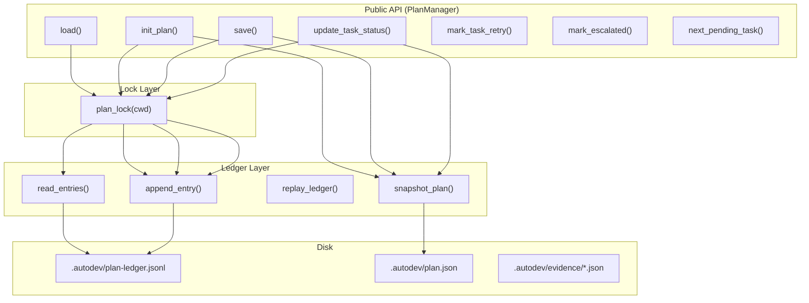
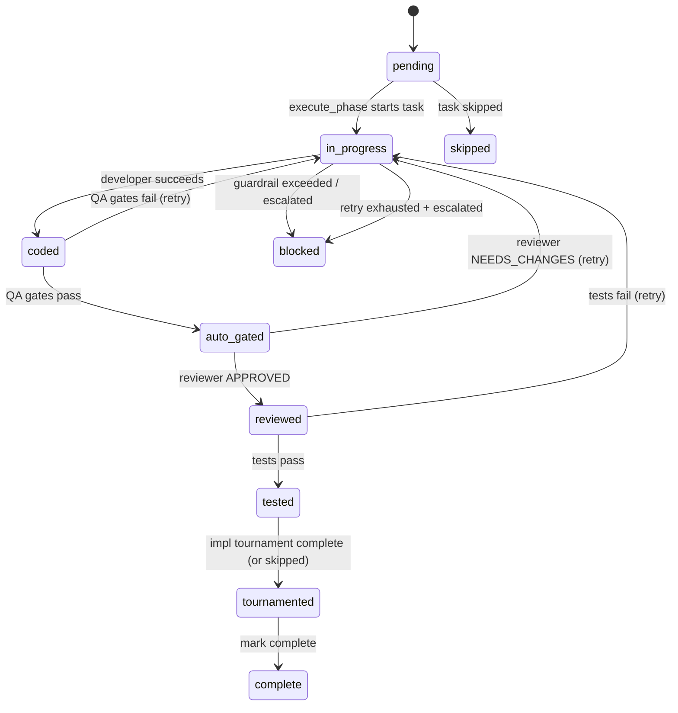

# Durable State Layer Design

**Status:** Implemented
**Author:** Mohamed Ameen
**Date:** 2026-04-17
**Last Updated:** 2026-04-17
**Reviewers:** --
**Package:** `src/state/`
**Entry Point:** Library-only (consumed by `orchestrator/`, `tournament/`, and CLI commands)

## 1. Overview

### 1.1 Purpose

The Durable State Layer provides crash-safe, append-only persistence for all AutoDev runtime state. It stores the execution plan, task status transitions, evidence bundles, and audit history in a tamper-evident ledger with CAS (Content-Addressable Storage) hash chaining. Every mutation is atomic and every state can be reconstructed by replaying the ledger from genesis or from the latest snapshot.

### 1.2 Scope

**In scope:**

- Append-only JSONL ledger with SHA-256 hash chaining (`prev_hash -> self_hash`)
- Atomic writes via `tempfile + os.replace` pattern
- Async-safe file locking via `filelock` with `thread_local=False`
- Ledger replay for plan state reconstruction with snapshot shortcutting
- `PlanManager` facade for all plan CRUD operations
- Evidence bundle I/O (discriminated union, atomic writes)
- Centralized `.autodev/` filesystem layout constants
- Pydantic v2 schemas with `extra="forbid"` for all boundary data

**Out of scope:**

- Knowledge store (Phase 9 -- lives in `state/knowledge.py` but is a separate design)
- Session event streams (`state/sessions/` is path-defined but session management is separate)
- Config file loading (lives in `src/config/`)

### 1.3 Context

The state layer is the persistence backbone of AutoDev:

```
orchestrator -> state/plan_manager -> state/ledger -> .autodev/plan-ledger.jsonl
                                   -> state/evidence -> .autodev/evidence/
                                   -> state/lockfile -> .autodev/.lock
```

All orchestrator components that read or mutate plan state do so through `PlanManager`, which acquires the file lock and appends to the ledger atomically. The ledger is the single source of truth -- `plan.json` is a convenience snapshot that can be reconstructed from ledger replay at any time.

## 2. Requirements

### 2.1 Functional Requirements

- **FR-1:** All plan state mutations must be recorded as append-only ledger entries.
- **FR-2:** Ledger entries must form a hash chain (`entry[n].prev_hash == entry[n-1].self_hash`) that is verifiable during replay.
- **FR-3:** Ledger replay must reconstruct the current plan state from the full entry history.
- **FR-4:** Snapshot entries must allow replay to short-circuit from the latest snapshot rather than replaying from genesis.
- **FR-5:** Evidence bundles must be persisted as individually addressable JSON files keyed by `(task_id, kind)`.
- **FR-6:** All state writes must be atomic -- a crash at any point must not corrupt existing state.
- **FR-7:** Concurrent access (multiple orchestrator instances or asyncio tasks) must be serialized via file locking.

### 2.2 Non-Functional Requirements

- **Crash-safety:** Every write uses the `tempfile + os.replace` pattern. The ledger append copies the entire existing file to a temp file, appends the new line, then atomically replaces. No partial writes are ever visible.
- **Asyncio concurrency:** `plan_lock` wraps `filelock.FileLock.acquire()` / `.release()` in `asyncio.to_thread()` so the event loop is never blocked. `thread_local=False` ensures concurrent asyncio tasks compete on the on-disk lock correctly.
- **Pydantic v2 strict validation:** All schemas use `ConfigDict(extra="forbid")`. Every ledger entry is validated through `LedgerEntry.model_validate()` on read. Evidence bundles use `TypeAdapter(Evidence)` for discriminated union deserialization.
- **Tamper evidence:** A broken `prev_hash` or `self_hash` raises `LedgerCorruptError` during replay, making it impossible to silently drop or reorder entries.
- **Maintainability:** All disk paths are defined in `state/paths.py`. All logging uses `structlog`.

### 2.3 Constraints

- Must run on Python 3.11+ with no compiled extensions.
- Must work within a single-machine, single-user context (no distributed locking).
- The lock file (`.autodev/.lock`) is safe to leave between runs; `filelock` handles stale locks.
- Ledger file can grow unbounded in theory; snapshots mitigate replay cost.

## 3. Architecture

### 3.1 High-Level Design



### 3.2 Component Structure

| File | Purpose |
|------|---------|
| `state/paths.py` | Centralized `.autodev/` layout constants and path builder functions |
| `state/schemas.py` | Pydantic v2 models: `Plan`, `Phase`, `Task`, `AcceptanceCriterion`, `TaskStatus`, Evidence discriminated union |
| `state/lockfile.py` | `plan_lock()` async context manager wrapping `filelock.FileLock` |
| `state/ledger.py` | `LedgerEntry` model, `append_entry()`, `read_entries()`, `replay_ledger()`, `snapshot_plan()`, `compute_hash()` |
| `state/plan_manager.py` | `PlanManager` facade: `load()`, `init_plan()`, `save()`, `update_task_status()`, `next_pending_task()`, etc. |
| `state/evidence.py` | `write_evidence()`, `read_evidence()`, `list_evidence()`, `write_patch()` |
| `state/__init__.py` | Re-exports all public symbols |

### 3.3 Data Models

**Ledger Entry:**

```python
LedgerOp = Literal[
    "init_plan",
    "update_plan",
    "update_task_status",
    "append_evidence",
    "mark_blocked",
    "mark_complete",
    "snapshot",
    "plan_tournament_complete",
    "impl_tournament_complete",
]

class LedgerEntry(BaseModel):
    model_config = ConfigDict(extra="forbid")

    seq: int                    # monotonically increasing, starts at 1
    timestamp: str              # ISO 8601, UTC
    session_id: str
    op: LedgerOp
    payload: dict[str, Any]     # op-specific data
    prev_hash: str              # self_hash of entry[n-1]; "" for genesis
    self_hash: str              # SHA-256 prefix (16 hex chars) of all other fields
```

**Plan/Phase/Task:**

```python
TaskStatus = Literal[
    "pending", "in_progress", "coded", "auto_gated", "reviewed",
    "tested", "tournamented", "complete", "blocked", "skipped",
]

class AcceptanceCriterion(BaseModel):
    model_config = ConfigDict(extra="forbid")
    id: str
    description: str
    met: bool = False

class Task(BaseModel):
    model_config = ConfigDict(extra="forbid")
    id: str                                 # "1.1", "1.2", "2.1"
    phase_id: str                           # "1", "2", "3"
    title: str
    description: str
    status: TaskStatus = "pending"
    files: list[str] = []
    acceptance: list[AcceptanceCriterion] = []
    depends_on: list[str] = []
    retry_count: int = 0
    escalated: bool = False
    assigned_agent: str | None = None
    evidence_bundle: str | None = None
    blocked_reason: str | None = None
    metadata: dict[str, Any] = {}

class Phase(BaseModel):
    model_config = ConfigDict(extra="forbid")
    id: str                                 # "1", "2", "3"
    title: str
    description: str = ""
    tasks: list[Task]

class Plan(BaseModel):
    model_config = ConfigDict(extra="forbid")
    plan_id: str
    spec_hash: str
    phases: list[Phase]
    metadata: dict[str, Any] = {}
    created_at: str
    updated_at: str
    content_hash: str = ""
```

**Evidence Discriminated Union:**

```python
Evidence = Annotated[
    Union[
        CoderEvidence,      # kind="developer"
        ReviewEvidence,     # kind="review"
        TestEvidence,       # kind="test"
        ExploreEvidence,    # kind="explore"
        SMEEvidence,        # kind="domain_expert"
        CriticEvidence,     # kind="critic"
        TournamentEvidence, # kind="tournament"
    ],
    Field(discriminator="kind"),
]
```

Each variant carries `task_id` and a `kind` literal discriminator. Notable fields:

| Variant | Key Fields |
|---------|------------|
| `CoderEvidence` | `diff`, `files_changed`, `output_text`, `duration_s`, `success` |
| `ReviewEvidence` | `verdict` (APPROVED/NEEDS_CHANGES/REJECTED), `issues` |
| `TestEvidence` | `passed`, `failed`, `total`, `coverage_pct` |
| `ExploreEvidence` | `findings`, `files_referenced` |
| `SMEEvidence` | `topic`, `findings`, `confidence` (HIGH/MEDIUM/LOW) |
| `CriticEvidence` | `verdict` (APPROVED/NEEDS_REVISION/REJECTED), `issues` |
| `TournamentEvidence` | `tournament_id`, `phase`, `passes`, `winner`, `converged`, `history` |

### 3.4 State Machine

The Task FSM captures the lifecycle of each task through the execute phase:



### 3.5 Protocol / Interface Contracts

The state layer does not define runtime-checkable protocols. It exposes concrete classes and functions consumed by the orchestrator and tournament engine.

### 3.6 Interfaces

**`PlanManager`:**

| Method | Description |
|--------|-------------|
| `async load() -> Plan \| None` | Load plan via snapshot fast-path or full replay |
| `async init_plan(plan) -> Plan` | Initialize a new plan (fails if one exists) |
| `async save(plan) -> Plan` | Overwrite plan wholesale (appends `update_plan` + `snapshot`) |
| `async get_task(task_id) -> Task \| None` | Retrieve a single task by ID |
| `async next_pending_task() -> Task \| None` | Return first task with `status=pending` (phase-major order) |
| `async update_task_status(task_id, status, meta) -> Task` | Transition task status with validation |
| `async mark_task_retry(task_id) -> int` | Increment retry count, return new count |
| `async mark_escalated(task_id) -> None` | Flag task as escalated |
| `async read_ledger() -> list[LedgerEntry]` | Read all validated entries (for debugging/CLI) |
| `async ledger_append(op, payload) -> LedgerEntry` | Append an arbitrary audit-only entry |

**Ledger functions:**

| Function | Description |
|----------|-------------|
| `async append_entry(cwd, op, payload, session_id)` | Append one entry, computing seq and hashes |
| `read_entries(cwd) -> list[LedgerEntry]` | Read + validate entire chain |
| `replay_ledger(cwd) -> (Plan \| None, list[LedgerEntry])` | Full replay from genesis |
| `async snapshot_plan(cwd, plan, session_id)` | Atomic write of `plan.json` + snapshot ledger entry |
| `compute_hash(entry_dict) -> str` | 16-char SHA-256 prefix of canonical JSON |

**Evidence functions:**

| Function | Description |
|----------|-------------|
| `async write_evidence(cwd, task_id, evidence) -> Path` | Atomic write to `evidence/{task_id}-{kind}.json` |
| `async read_evidence(cwd, task_id, kind) -> Evidence \| None` | Read and validate |
| `async list_evidence(cwd, task_id) -> list[Evidence]` | All evidence for a task |
| `async write_patch(cwd, task_id, diff) -> Path` | Atomic write to `evidence/{task_id}.patch` |

## 4. Design Decisions

### 4.1 Key Decisions

| Decision | Rationale | Alternatives Considered |
|----------|-----------|------------------------|
| Append-only JSONL with CAS hash chaining | Provides tamper evidence, crash safety (partial writes detectable), and full auditability. Replay enables time-travel debugging. | SQLite, single JSON file with versioning |
| 16-char SHA-256 prefix for hashes | Sufficient collision resistance for local single-user use (2^64 space). Shorter hashes are more readable in logs and diffs. | Full 64-char SHA-256, MD5, UUID-based |
| Atomic append via full-file copy + replace | Ensures either the entire new ledger is visible or nothing changes. Resilient to kill -9 mid-write. | Direct `fh.write()` + `fsync` (risk of torn writes), journaling |
| `filelock` with `thread_local=False` | Concurrent asyncio tasks each run `lock.acquire()` in a `to_thread` worker. Without `thread_local=False`, `filelock` suppresses the OS lock call when the same thread has already acquired, breaking in-process concurrency. | `asyncio.Lock` (only in-process, not cross-process), `fcntl.flock` (lower-level) |
| Snapshot ops for replay shortcutting | Full replay from genesis is O(N) in ledger size. Snapshots embed the current plan state so replay only needs to process entries after the latest snapshot. | Periodic compaction (destructive), separate checkpoint files |
| Discriminated union for evidence (`kind` field) | Single `TypeAdapter(Evidence)` dispatches to the correct subclass. Using `kind` instead of `type` avoids shadowing Python's `type` builtin. | Separate files per evidence type, generic dict with schema version |
| `extra="forbid"` on all boundary models | Rejects unknown fields at deserialization time, catching schema drift and typos immediately. | `extra="ignore"` (silent data loss), `extra="allow"` (untyped passthrough) |

### 4.2 Trade-offs

- **Full-file copy on append:** The atomic append strategy copies the entire existing ledger to a temp file for every append. This is O(N) in ledger size. For typical runs (hundreds of entries), this is negligible (~milliseconds). For very long-running projects with thousands of entries, snapshot compaction would help, but is not yet implemented.
- **No concurrent writers:** `plan_lock` serializes all access. This is correct for single-machine use but would not scale to distributed orchestration.
- **Snapshot + ledger redundancy:** Both `plan.json` and the ledger contain the plan state. This is intentional: `plan.json` is a fast-load convenience; the ledger is the authoritative source. A crash between writing `plan.json` and the snapshot ledger entry is harmless because the next successful snapshot reconciles them.

## 5. Implementation Details

### 5.1 Core Algorithms/Logic

**Hash chain computation:**

```python
def compute_hash(entry_dict_without_hash: dict[str, Any]) -> str:
    canon = json.dumps(entry_dict_without_hash, sort_keys=True)
    return hashlib.sha256(canon.encode("utf-8")).hexdigest()[:16]
```

The entry is serialized to canonical JSON (`sort_keys=True`) with the `self_hash` field excluded. The resulting 16-char hex prefix is stored in `self_hash` and becomes the `prev_hash` for the next entry.

**Chain validation during `read_entries`:**

1. For each entry, verify `seq == prev_seq + 1` (monotonic).
2. Verify `entry.prev_hash == previous_entry.self_hash` (chain link).
3. Recompute `compute_hash(entry without self_hash)` and verify it matches `entry.self_hash` (integrity).
4. Any violation raises `LedgerCorruptError` with the line number and expected vs. actual values.

**Ledger replay (`replay_ledger`):**

Applies ops in order. Key op handlers:
- `init_plan` / `update_plan` / `snapshot`: Replace the in-memory plan wholesale from `payload.plan`.
- `update_task_status`: Find the task by ID and mutate its `status`, `blocked_reason`, `retry_count`, `escalated`, `evidence_bundle`.
- `mark_blocked` / `mark_complete`: Terminal status transitions.
- `append_evidence`: Record the evidence path on the task.
- `plan_tournament_complete` / `impl_tournament_complete`: Audit-only, no plan mutation.

**Snapshot fast-path in `PlanManager.load`:**

1. Walk entries backwards to find the latest `snapshot` op.
2. Deserialize the plan from the snapshot's payload.
3. Apply only the entries after the snapshot index.
4. This is O(M) where M is entries since last snapshot, typically 0-10.

### 5.2 Concurrency Model

```python
@contextlib.asynccontextmanager
async def plan_lock(cwd: Path, timeout_s: float = 30.0) -> AsyncIterator[None]:
    ensure_autodev_dir(cwd)
    lock = FileLock(str(lock_path(cwd)), timeout=timeout_s, thread_local=False)
    try:
        await asyncio.to_thread(lock.acquire)
    except Timeout as exc:
        raise PlanLockTimeoutError(
            f"could not acquire .autodev/.lock within {timeout_s}s"
        ) from exc
    try:
        yield
    finally:
        await asyncio.to_thread(lock.release)
```

Key design points:
- `asyncio.to_thread` offloads the blocking `lock.acquire()` to a thread pool worker, keeping the event loop responsive.
- `thread_local=False` is critical: without it, if two asyncio tasks happen to run their `to_thread` workers on the same thread pool thread, `filelock` would skip the actual OS lock for the second caller, creating a data race.
- Timeout defaults to 30 seconds. `PlanLockTimeoutError` is raised on timeout so the caller can surface a clear error.

### 5.3 Atomic I/O Pattern

All state writes follow this pattern:

```python
def _atomic_append(path: Path, line: str) -> None:
    parent = path.parent
    parent.mkdir(parents=True, exist_ok=True)
    existing = path.read_bytes() if path.exists() else b""
    fd, tmp_path = tempfile.mkstemp(prefix=".ledger.", suffix=".tmp", dir=str(parent))
    try:
        with os.fdopen(fd, "wb") as fh:
            fh.write(existing)
            fh.write(line.encode("utf-8"))
            fh.flush()
            os.fsync(fh.fileno())
        os.replace(tmp_path, path)
    except BaseException:
        try:
            os.unlink(tmp_path)
        except OSError:
            pass
        raise
```

The `os.fsync` call ensures data is flushed to disk before `os.replace`. The temp file is always in the same directory as the target so `os.replace` is atomic on POSIX (same filesystem).

Evidence writes use the same pattern:

```python
def _atomic_write(path: Path, data: bytes) -> None:
    path.parent.mkdir(parents=True, exist_ok=True)
    fd, tmp = tempfile.mkstemp(prefix=".evidence.", suffix=".tmp", dir=str(path.parent))
    try:
        with os.fdopen(fd, "wb") as fh:
            fh.write(data)
            fh.flush()
            os.fsync(fh.fileno())
        os.replace(tmp, path)
    except BaseException:
        try:
            os.unlink(tmp)
        except OSError:
            pass
        raise
```

### 5.4 Error Handling

**Exception hierarchy:**

- `LedgerCorruptError(AutodevError)` -- integrity violation during replay (broken chain, bad JSON, missing fields, unknown op).
- `PlanConcurrentModificationError(AutodevError)` -- plan mutation with stale state (e.g., `init_plan` when plan already exists, `update_task_status` for unknown task).
- `PlanLockTimeoutError(AutodevError)` -- could not acquire `.autodev/.lock` within timeout.

**Recovery from corruption:**

The error messages include specific guidance:
- Malformed last line: "Manual recovery required -- inspect the trailing line of {path} and either remove it or restore from a snapshot."
- Chain break: Includes expected vs. actual hash values and line number.

### 5.5 Dependencies

- **filelock:** Cross-process file locking via `FileLock`.
- **pydantic:** All schema models, `model_validate`, `model_dump`, `TypeAdapter` for evidence union.
- **structlog:** Structured logging throughout.
- **Internal:** `src/errors` for exception types, `src/autologging` for logger factory.

### 5.6 Configuration

The state layer itself has no configuration -- it operates on the `.autodev/` directory relative to the provided `cwd`. The `PlanManager` accepts a `lock_timeout_s` parameter (default 30s).

Related config in `.autodev/config.json`:
- `qa_retry_limit: int = 3` -- governs how many times a task can be retried (used by the orchestrator, reflected in ledger entries).

## 6. Integration Points

### 6.1 Dependencies on Other Components

| Component | Dependency |
|-----------|------------|
| `src/errors.py` | `LedgerCorruptError`, `PlanConcurrentModificationError`, `AutodevError` |
| `src/autologging.py` | `get_logger()` factory |
| `src/orchestrator/task_state.py` | `assert_transition()` for FSM validation (imported lazily in `update_task_status`) |

### 6.2 Adapter Contract Dependency

The state layer does not depend on any adapter. It is a pure persistence layer.

### 6.3 Ledger Event Emissions

All events emitted to the ledger:

| Op | Payload Keys | Mutates Plan? |
|----|-------------|---------------|
| `init_plan` | `plan` (full Plan dict) | Yes (sets initial) |
| `update_plan` | `plan` (full Plan dict) | Yes (replaces) |
| `snapshot` | `plan` (full Plan dict) | Yes (replaces) |
| `update_task_status` | `task_id`, `status`, optional `blocked_reason`, `retry_count`, `escalated`, `evidence_bundle` | Yes (mutates task) |
| `mark_blocked` | `task_id`, optional `reason` | Yes (sets blocked) |
| `mark_complete` | `task_id` | Yes (sets complete) |
| `append_evidence` | `task_id`, `path` | Yes (sets evidence_bundle) |
| `plan_tournament_complete` | varies | No (audit-only) |
| `impl_tournament_complete` | varies | No (audit-only) |

### 6.4 Components That Depend on This

| Consumer | Usage |
|----------|-------|
| `orchestrator/plan_phase.py` | `PlanManager.init_plan()`, `.save()` |
| `orchestrator/execute_phase.py` | `PlanManager.update_task_status()`, `.next_pending_task()`, `.mark_task_retry()`, `.mark_escalated()` |
| `orchestrator/impl_tournament_runner.py` | `PlanManager.ledger_append()` for audit entries |
| `tournament/state.py` | Separate artifact store; does not use ledger directly |
| CLI `status` command | `PlanManager.load()`, `.read_ledger()` |

### 6.5 External Systems

- **Filesystem:** All state lives under `.autodev/` in the repository root.
- **No network dependencies.**

## 7. Testing Strategy

### 7.1 Unit Tests

- `LedgerEntry` round-trip serialization (model_validate -> model_dump -> model_validate).
- `compute_hash` determinism (same input -> same hash, different input -> different hash).
- `read_entries` chain validation (corrupt prev_hash, corrupt self_hash, non-monotonic seq, malformed JSON).
- `replay_ledger` with each op type.
- `PlanManager.load` snapshot fast-path vs. full replay.
- `PlanManager.update_task_status` FSM validation (invalid transitions rejected).
- Evidence round-trip via `TypeAdapter(Evidence)`.
- `plan_lock` timeout behavior.

### 7.2 Integration Tests

- Full lifecycle: `init_plan` -> multiple `update_task_status` -> `snapshot` -> crash-simulate -> `load` recovers correct state.
- Concurrent `PlanManager` instances competing for the lock.
- Evidence `write_evidence` -> `read_evidence` -> `list_evidence` round-trip.
- Ledger corruption recovery: truncate last line, verify `read_entries` raises `LedgerCorruptError`.

### 7.3 Property-Based Tests

- Hypothesis strategy for `TaskStatus`: any valid transition sequence produces a valid final state.
- Hypothesis strategy for ledger entries: any sequence of valid ops, when replayed, produces a plan consistent with the ops applied.
- Fuzz `compute_hash` input to verify no collisions in reasonable sample sizes.

### 7.4 Test Data Requirements

- Fixture `Plan` with multiple phases and tasks.
- Fixture ledger JSONL files with known hash chains (for replay tests).
- Corrupt ledger fixtures (bad JSON, broken chain, missing fields).

## 8. Security Considerations

- **Tamper evidence:** The hash chain detects any modification to historical entries. This is not cryptographic security (no signing), but it catches accidental corruption and naive tampering.
- **File permissions:** `.autodev/` inherits the repository's file permissions. The lock file is safe to leave between runs.
- **No secrets in state:** Evidence bundles may contain diff text but should never contain API keys or credentials (the secret scan QA gate runs before evidence is persisted).

## 9. Performance Considerations

- **Ledger append:** O(N) in ledger size due to full-file copy. Acceptable for typical use (hundreds of entries). Mitigated by snapshot shortcutting during load.
- **Lock contention:** Default 30s timeout is generous for single-user use. Multi-process contention (multiple `autodev` instances on the same repo) is serialized correctly but may cause wait times.
- **Replay cost:** Full replay from genesis is O(N). With snapshots, load is O(M) where M = entries since last snapshot. `PlanManager.save()` and `update_task_status()` both emit snapshots, keeping M small.
- **Evidence I/O:** Each evidence bundle is a small JSON file (~1-10KB). No batching needed.

## 10. Installation & CLI Entry

### 10.1 Package Registration

The state layer is an internal library package under `src/state/`. It has no standalone CLI entry points.

### 10.2 CLI Commands

State is accessed indirectly through:

```bash
autodev status       # reads plan via PlanManager.load(), displays task statuses
autodev run          # orchestrator uses PlanManager throughout execution
```

### 10.3 Filesystem Layout

```
.autodev/
  config.json              # project configuration
  spec.md                  # project specification
  plan.json                # convenience snapshot of current plan
  plan-ledger.jsonl        # append-only ledger (source of truth)
  .lock                    # filelock sentinel
  evidence/
    1.1-developer.json     # CoderEvidence for task 1.1
    1.1-review.json        # ReviewEvidence for task 1.1
    1.1-test.json          # TestEvidence for task 1.1
    1.1.patch              # raw unified diff for task 1.1
    1.1-tournament.json    # TournamentEvidence for task 1.1
  tournaments/
    {tournament_id}/       # per-tournament artifact store
  sessions/
    {session_id}/
      events.jsonl
      snapshot.json
  delegations/             # inline adapter delegation files
  responses/               # inline adapter response files
  knowledge.jsonl           # project-level learnings
  rejected_lessons.jsonl    # rejected knowledge entries
```

## 11. Observability

### 11.1 Structured Logging

| Event | Key Fields | Description |
|-------|------------|-------------|
| `ledger.append` | `op`, `seq`, `session_id` | Every ledger write |
| `plan.initialized` | `plan_id` | First plan created |
| `plan.saved` | `plan_id` | Plan overwritten |
| `task.status_updated` | `task_id`, `status`, `retry`, `escalated` | Task FSM transition |
| `evidence.write` | `task_id`, `kind`, `path` | Evidence persisted |
| `evidence.patch_written` | `task_id`, `path` | Diff patch persisted |

### 11.2 Audit Artifacts

The ledger itself is the primary audit artifact. Each JSONL line contains:
- Sequence number and timestamp for ordering.
- Session ID for attribution.
- Op type and full payload for reconstruction.
- Hash chain for integrity verification.

Evidence bundles under `.autodev/evidence/` provide per-task audit trails: what the developer produced, what the reviewer said, test results, tournament outcomes.

### 11.3 Status Command

`autodev status` displays:
- Plan ID and spec hash.
- Phase/task tree with current statuses.
- Retry counts and escalation flags.
- Ledger entry count and last op timestamp.

## 12. Cost Implications

The state layer itself has zero LLM cost. It is a pure persistence layer. LLM costs are incurred by the orchestrator and tournament engine that write to the state layer.

| Operation | LLM Calls | Notes |
|-----------|-----------|-------|
| Any state operation | 0 | Pure I/O |

## 13. Future Enhancements

- Ledger compaction: periodically rewrite the ledger as a single snapshot entry, discarding historical entries (with optional archive).
- Staleness detection: compare `plan.json` content hash against ledger tail to detect external modifications.
- Plan diff rendering: derive `plan.md` from Plan JSON for human-readable diffs.
- Auto-migration: version the ledger format and migrate old entries on replay.
- Distributed locking: replace `filelock` with a coordination service for multi-machine orchestration.

## 14. Open Questions

- [ ] Should the ledger support compaction (rewriting as a single snapshot) to bound file size?
- [ ] Should evidence bundles be embedded in ledger entries rather than stored as separate files?
- [ ] Is the 30s lock timeout appropriate for all deployment scenarios?

## 15. Related ADRs

- ADR-002: Append-only JSONL with CAS hash chaining

## 16. References

- [Content-Addressable Storage](https://en.wikipedia.org/wiki/Content-addressable_storage)
- [filelock documentation](https://py-filelock.readthedocs.io/)
- [Pydantic v2 discriminated unions](https://docs.pydantic.dev/latest/concepts/unions/#discriminated-unions)

## 17. Revision History

| Date | Author | Changes |
|------|--------|---------|
| 2026-04-17 | Mohamed Ameen | Initial draft |
