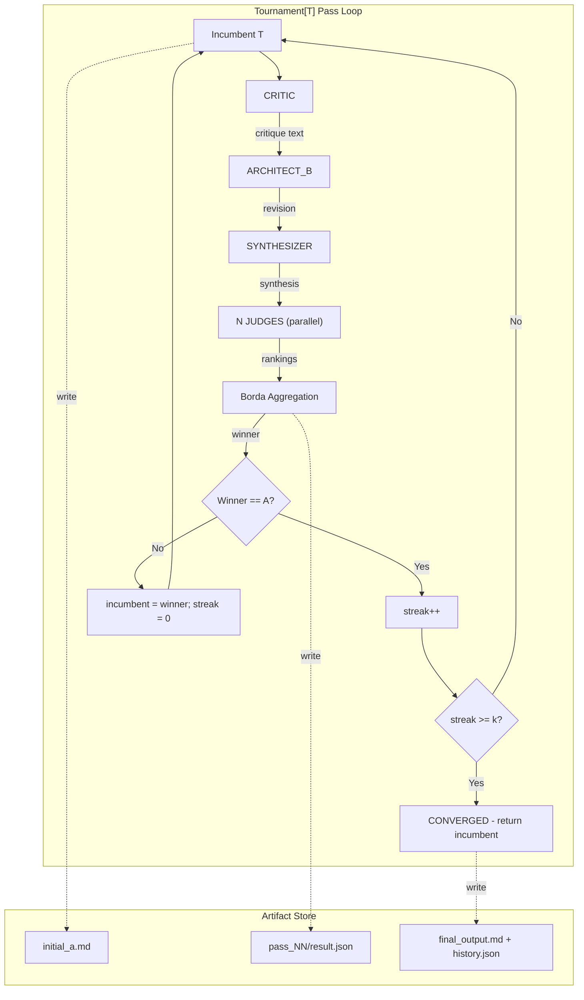
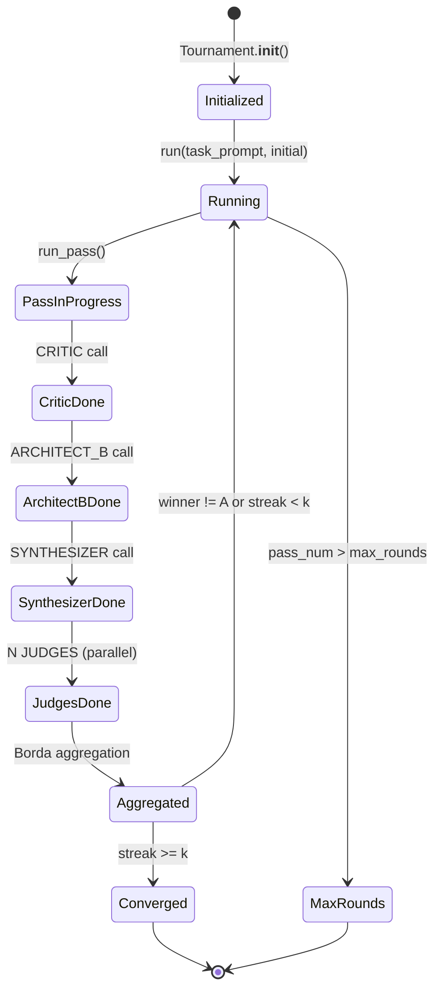

# Tournament Engine Design

**Status:** Implemented
**Author:** Mohamed Ameen
**Date:** 2026-04-17
**Last Updated:** 2026-04-17
**Reviewers:** --
**Package:** `src/tournament/`
**Entry Point:** Invoked by `orchestrator.plan_phase` (plan tournament) and `orchestrator.execute_phase` (impl tournament); no standalone CLI subcommand.

## 1. Overview

### 1.1 Purpose

The Tournament Engine provides a generic self-refinement convergence loop that iteratively improves any content type `T` through a structured CRITIC / ARCHITECT_B / SYNTHESIZER / JUDGE pipeline. It is the mechanism by which AutoDev goes beyond single-shot LLM generation: each "pass" critiques the current best answer (the incumbent), produces a revised version, synthesizes the best elements, and then has independent judges rank all three variants via Borda count aggregation.

### 1.2 Scope

**In scope:**

- Generic `Tournament[T]` parameterized over a `ContentHandler[T]` protocol
- Plan-markdown refinement via `PlanContentHandler` (`T = str`)
- Implementation-bundle refinement via `ImplTournament` (`T = ImplBundle`) with git worktree isolation
- Borda count aggregation with conservative tiebreak
- Judge randomization to prevent position bias
- Convergence detection via k-consecutive incumbent wins
- Adapter-backed LLM client with tenacity retry/backoff
- Per-pass artifact persistence via `TournamentArtifactStore`

**Out of scope:**

- Orchestrator-level decision to start/skip tournaments (lives in `orchestrator/`)
- Worktree lifecycle management (injected via `CoderRunner` / `WorktreeManager` protocols)
- Cost budgeting and billing (lives in `config/schema.py` and `orchestrator/guardrails.py`)

### 1.3 Context

The Tournament Engine sits in the refinement layer of the AutoDev pipeline:

```
adapters -> orchestrator -> agents -> [TOURNAMENT] -> QA gates -> state/ledger
```

During the **plan phase**, the architect's initial plan markdown is refined through a `Tournament[str]` driven by `PlanContentHandler`. During the **execute phase**, each task's developer-produced diff+tests is refined through `ImplTournament` (a `Tournament[ImplBundle]` subclass) that materializes variant implementations in isolated git worktrees before judging.

## 2. Requirements

### 2.1 Functional Requirements

- **FR-1:** Run a configurable number of refinement passes (up to `max_rounds`) over any content type `T`.
- **FR-2:** Each pass must execute the four-role pipeline: CRITIC, ARCHITECT_B, SYNTHESIZER, then N parallel JUDGES.
- **FR-3:** Aggregate judge rankings via Borda count with optional conservative tiebreak (incumbent wins ties).
- **FR-4:** Converge when the incumbent wins `convergence_k` consecutive passes.
- **FR-5:** Randomize the presentation order of variants to each judge to prevent position bias.
- **FR-6:** Persist all intermediate artifacts (versions, critic output, judge scores) for post-run auditability.
- **FR-7:** For implementation tournaments, materialize B and AB variants by re-running the coder in fresh git worktrees before judging.
- **FR-8:** Parse judge rankings robustly -- extract the last `RANKING:` line from the response, tolerating markdown formatting noise.

### 2.2 Non-Functional Requirements

- **Crash-safety:** All artifact writes use atomic `tempfile + os.replace` pattern. A crash mid-pass leaves the previous pass's artifacts intact; the incomplete pass directory may be partially written but the final output is never corrupted.
- **Asyncio concurrency:** Judge calls run concurrently via `asyncio.gather`, bounded by `asyncio.Semaphore(max_parallel_subprocesses)`. No blocking I/O on the event loop.
- **LLM cost efficiency:** Each pass costs exactly `3 + N` LLM calls (1 critic + 1 architect_b + 1 synthesizer + N judges). Conservative tiebreak and convergence detection minimize unnecessary passes.
- **Deterministic reproducibility:** A seeded `random.Random` instance controls all randomization (judge order shuffling, synthesizer X/Y coin flip). Given the same RNG seed and LLM responses, the tournament produces identical results.
- **Maintainability:** All logging via `structlog`. Every pass emits structured events (`tournament_start`, `pass_complete`, `converged`).

### 2.3 Constraints

- Must run on Python 3.11+ with no compiled extensions.
- Must work within a single-machine, single-user context.
- LLM calls go through the adapter layer -- the tournament engine never calls an LLM API directly.
- Temperature parameters on `TournamentConfig` are informational only (subscription CLIs do not expose temperature controls).

## 3. Architecture

### 3.1 High-Level Design



### 3.2 Component Structure

| File | Purpose |
|------|---------|
| `tournament/core.py` | Generic `Tournament[T]` class, `ContentHandler[T]` protocol, `LLMClient` protocol, `TournamentConfig`, `PassResult`, Borda aggregation helpers |
| `tournament/plan_tournament.py` | `PlanContentHandler` -- `ContentHandler[str]` for plan-markdown refinement |
| `tournament/impl_tournament.py` | `ImplBundle` dataclass, `ImplContentHandler`, `ImplTournament` subclass, `CoderRunner` protocol |
| `tournament/llm.py` | `AdapterLLMClient` (adapter-to-`LLMClient` bridge with tenacity retries), `StubLLMClient` (test double), `TransientError` |
| `tournament/prompts.py` | System and user prompt templates for all four roles |
| `tournament/state.py` | `TournamentArtifactStore` -- atomic per-pass persistence |
| `tournament/__init__.py` | Re-exports all public symbols |

### 3.3 Data Models

```python
@dataclass
class TournamentConfig:
    num_judges: int = 3
    convergence_k: int = 2
    max_rounds: int = 30
    author_temp: float = 0.8     # informational only
    judge_temp: float = 0.3      # informational only
    model: str | None = None
    conservative_tiebreak: bool = True
    max_parallel_subprocesses: int = 3

class PassResult(BaseModel):
    pass_num: int
    winner: WinnerLabel              # "A" | "B" | "AB"
    scores: dict[str, int]           # {"A": 7, "B": 5, "AB": 6}
    valid_judges: int
    elapsed_s: float
    judge_details: list[dict[str, Any]]
    incumbent_hash_before: str
    incumbent_hash_after: str
    meta: dict[str, Any]

@dataclass
class ImplBundle:
    task_id: str
    task_description: str
    diff: str = ""
    files_changed: list[str] = field(default_factory=list)
    tests_passed: int = 0
    tests_failed: int = 0
    tests_total: int = 0
    test_output_excerpt: str = ""
    variant_label: VariantLabel = "A"   # "A" | "B" | "AB"
    notes: str = ""
```

### 3.4 State Machine



### 3.5 Protocol / Interface Contracts

```python
@runtime_checkable
class LLMClient(Protocol):
    """Minimal async LLM-call interface."""
    async def call(
        self, *, system: str, user: str, role: str, model: str | None = None
    ) -> str: ...

@runtime_checkable
class ContentHandler(Protocol, Generic[T]):
    """Renders T into role-specific prompt payloads and parses role outputs."""
    def render_for_critic(self, t: T, task_prompt: str) -> str: ...
    def render_for_architect_b(self, task_prompt: str, a: T, critic_text: str) -> str: ...
    def render_for_synthesizer(self, task_prompt: str, x: T, y: T) -> str: ...
    def render_for_judge(self, task_prompt: str, v_a: T, v_b: T, v_ab: T,
                         order_map: dict[int, str]) -> str: ...
    def parse_revision(self, revision_text: str, original: T) -> T: ...
    def parse_synthesis(self, synth_text: str, a: T, b: T) -> T: ...
    def render_as_markdown(self, t: T) -> str: ...
    def hash(self, t: T) -> str: ...

@runtime_checkable
class CoderRunner(Protocol):
    """Realizes a variant by running the coder in an isolated git worktree."""
    async def run(self, variant_label: str, direction: str,
                  worktree: Path, task: ImplBundle) -> ImplBundle: ...
```

### 3.6 Interfaces

**`Tournament[T]`**

| Method | Description |
|--------|-------------|
| `async run(task_prompt, initial) -> (T, list[PassResult])` | Run the full convergence loop. Returns final incumbent and pass history. |
| `async run_pass(task_prompt, incumbent, pass_num) -> (WinnerLabel, T, PassResult)` | Execute one CRITIC-ARCHITECT_B-SYNTHESIZER-JUDGES pass. |

**Module-level helpers:**

| Function | Description |
|----------|-------------|
| `parse_ranking(text, valid_labels) -> list[str] \| None` | Extract the last `RANKING:` line from judge output. |
| `randomize_for_judge(v_a, v_b, v_ab, rng) -> (list[T], dict[int, str])` | Shuffle variants into randomized display order. |
| `aggregate_rankings(rankings, labels, tiebreak_winner) -> (str, dict, int)` | Borda count with conservative tiebreak. |

## 4. Design Decisions

### 4.1 Key Decisions

| Decision | Rationale | Alternatives Considered |
|----------|-----------|------------------------|
| Borda count over pairwise Elo | Borda is O(N) per judge with no iterative convergence loop of its own; Elo requires multiple rounds of pairwise matches, multiplying LLM calls. Borda is also transparent: a human can verify scores from the raw rankings. | Elo, Bradley-Terry, plurality vote |
| Conservative tiebreak (incumbent wins ties) | Prevents unnecessary churn -- a tie means the challenger is not demonstrably better, so the incumbent should survive. Reduces the risk of regression through noise. | Random tiebreak, challenger-favoring tiebreak |
| Judge randomization per judge call | Position bias is well-documented in LLM evaluation. Each judge sees variants in a different random order, and the mapping is recorded in `judge_details` for auditability. | Fixed order, round-robin rotation |
| Generic `ContentHandler[T]` protocol | Allows the same tournament loop to drive plan-markdown refinement (`T=str`) and implementation refinement (`T=ImplBundle`) without code duplication. | Separate tournament classes for each phase, strategy pattern with inheritance |
| `ImplTournament` subclass overrides `run_pass` | The implementation tournament needs to materialize B and AB variants by running the coder in worktrees before judging. Overriding `run_pass` keeps the base class clean while adding the realization step. | Hooks/callbacks in the base class, middleware pattern |
| Parse last `RANKING:` line (not first) | LLMs sometimes reason before concluding. Taking the last ranking line captures the final verdict, which is more reliable than the first mention. | First line, regex for strongest match |

### 4.2 Trade-offs

- **Cost vs. quality:** Each pass costs `3 + N` LLM calls. With `num_judges=3` and `max_rounds=30`, the theoretical maximum is 180 calls per tournament. In practice, convergence at `k=2` typically exits in 3-6 passes (~18-36 calls).
- **Worktree overhead:** Implementation tournaments create fresh git worktrees for each variant in each pass. This is expensive in I/O but provides perfect isolation -- no variant can pollute another's filesystem state.
- **Placeholder bundles in base handler:** `ImplContentHandler.parse_revision` returns a placeholder `ImplBundle` carrying direction text. If used with the base `Tournament` class (not `ImplTournament`), the judge would see direction text rather than a real diff, causing A to almost certainly win. This is intentional -- the base class is generic; realization is the subclass's responsibility.

## 5. Implementation Details

### 5.1 Core Algorithms/Logic

**Per-Pass Pipeline:**

1. **CRITIC** receives the incumbent and produces a list of problems (no fixes).
2. **ARCHITECT_B** receives the incumbent + critique and produces a revised version (B).
3. **SYNTHESIZER** receives two versions in randomized X/Y order (coin-flip via tournament RNG) and produces a best-of-both synthesis (AB). The coin flip prevents the synthesizer from developing a positional preference.
4. **N JUDGES** each receive all three variants (A, B, AB) in independently randomized display order. Each outputs a `RANKING: [best], [second], [worst]` line.
5. **Borda aggregation:** For each judge's ranking, position `p` earns `(n - p)` points where `n = 3`. Scores are summed across judges. The label with the highest score wins; ties are broken by the `tiebreak_winner` priority map (A gets priority 0, others get 1+).

**`parse_ranking` robustness:** Iterates lines in reverse, strips markdown formatting characters (`*`, `#`), and extracts characters matching `valid_labels` from the text after the `RANKING:` prefix. Requires at least 2 valid digits to accept. Returns `None` on failure (treated as an abstaining judge).

**Convergence:** A streak counter tracks consecutive passes where A (incumbent) wins. When `streak >= convergence_k`, the tournament exits. If `max_rounds` is reached first, the current incumbent is returned regardless.

### 5.2 Concurrency Model

```python
# Judge calls bounded by semaphore
self._sem = asyncio.Semaphore(max(1, cfg.max_parallel_subprocesses))

async def _guarded_judge(self, user: str, model: str | None) -> str:
    async with self._sem:
        return await self.client.call(system=JUDGE_SYSTEM, user=user, role="judge", model=model)

# Fan-out with asyncio.gather, exceptions returned as values
responses = await asyncio.gather(*coros, return_exceptions=True)
```

Judge calls are the only concurrent fan-out point within a pass. The semaphore bounds concurrency to `max_parallel_subprocesses` (default 3). Failed judges (exceptions) are collected as `None` rankings and recorded in `judge_details` for debugging.

### 5.3 Subprocess Invocation Pattern

The tournament engine does not directly spawn subprocesses. LLM calls go through `AdapterLLMClient -> adapter.execute()`. Implementation tournaments delegate worktree operations to the injected `CoderRunner` protocol, which is implemented by the orchestrator layer.

### 5.4 Atomic I/O Pattern

All artifact writes in `TournamentArtifactStore` use the atomic pattern:

```python
def _atomic_write_text(path: Path, content: str) -> None:
    path.parent.mkdir(parents=True, exist_ok=True)
    fd, tmp = tempfile.mkstemp(
        prefix=f".{path.name}.", suffix=".tmp", dir=str(path.parent)
    )
    try:
        with os.fdopen(fd, "w", encoding="utf-8") as fh:
            fh.write(content)
        os.replace(tmp, path)  # atomic on POSIX
    except Exception:
        try:
            os.unlink(tmp)
        except OSError:
            pass
        raise
```

Temp files are created in the same directory as the target to ensure `os.replace` is atomic (same filesystem).

### 5.5 Error Handling

**Exception hierarchy:**

- `TournamentError(AutodevError)` -- tournament engine failures (judge parse, convergence stall, adapter non-transient errors).
- `TransientError(AdapterError)` -- retryable adapter failures (rate limits, timeouts, overloaded).

**Retry policy (`AdapterLLMClient`):**

```python
@retry(
    stop=stop_after_attempt(5),
    wait=wait_exponential(multiplier=2, min=2, max=60),
    retry=retry_if_exception_type(TransientError),
    reraise=True,
)
```

Transient errors are classified by substring matching against the error text: `"rate"`, `"429"`, `"overloaded"`, `"529"`, `"too many requests"`, `"timeout"`, `"timed out"`, `"connection"`, `"503"`.

Non-transient errors propagate immediately as `TournamentError`.

**`ImplTournament` coder failure:** If the `CoderRunner` raises during variant realization, a degenerate `ImplBundle` with an empty diff and the error message in `notes` is substituted. Judges will strongly disfavor this variant, so the failure degrades gracefully rather than crashing the tournament.

### 5.6 Dependencies

- **tenacity:** Retry/backoff for LLM calls in `AdapterLLMClient`.
- **pydantic:** `PassResult` model validation, `model_dump(mode="json")` for serialization.
- **structlog:** All tournament logging.
- **Internal:** `src/errors` for exception types, `src/autologging` for logger factory, `src/adapters/types` (optional import for `AgentInvocation`).

### 5.7 Configuration

Configuration flows from `.autodev/config.json` via `TournamentsConfig`:

```python
class TournamentsConfig(BaseModel):
    plan: TournamentPhaseConfig    # enabled, num_judges, convergence_k, max_rounds
    impl: TournamentPhaseConfig    # enabled, num_judges, convergence_k, max_rounds
    max_parallel_subprocesses: int = 3
    auto_disable_for_models: list[str] = ["opus"]

class TournamentPhaseConfig(BaseModel):
    enabled: bool
    num_judges: int
    convergence_k: int
    max_rounds: int
```

The orchestrator maps these into `TournamentConfig` before constructing the engine.

## 6. Integration Points

### 6.1 Dependencies on Other Components

| Component | Dependency |
|-----------|------------|
| `src/adapters/` | `AdapterLike` protocol for LLM execution |
| `src/errors.py` | `TournamentError`, `AdapterError` base classes |
| `src/autologging.py` | `get_logger()` factory |
| `src/config/schema.py` | `TournamentsConfig`, `TournamentPhaseConfig` |

### 6.2 Adapter Contract Dependency

The tournament consumes any object satisfying `AdapterLike`:

```python
@runtime_checkable
class AdapterLike(Protocol):
    async def execute(self, inv: Any) -> Any: ...
```

The returned result must expose `.text`, `.success`, `.error` attributes. All concrete adapters (`ClaudeCodeAdapter`, `CursorAdapter`, `InlineAdapter`) satisfy this.

### 6.3 Ledger Event Emissions

The tournament engine itself does not write to the state ledger directly. The orchestrator appends audit-only ledger entries after tournament completion:

- `plan_tournament_complete` -- appended after plan tournament finishes.
- `impl_tournament_complete` -- appended after implementation tournament finishes.

### 6.4 Components That Depend on This

| Consumer | Usage |
|----------|-------|
| `orchestrator/plan_phase.py` | Creates `Tournament[str]` with `PlanContentHandler` |
| `orchestrator/impl_tournament_runner.py` | Creates `ImplTournament` with `ImplContentHandler` and `CoderRunner` |
| `orchestrator/execute_phase.py` | Invokes impl tournament after the tested stage |

### 6.5 External Systems

- **LLM APIs** (via adapter layer): All four roles (critic, architect_b, synthesizer, judge) require LLM calls.
- **Git worktrees** (impl tournament only): `CoderRunner` creates and operates within isolated worktrees.
- **Filesystem**: Artifact store writes to `.autodev/tournaments/{tournament_id}/`.

## 7. Testing Strategy

### 7.1 Unit Tests

- `parse_ranking`: edge cases (no RANKING line, markdown-wrapped, multiple RANKING lines, fewer than 2 digits).
- `aggregate_rankings`: Borda scoring correctness, tiebreak behavior, all-None judges.
- `randomize_for_judge`: verify bijection (all labels present), deterministic with seeded RNG.
- `PlanContentHandler`: round-trip `render_as_markdown` / `hash`, `render_for_*` prompt construction.
- `ImplContentHandler`: placeholder bundle creation, `hash` includes variant label.
- `StubLLMClient`: callback mode, dict mode, role-count keying.

### 7.2 Integration Tests

- Full `Tournament[str]` with `StubLLMClient` verifying convergence after k passes.
- `ImplTournament` with mock `CoderRunner` verifying variant realization flow.
- `AdapterLLMClient` with mock adapter verifying retry on transient errors and fail on non-transient.
- `TournamentArtifactStore` verifying directory layout and atomic writes.

### 7.3 Property-Based Tests

- Hypothesis strategy for `aggregate_rankings`: any list of valid rankings produces a winner that is one of the labels. Score sum is deterministic.
- Hypothesis strategy for `parse_ranking`: random text with embedded RANKING lines always parses correctly.

### 7.4 Test Data Requirements

- `StubLLMClient` with `responses` dict for deterministic multi-role responses.
- Fixture for `ImplBundle` with representative diffs and test counts.

## 8. Security Considerations

- **Prompt injection:** Judge prompts include user-provided task descriptions and LLM-generated content. The system prompt explicitly instructs judges to evaluate on merit only. No tool execution is granted to tournament roles (`allowed_tools=[]`).
- **Filesystem isolation:** `TournamentArtifactStore` writes only under `.autodev/tournaments/`. Path components are controlled by the engine (pass numbers, fixed filenames).
- **Worktree isolation:** Implementation tournaments operate in fresh git worktrees, preventing one variant from corrupting the main working tree.

## 9. Performance Considerations

- **Latency:** Each pass is dominated by LLM call latency. Sequential calls (critic, architect_b, synthesizer) are unavoidable due to data dependencies. Judge calls are the only parallelizable step.
- **Semaphore bound:** Default `max_parallel_subprocesses=3` prevents overwhelming the adapter/API.
- **Convergence shortcut:** `convergence_k=2` typically exits in 3-6 passes rather than running all `max_rounds=30`.
- **Prompt truncation:** `ImplContentHandler` truncates diffs to 12,000 chars and test output to 2,000 chars to avoid token limits. Judge proposals are truncated to 6,000 chars each.

## 10. Installation & CLI Entry

### 10.1 Package Registration

The tournament engine is an internal library package under `src/tournament/`. It is not registered as a standalone CLI entry point. It is invoked by the orchestrator's plan and execute phases.

### 10.2 CLI Commands

No direct CLI commands. Tournaments are triggered via:

```bash
autodev run           # full pipeline including plan + impl tournaments
autodev run --plan    # plan phase only (includes plan tournament if enabled)
```

Tournament behavior is controlled via `.autodev/config.json`:

```json
{
  "tournaments": {
    "plan": { "enabled": true, "num_judges": 3, "convergence_k": 2, "max_rounds": 10 },
    "impl": { "enabled": true, "num_judges": 1, "convergence_k": 1, "max_rounds": 3 },
    "max_parallel_subprocesses": 3
  }
}
```

## 11. Observability

### 11.1 Structured Logging

| Event | Key Fields | Description |
|-------|------------|-------------|
| `tournament_start` | `max_rounds`, `convergence_k`, `num_judges` | Emitted once at tournament start |
| `pass_complete` | `pass_num`, `winner`, `scores`, `valid_judges`, `streak` | Emitted after each pass |
| `converged` | `pass_num`, `streak` | Emitted when convergence is detected |
| `impl_pass_complete` | `pass_num`, `winner`, `scores`, `valid_judges` | Emitted by `ImplTournament` |
| `coder_runner_failed` | `variant`, `err` | Emitted when a variant fails to realize |
| `transient_exception` | `role`, `err` | Emitted by `AdapterLLMClient` on retryable errors |

### 11.2 Audit Artifacts

```
.autodev/tournaments/{tournament_id}/
  initial_a.md                    # initial incumbent
  incumbent_after_01.md           # new incumbent after pass 1 (only if winner != A)
  incumbent_after_03.md           # ...
  final_output.md                 # final converged incumbent
  history.json                    # array of PassResult objects
  pass_01/
    version_a.md                  # incumbent rendered as markdown
    critic.md                     # critic output
    version_b.md                  # architect_b revision
    version_ab.md                 # synthesizer output
    result.json                   # PassResult with scores, judge_details, timing
  pass_02/
    ...
```

### 11.3 Status Command

`autodev status` can display:
- Whether a tournament is currently running (plan or impl).
- Last tournament result (converged/max_rounds, passes, winner).
- Artifact directory path for inspection.

## 12. Cost Implications

| Operation | LLM Calls per Pass | Notes |
|-----------|-------------------|-------|
| CRITIC | 1 | Reads incumbent, produces critique |
| ARCHITECT_B | 1 | Reads incumbent + critique, produces revision |
| SYNTHESIZER | 1 | Reads A + B, produces synthesis |
| JUDGES | N (`num_judges`) | Parallel, each ranks A/B/AB |
| **Total per pass** | **3 + N** | Default N=3 -> 6 calls/pass |

**Typical plan tournament:** `num_judges=3`, converges in ~4 passes -> ~24 LLM calls.

**Typical impl tournament:** `num_judges=1`, `convergence_k=1`, `max_rounds=3` -> 4 calls/pass, converges in 1-2 passes -> ~4-8 LLM calls per task.

**Cost reduction strategies:**
- Conservative tiebreak reduces unnecessary incumbent replacement.
- Convergence detection exits early.
- `auto_disable_for_models: ["opus"]` skips tournaments for expensive models.
- Per-gate toggles allow disabling tournaments entirely.

## 13. Future Enhancements

- Per-section picking in `PlanContentHandler` (currently returns full revised markdown; richer section-level selection is planned for Phase 7+).
- Adaptive judge count based on score variance (add judges when rankings diverge significantly).
- Cached intermediate results to avoid re-running critic when only minor changes occurred.
- Tournament-level cost tracking with budget enforcement.

## 14. Open Questions

- [ ] Should the synthesizer see the critic output in addition to A and B?
- [ ] Should convergence be based on content hash stability rather than streak count?
- [ ] How should the tournament handle the case where all judges fail to parse (all rankings are None)?

## 15. Related ADRs

- ADR-003: Borda count for tournament aggregation
- ADR-010: Conservative tiebreak (incumbent wins ties)
- ADR-007: Worktree isolation for implementation variants

## 16. References

- [Borda Count -- Wikipedia](https://en.wikipedia.org/wiki/Borda_count)
- [Position Bias in LLM Evaluation](https://arxiv.org/abs/2305.17926)
- `docs/design_documentation/tournaments.md` -- high-level tournament documentation

## 17. Revision History

| Date | Author | Changes |
|------|--------|---------|
| 2026-04-17 | Mohamed Ameen | Initial draft |
