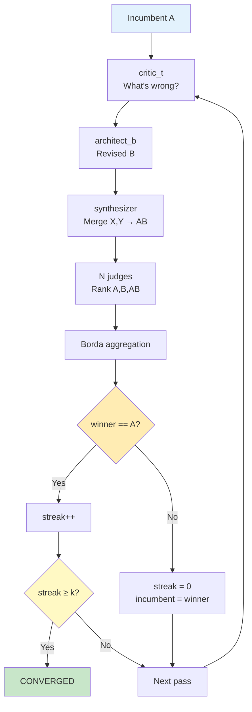

# Tournaments

AutoDev uses the **autoreason** self-refinement algorithm at two points in the workflow: once during plan creation and once after every developer task. This document explains how tournaments work, how to configure them, and how to manage their cost.

---

## How Tournaments Work

The autoreason algorithm is a multi-round self-refinement loop. Each round (called a "pass") has four steps:



The tournament converges when the incumbent wins `convergence_k` consecutive rounds without being displaced. The conservative tiebreak means ties always go to the incumbent — the tournament only advances if a challenger is clearly better.

**Why it works**: The autoreason paper shows a 42/42 Borda sweep at Haiku 3.5. The method provides iterative improvement by separating the roles of critic (finds problems), architect_b (proposes fixes), synthesizer (combines best parts), and judge (evaluates without bias from authorship).

---

## Plan Tournament Flow

The plan tournament runs after the architect produces an initial draft plan.

```
 autodev plan "<intent>"
        │
        ├─ explorer + domain_expert gather context
        │
        ├─ architect drafts plan v0 (markdown)
        │
        └─ PlanTournament.run(spec, v0)
              │
              for pass p = 1..max_rounds:
              │
              ├─ critic_t reads plan → critique (problems only, no fixes)
              ├─ architect_b reads (task, plan_A, critique) → plan_B
              ├─ synthesizer reads (task, randomized(A,B)) → plan_AB
              ├─ N judges rank (A, B, AB) in parallel
              ├─ Borda aggregate → winner
              ├─ persist pass_NN/ artifacts
              ├─ if winner == A: streak++
              │   if streak ≥ convergence_k: BREAK
              └─ else: streak=0, incumbent = winner
              │
              └─ final plan → critic_t (plan-gate role) → APPROVED | NEEDS_REVISION
```

Artifacts are written to `.autodev/tournaments/plan-{id}/`:
- `initial_a.md` — the architect's first draft
- `pass_NN/version_a.md`, `pass_NN/critic.md`, `pass_NN/version_b.md`, `pass_NN/version_ab.md`, `pass_NN/result.json`
- `final_output.md` — the tournament winner
- `history.json` — per-pass scores and winners

---

## Implementation Tournament Flow

The implementation tournament runs after every developer task passes QA gates. It is always-on by default with aggressive caps to manage cost.

```
developer produces diff_A (in main worktree)
        │
        ▼ QA gates pass (syntax, lint, build, tests, secretscan)
        │
        ▼
ImplTournament.run(task_desc, ImplBundle(diff_A, tests_A))
        │
        ├─ git worktree add .autodev/tournaments/impl-{task_id}/a
        │   (copy of diff_A state)
        │
        for pass p = 1..max_rounds:
        │
        ├─ critic_t reads (task, diff_A) → critique
        ├─ architect_b proposes change direction
        ├─ developer re-runs in /b worktree with direction → diff_B + tests_B
        ├─ synthesizer proposes per-file picks
        ├─ developer applies synthesis in /ab worktree → diff_AB + tests_AB
        ├─ judge ranks (A, B, AB) by:
        │     - test pass rate
        │     - correctness
        │     - minimalism (smaller diff preferred)
        │     - plan drift (stays within task scope)
        ├─ Borda aggregate → winner
        ├─ if winner == A: streak++
        │   if streak ≥ convergence_k: BREAK
        └─ else: streak=0, incumbent = winner
        │
        ├─ winner merged to main worktree
        ├─ /a /b /ab worktrees pruned
        └─ tournament.json evidence written
```

---

## Borda Aggregation

Each judge produces a ranking like `RANKING: 1, 2, 3` where the numbers are positions for versions A, B, AB (in randomized order). Borda scoring assigns points based on rank position:

- 1st place: 2 points
- 2nd place: 1 point
- 3rd place: 0 points

Scores are summed across all judges. The version with the highest total wins.

**Conservative tiebreak**: on a tie, the incumbent (version A) wins. This means the tournament only advances if a challenger is unambiguously better — it never regresses.

---

## Configuration Parameters

```jsonc
"tournaments": {
  "plan": {
    "enabled": true,
    "num_judges": 3,        // number of parallel judge calls per pass
    "convergence_k": 2,     // consecutive incumbent wins to converge
    "max_rounds": 15        // hard cap on passes
  },
  "impl": {
    "enabled": true,
    "num_judges": 1,        // 1 judge keeps impl cost low
    "convergence_k": 1,     // converge after first incumbent win
    "max_rounds": 3         // hard cap — impl tournament is fast
  },
  "max_parallel_subprocesses": 3,   // max concurrent judge subprocesses
  "auto_disable_for_models": ["opus"]  // skip tournament for high-tier models
}
```

| Parameter | Default (plan) | Default (impl) | Effect |
|---|---|---|---|
| `enabled` | `true` | `true` | Master switch for this tournament phase |
| `num_judges` | `3` | `1` | More judges = better signal, higher cost |
| `convergence_k` | `2` | `1` | Higher = more rounds before convergence |
| `max_rounds` | `15` | `3` | Hard cap regardless of convergence |
| `max_parallel_subprocesses` | `3` | `3` | Caps concurrent subprocess spawns |
| `auto_disable_for_models` | `["opus"]` | `["opus"]` | Skip tournament for these model tiers |

---

## Auto-Disable for High-Tier Models

The autoreason paper shows that tournament gains plateau above Haiku 4.5 — when the generation-evaluation gap closes, the critic and judge can no longer reliably distinguish better from worse. For opus-tier models, the tournament is automatically skipped.

To configure:
```jsonc
"auto_disable_for_models": ["opus", "sonnet"]  // skip for both tiers
```

The check runs at the start of each tournament. If the configured model matches any entry in `auto_disable_for_models`, the tournament is skipped and the initial version is used directly.

---

## Cost Guardrails

The tournament is the primary cost driver in AutoDev. Several mechanisms limit runaway cost:

1. **Hard `max_rounds` cap** — the tournament never runs more than `max_rounds` passes regardless of convergence.
2. **`num_judges=1` for impl** — halves per-round cost compared to the plan tournament (4 calls vs 6 per round with 3 judges).
3. **`convergence_k=1` for impl** — the impl tournament converges after the first incumbent win, often in 1–2 rounds.
4. **`auto_disable_for_models`** — skips the tournament entirely for high-tier models.
5. **`cost_budget_usd_per_plan`** — if set, the orchestrator warns before execution if projected calls exceed the budget.
6. **`--no-impl-tournament` flag** — disables the impl tournament for a single `autodev execute` run.

### Calls per tournament pass

| Role | Calls |
|---|---|
| critic_t | 1 |
| architect_b | 1 |
| synthesizer | 1 |
| judges | N (parallel) |
| **Total per pass** | **3 + N** |

With `num_judges=1`: 4 calls/pass × max 3 rounds = **12 calls max** per task.
With `num_judges=3`: 6 calls/pass × max 15 rounds = **90 calls max** for plan tournament.

See [cost.md](cost.md) for full cost estimates.

---

## Standalone Tournament Runner

You can run a tournament outside of the normal plan/execute flow for debugging or ad-hoc refinement:

```bash
# Refine a plan markdown file
 autodev tournament --phase=plan --input my-plan.md

# Dry run (no LLM calls, canned responses)
 autodev tournament --phase=plan --input my-plan.md --dry-run

# Limit rounds
 autodev tournament --phase=plan --input my-plan.md --max-rounds 3

# Refine an implementation diff
 autodev tournament --phase=impl --input-diff my.patch --task-desc "Add subtract function" --files math.py
```

Artifacts are written to `.autodev/tournaments/{plan|impl}-{id}/`.
